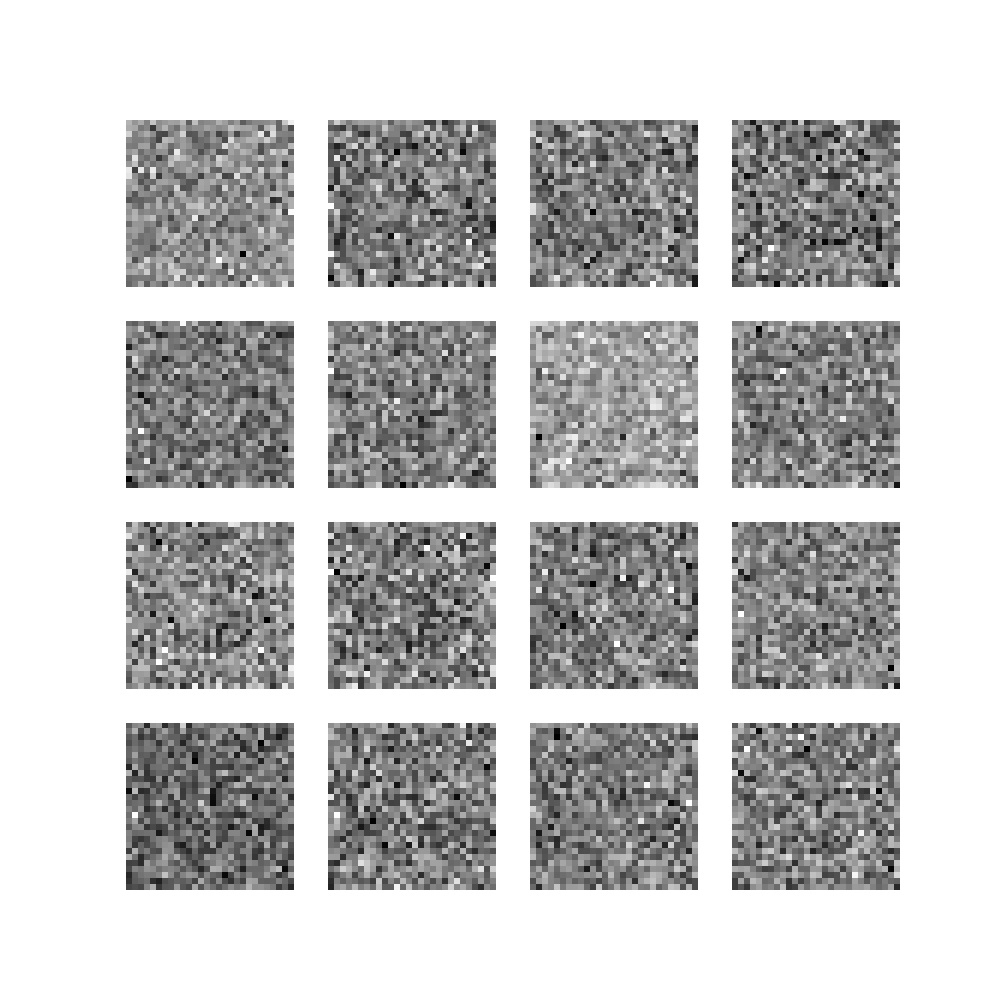
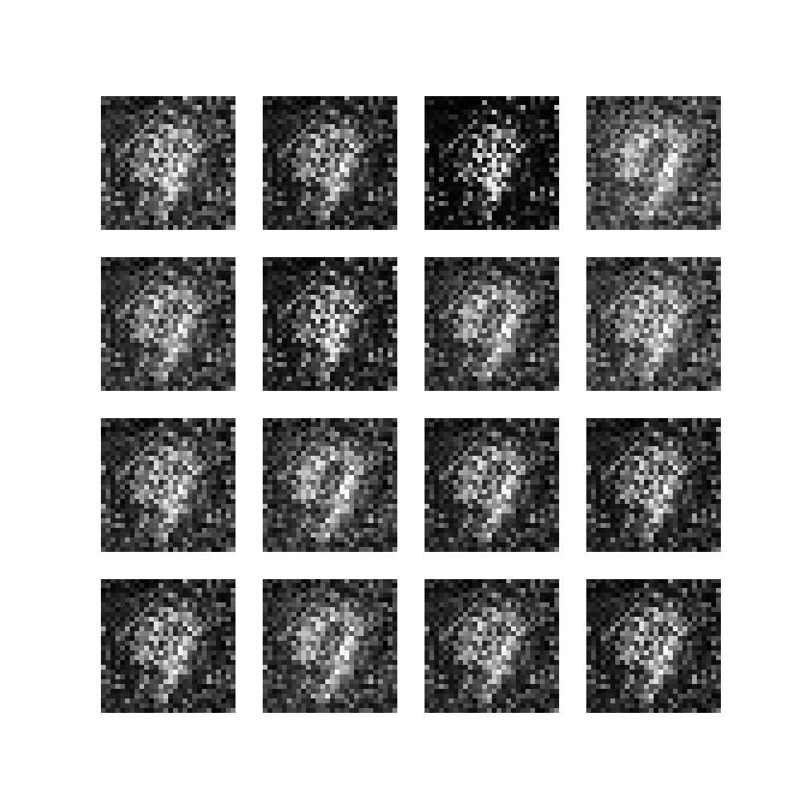
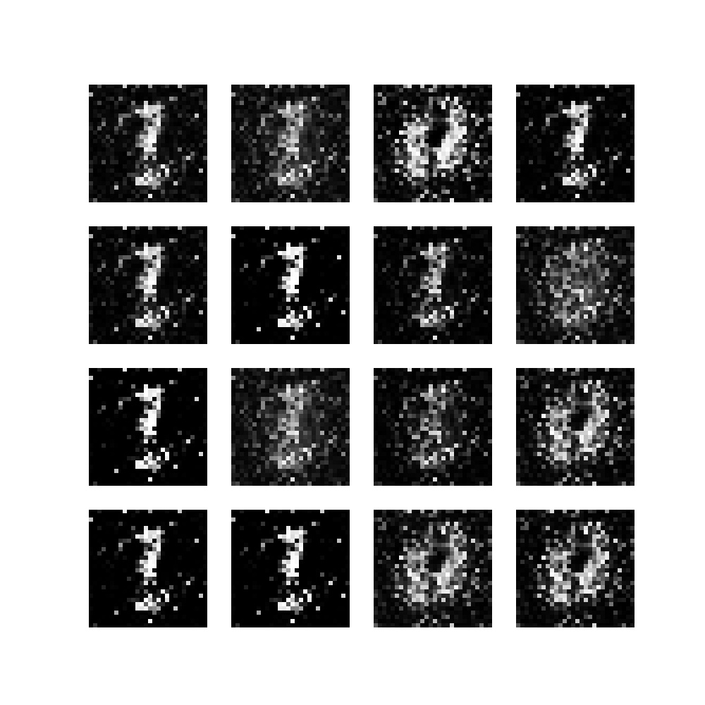
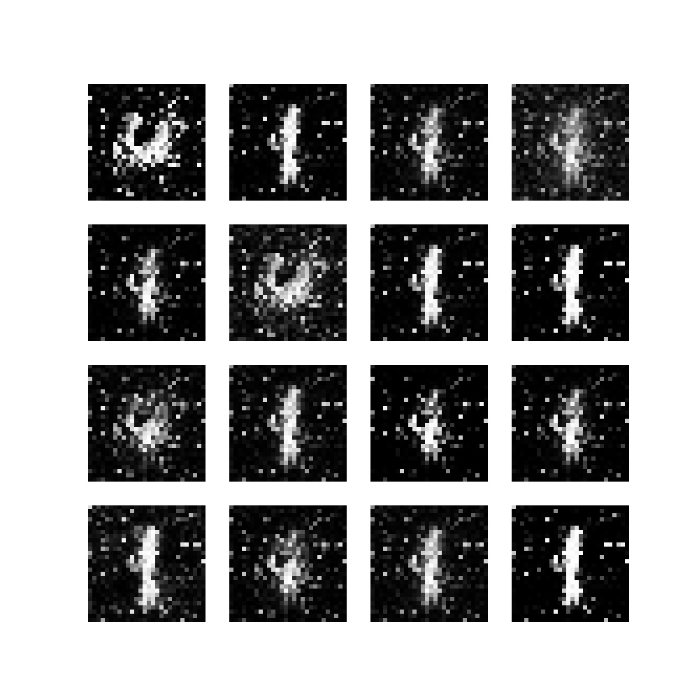
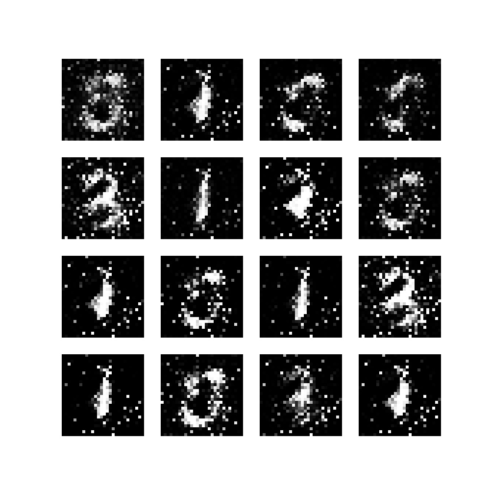
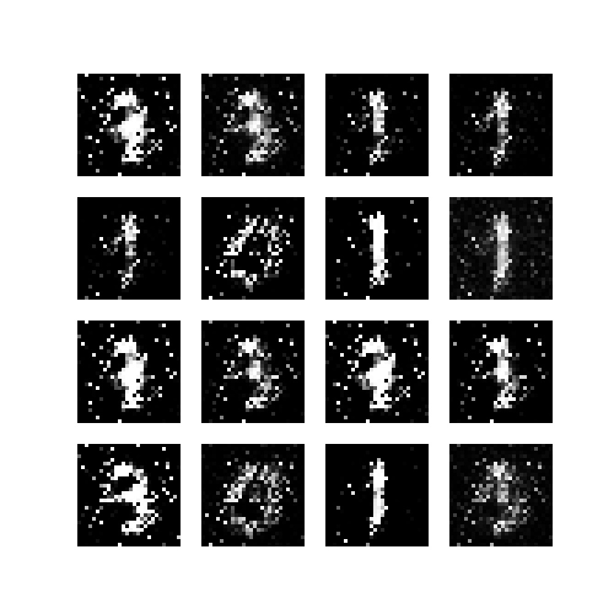
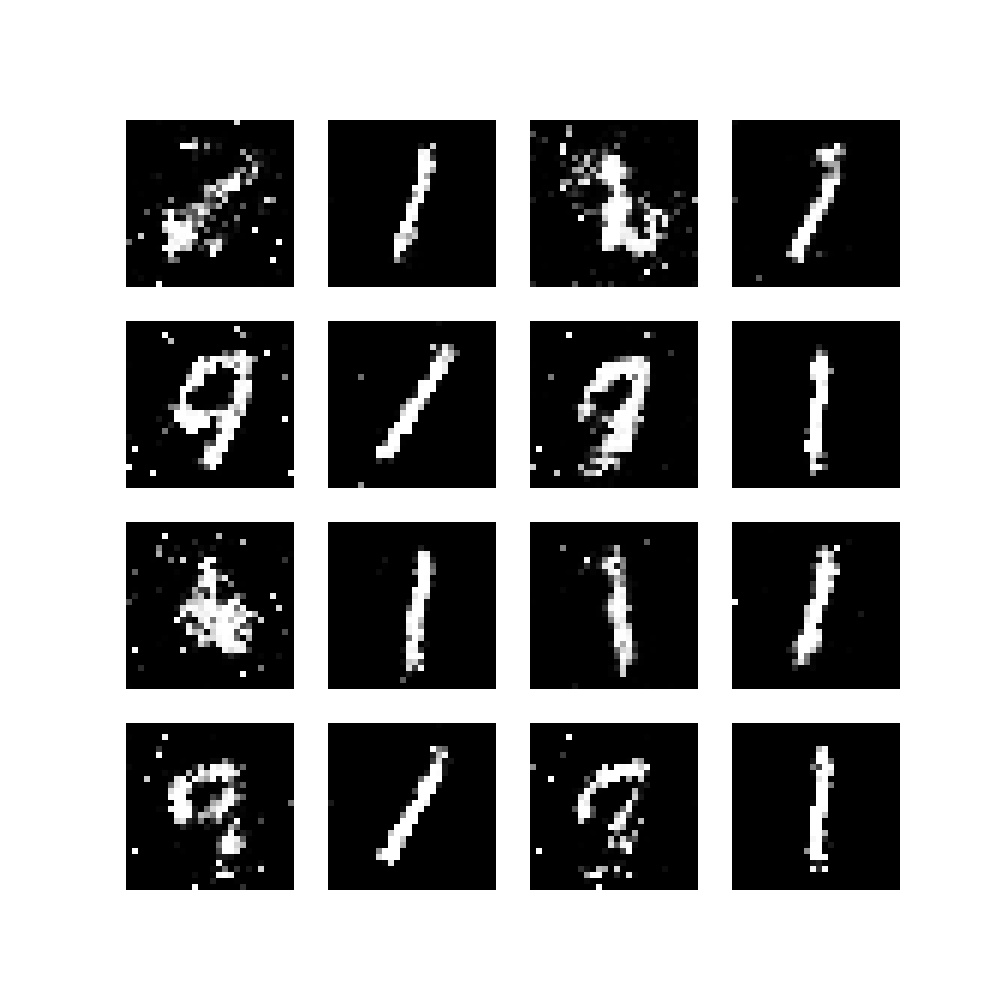
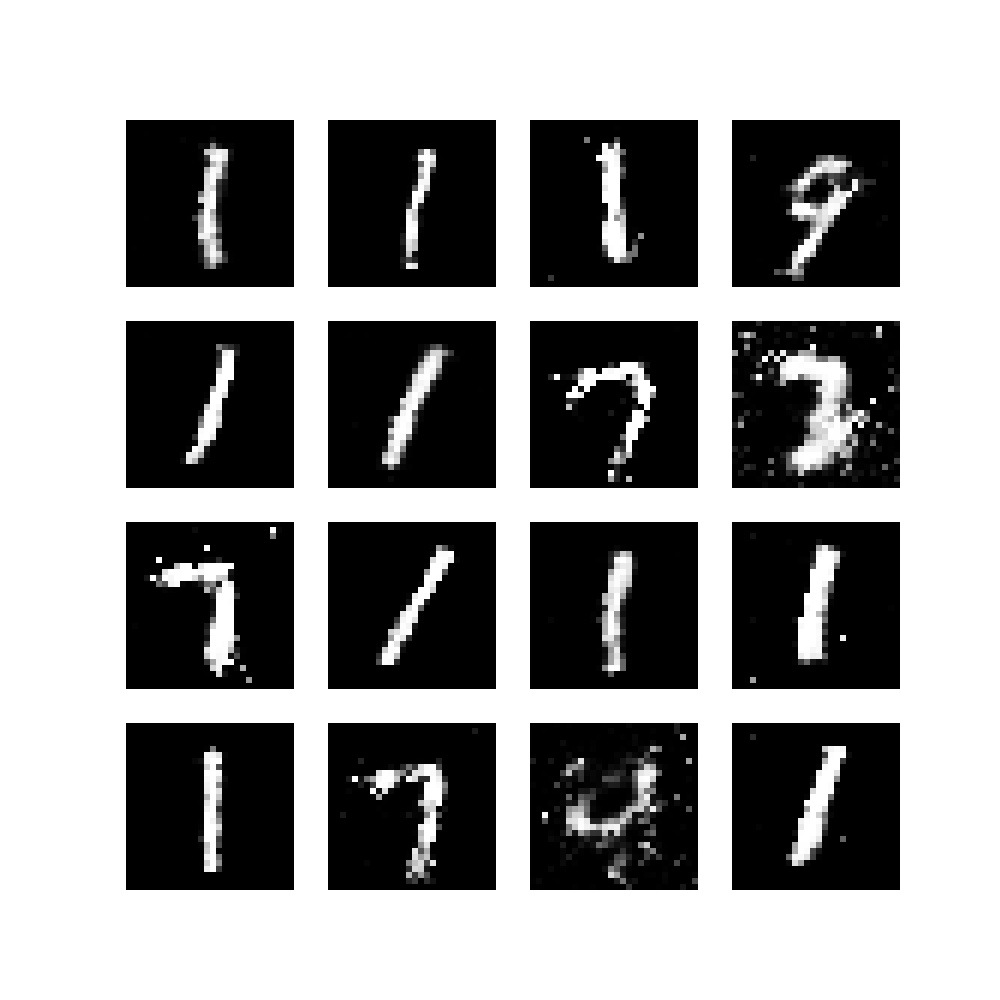
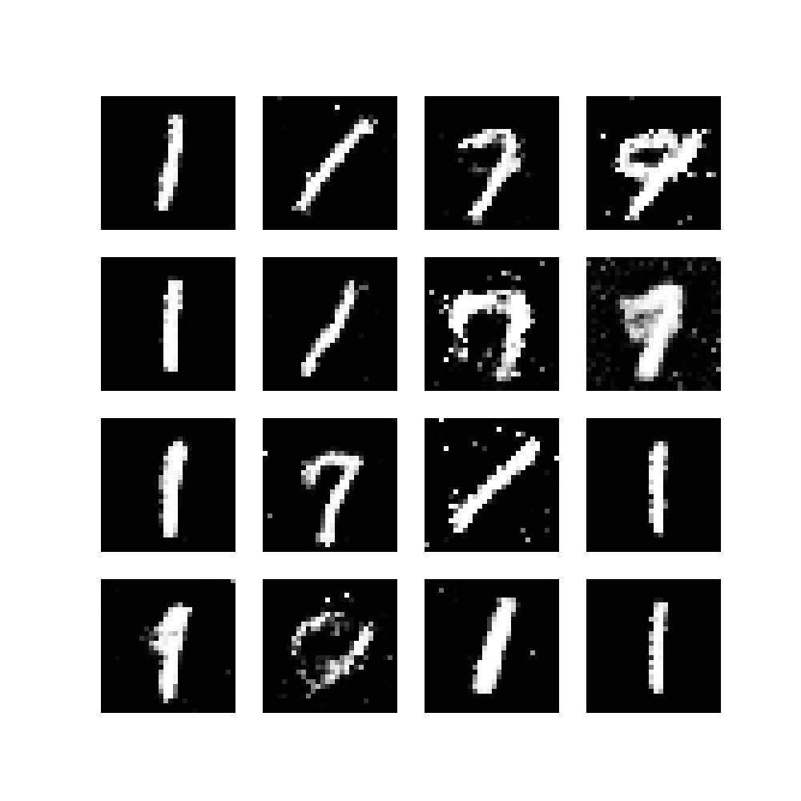

Using a **Generative Adversarial Model**, or a GAN, it is possible to perform generative Machine Learning. In other words, you can ensure that a model learns to produce new data, such as images.

Like these:

- 
    
- 
    
- 
    

In today's article, you will create a **simple GAN**, also called a _vanilla GAN_. It resembles the Generative Adversarial Network first created by Goodfellow et al. (2014). After reading this article, you will...

- **Understand what a GAN is and how it works.**
- **Be capable of building a simple GAN with Python and PyTorch.**
- **Have produced your first GAN results**.

Let's take a look! :)

* * *

\[toc\]

* * *

## What is a GAN?

Before we start building our simple GAN, it may be a good idea to briefly recap what GANs are. Make sure to read the [gentle introduction to GANs](https://www.machinecurve.com/index.php/2021/03/23/generative-adversarial-networks-a-gentle-introduction/) if you wish to understand their behavior in more detail. However, we'll also cover things here briefly. Let's take a look at the generic architecture of a GAN:


You'll see that a GAN is composed of two separate models. The first, being called the **Generator**, learns to convert a sample of noise (often drawn from a standard normal distribution) into a fake image. This image is then fed to the **Discriminator**, which judges whether the image is fake or real. Using the loss that emerges from this judgment, the networks are optimized jointly, after which the process starts again.

You can also compare this process with that of a **counterfeiter** and the **police**. The Generator serves as the counterfeiter, while the task of the police is to catch them. When the police catches more counterfeit images, the counterfeiter has to learn to produce better results. This is exactly what happens: through the Discriminator becoming better in judging whether an image is fake or real, the Generator eventually becomes better in generating fake images. Consequentially, the Generator can be used independently to generate images after it has been trained.

Now, it's time to start building the GAN. Note that more contemporary approaches, such as [DCGANs](https://www.machinecurve.com/index.php/2021/07/15/creating-dcgan-with-pytorch/), are more preferred if you wish to use your GAN in production (because of the simple reason that originally, the vanilla GAN didn't use any Convolutional layers). However, if you want to start with GANs, the example that you will produce below is a very good starting point - after which you can continue with DCGANs and further. Let's take a look! :)

* * *

## Simple GAN with PyTorch - fully explained code example

Let's now take a look at building a **simple Generative Adversarial Network**, which looks like the original GAN proposed by Goodfellow et al. (2014).

### Importing the dependencies

When you want to run the code that you're going to create, you will need to ensure that some dependencies are installed into your environment. These dependencies are as follows:

- A 3.x based version of **Python**, which you will use to run these scripts.
- **PyTorch** and its corresponding version of **Torchvision** for training the neural networks with MNIST data.
- **NumPy** for numbers processing.
- **Matplotlib** for visualizing images.

Now, create a Python file or Python-based Notebook, with the following imports:

```
import os
import torch
from torch import nn
from torchvision.datasets import MNIST
from torch.utils.data import DataLoader
from torchvision import transforms
import numpy as np
import matplotlib.pyplot as plt
import uuid
```

For some Operating System functions, you will need `os`. `uuid` will be used for generating a unique run identifier, which will be useful for saving intermediate models and generated images; i.e., for housekeeping. `torch` will be used for training the neural network, and hence you will need to import its `nn` library. The `MNIST` dataset will be used and hence requires import, and it will be loaded with the `DataLoader`. Finally, when loading the data, you will convert it into Tensor format and normalize the images, requiring `transforms`. Finally, for number processing and visualization, you'll need `numpy` and `matplotlib.pyplot`.

### Configuration variables

Now that you have specified the imports, it's time to pin down the configurable variables that will be used throughout the training process. Here's what you will create and why you'll need it:

- **The number of epochs:** each training process contains a fixed number of iterations through the entire training set, the _number of epochs_. We set it to 50, but you can choose any number. Note that 50 will produce an acceptable result; more may improve the results even further.
- **The noise dimension:** recall that the Generator will be fed a variable that serves as a sample from a multidimensional latent distribution. These are difficult words to say that we sample from a landscape that will eventually take a shape so that good examples are produced by the Generator. The dimensionality of this landscape and hence the vectors sampled from it will be defined by `NOISE_DIMENSION`.
- **The batch size:** within an epoch, we feed forward the data through the network in batches - i.e., not all in once. The why is simple - because it would not fit in memory otherwise. We set the batch size to 128 samples, but this can be higher, depending on the hardware on your system.
- **Training on GPU, yes or no:** depending on the availability of a GPU, you can choose to use it for training - otherwise your CUP will be used.
- **A unique run identifier:** related to housekeeping. You will see that during the training process, intermediate models and images will be stored on disk so that you can keep track of training progress. A folder with a _unique_ identifier will be created for this purpose; hence the `UNIQUE_RUN_ID`.
- **Print stats after n-th batch:** after feeding forward minibatches through the network, statistics will be printed after every `n-th` batch. Currently, we set it to 50.
- The **optimizer learning rate** and **optimizer betas**. The optimizer for the Generator and Discriminator will be initialized with a learning rate and Beta values. We set them to values that are deemed to produce acceptable results given previous research.
- The **output shape of the generator output** will be used to initialize the last layer of the Generator and the first layer of the Discriminator. It must be a multiplication of all shape dimensions of an individual image. In our case, the MNIST dataset has `28x28x1` images.

```
# Configurable variables
NUM_EPOCHS = 50
NOISE_DIMENSION = 50
BATCH_SIZE = 128
TRAIN_ON_GPU = True
UNIQUE_RUN_ID = str(uuid.uuid4())
PRINT_STATS_AFTER_BATCH = 50
OPTIMIZER_LR = 0.0002
OPTIMIZER_BETAS = (0.5, 0.999)
GENERATOR_OUTPUT_IMAGE_SHAPE = 28 * 28 * 1
```

### PyTorch speedups

There are some ways that you can use to make your PyTorch code [run faster](https://betterprogramming.pub/how-to-make-your-pytorch-code-run-faster-93079f3c1f7b): that's why you'll write these speedups next.

```
# Speed ups
torch.autograd.set_detect_anomaly(False)
torch.autograd.profiler.profile(False)
torch.autograd.profiler.emit_nvtx(False)
torch.backends.cudnn.benchmark = True
```

### Building the Generator

Now that we have written some preparatory code, it's time to build the actual Generator! Contrary to the [Deep Convolutional GAN](https://www.machinecurve.com/index.php/2021/07/15/creating-dcgan-with-pytorch/), which essentially follows the _vanilla GAN_ that you will create today, this Generator does not use [Convolutional layers](https://www.machinecurve.com/index.php/2018/12/07/convolutional-neural-networks-and-their-components-for-computer-vision/). Here's the code for the Generator:

```
class Generator(nn.Module):
  """
    Vanilla GAN Generator
  """
  def __init__(self,):
    super().__init__()
    self.layers = nn.Sequential(
      # First upsampling
      nn.Linear(NOISE_DIMENSION, 128, bias=False),
      nn.BatchNorm1d(128, 0.8),
      nn.LeakyReLU(0.25),
      # Second upsampling
      nn.Linear(128, 256, bias=False),
      nn.BatchNorm1d(256, 0.8),
      nn.LeakyReLU(0.25),
      # Third upsampling
      nn.Linear(256, 512, bias=False),
      nn.BatchNorm1d(512, 0.8),
      nn.LeakyReLU(0.25),
      # Final upsampling
      nn.Linear(512, GENERATOR_OUTPUT_IMAGE_SHAPE, bias=False),
      nn.Tanh()
    )

  def forward(self, x):
    """Forward pass"""
    return self.layers(x)
```

You can see that it is a regular PyTorch [`nn.Module` class](https://www.machinecurve.com/index.php/2021/01/26/creating-a-multilayer-perceptron-with-pytorch-and-lightning/) and hence performs a `forward` pass by simply feeding the data to a model, specified in `self.layers` as a `nn.Sequential` based neural network. In our case, you will write four upsampling blocks. The intermediate blocks consist of a `nn.Linear` (or densely-connected) layer, a `BatchNorm1d` layer for Batch Normalization, and Leaky ReLU. Bias is set to `False` because the Batch Norm layers nullify it.

The final upsampling layer converts the intermediate amount of neurons of already 512 into `GENERATOR_OUTPUT_IMAGE_SHAPE`, which is `28 * 28 * 1 = 784`. With Tanh, the outputs are normalized to the range `[-1, 1]`.

### Building the Discriminator

The Discriminator is even simpler than the Generator. It is a separate neural network, as you can see by its `nn.Module` class definition. It simply composes a fully-connected neural network that accepts an input of dimensionality `GENERATOR_OUTPUT_IMAGE_SHAPE` (i.e., a Generator output) and converts it into a `[0, 1]` Sigmoid-normalized prediction as to whether the image is real or fake.

```
class Discriminator(nn.Module):
  """
    Vanilla GAN Discriminator
  """
  def __init__(self):
    super().__init__()
    self.layers = nn.Sequential(
      nn.Linear(GENERATOR_OUTPUT_IMAGE_SHAPE, 1024), 
      nn.LeakyReLU(0.25),
      nn.Linear(1024, 512), 
      nn.LeakyReLU(0.25),
      nn.Linear(512, 256), 
      nn.LeakyReLU(0.25),
      nn.Linear(256, 1),
      nn.Sigmoid()
    )

  def forward(self, x):
    """Forward pass"""
    return self.layers(x)
```

### Combining everything into one

Okay, we now have two different neural networks, a few imports and some configuration variables. Time to combine everything into one! Let's start with writing some housekeeping functions.

#### Housekeeping functions

Recall that you read before that intermediate models would be saved in a folder, and that images would be generated as well. While we will actually _implement_ these calls later, i.e. use them, you're already going to write them now. Our housekeeping functions contain five definitions:

1. **Getting the device**. Recall that you specified `True` or `False` for `TRAIN_ON_GPU`. This definition will check whether you want to use the GPU and whether it is avilable, and instructs PyTorch to use your CPU otherwise.
2. **Making the directory for a run** utilizes the `UNIQUE_RUN_ID` to generate a directory for the unique run.
3. **Generating the images** will generate 16 examples using some Generator (usually, the Generator that you will have trained most recently) and store them to disk.
4. **Saving the models** saves the current state of the Generator and Discriminator to disk.
5. **Printing training progress** prints the current loss values on screen.

```
def get_device():
  """ Retrieve device based on settings and availability. """
  return torch.device("cuda:0" if torch.cuda.is_available() and TRAIN_ON_GPU else "cpu")
    
    
def make_directory_for_run():
  """ Make a directory for this training run. """
  print(f'Preparing training run {UNIQUE_RUN_ID}')
  if not os.path.exists('./runs'):
    os.mkdir('./runs')
  os.mkdir(f'./runs/{UNIQUE_RUN_ID}')


def generate_image(generator, epoch = 0, batch = 0, device=get_device()):
  """ Generate subplots with generated examples. """
  images = []
  noise = generate_noise(BATCH_SIZE, device=device)
  generator.eval()
  images = generator(noise)
  plt.figure(figsize=(10, 10))
  for i in range(16):
    # Get image
    image = images[i]
    # Convert image back onto CPU and reshape
    image = image.cpu().detach().numpy()
    image = np.reshape(image, (28, 28))
    # Plot
    plt.subplot(4, 4, i+1)
    plt.imshow(image, cmap='gray')
    plt.axis('off')
  if not os.path.exists(f'./runs/{UNIQUE_RUN_ID}/images'):
    os.mkdir(f'./runs/{UNIQUE_RUN_ID}/images')
  plt.savefig(f'./runs/{UNIQUE_RUN_ID}/images/epoch{epoch}_batch{batch}.jpg')


def save_models(generator, discriminator, epoch):
  """ Save models at specific point in time. """
  torch.save(generator.state_dict(), f'./runs/{UNIQUE_RUN_ID}/generator_{epoch}.pth')
  torch.save(discriminator.state_dict(), f'./runs/{UNIQUE_RUN_ID}/discriminator_{epoch}.pth')


def print_training_progress(batch, generator_loss, discriminator_loss):
  """ Print training progress. """
  print('Losses after mini-batch %5d: generator %e, discriminator %e' %
        (batch, generator_loss, discriminator_loss))
```

#### Preparing the dataset

Okay, after housekeeping it's time to start writing functionality for preparing the dataset. This will be a multi-stage process. First, we load the `MNIST` dataset from `torchvision`. Upon loading, the smaples will be transformed into Tensor format and normalized in the range `[-1, 1]` so that they are directly compatible with the Generator-generated images.

However, after loading all the data, we still need to batch it - recall that you will not feed all the images to the network at once, but will do so in a batched fashion. You will also shuffle the images. For the sake of PyTorch efficiency, the number of workers will be 4, and `pin_memory` is set to True. Once complete, the `DataLoader` is returned, so that it can be used.

```
def prepare_dataset():
  """ Prepare dataset through DataLoader """
  # Prepare MNIST dataset
  dataset = MNIST(os.getcwd(), download=True, train=True, transform=transforms.Compose([
    transforms.ToTensor(),
    transforms.Normalize((0.5,), (0.5,))
  ]))
  # Batch and shuffle data with DataLoader
  trainloader = torch.utils.data.DataLoader(dataset, batch_size=BATCH_SIZE, shuffle=True, num_workers=4, pin_memory=True)
  # Return dataset through DataLoader
  return trainloader
```

#### Initialization functions

Some other defs that you will need are related to the models, loss functions and optimizers that will be used during the joint training process.

In `initialize_models`, youll initialize the Generator and Discriminator, move them to the device that was configured, and return it. Initializing binary cross-entropy loss will be performed in `initialize_loss`, and finally, the optimizers for both Generator and Discriminator will be initialized in `initialize_optimizers`. Once again, you will use these later.

```
def initialize_models(device = get_device()):
  """ Initialize Generator and Discriminator models """
  generator = Generator()
  discriminator = Discriminator()
  # Move models to specific device
  generator.to(device)
  discriminator.to(device)
  # Return models
  return generator, discriminator


def initialize_loss():
  """ Initialize loss function. """
  return nn.BCELoss()


def initialize_optimizers(generator, discriminator):
  """ Initialize optimizers for Generator and Discriminator. """
  generator_optimizer = torch.optim.AdamW(generator.parameters(), lr=OPTIMIZER_LR,betas=OPTIMIZER_BETAS)
  discriminator_optimizer = torch.optim.AdamW(discriminator.parameters(), lr=OPTIMIZER_LR,betas=OPTIMIZER_BETAS)
  return generator_optimizer, discriminator_optimizer
```

#### Forward and backward pass

Using the initialized models, you will perform a forward and a backward pass. For this, and the training step as a whole, you'll need three defs that will be created next. The fist, `generate_noise`, is used to generate `number_of_images` noise vectors of `noise_dimension` dimensionality, onto the device that you configured earlier.

Efficiently zeroing the gradients must be done at the start of each training step and will be done by calling `efficient_zero_grad()`. Finally, using `forward_and_backward`, a forward _and_backward pass will be computed using some model, loss function, data and corresponding targets. The numeric value for loss is then returned.

```
def generate_noise(number_of_images = 1, noise_dimension = NOISE_DIMENSION, device=None):
  """ Generate noise for number_of_images images, with a specific noise_dimension """
  return torch.randn(number_of_images, noise_dimension, device=device)


def efficient_zero_grad(model):
  """ 
    Apply zero_grad more efficiently
    Source: https://betterprogramming.pub/how-to-make-your-pytorch-code-run-faster-93079f3c1f7b
  """
  for param in model.parameters():
    param.grad = None


def forward_and_backward(model, data, loss_function, targets):
  """
    Perform forward and backward pass in a generic way. Returns loss value.
  """
  outputs = model(data)
  error = loss_function(outputs, targets)
  error.backward()
  return error.item()
```

#### Performing a training step

Now that we have defined our functions for the forward and the backward pass, it's time to create one for performing a training step.

Recall that a training step for a GAN involves multiple forward and backward passes: one with real images using the Discriminator and one with fake images using the Discriminator, after which it is optimized. Then, the fake images are used again for optimizing the Generator.

Below, you will code this process into four intermediate steps. First of all, you'll prepare a few things, such as setting label values for real and fake data. In the second step, the Discriminator is trained, followed by the Generator in the third. Finally, you'll merge together some loss values, and return them, in the fourth step.

```
def perform_train_step(generator, discriminator, real_data, \
  loss_function, generator_optimizer, discriminator_optimizer, device = get_device()):
  """ Perform a single training step. """
  
  # 1. PREPARATION
  # Set real and fake labels.
  real_label, fake_label = 1.0, 0.0
  # Get images on CPU or GPU as configured and available
  # Also set 'actual batch size', whih can be smaller than BATCH_SIZE
  # in some cases.
  real_images = real_data[0].to(device)
  actual_batch_size = real_images.size(0)
  label = torch.full((actual_batch_size,1), real_label, device=device)
  
  # 2. TRAINING THE DISCRIMINATOR
  # Zero the gradients for discriminator
  efficient_zero_grad(discriminator)
  # Forward + backward on real images, reshaped
  real_images = real_images.view(real_images.size(0), -1)
  error_real_images = forward_and_backward(discriminator, real_images, \
    loss_function, label)
  # Forward + backward on generated images
  noise = generate_noise(actual_batch_size, device=device)
  generated_images = generator(noise)
  label.fill_(fake_label)
  error_generated_images =forward_and_backward(discriminator, \
    generated_images.detach(), loss_function, label)
  # Optim for discriminator
  discriminator_optimizer.step()
  
  # 3. TRAINING THE GENERATOR
  # Forward + backward + optim for generator, including zero grad
  efficient_zero_grad(generator)
  label.fill_(real_label)
  error_generator = forward_and_backward(discriminator, generated_images, loss_function, label)
  generator_optimizer.step()
  
  # 4. COMPUTING RESULTS
  # Compute loss values in floats for discriminator, which is joint loss.
  error_discriminator = error_real_images + error_generated_images
  # Return generator and discriminator loss so that it can be printed.
  return error_generator, error_discriminator
```

#### Performing an epoch

Recall that training the GAN consists of multiple epochs which themselves consist of multiple training steps. Now that you have written some code for an individual training step, it's time that you write code for performing an epoch. As you can see below, you'll iterate over the batches that are created by the `DataLoader`. Using each batch, a training step is performed, and statistics are printed if necessary.

After every epoch, the models are saved, and CUDA memory is cleared.

```
def perform_epoch(dataloader, generator, discriminator, loss_function, \
    generator_optimizer, discriminator_optimizer, epoch):
  """ Perform a single epoch. """
  for batch_no, real_data in enumerate(dataloader, 0):
    # Perform training step
    generator_loss_val, discriminator_loss_val = perform_train_step(generator, \
      discriminator, real_data, loss_function, \
      generator_optimizer, discriminator_optimizer)
    # Print statistics and generate image after every n-th batch
    if batch_no % PRINT_STATS_AFTER_BATCH == 0:
      print_training_progress(batch_no, generator_loss_val, discriminator_loss_val)
      generate_image(generator, epoch, batch_no)
  # Save models on epoch completion.
  save_models(generator, discriminator, epoch)
  # Clear memory after every epoch
  torch.cuda.empty_cache()
```

#### Starting the training process

Finally - the last definition!

In this definition, you will merge everything together, so that training can actually be performed.

First of all, you'll ensure that a new directory is created for this unique run. Then, you'll set the seed for the random number generator to a fixed number, so that variability in the initialization vector cannot be the cause of any oddities. Then, you'll retrieve the prepared (i.e. shuffled and batched) dataset; initialize the models, loss and optimizers; and finally train the model by iterating for the number of epochs specified.

To ensure that your script starts running, you'll call `train_dcgan()` as the last part of your code.

```
def train_dcgan():
  """ Train the DCGAN. """
  # Make directory for unique run
  make_directory_for_run()
  # Set fixed random number seed
  torch.manual_seed(42)
  # Get prepared dataset
  dataloader = prepare_dataset()
  # Initialize models
  generator, discriminator = initialize_models()
  # Initialize loss and optimizers
  loss_function = initialize_loss()
  generator_optimizer, discriminator_optimizer = initialize_optimizers(generator, discriminator)
  # Train the model
  for epoch in range(NUM_EPOCHS):
    print(f'Starting epoch {epoch}...')
    perform_epoch(dataloader, generator, discriminator, loss_function, \
      generator_optimizer, discriminator_optimizer, epoch)
  # Finished :-)
  print(f'Finished unique run {UNIQUE_RUN_ID}')


if __name__ == '__main__':
  train_dcgan()
```

### Python GAN - full code example

```
import os
import torch
from torch import nn
from torchvision.datasets import MNIST
from torch.utils.data import DataLoader
from torchvision import transforms
import numpy as np
import matplotlib.pyplot as plt
import uuid


# Configurable variables
NUM_EPOCHS = 50
NOISE_DIMENSION = 50
BATCH_SIZE = 128
TRAIN_ON_GPU = True
UNIQUE_RUN_ID = str(uuid.uuid4())
PRINT_STATS_AFTER_BATCH = 50
OPTIMIZER_LR = 0.0002
OPTIMIZER_BETAS = (0.5, 0.999)
GENERATOR_OUTPUT_IMAGE_SHAPE = 28 * 28 * 1


# Speed ups
torch.autograd.set_detect_anomaly(False)
torch.autograd.profiler.profile(False)
torch.autograd.profiler.emit_nvtx(False)
torch.backends.cudnn.benchmark = True


class Generator(nn.Module):
  """
    Vanilla GAN Generator
  """
  def __init__(self,):
    super().__init__()
    self.layers = nn.Sequential(
      # First upsampling
      nn.Linear(NOISE_DIMENSION, 128, bias=False),
      nn.BatchNorm1d(128, 0.8),
      nn.LeakyReLU(0.25),
      # Second upsampling
      nn.Linear(128, 256, bias=False),
      nn.BatchNorm1d(256, 0.8),
      nn.LeakyReLU(0.25),
      # Third upsampling
      nn.Linear(256, 512, bias=False),
      nn.BatchNorm1d(512, 0.8),
      nn.LeakyReLU(0.25),
      # Final upsampling
      nn.Linear(512, GENERATOR_OUTPUT_IMAGE_SHAPE, bias=False),
      nn.Tanh()
    )

  def forward(self, x):
    """Forward pass"""
    return self.layers(x)


class Discriminator(nn.Module):
  """
    Vanilla GAN Discriminator
  """
  def __init__(self):
    super().__init__()
    self.layers = nn.Sequential(
      nn.Linear(GENERATOR_OUTPUT_IMAGE_SHAPE, 1024), 
      nn.LeakyReLU(0.25),
      nn.Linear(1024, 512), 
      nn.LeakyReLU(0.25),
      nn.Linear(512, 256), 
      nn.LeakyReLU(0.25),
      nn.Linear(256, 1),
      nn.Sigmoid()
    )

  def forward(self, x):
    """Forward pass"""
    return self.layers(x)


def get_device():
  """ Retrieve device based on settings and availability. """
  return torch.device("cuda:0" if torch.cuda.is_available() and TRAIN_ON_GPU else "cpu")
    
    
def make_directory_for_run():
  """ Make a directory for this training run. """
  print(f'Preparing training run {UNIQUE_RUN_ID}')
  if not os.path.exists('./runs'):
    os.mkdir('./runs')
  os.mkdir(f'./runs/{UNIQUE_RUN_ID}')


def generate_image(generator, epoch = 0, batch = 0, device=get_device()):
  """ Generate subplots with generated examples. """
  images = []
  noise = generate_noise(BATCH_SIZE, device=device)
  generator.eval()
  images = generator(noise)
  plt.figure(figsize=(10, 10))
  for i in range(16):
    # Get image
    image = images[i]
    # Convert image back onto CPU and reshape
    image = image.cpu().detach().numpy()
    image = np.reshape(image, (28, 28))
    # Plot
    plt.subplot(4, 4, i+1)
    plt.imshow(image, cmap='gray')
    plt.axis('off')
  if not os.path.exists(f'./runs/{UNIQUE_RUN_ID}/images'):
    os.mkdir(f'./runs/{UNIQUE_RUN_ID}/images')
  plt.savefig(f'./runs/{UNIQUE_RUN_ID}/images/epoch{epoch}_batch{batch}.jpg')


def save_models(generator, discriminator, epoch):
  """ Save models at specific point in time. """
  torch.save(generator.state_dict(), f'./runs/{UNIQUE_RUN_ID}/generator_{epoch}.pth')
  torch.save(discriminator.state_dict(), f'./runs/{UNIQUE_RUN_ID}/discriminator_{epoch}.pth')


def print_training_progress(batch, generator_loss, discriminator_loss):
  """ Print training progress. """
  print('Losses after mini-batch %5d: generator %e, discriminator %e' %
        (batch, generator_loss, discriminator_loss))


def prepare_dataset():
  """ Prepare dataset through DataLoader """
  # Prepare MNIST dataset
  dataset = MNIST(os.getcwd(), download=True, train=True, transform=transforms.Compose([
    transforms.ToTensor(),
    transforms.Normalize((0.5,), (0.5,))
  ]))
  # Batch and shuffle data with DataLoader
  trainloader = torch.utils.data.DataLoader(dataset, batch_size=BATCH_SIZE, shuffle=True, num_workers=4, pin_memory=True)
  # Return dataset through DataLoader
  return trainloader


def initialize_models(device = get_device()):
  """ Initialize Generator and Discriminator models """
  generator = Generator()
  discriminator = Discriminator()
  # Move models to specific device
  generator.to(device)
  discriminator.to(device)
  # Return models
  return generator, discriminator


def initialize_loss():
  """ Initialize loss function. """
  return nn.BCELoss()


def initialize_optimizers(generator, discriminator):
  """ Initialize optimizers for Generator and Discriminator. """
  generator_optimizer = torch.optim.AdamW(generator.parameters(), lr=OPTIMIZER_LR,betas=OPTIMIZER_BETAS)
  discriminator_optimizer = torch.optim.AdamW(discriminator.parameters(), lr=OPTIMIZER_LR,betas=OPTIMIZER_BETAS)
  return generator_optimizer, discriminator_optimizer
  

def generate_noise(number_of_images = 1, noise_dimension = NOISE_DIMENSION, device=None):
  """ Generate noise for number_of_images images, with a specific noise_dimension """
  return torch.randn(number_of_images, noise_dimension, device=device)


def efficient_zero_grad(model):
  """ 
    Apply zero_grad more efficiently
    Source: https://betterprogramming.pub/how-to-make-your-pytorch-code-run-faster-93079f3c1f7b
  """
  for param in model.parameters():
    param.grad = None


def forward_and_backward(model, data, loss_function, targets):
  """
    Perform forward and backward pass in a generic way. Returns loss value.
  """
  outputs = model(data)
  error = loss_function(outputs, targets)
  error.backward()
  return error.item()


def perform_train_step(generator, discriminator, real_data, \
  loss_function, generator_optimizer, discriminator_optimizer, device = get_device()):
  """ Perform a single training step. """
  
  # 1. PREPARATION
  # Set real and fake labels.
  real_label, fake_label = 1.0, 0.0
  # Get images on CPU or GPU as configured and available
  # Also set 'actual batch size', whih can be smaller than BATCH_SIZE
  # in some cases.
  real_images = real_data[0].to(device)
  actual_batch_size = real_images.size(0)
  label = torch.full((actual_batch_size,1), real_label, device=device)
  
  # 2. TRAINING THE DISCRIMINATOR
  # Zero the gradients for discriminator
  efficient_zero_grad(discriminator)
  # Forward + backward on real images, reshaped
  real_images = real_images.view(real_images.size(0), -1)
  error_real_images = forward_and_backward(discriminator, real_images, \
    loss_function, label)
  # Forward + backward on generated images
  noise = generate_noise(actual_batch_size, device=device)
  generated_images = generator(noise)
  label.fill_(fake_label)
  error_generated_images =forward_and_backward(discriminator, \
    generated_images.detach(), loss_function, label)
  # Optim for discriminator
  discriminator_optimizer.step()
  
  # 3. TRAINING THE GENERATOR
  # Forward + backward + optim for generator, including zero grad
  efficient_zero_grad(generator)
  label.fill_(real_label)
  error_generator = forward_and_backward(discriminator, generated_images, loss_function, label)
  generator_optimizer.step()
  
  # 4. COMPUTING RESULTS
  # Compute loss values in floats for discriminator, which is joint loss.
  error_discriminator = error_real_images + error_generated_images
  # Return generator and discriminator loss so that it can be printed.
  return error_generator, error_discriminator
  

def perform_epoch(dataloader, generator, discriminator, loss_function, \
    generator_optimizer, discriminator_optimizer, epoch):
  """ Perform a single epoch. """
  for batch_no, real_data in enumerate(dataloader, 0):
    # Perform training step
    generator_loss_val, discriminator_loss_val = perform_train_step(generator, \
      discriminator, real_data, loss_function, \
      generator_optimizer, discriminator_optimizer)
    # Print statistics and generate image after every n-th batch
    if batch_no % PRINT_STATS_AFTER_BATCH == 0:
      print_training_progress(batch_no, generator_loss_val, discriminator_loss_val)
      generate_image(generator, epoch, batch_no)
  # Save models on epoch completion.
  save_models(generator, discriminator, epoch)
  # Clear memory after every epoch
  torch.cuda.empty_cache()
  

def train_dcgan():
  """ Train the DCGAN. """
  # Make directory for unique run
  make_directory_for_run()
  # Set fixed random number seed
  torch.manual_seed(42)
  # Get prepared dataset
  dataloader = prepare_dataset()
  # Initialize models
  generator, discriminator = initialize_models()
  # Initialize loss and optimizers
  loss_function = initialize_loss()
  generator_optimizer, discriminator_optimizer = initialize_optimizers(generator, discriminator)
  # Train the model
  for epoch in range(NUM_EPOCHS):
    print(f'Starting epoch {epoch}...')
    perform_epoch(dataloader, generator, discriminator, loss_function, \
      generator_optimizer, discriminator_optimizer, epoch)
  # Finished :-)
  print(f'Finished unique run {UNIQUE_RUN_ID}')


if __name__ == '__main__':
  train_dcgan()
```

* * *

## Results

Now, it's time to run your model, e.g. with `python gan.py`.

You should see that the model starts iterating relatively quickly, even on CPU.

During the first epochs, we see a quick improvement from the random noise into slightly recognizable numbers, when we open the files in the folder created for this training run:

- [](https://www.machinecurve.com/wp-content/uploads/2021/07/epoch0_batch0-1.jpg)
    
    Epoch 0, batch 0
    
- [](https://www.machinecurve.com/wp-content/uploads/2021/07/epoch0_batch50-1.jpg)
    
    Epoch 0, batch 50
    
- [](https://www.machinecurve.com/wp-content/uploads/2021/07/epoch1_batch0-1.jpg)
    
    Epoch 1, batch 0
    
- [](https://www.machinecurve.com/wp-content/uploads/2021/07/epoch1_batch50.jpg)
    
    Epoch 1, batch 50
    
- [](https://www.machinecurve.com/wp-content/uploads/2021/07/epoch2_batch0.jpg)
    
    Epoch 2, batch 0
    
- [](https://www.machinecurve.com/wp-content/uploads/2021/07/epoch2_batch50.jpg)
    
    Epoch 2, batch 50
    
- [](https://www.machinecurve.com/wp-content/uploads/2021/07/epoch3_batch0.jpg)
    
    Epoch 3, batch 0
    
- [](https://www.machinecurve.com/wp-content/uploads/2021/07/epoch3_batch50.jpg)
    
    Epoch 3, batch 50
    

Over the course of subsequent epochs, the outputs start to improve, as more and more noise disappears:

- [](https://www.machinecurve.com/wp-content/uploads/2021/07/epoch18_batch0.jpg)
    
    Epoch 18, batch 0
    
- [](https://www.machinecurve.com/wp-content/uploads/2021/07/epoch18_batch50.jpg)
    
    Epoch 18, batch 50
    
- [](https://www.machinecurve.com/wp-content/uploads/2021/07/epoch25_batch0.jpg)
    
    Epoch 25, batch 0
    
- [](https://www.machinecurve.com/wp-content/uploads/2021/07/epoch25_batch50.jpg)
    
    Epoch 25, batch 50
    
- [](https://www.machinecurve.com/wp-content/uploads/2021/07/epoch30_batch0.jpg)
    
    Epoch 30, batch 0
    
- [](https://www.machinecurve.com/wp-content/uploads/2021/07/epoch30_batch50.jpg)
    
    Epoch 30, batch 50
    
- [](https://www.machinecurve.com/wp-content/uploads/2021/07/epoch36_batch0.jpg)
    
    Epoch 36, batch 0
    
- [](https://www.machinecurve.com/wp-content/uploads/2021/07/epoch36_batch50.jpg)
    
    Epoch 36, batch 50
    

Voila, your first GAN is complete! :D

* * *

## Sources

Goodfellow, I. J., Pouget-Abadie, J., Mirza, M., Xu, B., Warde-Farley, D., Ozair, S., … & Bengio, Y. (2014). [Generative adversarial networks.](https://arxiv.org/abs/1406.2661) _arXiv preprint arXiv:1406.2661_.

MachineCurve. (2021, July 15). _Creating DCGAN with PyTorch_. [https://www.machinecurve.com/index.php/2021/07/15/creating-dcgan-with-pytorch/](https://www.machinecurve.com/index.php/2021/07/15/creating-dcgan-with-pytorch/)
