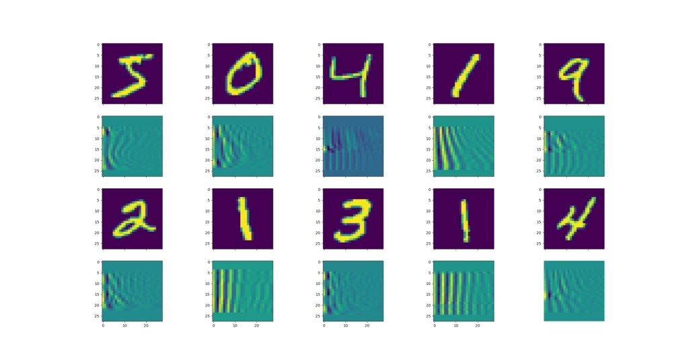
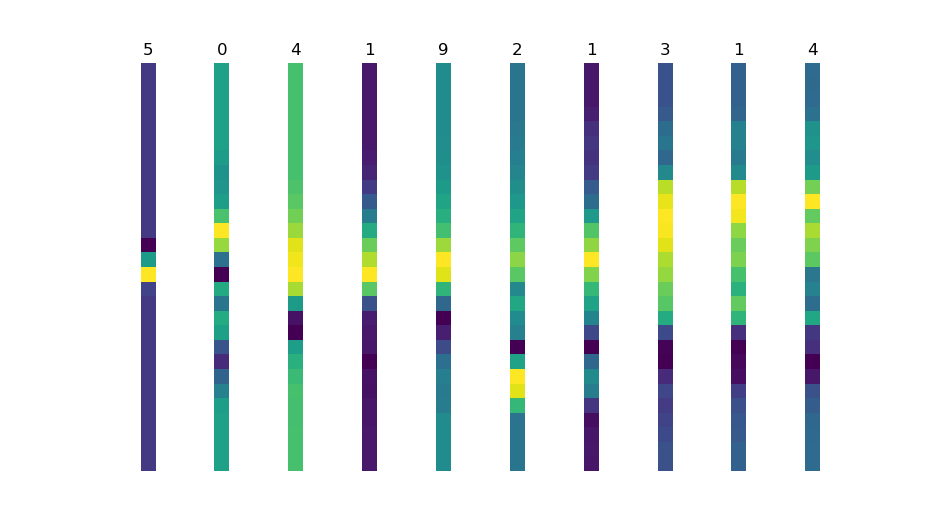

I recently finished work on my master's thesis in which I investigated how the process of mapping underground utilities such as cables and pipelines could be improved with deep neural networks.

Specifically, since utility mapping harnesses a geophysical technique called Ground Penetrating Radar, which produces image-like data, I investigated the effectiveness of [Convolutional Neural Networks](https://github.com/mobiletest2016/machine-learning-articles/blob/master/articles/convolutional-neural-networks-and-their-components-for-computer-vision.md) for this purpose. Since utility mapping is effectively a classification problem with respect to utility material type, that's what made CNNs worthwhile.

Later more on my thesis work, but today I want to share a peculiar observation with you: **that I have the feeling that feature compression deteriorates model performance when you're using CNNs.**

**Update February 2020** - Added table of contents and added links to relevant MachineCurve blog posts.

\[toc\]

## A bit of history

Since deep learning practitioners such as Chollet claim "to input data into CNNs as raw as possible", you may wonder why this blog is written in the first place.

So let's look backwards for a bit before we'll try to explain the behavior I observed during my research.

Primarily, approaches harnessing machine learning for improving the utility mapping process have used [Support Vector Machines](https://github.com/mobiletest2016/machine-learning-articles/blob/master/articles/intuitively-understanding-svm-and-svr.md) for this purpose. SVMs, which were popular many years ago i.e. before deep learning was cool, had one big shortcoming: they could not handle dimensionality well. That is, if you had an image, you had to substantially downsample it prior to feeding it to the model. Otherwise, it wouldn't work.

By consequence, many feature extraction approaches were investigated for utility mapping that all had in common that they wanted to reduce this _curse of dimensionality_. Examples are signal histograms (reducing dimensionality because many signal backscatters could be grouped into histogram bins) or the Discrete Cosine Transform (which essentially transforms the data input into the frequency spectrum, making it usable for signal compression such as the JPEG format).

...so I thought: let's try and see if they also work with CNNs, and I trained CNNs with histograms, DCTs and raw data.

Fun fact: the first two didn't work with accuracies averaging 50-60%. The latter one _did_ work and achieved ~80% with only 2500 data points.

_Side note:_ we're currently expanding the number of samples to avoid the trap of overfitting.

I think I have been able to intuitively derive the reasons for this problem based on logical reasoning, but let's first see if we can reproduce this behavior once more.

\[ad\]

## MNIST CNN

Do we remember that fancy numbers dataset?


Indeed, it's the [MNIST](http://yann.lecun.com/exdb/mnist.md) dataset: "a training set of 60,000 examples, and a test set of 10,000 examples". It [contains handwritten digits](https://github.com/mobiletest2016/machine-learning-articles/blob/master/articles/exploring-the-keras-datasets.md/#mnist-database-of-handwritten-digits), thus numbers from 0-9.

To give you a baseline of what a CNN can do with such a dataset, you will next see the result of training a CNN based on a [default Keras example script](https://github.com/keras-team/keras/blob/master/examples/mnist_cnn.py):

```
Epoch 1/12
60000/60000 [==============================] - 24s 404us/step - loss: 0.2616 - acc: 0.9201 - val_loss: 0.0745 - val_acc: 0.9779
Epoch 2/12
60000/60000 [==============================] - 15s 250us/step - loss: 0.0888 - acc: 0.9731 - val_loss: 0.0427 - val_acc: 0.9864
Epoch 3/12
60000/60000 [==============================] - 15s 244us/step - loss: 0.0667 - acc: 0.9797 - val_loss: 0.0356 - val_acc: 0.9878
Epoch 4/12
60000/60000 [==============================] - 14s 239us/step - loss: 0.0559 - acc: 0.9835 - val_loss: 0.0308 - val_acc: 0.9901
Epoch 5/12
60000/60000 [==============================] - 14s 238us/step - loss: 0.0478 - acc: 0.9858 - val_loss: 0.0318 - val_acc: 0.9901
Epoch 6/12
60000/60000 [==============================] - 13s 212us/step - loss: 0.0434 - acc: 0.9870 - val_loss: 0.0288 - val_acc: 0.9908
Epoch 7/12
60000/60000 [==============================] - 13s 218us/step - loss: 0.0392 - acc: 0.9877 - val_loss: 0.0312 - val_acc: 0.9904
Epoch 8/12
60000/60000 [==============================] - 14s 236us/step - loss: 0.0350 - acc: 0.9891 - val_loss: 0.0277 - val_acc: 0.9909
Epoch 9/12
60000/60000 [==============================] - 14s 232us/step - loss: 0.0331 - acc: 0.9897 - val_loss: 0.0276 - val_acc: 0.9906
Epoch 10/12
60000/60000 [==============================] - 15s 243us/step - loss: 0.0318 - acc: 0.9901 - val_loss: 0.0269 - val_acc: 0.9913
Epoch 11/12
60000/60000 [==============================] - 13s 219us/step - loss: 0.0284 - acc: 0.9914 - val_loss: 0.0296 - val_acc: 0.9899
Epoch 12/12
60000/60000 [==============================] - 12s 200us/step - loss: 0.0263 - acc: 0.9918 - val_loss: 0.0315 - val_acc: 0.9903
Test loss: 0.03145747215508682
Test accuracy: 0.9903
```

That's pretty good performance: it was right in approximately 99% of cases using the test set after only 12 epochs, or rounds of training. Could be worse... although it's a very simple computer vision problem indeed ;-)

## Making the data sparser

In order to demonstrate what I mean with _worse performance when your data is sparser_, I'm going to convert the MNIST samples into a sparsened version. I'll use the Discrete Cosine Transform for this, also called the DCT.

The DCT is a signal compression technique which, according to [Wikipedia](https://en.wikipedia.org/wiki/Discrete_cosine_transform), "expresses a finite sequence of data points in terms of a sum of cosine functions oscillating at different frequencies".

\[ad\]

I'm specifically using the `scipy.fftpack` DCT, type 2, which is the de facto default DCT in the scientific community. It can be written as [follows](https://docs.scipy.org/doc/scipy-0.14.0/reference/generated/scipy.fftpack.dct.html):

```
          N-1
y[k] = 2* sum x[n]*cos(pi*k*(2n+1)/(2*N)), 0 <= k < N.
          n=0
```

This is what the numbers subsequently look like visually:

[]

DCTs generated for MNIST samples.

You see that they can still be distinguished, but that the signal is more compact now (or diluted). This property, called _signal compaction_, allows one to literally downsample the DCT without losing predictive power.

Now let's see what happens if you average the matrices across one of the axes:



We have substantially sparser feature vectors now: in fact, every number is now represented by 28 instead of 784 features.

Let's redo the experiment. Note that this time, I had to change all references to [2D image data](https://github.com/mobiletest2016/machine-learning-articles/blob/master/articles/how-to-create-a-cnn-classifier-with-keras.md), e.g. the `Conv2D` and the `MaxPooling2D` layers, into their 1D variants - we namely removed one dimension from the data, and the 2D variants simply don't work anymore.

The [convolution operation](https://github.com/mobiletest2016/machine-learning-articles/blob/master/articles/convolutional-neural-networks-and-their-components-for-computer-vision.md) with learning filters itself, however, remains similar. This is the result:

```
Epoch 1/12
60000/60000 [==============================] - 23s 380us/step - loss: 2.5680 - acc: 0.1103 - val_loss: 2.3011 - val_acc: 0.1135
Epoch 2/12
60000/60000 [==============================] - 11s 183us/step - loss: 2.3026 - acc: 0.1123 - val_loss: 2.3010 - val_acc: 0.1135
Epoch 3/12
60000/60000 [==============================] - 12s 196us/step - loss: 2.3021 - acc: 0.1126 - val_loss: 2.3010 - val_acc: 0.1135
Epoch 4/12
60000/60000 [==============================] - 11s 190us/step - loss: 2.3015 - acc: 0.1123 - val_loss: 2.3010 - val_acc: 0.1135
Epoch 5/12
60000/60000 [==============================] - 10s 174us/step - loss: 2.3016 - acc: 0.1124 - val_loss: 2.3010 - val_acc: 0.1135
Epoch 6/12
60000/60000 [==============================] - 11s 186us/step - loss: 2.3014 - acc: 0.1124 - val_loss: 2.3010 - val_acc: 0.1135
Epoch 7/12
60000/60000 [==============================] - 11s 185us/step - loss: 2.3013 - acc: 0.1123 - val_loss: 2.3010 - val_acc: 0.1135
Epoch 8/12
60000/60000 [==============================] - 11s 192us/step - loss: 2.3013 - acc: 0.1124 - val_loss: 2.3010 - val_acc: 0.1135
Epoch 9/12
60000/60000 [==============================] - 11s 184us/step - loss: 2.3013 - acc: 0.1124 - val_loss: 2.3010 - val_acc: 0.1135
Epoch 10/12
60000/60000 [==============================] - 10s 163us/step - loss: 2.3015 - acc: 0.1125 - val_loss: 2.3010 - val_acc: 0.1135
Epoch 11/12
60000/60000 [==============================] - 10s 166us/step - loss: 2.3013 - acc: 0.1124 - val_loss: 2.3010 - val_acc: 0.1135
Epoch 12/12
60000/60000 [==============================] - 11s 191us/step - loss: 2.3014 - acc: 0.1124 - val_loss: 2.3010 - val_acc: 0.1135
Test loss: 2.3010036102294924
Test accuracy: 0.1135
```

Absolutely terrible performance. Unworthy of CNNs!

And this is indeed what I also experienced during my research.

## Here's why I think that DCT sparsity deteriorated model performance

In my research, I drew this conclusion with respect to the loss of performance when using the DCT:

_I think you blind the convolutional filters to the ideosyncrasies of the data._

\[ad\]

Or, in layman's terms, you make the CNN blind to the unique aspects represented by the numbers... despite the fact that they are already _in there_.

**Why is this the case?**

In my opinion, this can be explained by looking at the internals of a convolutional layer. It works as follows. [You specify a number of filters](https://github.com/mobiletest2016/machine-learning-articles/blob/master/articles/convolutional-neural-networks-and-their-components-for-computer-vision.md) which, during training, learn to recognize unique aspects of the image-like data. They can then be used to classify new samples - quite accurately, as we have seen with raw MNIST data. This means that the convolutional layer _already makes your data representation sparser_. What's more, this effect gets even stronger when layers like [Max Pooling](https://github.com/mobiletest2016/machine-learning-articles/blob/master/articles/what-are-max-pooling-average-pooling-global-max-pooling-and-global-average-pooling.md) are applied - which is precisely what I did above.

But when you downsample the data first by e.g. applying the DCT, _you thus effectively apply sparsening twice._ My only conclusion can thus be that by consequence, the convolutional filters can no longer learn the unique aspects within the image-like data, as they are hidden in the data set made compact. Only then, I literally found out why people always suggest to input your image data into CNNs as untransformed as possible.

**Then why did this work with SVMs?**

Previous scientific works on supporting utility mapping with machine learning achieved promising results when applying dimensionality reduction techniques like the DCT before training their models, such as SVMs.

Yet, it didn't work with CNNs.

Besides the architectural differences between them, one must also conclude that _CNNs make data essentially sparser while SVMs do not_. Consequently, for the latter you actually needed to apply those compression techniques for them to work in the first place, while for the first it makes the models perform worse.

An interesting insight - and a reminder to always set an average- to well-performing baseline first before you start training variations :-)

Did you run into this problem too? I'm eager to know. Please feel free to leave a comment. I'm happy to respond :) Thanks for reading!
