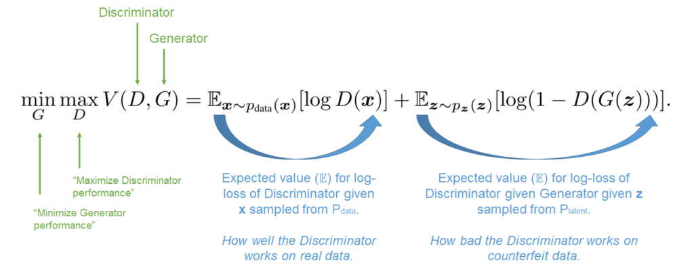
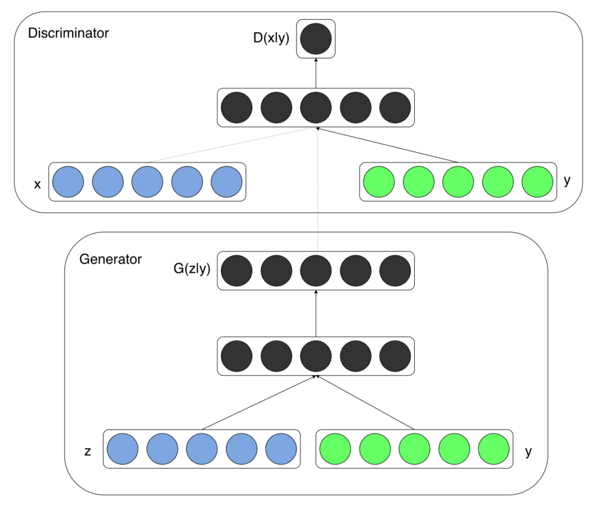
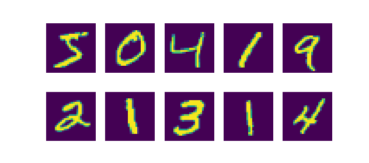

**Conditional Generative Adversarial Networks**, or _cGANs_ for short, improve regular or 'vanilla' GANs by adding a condition into the Generator and Discriminator networks. The idea is that it allows a GAN to better structure its latent space and the mapping into data space, and the concept of a cGAN was proposed by Mirza & Osindero (2014).

In this article, we're going to take a look at cGANs and explain the concepts. After reading it, you will...

- **Understand what is meant with vanilla GANs being _unconditional_.**
- **Know how GANs can be made conditional, and be turned into cGANs.**
- **See how this improves performance of a GAN trained on the MNIST dataset.**

Let's take a look! 🚀

* * *

\[toc\]

* * *

## Vanilla GANs are Unconditional

Generative Adversarial Networks were proposed back in 2014, through a paper written by Ian Goodfellow and others (Goodfellow et al., 2014). Their architecture is composed of two neural networks. First of all, there is a _generator_ $G$, which is responsible for generating images. Secondly, there is a _discriminator_ $D$, which has the task to detect which of the images presented to it is fake and which is real.

As they are trained jointly by minimizing loss components, the following minimax game emerges, as discussed in [our article about vanilla GANs](https://github.com/mobiletest2016/machine-learning-articles/blob/master/articles/generative-adversarial-networks-a-gentle-introduction.md):

Loss and its components for an unconditioned GAN.

This loss works with both the vector $\\bf{z}$ sampled from the latent distribution $\\text{Z}$ and vector $\\bf{x}$ which is generated by the generator on the basis of $\\bf{z}$.

Through their joint training, the Generator learns to convert samples from the latent distribution in such a way that they produce output images that cannot be distinguished from real ones anymore. This allows us to draw samples ($\\bf{z}$s) from the latent distribution and generate images. In effect, through the lens of the Generator, the latent distribution thus compresses information about 'data space' - but then in an accessible way.

According to Goodfellow et al. (2014), vanilla GANs have many straightforward extensions - of which cGANs are one:

> A conditional generative model p(x | c) can be obtained by adding c as input to both G and D
> 
> Goodfellow et al. (2014)

Yes, vanilla GANs are _unconditional_. In the quote above, you can read $p(\\text{x | c})$ as _the probability that we generate vector $\\bf{x}$ given some condition $c$._ Adding a condition to our probabilities allows us to teach the Generator to use the latent distribution in an even more structured way.

* * *

## Introducing the Conditional GAN (cGAN)

For this reason, Mirza & Osindero (2014) propose what they call the **Conditional GAN**, or cGAN. It adds conditioning on some extra information $\\bf{y}$. Then, the probability $p(\\bf{x})$ generated by $G$ turns into $p(\\bf{x|y})$, or "the probability for $\\bf{x}$ given condition $\\bf{y}$". The trained eye easily sees that $\\bf{y}$ and $\\bf{c}$ are the same; that they just use different letters.

Adding conditioning is expected to allow for better structuring of the latent space and its sampling _and_ thus generate better results. Any kind of information can be used for conditioning (Mirza & Osindero, 2014). Simple conditioning can be achieved by adding label data, such as the target for the image to be generated (e.g. `y = 1` if the goal is to generate 1s from the MNIST dataset). It is also possible to use more complex conditioning information, such as data from other modalities (e.g. text instead of images).

Applying conditioning involves feeding the condition parameter $\\bf{y}$ into both the generator $G$ and the discriminator $D$ of your GAN. We use an additional input layer for this purpose. Visually, this looks as follows:

Conditional Generative Adversarial Network (cGAN) architecture (Mirza & Osindero, 2014).

We can see that the conditioning information is first concatenated with the latent space or generation and then further processed. It's a straightforward expansion of the vanilla GAN. No other significant changes to e.g. hyperparameters were applied compared to the Goodfellow et al. (2014) GAN, at least according to the paper (Mirza & Osindero, 2014).

* * *

## Results compared to vanilla GANs

Conditional GANs were tested in two settings:

- **Generating samples from the MNIST dataset.** Performance was measured by a log-likelihood estimate.
- **Generating text labels for images.**

In both cases, very agreeable results were achieved, with cGANs achieving better performance on MNIST generation compared to vanilla GANs. Conditioning definitely helps here!

* * *

## Summary

Vanilla GANs were proposed back in 2014 (by Goodfellow et al., 2014) as a new mechanism for generative Machine Learning. As with any innovation, non-significant amounts of optimization have taken place. This is even suggested in the original work: there are a variety of straightforward extensions that can be applied to possibly make GANs even more performant.

Conditional GANs, or cGANs, are one such extension. By making the sampling from latent space and data space conditional by adding an additional parameter to the neural networks, the neural network can much better structure the latent space and the mapping into data space. As a consequence, cGANs are more performant compared to the 2014 vanilla GANs, and adding conditionality - if possible - can be a best practice for training your GAN.

By reading this tutorial, you now...

- **Understand what is meant with vanilla GANs being _unconditional_.**
- **Know how GANs can be made conditional, and be turned into cGANs.**
- **See how this improves performance of a GAN trained on the MNIST dataset.**

I hope that it was useful for your learning process! Please feel free to share what you have learned in the comments section 💬 I’d love to hear from you. Please do the same if you have any questions or other remarks.

Thank you for reading MachineCurve today and happy engineering! 😎

* * *

## References

Goodfellow, I. J., Pouget-Abadie, J., Mirza, M., Xu, B., Warde-Farley, D., Ozair, S., … & Bengio, Y. (2014). [Generative adversarial networks.](https://arxiv.org/abs/1406.2661) _arXiv preprint arXiv:1406.2661_.

Mirza, M., & Osindero, S. (2014). [Conditional generative adversarial nets.](https://arxiv.org/abs/1411.1784) _arXiv preprint arXiv:1411.1784_.
