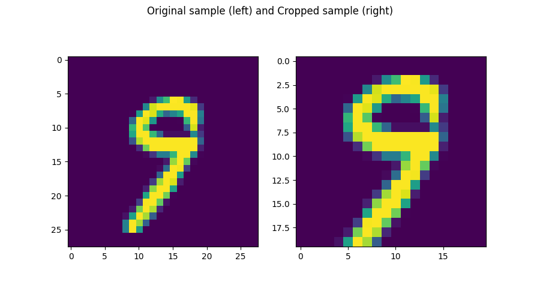
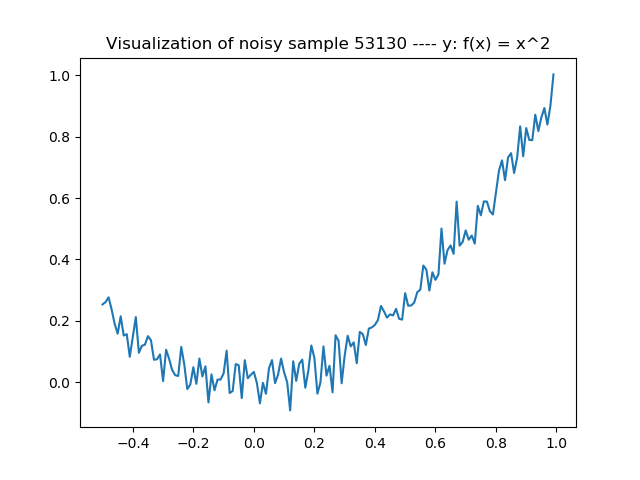
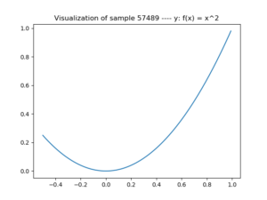
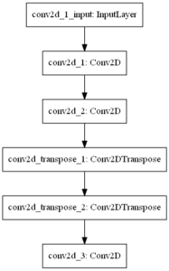
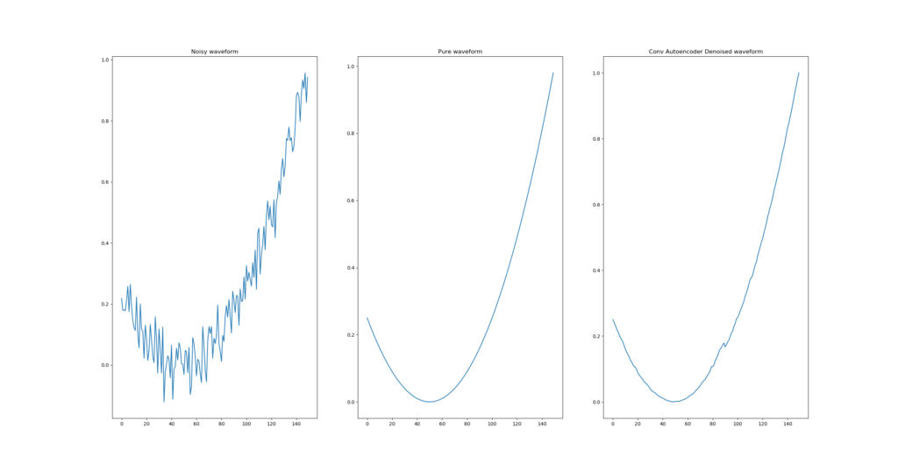
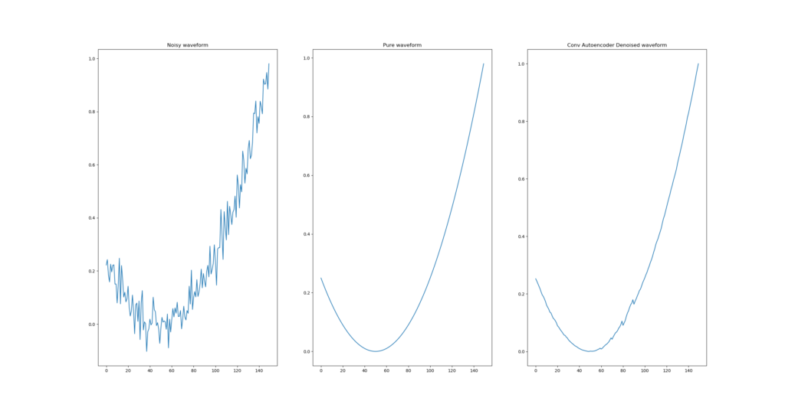
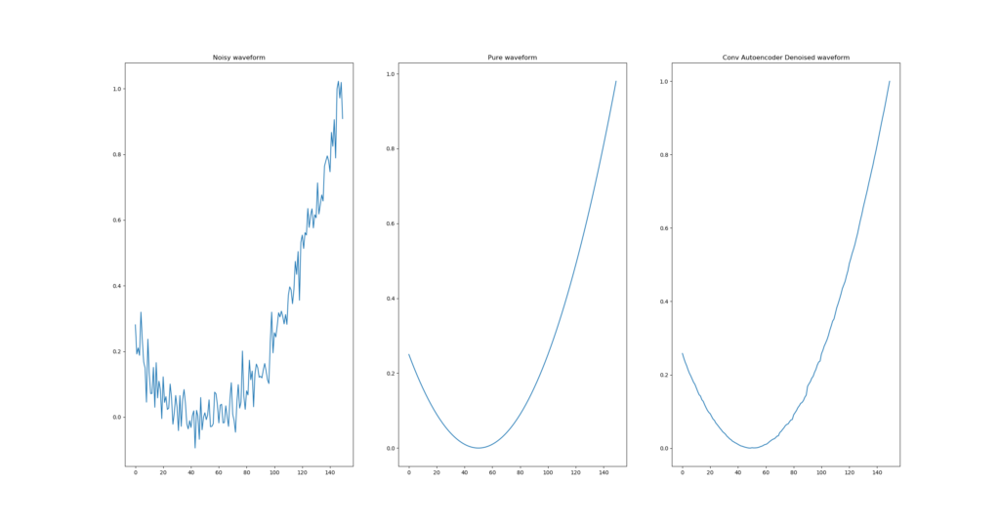

Pure signals only exist in theory. That is, when you're doing signal processing related activities, it's very likely that you'll experience noise. Whether noise is caused by the measurement (or reception) device or by the medium in which you perform measurements, you want it gone.

Various mathematical tricks exist to filter out noise from a signal. When noise is relatively constant across a range of signals, for example, you can take the mean of all the signals and deduct it from each individual signal - which likely removes the factors that contribute from noise.

However, these tricks work by knowing a few things about the noise up front. In many cases, the exact shape of your noise is unknown or cannot be estimated because it is relatively hidden. In those cases, the solution may lie in _learning_ the noise from example data.

[]

_A noisy \[latex\]x^2\[/latex\] sample. We'll try to remove the noise with an autoencoder._

Autoencoders can be used for this purpose. By feeding them noisy data as inputs and clean data as outputs, it's possible to make them recognize _the ideosyncratic noise for the training data_. This way, autoencoders can serve as denoisers.

But what are autoencoders exactly? And why does the way they work make them suitable for noise removal? And how to implement one for _signal denoising / noise reduction_?

We'll answer these questions in today's blog. First, we'll provide a recap on autoencoders - to (re)gain a theoretical understanding of what they are and how they work. This includes a discussion on why they can be applied to noise removal. Subsequently, we implement an autoencoder to demonstrate this, by means of a three-step process:

- We generate a large dataset of \[latex\]x^2\[/latex\] samples.
- We generate a large dataset of \[latex\]x^2\[/latex\] samples to which Gaussian (i.e., random) noise has been added.
- We create an autoencoder which learns to transform noisy \[latex\]x^2\[/latex\] inputs into the original sine, i.e. _which removes the noise_ - also for new data!

Ready?

Okay, let's go! 😊

**Update 06/Jan/2021:** updated the article to reflect TensorFlow in 2021. As 1-dimensional transposed convolutions are available in TensorFlow now, the article was updated to use `Conv1D` and `Conv1DTranspose` layers instead of their 2D variants. This fits better given the 1D aspect of our dataset. In addition, references to old Keras were replaced with newer `tf.keras` versions, meaning that this article is compatible with TensorFlow 2.4.0+.

* * *

\[toc\]

* * *

## Recap: what are autoencoders?

If we're going to build an autoencoder, we must know what they are.

In our blog post **"Conv2DTranspose: using 2D transposed convolutions with Keras"**, we already [covered the high-level principles](https://github.com/mobiletest2016/machine-learning-articles/blob/master/articles/conv2dtranspose-using-2d-transposed-convolutions-with-keras/#what-is-an-autoencoder) behind autoencoders, but it's wise to repeat them here.

We can visualize the flow of an autoencoder as follows:

[]

Autoencoders are composed of two parts: an _encoder_, which encodes some input into encoded state, and a _decoder_ which can decode the encoded state into another format. This can be a reconstruction of the original input, as we can see in the plot below, but it can also be something different.



_When autoencoders are used to reconstruct inputs from an encoded state._

For example, autoencoders are learnt for noise removal, but also for dimensionality reduction (Keras Blog , n.d.; we then use them to convert the input data into low-dimensional format, which might benefit training lower-dimensionality model types such as [SVMs](https://github.com/mobiletest2016/machine-learning-articles/blob/master/articles/intuitively-understanding-svm-and-svr.md)).

Note that the red parts in the block above - that is, the encoder and the decoder, are _learnt based on data_ (Keras Blog, n.d.). This means that, contrary to more abstract mathematical functions (e.g. filters), they are highly specialized in _one domain_ (e.g. signal noise removal at \[latex\]x^2\[/latex\] plots as we will do next) while they perform very poorly in another (e.g. when using the same autoencoder for image noise removal).

* * *

## Why autoencoders are applicable to noise removal

Autoencoders learn an _encoded state_ with an _encoder_, and learn to decode this state into _something else_ with a _decoder_.

Now think about this in the context of signal noise: suppose that you feed the neural network noisy data as _features_, while you have the pure data available as _targets_. Following the drawing above, the neural network will learn an encoded state based on the noisy image, and will attempt to decode it to best match the _pure data_. What's the thing that stands in between the pure data and the noisy data? Indeed, the noise. In effect, the autoencoder will thus learn to recognize noise and remove it from the input image.

Let's now see if we can create such an autoencoder with Keras.

* * *

## Today's example: a Keras based autoencoder for noise removal

In the next part, we'll show you how to use the Keras deep learning framework for creating a _denoising_ or _signal removal_ autoencoder. Here, we'll first take a look at two things - the data we're using as well as a high-level description of the model.

### The data

First, the data. As _pure signals_ (and hence autoencoder targets), we're using pure \[latex\]x^2\[/latex\] samples from a small domain. When plotted, a sample looks like this:

[]

For today's model, we use 100.000 samples. To each of them, we add Gaussian noise - or random noise. While the global shape remains present, it's clear that the plots become noisy:

[]

### The model

Now, the model. It looks as follows:


...and has these layers:

- The input layer, which takes the input data;
- Two [Conv1D layers](https://www.tensorflow.org/api_docs/python/tf/keras/layers/Conv1D), which serve as _encoder_;
- Two [Conv1D transpose layers](https://www.tensorflow.org/api_docs/python/tf/keras/layers/Conv1DTranspose), which serve as _decoder_;
- One Conv1D layer with one output, a Sigmoid activation function and padding, serving as the output layer.

To provide more details, this is the model summary:

```
Model: "sequential"
_________________________________________________________________
Layer (type)                 Output Shape              Param #
=================================================================
conv1d (Conv1D)              (None, 148, 128)          512
_________________________________________________________________
conv1d_1 (Conv1D)            (None, 146, 32)           12320
_________________________________________________________________
conv1d_transpose (Conv1DTran (None, 148, 32)           3104
_________________________________________________________________
conv1d_transpose_1 (Conv1DTr (None, 150, 128)          12416
_________________________________________________________________
conv1d_2 (Conv1D)            (None, 150, 1)            385
=================================================================
Total params: 28,737
Trainable params: 28,737
Non-trainable params: 0
```

Let's now start with the first part - generating the pure waveforms! Open up your Explorer, navigate to some folder (e.g. `keras-autoencoders`) and create a file called `signal_generator.py`. Next, open this file in your code editor - and let the coding process begin!

* * *

## Generating pure waveforms

[]

Generating pure waveforms consists of the following steps, in order to generate visualizations like the one shown on the right:

- Adding the necessary imports to the start of your Python script;
- Defining configuration settings for the signal generator;
- Generating the data, a.k.a. the pure waveforms;
- Saving the waveforms and visualizing a subset of them.

### Adding imports

First, the imports - it's a simple list:

```
import matplotlib.pyplot as plt
import numpy as np
```

We use Numpy for data generation & processing and Matplotlib for visualizing some of the samples at the end.

### Configuring the generator

Generator configuration consists of three steps: sample-wide configuration, intra-sample configuration and other settings. First, sample-wide configuration, which is just the number of samples to generate:

```
# Sample configuration
num_samples = 100000
```

Followed by intra-sample configuration:

```
# Intrasample configuration
num_elements = 1
interval_per_element = 0.01
total_num_elements = int(num_elements / interval_per_element)
starting_point = int(0 - 0.5*total_num_elements)
```

`num_elements` represents the _width_ of your domain. `interval_per_element` represents the step size that the iterator will take when generating the sample. In this case, the domain \[latex\](0, 1\]\[/latex\] will thus contain 100 samples (as \[latex\]1/interval per element = 1/0.01 = 100\[/latex\]). That's what's represented in `total_num_elements`.

The starting point determines where to start the generation process.

Finally, you can set the number of samples that you want visualized in the `other configuration` settings:

```
# Other configuration
num_samples_visualize = 1
```

### Generating data

Next step, creating some data! 😁

We'll first specify the lists that contain our data and the sub-sample data (one sample in `samples` contains multiple `xs` and `ys`; when \[latex\]totalnumelements = 100\[/latex\], that will be 100 of them each):

```
# Containers for samples and subsamples
samples = []
xs = []
ys = []
```

Next, the actual data generation part:

```
# Generate samples
for j in range(0, num_samples):
  # Report progress
  if j % 100 == 0:
    print(j)
  # Generate wave
  for i in range(starting_point, total_num_elements):
    x_val = i * interval_per_element
    y_val = x_val * x_val
    xs.append(x_val)
    ys.append(y_val)
  # Append wave to samples
  samples.append((xs, ys))
  # Clear subsample containers for next sample
  xs = []
  ys = []
```

We'll first iterate over every sample, determined by the range between 0 and the `num_samples` variable. This includes a progress report every 100 samples.

Next, we construct the wave step by step, adding the function outputs to the `xs` and `ys` variables.

Subsequently, we append the entire wave to the `samples` list, and clear the subsample containers for generating the next sample.

### Saving & visualizing

The next step is to save the data. We do so by using Numpy's `save` call, and save `samples` to a file called `./signal_waves_medium.py`.

```
# Input shape
print(np.shape(np.array(samples[0][0])))
  
# Save data to file for re-use
np.save('./signal_waves_medium.npy', samples)

# Visualize a few random samples
for i in range(0, num_samples_visualize):
  random_index = np.random.randint(0, len(samples)-1)
  x_axis, y_axis = samples[random_index]
  plt.plot(x_axis, y_axis)
  plt.title(f'Visualization of sample {random_index} ---- y: f(x) = x^2')
  plt.show()
```

Next, with some basic Matplotlib code, we visualize `num_samples_visualize` random samples from the `samples` array. And that's it already!

Run your code with `python signal_generator.py` (ensure that you have Numpy and Matplotlib installed) and the generation process should begin, culminating in a `.npy` file and one (or more) visualizations popping up once the process finishes.

### Full generator code

If you wish to obtain the entire signal generator at once, here you go:

```
import matplotlib.pyplot as plt
import numpy as np

# Sample configuration
num_samples = 100000

# Intrasample configuration
num_elements = 1
interval_per_element = 0.01
total_num_elements = int(num_elements / interval_per_element)
starting_point = int(0 - 0.5*total_num_elements)

# Other configuration
num_samples_visualize = 1

# Containers for samples and subsamples
samples = []
xs = []
ys = []

# Generate samples
for j in range(0, num_samples):
  # Report progress
  if j % 100 == 0:
    print(j)
  # Generate wave
  for i in range(starting_point, total_num_elements):
    x_val = i * interval_per_element
    y_val = x_val * x_val
    xs.append(x_val)
    ys.append(y_val)
  # Append wave to samples
  samples.append((xs, ys))
  # Clear subsample containers for next sample
  xs = []
  ys = []

# Input shape
print(np.shape(np.array(samples[0][0])))
  
# Save data to file for re-use
np.save('./signal_waves_medium.npy', samples)

# Visualize a few random samples
for i in range(0, num_samples_visualize):
  random_index = np.random.randint(0, len(samples)-1)
  x_axis, y_axis = samples[random_index]
  plt.plot(x_axis, y_axis)
  plt.title(f'Visualization of sample {random_index} ---- y: f(x) = x^2')
  plt.show()
```

* * *

## Adding noise to pure waveforms

The second part: adding noise to the 100k pure waveforms we generated in the previous step.

[]

It's composed of these individual steps:

- Once again, adding imports;
- Setting the configuration variables for the noising process;
- Loading the data;
- Adding the noise;
- Saving the noisy samples and visualizing a few of them.

Create an additional file, e.g. `signal_apply_noise.py`, and let's add the following things.

### Adding imports

Our imports are the same as we used in the signal generator:

```
import matplotlib.pyplot as plt
import numpy as np
```

### Configuring the noising process

Our noising configuration is also a lot simpler:

```
# Sample configuration
num_samples_visualize = 1
noise_factor = 0.05
```

`num_samples_visualize` is the number of samples we wish to visualize once the noising process finishes, and `noise_factor` is the amount of noise we'll be adding to our samples (\[latex\]0 = no noise; 1 = full noise\[/latex\]).

### Loading data

Next, we load the data and assign the samples to the correct variables, being `x_val` and `y_val`.

```
# Load data
data = np.load('./signal_waves_medium.npy')
x_val, y_val = data[:,0], data[:,1]
```

### Adding noise

Next, we add the noise to our samples.

```
# Add noise to data
noisy_samples = []
for i in range(0, len(x_val)):
  if i % 100 == 0:
    print(i)
  pure = np.array(y_val[i])
  noise = np.random.normal(0, 1, pure.shape)
  signal = pure + noise_factor * noise
  noisy_samples.append([x_val[i], signal])
```

First, we define a new list that will contain our noisy samples. Subsequently, we iterate over each sample (reporting progress every 100 samples). We then do a couple of things:

- We assign the pure sample (i.e., the \[latex\]x^2\[/latex\] plot wihtout noise) to the `pure` variable.
- Subsequently, we generate Gaussian noise using `np.random.normal`, with the same shape as `pure`'s.
- Next, we add the noise to the pure sample, using the `noise_factor`.
- Finally, we append the sample's domain and the noisy sample to the `noisy_samples` array.

### Saving & visualizing

Next, we - and this is no different than with the generator before - save the data into a `.npy` file (this time, with a different name 😃) and visualize a few random samples based on the number you configured earlier.

```
# Save data to file for re-use
np.save('./signal_waves_noisy_medium.npy', noisy_samples)

# Visualize a few random samples
for i in range(0, num_samples_visualize):
  random_index = np.random.randint(0, len(noisy_samples)-1)
  x_axis, y_axis = noisy_samples[random_index]
  plt.plot(x_axis, y_axis)
  plt.title(f'Visualization of noisy sample {random_index} ---- y: f(x) = x^2')
  plt.show()
```

If you would now run `signal_apply_noise.py`, you'd get 100k noisy samples, with which we can train the autoencoder we'll build next.

### Full noising code

If you're interested in the full code of the noising script, here you go:

```
import matplotlib.pyplot as plt
import numpy as np

# Sample configuration
num_samples_visualize = 1
noise_factor = 0.05

# Load data
data = np.load('./signal_waves_medium.npy')
x_val, y_val = data[:,0], data[:,1]

# Add noise to data
noisy_samples = []
for i in range(0, len(x_val)):
  if i % 100 == 0:
    print(i)
  pure = np.array(y_val[i])
  noise = np.random.normal(0, 1, pure.shape)
  signal = pure + noise_factor * noise
  noisy_samples.append([x_val[i], signal])
  
# Save data to file for re-use
np.save('./signal_waves_noisy_medium.npy', noisy_samples)

# Visualize a few random samples
for i in range(0, num_samples_visualize):
  random_index = np.random.randint(0, len(noisy_samples)-1)
  x_axis, y_axis = noisy_samples[random_index]
  plt.plot(x_axis, y_axis)
  plt.title(f'Visualization of noisy sample {random_index} ---- y: f(x) = x^2')
  plt.show()
```

* * *

## Creating the autoencoder

[]

It's now time for the interesting stuff: creating the autoencoder 🤗

Creating it contains these steps:

- Once again, adding some imports 😋
- Setting configuration details for the model;
- Data loading and preparation;
- Defining the model architecture;
- Compiling the model and starting training;
- Visualizing denoised waveforms from the test set, to find out visually whether it works.

To run it successfully, you'll need **TensorFlow 2.4.0+**, **Matplotlib** and **Numpy**.

Let's create a third (and final 😋) file: `python signal_autoencoder.py`.

### Adding imports

First, let's specify the imports:

```
import tensorflow.keras
from tensorflow.keras.models import Sequential
from tensorflow.keras.layers import Conv1D, Conv1DTranspose
from tensorflow.keras.constraints import max_norm
import matplotlib.pyplot as plt
import numpy as np
import math
```

From Keras, we import the Sequential API (which we use to stack the layers on top of each other), the Conv1D and Conv1DTranspose layers (see the architecture and the rationale [here](#the-model) to find out why), and the MaxNorm constraint, in order to keep the weight updates in check. We also import Matplotlib, Numpy and the Python `math` library.

### Model configuration

Next, we set some configuration options for the model:

```
# Model configuration
input_shape = (150, 1)
batch_size = 150
no_epochs = 5
train_test_split = 0.3
validation_split = 0.2
verbosity = 1
max_norm_value = 2.0
```

Here are some insights about the model configuration:

- The `input_shape`, in line with Conv1D input, is thus \[latex\] (150, 1)\[/latex\].
- The batch size is 150. This number seemed to work well, offering a nice balance between loss value and prediction time.
- The number of epochs is fairly low, but pragmatic: the autoencoder did not improve substantially anymore after this number.
- We use 30% of the total data, i.e. 30k samples, as testing data.
- 20% of the training data (70k) will be used for validation purposes. Hence, 14k will be used to validate the model per epoch (and even per minibatch), while 56k will be used for actual training.
- All model outputs are displayed on screen, with `verbosity` mode set to True.
- The `max_norm_value` is 2.0. This value worked well in a different scenario, and slightly improved the training results.

### Data loading & preparation

The next thing to do is to load the data. We load both the noisy and the pure samples into their respective variables:

```
# Load data
data_noisy = np.load('./signal_waves_noisy_medium.npy')
x_val_noisy, y_val_noisy = data_noisy[:,0], data_noisy[:,1]
data_pure = np.load('./signal_waves_medium.npy')
x_val_pure, y_val_pure = data_pure[:,0], data_pure[:,1]
```

Next, we'll reshape the data. We do so for each sample. This includes the following steps:

[]

_Binary crossentropy loss values for target = 1, in the prediction range \[0, 1\]._

- First, given the way how [binary crossentropy loss works](https://github.com/mobiletest2016/machine-learning-articles/blob/master/articles/about-loss-and-loss-functions/#binary-crossentropy), we normalize our samples to fall in the range \[latex\]\[0, 1\]\[/latex\]. Without this normalization step, odd loss values (extremely negative ones, impossible with BCE loss) start popping up (Quetzalcohuatl, n.d.).
- We subsequently add the noisy and pure samples to the specific `*_r` arrays.

```
# Reshape data
y_val_noisy_r = []
y_val_pure_r = []
for i in range(0, len(y_val_noisy)):
  noisy_sample = y_val_noisy[i]
  pure_sample = y_val_pure[i]
  noisy_sample = (noisy_sample - np.min(noisy_sample)) / (np.max(noisy_sample) - np.min(noisy_sample))
  pure_sample = (pure_sample - np.min(pure_sample)) / (np.max(pure_sample) - np.min(pure_sample))
  y_val_noisy_r.append(noisy_sample)
  y_val_pure_r.append(pure_sample)
y_val_noisy_r   = np.array(y_val_noisy_r)
y_val_pure_r    = np.array(y_val_pure_r)
noisy_input     = y_val_noisy_r.reshape((y_val_noisy_r.shape[0], y_val_noisy_r.shape[1], 1))
pure_input      = y_val_pure_r.reshape((y_val_pure_r.shape[0], y_val_pure_r.shape[1], 1))
```

Once each sample is resampled, we convert the _entire_ array for both the resampled noisy and resampled pure samples into a structure that TensorFlow/Keras can handle. That is, we increase the shape with another dimension to represent the number of channels, which in our case is just 1.

Finally, we perform the split into training and testing data (30k test, 56+14 = 70k train):

```
# Train/test split
percentage_training = math.floor((1 - train_test_split) * len(noisy_input))
noisy_input, noisy_input_test = noisy_input[:percentage_training], noisy_input[percentage_training:]
pure_input, pure_input_test = pure_input[:percentage_training], pure_input[percentage_training:]
```

### Creating the model architecture

This is the architecture of our autoencoder:

```
# Create the model
model = Sequential()
model.add(Conv1D(128, kernel_size=3, kernel_constraint=max_norm(max_norm_value), activation='relu', kernel_initializer='he_uniform', input_shape=input_shape))
model.add(Conv1D(32, kernel_size=3, kernel_constraint=max_norm(max_norm_value), activation='relu', kernel_initializer='he_uniform'))
model.add(Conv1DTranspose(32, kernel_size=3, kernel_constraint=max_norm(max_norm_value), activation='relu', kernel_initializer='he_uniform'))
model.add(Conv1DTranspose(128, kernel_size=3, kernel_constraint=max_norm(max_norm_value), activation='relu', kernel_initializer='he_uniform'))
model.add(Conv1D(1, kernel_size=3, kernel_constraint=max_norm(max_norm_value), activation='sigmoid', padding='same'))

model.summary()
```

- We'll use the Sequential API, for stacking the layers on top of each other.
- The two Conv1D layers serve as the _encoder_, and learn 128 and 32 filters, respectively. They activate with the [ReLU activation function](https://github.com/mobiletest2016/machine-learning-articles/blob/master/articles/implementing-relu-sigmoid-and-tanh-in-keras.md), and by consequence require [He initialization](https://github.com/mobiletest2016/machine-learning-articles/blob/master/articles/he-xavier-initialization-activation-functions-choose-wisely.md). Max-norm regularization is applied to each of them.
- The two Conv1DTranspose layers, which learn 32 and 128 filters, serve as the _decoder_. They also use ReLU activation and He initialization, as well as Max-norm regularization.
- The final Conv layer serves as the output layer, and does (by virtue of `padding='same'`) not alter the shape, except for the number of channels (back into 1).
- Kernel sizes are 3 pixels.

Generating a model summary, i.e. calling `model.summary()`, results in this summary, which also shows the number of parameters that is trained:

```
Model: "sequential"
_________________________________________________________________
Layer (type)                 Output Shape              Param #
=================================================================
conv1d (Conv1D)              (None, 148, 128)          512
_________________________________________________________________
conv1d_1 (Conv1D)            (None, 146, 32)           12320
_________________________________________________________________
conv1d_transpose (Conv1DTran (None, 148, 32)           3104
_________________________________________________________________
conv1d_transpose_1 (Conv1DTr (None, 150, 128)          12416
_________________________________________________________________
conv1d_2 (Conv1D)            (None, 150, 1)            385
=================================================================
Total params: 28,737
Trainable params: 28,737
Non-trainable params: 0
_________________________________________________________________
```

### Model compilation & starting the training process

The next thing to do is to compile the model (i.e., specify the optimizer and loss function) and to start the training process. We use Adam and Binary crossentropy for the fact that they are relatively default choices for today's deep learning models.

Fitting the data shows that we're going from `noisy_input` (features) to `pure_input` (targets). The number of epochs, the batch size and the validation split are as configured earlier.

```
# Compile and fit data
model.compile(optimizer='adam', loss='binary_crossentropy')
model.fit(noisy_input, pure_input,
                epochs=no_epochs,
                batch_size=batch_size,
                validation_split=validation_split)
```

### Visualizing denoised waveforms from test set

Once the training process finishes, it's time to find out whether our model actually works. We do so by generating a few reconstructions: we add a noisy sample from the test set (which is data the model has never seen before!) and visualize whether it outputs the noise-free shape. This is the code

```
# Generate reconstructions
num_reconstructions = 4
samples = noisy_input_test[:num_reconstructions]
reconstructions = model.predict(samples)

# Plot reconstructions
for i in np.arange(0, num_reconstructions):
  # Prediction index
  prediction_index = i + percentage_training
  # Get the sample and the reconstruction
  original = y_val_noisy[prediction_index]
  pure = y_val_pure[prediction_index]
  reconstruction = np.array(reconstructions[i])
  # Matplotlib preparations
  fig, axes = plt.subplots(1, 3)
  # Plot sample and reconstruciton
  axes[0].plot(original)
  axes[0].set_title('Noisy waveform')
  axes[1].plot(pure)
  axes[1].set_title('Pure waveform')
  axes[2].plot(reconstruction)
  axes[2].set_title('Conv Autoencoder Denoised waveform')
  plt.show()
```

Open up your terminal again, and run `python signal_autoencoder.py`. Now, the training process should begin.

### Full model code

If you're interested in the full code, here you go:

```
import tensorflow.keras
from tensorflow.keras.models import Sequential, save_model
from tensorflow.keras.layers import Conv1D, Conv1DTranspose
from tensorflow.keras.constraints import max_norm
import matplotlib.pyplot as plt
import numpy as np
import math

# Model configuration
input_shape = (150, 1)
batch_size = 150
no_epochs = 5
train_test_split = 0.3
validation_split = 0.2
verbosity = 1
max_norm_value = 2.0

# Load data
data_noisy = np.load('./signal_waves_noisy_medium.npy')
x_val_noisy, y_val_noisy = data_noisy[:,0], data_noisy[:,1]
data_pure = np.load('./signal_waves_medium.npy')
x_val_pure, y_val_pure = data_pure[:,0], data_pure[:,1]

# Reshape data
y_val_noisy_r = []
y_val_pure_r = []
for i in range(0, len(y_val_noisy)):
  noisy_sample = y_val_noisy[i]
  pure_sample = y_val_pure[i]
  noisy_sample = (noisy_sample - np.min(noisy_sample)) / (np.max(noisy_sample) - np.min(noisy_sample))
  pure_sample = (pure_sample - np.min(pure_sample)) / (np.max(pure_sample) - np.min(pure_sample))
  y_val_noisy_r.append(noisy_sample)
  y_val_pure_r.append(pure_sample)
y_val_noisy_r   = np.array(y_val_noisy_r)
y_val_pure_r    = np.array(y_val_pure_r)
noisy_input     = y_val_noisy_r.reshape((y_val_noisy_r.shape[0], y_val_noisy_r.shape[1], 1))
pure_input      = y_val_pure_r.reshape((y_val_pure_r.shape[0], y_val_pure_r.shape[1], 1))

# Train/test split
percentage_training = math.floor((1 - train_test_split) * len(noisy_input))
noisy_input, noisy_input_test = noisy_input[:percentage_training], noisy_input[percentage_training:]
pure_input, pure_input_test = pure_input[:percentage_training], pure_input[percentage_training:]

# Create the model
model = Sequential()
model.add(Conv1D(128, kernel_size=3, kernel_constraint=max_norm(max_norm_value), activation='relu', kernel_initializer='he_uniform', input_shape=input_shape))
model.add(Conv1D(32, kernel_size=3, kernel_constraint=max_norm(max_norm_value), activation='relu', kernel_initializer='he_uniform'))
model.add(Conv1DTranspose(32, kernel_size=3, kernel_constraint=max_norm(max_norm_value), activation='relu', kernel_initializer='he_uniform'))
model.add(Conv1DTranspose(128, kernel_size=3, kernel_constraint=max_norm(max_norm_value), activation='relu', kernel_initializer='he_uniform'))
model.add(Conv1D(1, kernel_size=3, kernel_constraint=max_norm(max_norm_value), activation='sigmoid', padding='same'))

model.summary()

# Compile and fit data
model.compile(optimizer='adam', loss='binary_crossentropy')
model.fit(noisy_input, pure_input,
                epochs=no_epochs,
                batch_size=batch_size,
                validation_split=validation_split)

# Generate reconstructions
num_reconstructions = 4
samples = noisy_input_test[:num_reconstructions]
reconstructions = model.predict(samples)

# Plot reconstructions
for i in np.arange(0, num_reconstructions):
  # Prediction index
  prediction_index = i + percentage_training
  # Get the sample and the reconstruction
  original = y_val_noisy[prediction_index]
  pure = y_val_pure[prediction_index]
  reconstruction = np.array(reconstructions[i])
  # Matplotlib preparations
  fig, axes = plt.subplots(1, 3)
  # Plot sample and reconstruciton
  axes[0].plot(original)
  axes[0].set_title('Noisy waveform')
  axes[1].plot(pure)
  axes[1].set_title('Pure waveform')
  axes[2].plot(reconstruction)
  axes[2].set_title('Conv Autoencoder Denoised waveform')
  plt.show()
 
```

## Results

Next, the results 😎

After the fifth epoch, validation loss \[latex\]\\approx 0.3556\[/latex\]. This is high, but acceptable. What's more important is to find out how well the model works when visualizing the test set predictions.

Here they are:

- []
    
- []
    
- []
    
- []
    

Clearly, the autoencoder has learnt to remove much of the noise. As you can see, the denoised samples are not entirely noise-free, but it's a lot better. Some nice results! 😎

## Summary

In this blog post, we created a denoising / noise removal autoencoder with Keras, specifically focused on signal processing. By generating 100.000 pure and noisy samples, we found that it's possible to create a trained noise removal algorithm that is capable of removing specific noise from input data. I hope you've learnt something today, and if you have any questions or remarks - please feel free to leave a comment in the comments box below! 😊 I'll try to answer your comment as soon as I can.

Thanks for reading MachineCurve today and happy engineering! 😎

_Please note that the code for these models is also available in my [keras-autoencoders Github repository](https://github.com/christianversloot/keras-autoencoders)._

## References

Keras Blog. (n.d.). Building Autoencoders in Keras. Retrieved from [https://blog.keras.io/building-autoencoders-in-keras.html](https://blog.keras.io/building-autoencoders-in-keras.html)

Quetzalcohuatl. (n.d.). The loss becomes negative · Issue #1917 · keras-team/keras. Retrieved from [https://github.com/keras-team/keras/issues/1917#issuecomment-451534575](https://github.com/keras-team/keras/issues/1917#issuecomment-451534575)

TensorFlow. (n.d.). _Tf.keras.layers.Conv1DTranspose_. [https://www.tensorflow.org/api\_docs/python/tf/keras/layers/Conv1DTranspose](https://www.tensorflow.org/api_docs/python/tf/keras/layers/Conv1DTranspose)

TensorFlow. (n.d.). _Tf.keras.layers.Conv1D_. [https://www.tensorflow.org/api\_docs/python/tf/keras/layers/Conv1D](https://www.tensorflow.org/api_docs/python/tf/keras/layers/Conv1D)
