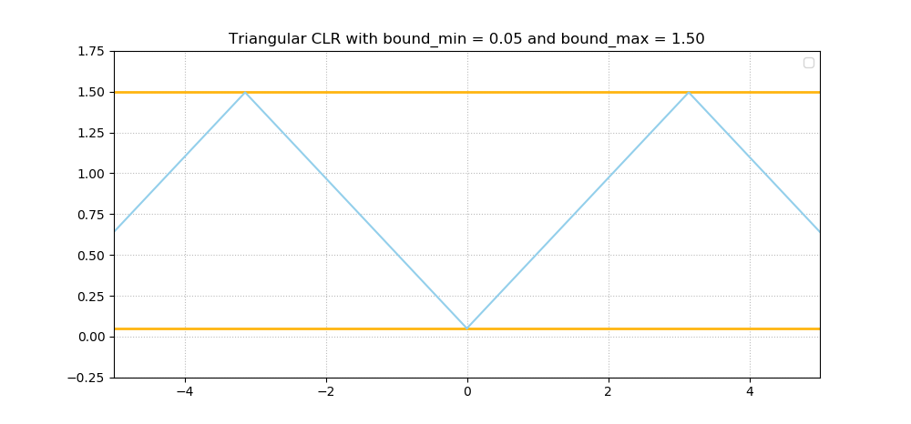
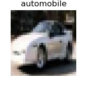
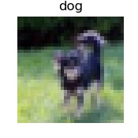

When you train a supervised machine learning model, your goal is to minimize the [loss function](https://github.com/mobiletest2016/machine-learning-articles/blob/master/articles/about-loss-and-loss-functions.md) - or error function - that you specify for your model.

Generally speaking, this goes pretty easily in the first iterations of your training process. Loss falls fast, and the model improves substantially. But then, you get stuck.

You encounter what is known as a **loss plateau** - suddenly, it seems to have become impossible to improve the model, with loss values balancing around some constant value.

It may be the case that you have reached the _global loss minimum_. In that case, you're precisely where you want to be.

But what if you're not? What if your model is stuck in what is known as a saddle point, or a local minimum? What are these? Interesting questions, which we'll answer in this blog post.

Now, in those cases, you might wish to "boost" your model and ensure that it can escape from these problematic areas of your loss landscape. We'll show you two possible approaches in this blog post, one of which we'll dive into much deeper. Firstly, we'll briefly touch Cyclical Learning Rates - subsequently pointing you to another blog post at MachineCurve which discusses them in detail.

Secondly, and most importantly, we'll show you how automated adjustment of your Learning Rate may be just enough to escape the problematic areas mentioned before. What's more, we'll also provide an example implementation for your neural network using the Keras framework for deep learning, using TensorFlow 2.0.

Let's take a look! 😎

* * *

\[toc\]

* * *

## Loss plateaus: saddle points and local minima

In the introduction, we introduced the training process for a supervised machine learning model. There, we also noticed that two types of problematic areas may occur in your loss landscape: saddle points and local minima.

Indeed, they may be the reason that your loss does not improve any further - especially when at a particular point in time, your learning rate becomes very small, either because it is configured that way or because it has decayed to really small values.

Let's take a look at saddle points and local minima in more detail next.

### Saddle points

A loss landscape is a representation in some space of your loss value. Below, you'll see two (slices of) loss landscapes with a saddle point in each of them.

- []
    
- []
    

_Two landscapes with saddle points. On the left, it's most visible - while on the right, it's in between two maxima. | Left: By [Nicoguaro](//commons.wikimedia.org/wiki/User:Nicoguaro "User:Nicoguaro") - Own work, [CC BY 3.0](https://creativecommons.org/licenses/by/3.0 "Creative Commons Attribution 3.0"), [Link](https://commons.wikimedia.org/w/index.php?curid=20570051) | Right: By [Nicoguaro](//commons.wikimedia.org/wiki/User:Nicoguaro "User:Nicoguaro") - Own work, [CC BY 4.0](https://creativecommons.org/licenses/by/4.0 "Creative Commons Attribution 4.0"), [Link](https://commons.wikimedia.org/w/index.php?curid=48854962)_

The loss landscapes, here, are effectively the \[latex\]z\[/latex\] values for the \[latex\]x\[/latex\] and \[latex\]y\[/latex\] inputs to the fictional loss function used to generate them.

Now, if they are the output of a _function_, it may be the case that we can compute the _derivative_ of that function as well. And by consequence, we can compute the _gradient_ for that particular \[latex\](x, y)\[/latex\] position too, a.k.a. the direction and speed of change at that point.

**Saddle points are points in your loss landscape where the gradient is zero, but which are no extremum** (Wikipedia, 2004). That is, the gradient is zero but they don't represent minima or maxima.

And this is problematic. Why, you may ask. Fair question.

Here's the answer: supervised machine learning models are optimized by means of the gradients. If they're zero, the model gets stuck.

Contrary to local minima, which we will cover next, saddle points are extra problematic because they don't represent an extremum. Hence, for example, if you'd go left and right, you'd find a loss that increases - while it would decrease for the other two directions. This means that it's extra difficult to escape such points.

Let's therefore focus on another, but slightly less problematic area in your loss landscape first, before we move on to possible solutions.

### Local minima

Indeed, another possible bottleneck for your training process can be when it encounters a local minimum. In this case, the point is an extremum - which is good - but the gradient is zero.

For example, the red dot in this plot represent such a local minimum:


_Source: [Sam Derbyshire](https://en.wikipedia.org/wiki/User:Sam_Derbyshire "wikipedia:User:Sam Derbyshire") at [Wikipedia](https://en.wikipedia.org/wiki/ "wikipedia:") [CC BY-SA 3.0](http://creativecommons.org/licenses/by-sa/3.0/ "Creative Commons Attribution-Share Alike 3.0"), [Link](https://commons.wikimedia.org/w/index.php?curid=48728184)_

Here, too, if your learning rate is too small, you might not escape the local minimum. Recall that in the beginning of this blog post, we noted that the loss value in your hypothetical training scenario started balancing around some constant value. It may be that this value represents this local minimum.

While, as you can see towards the right bottom part of the cube, loss starts decreasing rapidly if you're able to escape the minimum and get over the ridge. It may thus be actually worth it to try and see whether you can escape these points.

### Zero gradients and consequences for training

Altogether, we can thus say that zero gradients are bottlenecks for your training process - unless they represent the global minimum in your entire loss landscape.

We can also say that we must try and find a way to escape from areas with saddle points and local minima.

Let's now take a look at a few approaches with which we can try and make it happen.

* * *

## Getting out of loss plateaus

Here, we'll cover the concepts behind Cyclical Learning Rates and Automated Plateau Adjustment of your Neural Learning Rate.

Yeah, the latter one is just an invention by me, but well, I had to give it a name, right? :)

We'll briefly cover Cyclical Learning Rates, as we covered them in detail [in another blog post](https://github.com/mobiletest2016/machine-learning-articles/blob/master/articles/training-your-neural-network-with-cyclical-learning-rates.md). Nevertheless, it's worthwhile to introduce them here. However, after doing so, we'll focus on APANLR - crazy acronym, so let's skip that one from now on 😋

### Using Cyclical Learning Rates

One cause for getting stuck in saddle points and global minima can be a learning rate that is too small.


As learning rates effectively represent the "step size" of your mountain descent, which is what you're doing when you're walking down that loss landscape visualized in blue above, when they're too small, you get slow.

With respect to local minima and saddle points, one could argue that you could simply walk "past" them if you set steps that are large enough. Having a learning rate that is too small will thus ensure that you get stuck.

Now, **Cyclical Learning Rates** - which were introduced by Smith (2017) - help you fix this issue. These learning rates are indeed cyclical, and ensure that the learning rate moves back and forth between a _minimum value_ and a _maximum value_ all the time. Here are a few examples:

- []
    
- []
    
- []
    

As you can imagine, this is a perfect balance between "stepping over" local minima while allowing yourself to look around in detail every now and then. Or, how Smith (2017) calls it - giving up short-term performance improvements in order to get better in the long run.

Make sure to look at [that blog post](https://github.com/mobiletest2016/machine-learning-articles/blob/master/articles/training-your-neural-network-with-cyclical-learning-rates.md) if you wish to understand them in more detail. It provides a Keras example too! 😎

### Adjusting your Learning Rate when Plateaus are encountered

While the Cyclical Learning Rates may work very nicely, can't we think of another way that may work to escape such points?

We actually might. And once again, we'll be using the **Learning Rate Range Test** for this, a test that [has proved to be useful](https://github.com/mobiletest2016/machine-learning-articles/blob/master/articles/finding-optimal-learning-rates-with-the-learning-rate-range-test.md) when learning rates are concerned.

This test, which effectively starts a training process starting at a very small, but exponentially increasing learning rate, allows you to find out which learning rate - or which _range of learning rates_ - works best for your model.

Now, we - and by _we_ I mean Jonathan Mackenzie with his `keras_find_lr_on_plateau` [repository on GitHub](https://github.com/JonnoFTW/keras_find_lr_on_plateau) ([mirror](https://github.com/christianversloot/keras_find_lr_on_plateau)) - could invent an algorithm which both ensures that the model trains and uses the Learning Rate Range Test to find new learning rates when loss plateaus:

> Train a model for a large number of epochs. If the model's loss fails to improve for `n` epochs:
> 
> 1\. Take a snapshot of the model  
> 2\. Set training rate to min\_lr and train for a batch  
> 3\. Increase the learning rate exponentially toward max\_lr after every batch.  
> 4\. Once candidate learning rates have been exhausted, select new\_lr as the learning rate that gave the steepest negative gradient in loss.  
> 5\. Reload weights from the snapshot  
> 6\. Set model's learning rate to new\_lr and continue training as normal
> 
> Mackenzie (n.d.)

Interesting! :)

Now, if you look at Mackenzie's repository more closely, you'll see that he's also provided an implementation for Keras - by means of a Keras callback. Such callbacks effectively "spy" on the training process, and can act on it after every epoch. In this case, it thus simply looks at model improvement, pausing the training process temporarily (by snapshotting the model), finding a better learning rate, after which it's resumed again (with the snapshotted model).

* * *

## Automatically adjusting Learning Rates on Plateaus - a Keras example

Let's now find out how we can use this implementation with an actual Keras model :)

### Today's dataset

In today's model, we'll be working with the [CIFAR-10 dataset](https://github.com/mobiletest2016/machine-learning-articles/blob/master/articles/exploring-the-keras-datasets.md/#cifar-10-small-image-classification) - a dataset generated by a Canadian institute that contains many images across ten varying classes:

- []
    
- []
    
- []
    
- []
    
- []
    
- []
    
- []
    
- []
    

### Today's Keras model

The model with which we'll be showing you how to use this callback is a slight adaptation of the [sparse categorical crossentropy loss based model](https://github.com/mobiletest2016/machine-learning-articles/blob/master/articles/how-to-use-sparse-categorical-crossentropy-in-keras.md) that we created before. Check out that blog if you wish to understand it in more detail, as we explained each individual block of code there.

Now, open up your Explorer/Finder, create a file - say, `plateau_model.py` - and add this code. Ensure that TensorFlow 2.0 is installed, and that its Keras implementation works flawlessly (i.e., if you use the GPU version, this means that you'll also need to install other dependencies such as correct CUDA versions, and so on).

```
from tensorflow.keras.datasets import cifar10
from tensorflow.keras.models import Sequential
from tensorflow.keras.layers import Dense, Flatten, Conv2D, MaxPooling2D
from tensorflow.keras.losses import sparse_categorical_crossentropy
from tensorflow.keras.optimizers import Adam

# Model configuration
batch_size = 50
img_width, img_height, img_num_channels = 32, 32, 3
loss_function = sparse_categorical_crossentropy
no_classes = 10
no_epochs = 100
optimizer = Adam()
validation_split = 0.2
verbosity = 1

# Load CIFAR-100 data
(input_train, target_train), (input_test, target_test) = cifar10.load_data()

# Determine shape of the data
input_shape = (img_width, img_height, img_num_channels)

# Parse numbers as floats
input_train = input_train.astype('float32')
input_test = input_test.astype('float32')

# Normalize data
input_train = input_train / 255
input_test = input_test / 255

# Create the model
model = Sequential()
model.add(Conv2D(32, kernel_size=(3, 3), activation='relu', input_shape=input_shape))
model.add(MaxPooling2D(pool_size=(2, 2)))
model.add(Conv2D(64, kernel_size=(3, 3), activation='relu'))
model.add(MaxPooling2D(pool_size=(2, 2)))
model.add(Conv2D(128, kernel_size=(3, 3), activation='relu'))
model.add(MaxPooling2D(pool_size=(2, 2)))
model.add(Flatten())
model.add(Dense(256, activation='relu'))
model.add(Dense(128, activation='relu'))
model.add(Dense(no_classes, activation='softmax'))

# Compile the model
model.compile(loss=loss_function,
              optimizer=optimizer,
              metrics=['accuracy'])

# Fit data to model
history = model.fit(input_train, target_train,
            batch_size=batch_size,
            epochs=no_epochs,
            verbose=verbosity,
            validation_split=validation_split)

# Generate generalization metrics
score = model.evaluate(input_test, target_test, verbose=0)
print(f'Test loss: {score[0]} / Test accuracy: {score[1]}')
```

### Installing the LR Plateau Finder

Installing the code is easy - open a terminal, ensure that Git is installed, `cd` into the folder where your `plateau_model.py` file is stored, and clone the repository:

```
git clone https://github.com/JonnoFTW/keras_find_lr_on_plateau.git
```

(if the repository above doesn't work anymore, you could always use the mirrored i.e. forked version, but I can't guarantee that it's up to date - therefore, I'd advise to use Jonathan Mackenzie's one.)

```
git clone https://github.com/christianversloot/keras_find_lr_on_plateau.git
```

### Detecting plateaus and adjusting learning rates

Now, let's add the code for the callback :)

First of all, we'll add an `ImageDataGenerator`. This is a built-in facility in Keras for processing your images and adding e.g. augmentation at the same time. Strictly speaking, we don't need it - our CIFAR-10 dataset is quite simple - but the LR Plateau Optimizer requires it. By consequence, we'll add it next - directly after `model.compile` and before `model.fit`:

```
# Define an ImageDataGenerator
gen = ImageDataGenerator(validation_split=validation_split)
```

Note that we do have to specify the validation split in the Image Data Generator rather than the `fit`, because - as we shall see - we'll be using it a little bit differently. Do note that we also have to add the generator to the imports:

```
from tensorflow.keras.preprocessing.image import ImageDataGenerator
```

The same goes for the LR Plateau Optimizer:

```
from keras_find_lr_on_plateau.keras_lr_optimiser_callback.optimize_lr_on_plateau import LRFOnPlateau
```

Next, we can instantiate it with the corresponding configuration - with a `max_lr` of 1, in order to provide a real "boost" during the testing phase:

```
# Define the LR Plateau Optimizer
adjuster = LRFOnPlateau(max_lr=1e0, train_iterator=gen, train_samples=input_train, batch_size=batch_size, epochs=no_epochs)
```

Finally, we fit the data to the generator - note the `adjuster` callback!

```
# Fit data to model
history = model.fit_generator(gen.flow(input_train, target_train, batch_size=batch_size),
            epochs=no_epochs,
            verbose=verbosity,
            callbacks=[adjuster])
```

And we're ready to go! Open up a terminal, `cd` to the folder where your `plateau_model.py` file is located, and run it with `python plateau_model.py`. The training process _including_ the Plateau Optimizer should now begin :)

### Oops - it breaks down... let's fix it

Except that it doesn't. It turns out that it's not entirely up to date, as far as I can tell.

However, we can easily fix this by replacing two parts within the `optimize_lr_on_plateau.py` file:

First, we'll replace the `LRFinder` import with:

```
from .lr_finder import LRFinder
```

This fixes the first issue. Now the second:

```
  File "C:\Users\chris\MachineCurve\Models\keras-k-fold\keras_find_lr_on_plateau\keras_lr_optimiser_callback\optimize_lr_on_plateau.py", line 24, in on_epoch_end
    if self.monitor_op(current, self.best):
  File "C:\Users\chris\AppData\Local\Programs\Python\Python36\lib\site-packages\keras\callbacks\callbacks.py", line 1023, in <lambda>
    self.monitor_op = lambda a, b: np.less(a, b - self.min_delta)
TypeError: '<' not supported between instances of 'NoneType' and 'float'
```

When Googling around, this seems like a typical error. Now, after line 22 (which reads `self.wait = 0`), add this:

```
if current is None:
    current = 0.0
```

This should fix the issue. Now, training should commence as expected :)

* * *

## Summary

In this blog post, we found out how to implement a method for finding a possibly better learning rate once loss plateaus occur. It does so by applying the Learning Rate Range Test as a callback in the learning process, which we demonstrated by implementing it for Keras model.

Hopefully, this method works for you when you're facing saddle points, local minima or other issues that cause your losses to plateau. If it does, please let me know! I'll be happy to hear from you. Please leave a comment as well if you spot a mistake, or when you have questions or remarks.

Thank you for reading MachineCurve today and happy engineering! 😎

* * *

## References

Wikipedia. (2004, May 7). Saddle point. Retrieved from [https://en.wikipedia.org/wiki/Saddle\_point](https://en.wikipedia.org/wiki/Saddle_point)

Smith, L. N. (2017, March). [Cyclical learning rates for training neural networks](https://arxiv.org/abs/1506.01186). In _2017 IEEE Winter Conference on Applications of Computer Vision (WACV)_ (pp. 464-472). IEEE.

Mackenzie, J. (n.d.). JonnoFTW/keras\_find\_lr\_on\_plateau. Retrieved from [https://github.com/JonnoFTW/keras\_find\_lr\_on\_plateau](https://github.com/JonnoFTW/keras_find_lr_on_plateau)
