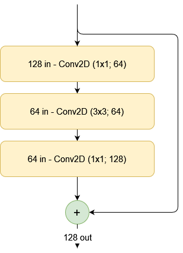
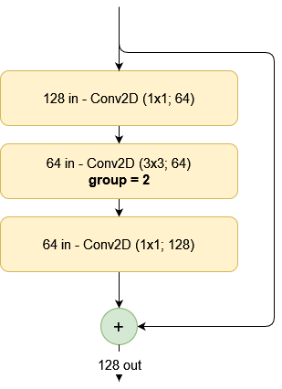

Improving your convolution performance does not have to be difficult - one way to achieve this is by using **grouped convolutions**. By splitting the filter maps in your convolutional layers into multiple disjoint groups, it's possible to reduce the parameters in your network, while having the network learn better features.

How? That's what you will discover by reading today's article. Firstly, you will read about grouped convolutions, from a ResNeXt point of view. Then, you'll learn about why they can improve network and training performance. Finally, you will take a look at implementing these convolutions with TensorFlow and Keras.

Let's take a look! 😎

* * *

\[toc\]

* * *

## What are grouped convolutions?

In their paper introducing the [ResNeXt architecture](https://arxiv.org/abs/1611.05431), Xie et al. (2017) noted that there are multiple ways of improving model performance. A relatively standard one is to make the model deeper - that is, for example, adding more convolutional layers to learn a deeper hierarchy of features that can be used for classification.

Making the neural network wider, by increasing the number of feature maps learned at every level, is another option, to increase feature richness benefiting optimization.

However, in their work, they state that there is another way: by increasing the cardinality

> Experiments demonstrate that in- creasing cardinality is a more effective way of gaining accu- racy than going deeper or wider, especially when depth and width starts to give diminishing returns for existing models.
> 
> Xie et al. (2017)

Cardinality, here, is defined as "the size of the set of transformations". Because things may still be a bit vague now, let's make things visual for better understanding.

### Starting from a simple residual block...

Suppose that you are training a convolutional architecture. To be more specific, you're using ResNet blocks as the backbone for your classifier. A simple residual block - with a regular mapping and a skip connection - can look as follows:



The creators of the ResNeXt architecture suggest that by splitting this set of transformations into multiple sub sets, performance can increase, because the sub sets become separate feature learners at a specific level in the feature hierarchy.

The number of sub sets at a specific level is the cardinality of that specific level. For example, if we split the residual block into sub sets with a cardinality of 2, this would be the outcome. We see a similarly complex model, where the outputs of both subsets are summated and then the skip connection is added back.


The ResNeXt authors have found empirical improvements of their architecture over classic ResNet. However, the split-transform-summate approach from above is not the only possible approach. For example, it is also possible to perform split-transform-concatenate, after which the concatenation is processed by another convolutional layer to preserve feature map dimensionaltiy of the whole block.

### Using grouped convolutions

Now, getting to the point of this article, another approach is to use **grouped convolutions**. Having been at the basis of the deep learning revolution, it was already used by AlexNet in order to allow training in a multi-GPU setting.



Now, what is a grouped convolution?

> \[A\] group is convolved separately with filters / groups filters. The output is the concatenation of all the groups results along the channel axis.
> 
> TensorFlow (n.d.)

Normally, in a regular convolution, we have filters (which slide or convolve over the input feature maps). For example, we can have 32 filters that slide over the input feature maps. These 32 filters are convolved at the same time, over the whole input.

When using grouped convolutions, we can separate the filters into disjoint groups - i.e., groups of filters that convolve over distinct feature maps. For example, if we would split the 32 in 2 groups of 16 filters, the first group would convolve over the first 50% of input filters, while the second would convolve over the second 50%.

Note that the percentage is relative - let's illustrate this with another example. If we have 60 input feature maps, and 256 output feature maps, each group would convolve over 15 (25%) feature maps if we would use 4 groups.

### Benefits of using grouped convolutions

Using grouped convolutions has multiple benefits compared to using normal convolutions:

1. **Hardware efficiency.** By splitting the convolution procedure in disjoint groups, training can be parallelized over GPUs quite easily - for example, by using one GPU per group.
2. **Reduced number of trainable parameters.** The wider one's convolutional layer, the more parameters are used. By using grouped convolutions, the number of parameters is reduced significantly.
3. **Better model performance!** Now, that's something that is quite surprising (since splitting the convolution into groups would yield a model that is theoretically as complex as using regular convolutions). Ioannou (2017) discusses this in [an interesting article](https://blog.yani.ai/filter-group-tutorial/) - something that was underrecognized is that using grouped convolutions means learning better representations.

But why? Make sure to read the article if you want to learn it in more detail, but the gist of the argument is that grouped convolutions perform better representation learning because **irrelevant correlations between features across layers are left out**. For example, if you would have a regular convolution with 32 filters in one layer and 64 in the next, learning capacity of the network correlates the 32 with the 64 filters. This happens because the gradient update yielding a change in the 32 filters is dependent on the gradient update generated for the 64 filters more downstream. In other words, all correlations between the 64 and 32 layers mean something for network performance.

Using grouped convolution breaks down the filters into separate and disjoint groups. In other words, these groups do not know about each other when being trained. In sum, this means that (should we use grouped convolutions with 2 groups for each layer) now only 16 filters are correlated with 32 filters. Increasing the number of groups both reduces parameters and improves performance, by having actually many small networks into one.

* * *

## Implementing grouped convolutions with TensorFlow 2 and Keras

Using grouped convolutions with TensorFlow 2 and Keras is actually really easy. The only thing that you will need to do is using the `groups` attribute in specifying your convolutional layer (whether that is a `Conv1D`, `Conv2D` or `Conv3D` layer).

> A positive integer specifying the number of groups in which the input is split along the channel axis. Each group is convolved separately with filters / groups filters. The output is the concatenation of all the groups results along the channel axis. Input channels and filters must both be divisible by groups.
> 
> TensorFlow (n.d.)

For example, if you have a two-dimensional convolutional layer that outputs 64 feature maps, you can turn it into a grouped convolution that outputs 4x16 feature maps by simply specifying this in layer initialization:

```
Conv2D(64, (3, 3), groups=4)
```

That's it! You now understand what grouped convolutions are, why they can be useful and beneficial to your neural network, and how you can use them within TensorFlow 2 and Keras 😎 If you have any questions, comments or suggestions, feel free to leave a message in the comments section below 💬 I will then try to answer you as quickly as possible. For now, thank you for reading MachineCurve today and happy engineering!

* * *

## References

Xie, S., Girshick, R., Dollár, P., Tu, Z., & He, K. (2017). [Aggregated residual transformations for deep neural networks.](https://arxiv.org/abs/1611.05431) In _Proceedings of the IEEE conference on computer vision and pattern recognition_ (pp. 1492-1500).

TensorFlow. (n.d.). _Tf.keras.layers.Conv2D_. [https://www.tensorflow.org/api\_docs/python/tf/keras/layers/Conv2D](https://www.tensorflow.org/api_docs/python/tf/keras/layers/Conv2D)

Ioannou, Y. (2017, August 10). _A tutorial on filter groups (Grouped convolution)_. A Shallow Blog about Deep Learning. [https://blog.yani.ai/filter-group-tutorial/](https://blog.yani.ai/filter-group-tutorial/)
