Convolutional neural networks are great tools for building image classifiers. They have been used thoroughly since the 2012 deep learning breakthrough, and have led to interesting applications such as classifiers and object detectors.

But why are they so useful for classifying images? And how can we build one with Keras on TensorFlow 2.0? That's what today's blog post will look at.

Firstly, we'll study why ConvNets are so suitable when your goal is to build an image classifier. Then, we'll actually build one - by using the CIFAR-10 and CIFAR-100 datasets. After inspecting the datasets, which is what we do first, we build a Keras based model using the new TensorFlow 2.0 style of implementing them. This way, you should have Python based code examples that will help you implement such classifiers yourself.

Are you ready? Let's go! 😎

* * *

\[toc\]

* * *

## Why Convolutional Neural Networks suit image classification

We all know that numbers are built from digits, and more specifically, the digits 0 to 9.

Now, say that we show you a few of these digits, handwritten ones:

[]

Check out ["Making more datasets available for Keras"](https://github.com/mobiletest2016/machine-learning-articles/blob/master/articles/making-more-datasets-available-for-keras.md) for this dataset.

Likely, you know which digits they are instantly. The first row: 4 - 1 - 4 -1. The second: 6 - 7 - 6 - 8. And so on.

But have you ever thought about _why_ you can recognize them so fast? And why you know that the two 4s are 4s, even though they are written differently?

### Decomposition of images into smaller, generic parts

The answer is a little bit more complex than this (i.e., we leave the discussion about induction vs deduction out of scope here), but it essentially boils down to this:

1. Your brain decomposes (or "breaks down") the image it sees into smaller parts.
2. These parts, in return, take some kind of "generic shape". While the bottom part of the second 4 is written in a curvy way, and the first in a cursive way, we still know that it's the bottom part of the 4. We thus instantly recognize it as the "bottom part", regardless of the precise shape it takes.

Now, **[convolutional neural networks](https://github.com/mobiletest2016/machine-learning-articles/blob/master/articles/convolutional-neural-networks-and-their-components-for-computer-vision.md)**, together with extra additions such as [pooling layers](https://github.com/mobiletest2016/machine-learning-articles/blob/master/articles/what-are-max-pooling-average-pooling-global-max-pooling-and-global-average-pooling.md), attempt to mimic this process. They break down input images into smaller parts in ways they have learnt during training. Preferably, these smaller parts are "generic", so that a wide range of input data should yield the same conclusion. Let's take a look at how this works.

### How a convolutional layer works

Convolutional neural networks are composed of, among others, convolutional layers. They are often present within the first part of the network, together with layers that are related to them. The second part, then, is composed of Dense layers often. They generate the actual classification based on the features that were extracted by the convolutional layers.

Here is what a convolutional layer does, and why it is such a good feature extractor, at a high level:

[]

The input to this convolutional layer is a \[latex\]H \\times W\[/latex\] image, where \[latex\]H\[/latex\] is the height and \[latex\]W\[/latex\] is the width of this image. These days, most images are RGB - red, green and blue - and hence have 3 image channels. This is not different in the scenario above.

Now, the convolutional layer works with \[latex\]N\[/latex\] so called "kernels". The value for \[latex\]N\[/latex\] can be configured by the machine learning engineer. These kernels, which have a fixed \[latex\]H\_{kernel}\[/latex\] and \[latex\]W\_{kernel}\[/latex\] that are often much smaller than the input (e.g. 3x3), have the same amount of channels as the input data (3 in our case). They are initialized with "weights", and this is what makes learning possible (as we will see later).

Now, this "kernel" (which is 5 x 5 pixels in the schematic drawing below) slides (or "convolves") over the input data. In doing so, for each position it takes, it multiplies the weight at some point with the corresponding pixel in your input data, element-wise. This means that all the individual multiplications are added together, and that the output of that particular kernel-input multiplication is 1 pixel:

[]

Now, sliding over the entire image horizontally and vertically, it produces many of such "outputs" - rendering the output on the right in the image above. This output, which is called a "feature map", is smaller than the input data, and essentially contains the input data in a more "abstract" fashion. Now, as there are \[latex\]N\[/latex\] kernels, there will be \[latex\]N\[/latex\] such feature maps produced by a convolutional layer.

### Feature detection and the "smaller parts"

The fun thing, here, is that the network can be trained. That is, the weights can be adapted. During this training process, the network as a whole will produce one output value. This output value can be compared to the true target - a.k.a. the "ground truth". The difference between the two can be captured in a [loss value](https://github.com/mobiletest2016/machine-learning-articles/blob/master/articles/about-loss-and-loss-functions.md) that can subsequently be used for [optimizing the model](https://github.com/mobiletest2016/machine-learning-articles/blob/master/articles/gradient-descent-and-its-variants.md). This way, iteratively, the model can learn weights that yield the most optimal outputs.

Now, possibly and most preferably, what will these weights become?

Indeed - **the individual parts of the images, such as the "bottom part of the four", that represents a four "together with its top part".**

This is why the _convolutional layers are said to be feature extractors_ in a convolutional neural network. They break down the images into smaller parts (feature maps that get more abstract when you go downstream in a ConvNet), a process that is guided by the desired outputs in the training process. This way, you'll eventually get a Convolutional neural network that learns to detect "parts" in the images that are very discriminative with respect to the final outcome.

And that's precisely what you want when you're training an image classifier! 😎

### Adding Pooling to make the parts generic

The convolutional layers you - theoretically - apply so far do indeed result in a "spatial hierarchy", where the outputs of the subsequent convolutional layers get smaller every time. However, the hierarchy will look very much like the one on the right of this drawing:

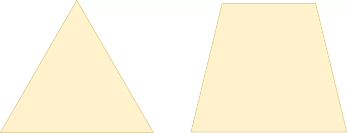

Thus, even though you have a spatial hierarchy, it's not very _sharp_. This, in return, will mean that even though you do break apart the inputs into smaller, more abstract blocks, the network will still be sensitive to e.g. the shape of the bottom part of the 4.

What's more, it's still not "translation invariant", which means that it's also sensitive to the _orientation, size, and position_ of the particular element. In the case of the four, if the top part were cut off and the bottom part was shifted to the top, leaving blank space at the bottom, the network may now not detect it as a 4 anymore.

Adding **pooling layers** may [help you resolve this issue](https://github.com/mobiletest2016/machine-learning-articles/blob/master/articles/what-are-max-pooling-average-pooling-global-max-pooling-and-global-average-pooling.md). Similar to convolutional layers, pooling layers slide over the inputs, but instead of multiplying the parts with some learnt weights, they compute a hard value such as \[latex\]max()\[/latex\].

- []
    
- []
    

As you can see, a pooling layer - Max Pooling in the image above - substantially reduces the size of your feature map, and in this case takes the maximum value. What this means is this:

- The most important feature in the feature map will be used. As the convolutional layer directly in front of the pooling layer will likely learn to _detect the object(s) of interest_, this is likely the object we want to detect.
- It does not matter in which of the four red positions the object is present; it will always be taken along into the pooling layer's output.

This way, we introduce "feature invariance" into the model. Together, the convolutional layer both "learns parts" and "learns them in a generic way". Exactly what we want :)

Now that we understand the two most important parts of a ConvNet, it's time to build one. Please note that it's possible to use additional layers such as [Dropout](https://github.com/mobiletest2016/machine-learning-articles/blob/master/articles/how-to-use-dropout-with-keras.md), and that you can [apply padding when desired](https://github.com/mobiletest2016/machine-learning-articles/blob/master/articles/what-is-padding-in-a-neural-network.md), but this is optional. Let's now take a look at the datasets that we'll use today! 📷

* * *

## Image datasets: the CIFAR-10 and CIFAR-100 datasets

The CIFAR datasets were introduced by Krizhevsky & Hinton (2009) and were named after the Canadian Institute for Advanced Research (CIFAR). They come in two ways: the CIFAR-10 datasets, with ten classes, and the CIFAR-100 dataset, with one hundred classes. Let's inspect them in more detail now 🕵️‍♀️

### The CIFAR-10 dataset

The **CIFAR-10 dataset** contains contains 60.000 32x32 pixel RGB images across 10 classes – which means 6.000 per class. These are the classes that it supports (Krizhevsky & Hinton, 2009):

<table><tbody><tr><td>Airplane</td><td>Automobile</td><td>Bird</td><td>Cat</td><td>Deer</td></tr><tr><td>Dog</td><td>Frog</td><td>Horse</td><td>Ship</td><td>Truck</td></tr></tbody></table>

A few samples:

- [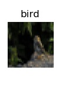]
    
- []
    
- []
    
- []
    
- []
    
- []
    
- []
    
- []
    
- [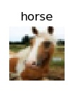]
    
- [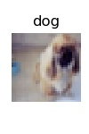]
    
- []
    
- []
    

The dataset is split into 50.000 images for training and 10.000 images for testing purposes.

### The CIFAR-100 dataset

**CIFAR-100** is effectively the "parent dataset" for the CIFAR-10 one. It contains many images across 100 non-overlapping classes. It also contains 60.000 samples in total, which means that each class only has 600 samples instead of 6.000 (as with the CIFAR-10 one).

- []
    
- [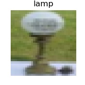]
    
- []
    
- []
    
- [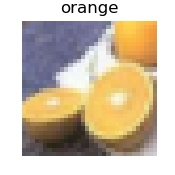]
    
- [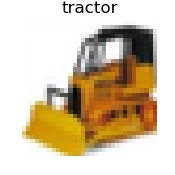]
    
- [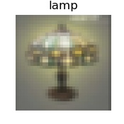]
    
- []
    
- []
    
- [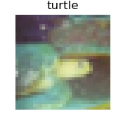]
    
- []
    
- []
    

These are the classes present within CIFAR-100 (Krizhevsky & Hinton, 2009):

<table><tbody><tr><td>Beaver</td><td>Dolphin</td><td>Otter</td><td>Seal</td><td>Whale</td></tr><tr><td>Aquarium fish</td><td>Flatfish</td><td>Ray</td><td>Shark</td><td>Trout</td></tr><tr><td>Orchids</td><td>Poppies</td><td>Roses</td><td>Sunflowers</td><td>Tulips</td></tr><tr><td>Bottles</td><td>Bowls</td><td>Cans</td><td>Cups</td><td>Plates</td></tr><tr><td>Apples</td><td>Mushrooms</td><td>Oranges</td><td>Pears</td><td>Sweet peppers</td></tr><tr><td>Clok</td><td>Computer keyboard</td><td>Lamp</td><td>Telephone</td><td>Television</td></tr><tr><td>Bed</td><td>Chair</td><td>Couch</td><td>Table</td><td>Wardrobe</td></tr><tr><td>Bee</td><td>Beetle</td><td>Butterfly</td><td>Caterpillar</td><td>Cockroach</td></tr><tr><td>Bear</td><td>Leopard</td><td>Lion</td><td>Tiger</td><td>Wolf</td></tr><tr><td>Bridge</td><td>Castle</td><td>House</td><td>Road</td><td>Skyscraper</td></tr><tr><td>Cloud</td><td>Forest</td><td>Mountain</td><td>Plain</td><td>Sea</td></tr><tr><td>Camel</td><td>Cattle</td><td>Chimpanzee</td><td>Elephant</td><td>Kangaroo</td></tr><tr><td>Fox</td><td>Porcupine</td><td>Possum</td><td>Raccoon</td><td>Skunk</td></tr><tr><td>Crab</td><td>Lobster</td><td>Snail</td><td>Spider</td><td>Worm</td></tr><tr><td>Baby</td><td>Boy</td><td>Girl</td><td>Man</td><td>Woman</td></tr><tr><td>Crocodile</td><td>Dinosaur</td><td>Lizard</td><td>Snake</td><td>Turtle</td></tr><tr><td>Hamster</td><td>Mouse</td><td>Rabbit</td><td>Shrew</td><td>Squirrel</td></tr><tr><td>Maple</td><td>Oak</td><td>Palm</td><td>Pine</td><td>Willow</td></tr><tr><td>Bicycle</td><td>Bus</td><td>Motorcycle</td><td>Pickup truck</td><td>Train</td></tr><tr><td>Lawn-mower</td><td>Rocket</td><td>Streetcar</td><td>Tank</td><td>Tractor</td></tr></tbody></table>

Like the CIFAR-10 dataset, the CIFAR-100 dataset is also split in a 50.000/10.000 fashion (Krizhevsky & Hinton, 2009).

* * *

## Keras neural network for CIFAR-10 classification

Now that we know what our datasets look like, let's take a look at some code! 👩‍💻

Open up a code editor, create a file (e.g. `cifar10.py`) and let's go :)

### What you'll need to run the model

...but wait: one small intermezzo. Obviously, you cannot run this model out of the blue: you'll need to install a few dependencies before you can run it. Don't worry, you don't need to install much, but you do need at least:

- **TensorFlow**, and preferably TensorFlow 2.0+: `pip install tensorflow` or, if you have a strong GPU, `pip install tensorflow-gpu`.
- **Keras**, if you don't use TensorFlow 2.0+ (otherwise, the right version comes preinstalled): `pip install keras`.
- **Numpy**, for number processing: `pip install numpy`.
- **Matplotlib**, for generating plots: `pip install matplotlib`.

### Model imports

Time to write some actual code! We'll start with the model imports. As our model consists of these elements...

- The **CIFAR-10 dataset**;
- The **Sequential API**, which allows us to stack the individual layers nicely together;
- The **Conv2D, MaxPooling2D, Flatten** and **Dense** layers;
- **[Adam optimization](https://github.com/mobiletest2016/machine-learning-articles/blob/master/articles/extensions-to-gradient-descent-from-momentum-to-adabound/#adam)** with **[sparse categorical crossentropy loss](https://github.com/mobiletest2016/machine-learning-articles/blob/master/articles/how-to-use-sparse-categorical-crossentropy-in-keras.md)**;
- Visualizations of the [model history](https://github.com/mobiletest2016/machine-learning-articles/blob/master/articles/how-to-visualize-the-training-process-in-keras.md);

...you'll need to import these dependencies. You can do this as follows:

```
from tensorflow.keras.datasets import cifar10
from tensorflow.keras.models import Sequential
from tensorflow.keras.layers import Dense, Flatten, Conv2D, MaxPooling2D
from tensorflow.keras.losses import sparse_categorical_crossentropy
from tensorflow.keras.optimizers import Adam
import matplotlib.pyplot as plt
```

### Model configuration

Now, let's set some configuration options for our model:

```
# Model configuration
batch_size = 50
img_width, img_height, img_num_channels = 32, 32, 3
loss_function = sparse_categorical_crossentropy
no_classes = 10
no_epochs = 100
optimizer = Adam()
validation_split = 0.2
verbosity = 1
```

What do they mean is what you may wonder now. Let's find out:

- The **batch size** is the amount of samples that will be [fed forward](https://github.com/mobiletest2016/machine-learning-articles/blob/master/articles/about-loss-and-loss-functions/#forward-pass) in your model at once, after which the loss value is computed. You could either feed the model the [entire training batch, one sample every time or a minibatch](https://github.com/mobiletest2016/machine-learning-articles/blob/master/articles/gradient-descent-and-its-variants/#variants-of-gradient-descent) - and you can set this value by specifying `batch_size`.
- The **image width, image height and number of channels**. Width and height are 32, respectively, and number of channels is 3, as the dataset contains RGB images.
- The **loss function** used to compare predictions with ground truth during training. We use [sparse categorical crossentropy loss](https://github.com/mobiletest2016/machine-learning-articles/blob/master/articles/about-loss-and-loss-functions/#sparse-categorical-crossentropy). We skip the "why" for now - I'll show you later why we use _sparse_ instead of regular categorical crossentropy loss.
- The **number of classes** and **number of epochs** (or iterations), which we set to 10 and 100, respectively. We set the first to 10 because we have ten distinct classes - the digits 0 to 9. The second is set to 100 because I'm assuming that we'll have passed maximum model performance by then. We don't want to be training infinitely, as this induces [overfitting](https://github.com/mobiletest2016/machine-learning-articles/blob/master/articles/what-is-dropout-reduce-overfitting-in-your-neural-networks/#how-well-does-your-model-perform-underfitting-and-overfitting).
- The **optimizer**, or the method by which we update the weights of our neural network. We use [Adam optimization](https://github.com/mobiletest2016/machine-learning-articles/blob/master/articles/extensions-to-gradient-descent-from-momentum-to-adabound/#adam) - which is a relatively state-of-the-art optimizer and common in today's neural networks.
- 20% of our training data will be used for **validation purposes**; that is, used to test the model with non-training-data _during_ training.
- Verbosity mode is set to "1", which means "True", which means that all the output is displayed on screen. This is good for understanding what happens during training, but it's best to turn it off when you _actually_ train models, as it slows down the training process.

### Loading & preparing CIFAR-10 data

Now, let's load some CIFAR-100 data. We can do so easily because Keras provides intuitive access to the dataset by design:

```
# Load CIFAR-10 data
(input_train, target_train), (input_test, target_test) = cifar10.load_data()
```

The next step is to determine the shape of one sample. This is required by Keras to understand what data it can expect in the input layer of your neural network. You can do so as follows:

```
# Determine shape of the data
input_shape = (img_width, img_height, img_num_channels)
```

Next, two technical things. Firstly, we'll convert our data into `float32` format, which presumably speeds up training. Then, we normalize the data, into the \[latex\]\[-1, 1\]\[/latex\] range.

```
# Parse numbers as floats
input_train = input_train.astype('float32')
input_test = input_test.astype('float32')

# Normalize data
input_train = input_train / 255
input_test = input_test / 255
```

### Creating the model architecture

We can then create the architecture of our model. First, we'll instantiate the `Sequential` API and assign it to `model` - this is like the foundation of your model, the Lego board onto which you can "click" bricks, a.k.a. layers.

Next, it's time to stack a few layers. Firstly, we'll use three convolutional blocks - which is the nickname I often use for convolutional layers with some related ones. In this case, the related layer that is applied every time is a `MaxPooling2D` one directly after the `Conv2D` layer. As you can see, each time, the numer of feature maps increases - from 32, to 64, to 128. This is done because the model then learns a limited number of "generic" patterns (32) and a high amount of patterns unique to the image (128). Max Pooling ensures translation invariance, as we discussed before.

After the convolutional blocks, we add a `Flatten` layer. The `Dense` layers, which are responsible for generating the actual classifications, only work with one-dimensional data. Flatten makes this happen: it converts the multidimensional feature maps into one-dimensional shape. Great!

As said, the Dense layers ensure that classification is possible. As you can see, in terms of the number of outputs per layer, we create an information bottleneck that eventually converges in `no_classes` - thus 10 - outputs, exactly the number of unique classes in our dataset. As we're using the [Softmax activation function](https://github.com/mobiletest2016/machine-learning-articles/blob/master/articles/how-does-the-softmax-activation-function-work.md), we'll get a discrete multiclass probability distribution as our output for any input. From this distribution, we can draw the one with the highest value, which is the most likely class for our input. There we go, our classifier is ready! Or isn't it? 😉

```
# Create the model
model = Sequential()
model.add(Conv2D(32, kernel_size=(3, 3), activation='relu', input_shape=input_shape))
model.add(MaxPooling2D(pool_size=(2, 2)))
model.add(Conv2D(64, kernel_size=(3, 3), activation='relu'))
model.add(MaxPooling2D(pool_size=(2, 2)))
model.add(Conv2D(128, kernel_size=(3, 3), activation='relu'))
model.add(MaxPooling2D(pool_size=(2, 2)))
model.add(Flatten())
model.add(Dense(256, activation='relu'))
model.add(Dense(128, activation='relu'))
model.add(Dense(no_classes, activation='softmax'))
```

### Compiling the model & fitting data

To be fair: no, it's not :) What we did so far was create the _skeleton_ for our model. We don't have a _model_ yet, as it must be compiled first. This can be done by calling `model.compile`. As you can see, it involves specifying settings for the training process, such as the loss function and the optimizer. What's more, and what I always prefer, is to add accuracy as an additional metric, due to it being intuitive for humans.

Once the model is compiled, we _do_ have a model, but it's not yet trained. We can start the training process by calling `model.fit`, which fits our data (in this case our training data and the corresponding targets) and specifies some settings for our training process, ones that we configured before.

Here, it also becomes clear why we decided to use _sparse_ categorical crossentropy instead of _true_ categorical crossentropy. Categorical crossentropy requires our data to be categorical, which can e.g. be achieved with `to_categorical` i.e. one-hot encoding of your target vectors.

Our data is not categorical by nature: our targets are integers in the range \[latex\]\[0, 9\]\[/latex\]. But why convert them, I'd argue, if there is a loss function which does the same as _true_ categorical crossentropy but works with integer targets? Indeed, [_sparse_ categorical crossentropy](https://github.com/mobiletest2016/machine-learning-articles/blob/master/articles/how-to-use-sparse-categorical-crossentropy-in-keras.md) is this activation function. Hence, we choose it over the other one :)

```
# Compile the model
model.compile(loss=loss_function,
              optimizer=optimizer,
              metrics=['accuracy'])

# Fit data to model
history = model.fit(input_train, target_train,
            batch_size=batch_size,
            epochs=no_epochs,
            verbose=verbosity,
            validation_split=validation_split)
```

### Generating evaluation metrics & visualizations

We're almost there. As you can see, we assigned the results of `model.fit` to a `history` object. This will allow us to see the _testing_ results as well as [generate nice plots of the training process](https://github.com/mobiletest2016/machine-learning-articles/blob/master/articles/how-to-visualize-the-training-process-in-keras.md). Here's the code:

```
# Generate generalization metrics
score = model.evaluate(input_test, target_test, verbose=0)
print(f'Test loss: {score[0]} / Test accuracy: {score[1]}')

# Visualize history
# Plot history: Loss
plt.plot(history.history['val_loss'])
plt.title('Validation loss history')
plt.ylabel('Loss value')
plt.xlabel('No. epoch')
plt.show()

# Plot history: Accuracy
plt.plot(history.history['val_accuracy'])
plt.title('Validation accuracy history')
plt.ylabel('Accuracy value (%)')
plt.xlabel('No. epoch')
plt.show()
```

Ready! We have a functional Keras model now 😊 Open up a terminal which has the sofware dependencies installed, `cd` into the folder where your Python code is located, and run e.g. `python cifar10.py`. The training process should now begin! :)

### Full model code

If you wish to obtain the full model code at once, here you go:

```
from tensorflow.keras.datasets import cifar10
from tensorflow.keras.models import Sequential
from tensorflow.keras.layers import Dense, Flatten, Conv2D, MaxPooling2D
from tensorflow.keras.losses import sparse_categorical_crossentropy
from tensorflow.keras.optimizers import Adam
import matplotlib.pyplot as plt

# Model configuration
batch_size = 50
img_width, img_height, img_num_channels = 32, 32, 3
loss_function = sparse_categorical_crossentropy
no_classes = 10
no_epochs = 100
optimizer = Adam()
validation_split = 0.2
verbosity = 1

# Load CIFAR-10 data
(input_train, target_train), (input_test, target_test) = cifar10.load_data()

# Determine shape of the data
input_shape = (img_width, img_height, img_num_channels)

# Parse numbers as floats
input_train = input_train.astype('float32')
input_test = input_test.astype('float32')

# Normalize data
input_train = input_train / 255
input_test = input_test / 255

# Create the model
model = Sequential()
model.add(Conv2D(32, kernel_size=(3, 3), activation='relu', input_shape=input_shape))
model.add(MaxPooling2D(pool_size=(2, 2)))
model.add(Conv2D(64, kernel_size=(3, 3), activation='relu'))
model.add(MaxPooling2D(pool_size=(2, 2)))
model.add(Conv2D(128, kernel_size=(3, 3), activation='relu'))
model.add(MaxPooling2D(pool_size=(2, 2)))
model.add(Flatten())
model.add(Dense(256, activation='relu'))
model.add(Dense(128, activation='relu'))
model.add(Dense(no_classes, activation='softmax'))

# Compile the model
model.compile(loss=loss_function,
              optimizer=optimizer,
              metrics=['accuracy'])

# Fit data to model
history = model.fit(input_train, target_train,
            batch_size=batch_size,
            epochs=no_epochs,
            verbose=verbosity,
            validation_split=validation_split)

# Generate generalization metrics
score = model.evaluate(input_test, target_test, verbose=0)
print(f'Test loss: {score[0]} / Test accuracy: {score[1]}')

# Visualize history
# Plot history: Loss
plt.plot(history.history['val_loss'])
plt.title('Validation loss history')
plt.ylabel('Loss value')
plt.xlabel('No. epoch')
plt.show()

# Plot history: Accuracy
plt.plot(history.history['val_accuracy'])
plt.title('Validation accuracy history')
plt.ylabel('Accuracy value (%)')
plt.xlabel('No. epoch')
plt.show()
```

### The results - how well does our CIFAR-10 CNN perform?

Once the training process finishes, it's time to look at some statistics. Firstly, the test results from `model.evaluate`:

```
Test loss: 2.931418807697296 / Test accuracy: 0.6948000192642212
```

In approximately 70% of the cases, our model was correct. This is in line with the _validation_ accuracies visualized below across the epochs. But, quite importantly, take a look at the _loss values_ now! At first, loss went down pretty fast, reached a minimum at about the 5th epoch, and then went up again - substantially.

This is a clear sign that our model is overfitting, or that it is highly adapted to our _training dataset_. This may mean that its performance on data it has never seen before is worse than if the training process was stopped at e.g. the fifth epoch. Take a look at these blog posts if you wish to reduce the impact of overfitting:

- [What is Dropout? Reduce overfitting in your neural networks](https://github.com/mobiletest2016/machine-learning-articles/blob/master/articles/what-is-dropout-reduce-overfitting-in-your-neural-networks.md)
- [What are L1, L2 and Elastic Net Regularization in neural networks?](https://github.com/mobiletest2016/machine-learning-articles/blob/master/articles/what-are-l1-l2-and-elastic-net-regularization-in-neural-networks.md)
- [Avoid wasting resources with EarlyStopping and ModelCheckpoint in Keras](https://github.com/mobiletest2016/machine-learning-articles/blob/master/articles/avoid-wasting-resources-with-earlystopping-and-modelcheckpoint-in-keras.md)

- [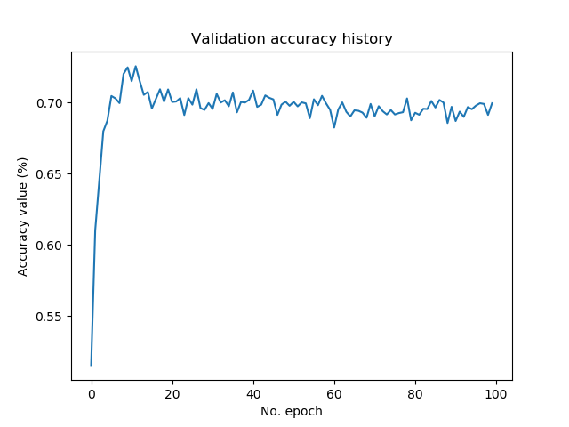]
    
- [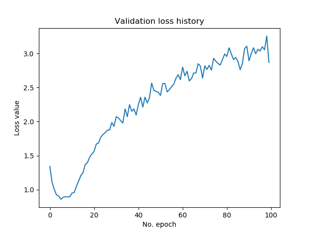]
    

* * *

## Keras neural network for CIFAR-100 classification

Let's now take a look how to create a Keras model for the CIFAR-100 dataset :)

### From CIFAR-10 to CIFAR-100

In order to ensure that this blog post stays within check in terms of length, we'll take the model we just created for the CIFAR-10 dataset as our base model. In fact, this is smart for another reason: the CIFAR-100 dataset, like the CIFAR-10 one, has 60.000 samples of shape \[latex\](32, 32, 3)\[/latex\].

Essentially, moving from CIFAR-10 to CIFAR-100 is thus very easy! First, let's change the import so that it supports CIFAR-100:

```
from tensorflow.keras.datasets import cifar100
```

Instead of `cifar10`, you'll import `cifar100`. Then, you change it in a similar way in the `load_data` part of your model:

```
# Load CIFAR-100 data
(input_train, target_train), (input_test, target_test) = cifar100.load_data()
```

Finally, also make sure to change the number of classes from ten to one hundred: `no_classes = 100`.

Ready to go! Open up a new terminal, or use your same terminal, `cd` to the folder and run e.g. `python cifar100.py`.

### Full model code

Here's the full model for CIFAR-100, if you wish to use it directly:

```
from tensorflow.keras.datasets import cifar100
from tensorflow.keras.models import Sequential
from tensorflow.keras.layers import Dense, Flatten, Conv2D, MaxPooling2D
from tensorflow.keras.losses import sparse_categorical_crossentropy
from tensorflow.keras.optimizers import Adam
import matplotlib.pyplot as plt

# Model configuration
batch_size = 50
img_width, img_height, img_num_channels = 32, 32, 3
loss_function = sparse_categorical_crossentropy
no_classes = 100
no_epochs = 100
optimizer = Adam()
validation_split = 0.2
verbosity = 1

# Load CIFAR-100 data
(input_train, target_train), (input_test, target_test) = cifar100.load_data()

# Determine shape of the data
input_shape = (img_width, img_height, img_num_channels)

# Parse numbers as floats
input_train = input_train.astype('float32')
input_test = input_test.astype('float32')

# Normalize data
input_train = input_train / 255
input_test = input_test / 255

# Create the model
model = Sequential()
model.add(Conv2D(32, kernel_size=(3, 3), activation='relu', input_shape=input_shape))
model.add(MaxPooling2D(pool_size=(2, 2)))
model.add(Conv2D(64, kernel_size=(3, 3), activation='relu'))
model.add(MaxPooling2D(pool_size=(2, 2)))
model.add(Conv2D(128, kernel_size=(3, 3), activation='relu'))
model.add(MaxPooling2D(pool_size=(2, 2)))
model.add(Flatten())
model.add(Dense(256, activation='relu'))
model.add(Dense(128, activation='relu'))
model.add(Dense(no_classes, activation='softmax'))

# Compile the model
model.compile(loss=loss_function,
              optimizer=optimizer,
              metrics=['accuracy'])

# Fit data to model
history = model.fit(input_train, target_train,
            batch_size=batch_size,
            epochs=no_epochs,
            verbose=verbosity,
            validation_split=validation_split)

# Generate generalization metrics
score = model.evaluate(input_test, target_test, verbose=0)
print(f'Test loss: {score[0]} / Test accuracy: {score[1]}')

# Visualize history
# Plot history: Loss
plt.plot(history.history['val_loss'])
plt.title('Validation loss history')
plt.ylabel('Loss value')
plt.xlabel('No. epoch')
plt.show()

# Plot history: Accuracy
plt.plot(history.history['val_accuracy'])
plt.title('Validation accuracy history')
plt.ylabel('Accuracy value (%)')
plt.xlabel('No. epoch')
plt.show()
```

### The results - how well does our CIFAR-100 CNN perform?

As you can see, our CIFAR-100 image classifier performs worse than the CIFAR-10 one. This is not strange: the CIFAR-100 one has ten times as many classes that it can choose from.

Neither is it strange that we observe overfitting again, by looking at the plot that displays validation loss. Our best model, with an accuracy of just above 35%, is achieved around epoch number 20. After then, performance deteriorates.

- 
    
- 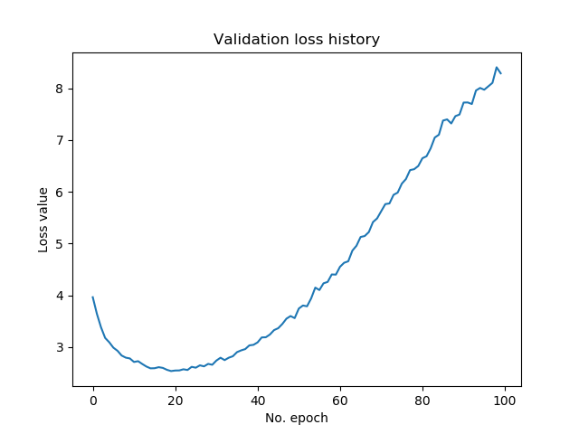
    

* * *

## Summary

In this blog post, we looked at how we can implement a CNN based classifier with Keras for the CIFAR-10 and CIFAR-100 datasets. Firstly, we explored why ConvNets are so good for building image classifiers: having convolutional layers work as "feature extractors" essentially allows you to let the model take care of feature engineering as well. This included a discussion on why pooling layers may improve the effectiveness of your CNN even further.

Then, we looked at the datasets - the CIFAR-10 and CIFAR-100 image datasets, with hundreds to thousands of samples across ten or one hundred classes, respectively. This was followed by implementations of CNN based classifiers using Keras with TensorFlow 2.0, one of the more popular deep learning frameworks used today.

I hope you've learnt something from this blog post! 😊 If you did, feel free to leave a comment in the comments box below. Please do the same if you have questions, if you spot mistakes, or when you have other remarks. I'll try to answer as soon as I can!

Thank you for reading MachineCurve today and happy engineering! 😎

\[kerasbox\]

* * *

## References

MachineCurve. (2020, January 6). Exploring the Keras Datasets. Retrieved from [https://github.com/mobiletest2016/machine-learning-articles/blob/master/articles/exploring-the-keras-datasets/](https://github.com/mobiletest2016/machine-learning-articles/blob/master/articles/exploring-the-keras-datasets.md)

MachineCurve. (2020, February 2). Convolutional Neural Networks and their components for computer vision. Retrieved from [https://github.com/mobiletest2016/machine-learning-articles/blob/master/articles/convolutional-neural-networks-and-their-components-for-computer-vision/](https://github.com/mobiletest2016/machine-learning-articles/blob/master/articles/convolutional-neural-networks-and-their-components-for-computer-vision.md)

MachineCurve. (2019, September 24). How to create a CNN classifier with Keras? Retrieved from [https://github.com/mobiletest2016/machine-learning-articles/blob/master/articles/how-to-create-a-cnn-classifier-with-keras/](https://github.com/mobiletest2016/machine-learning-articles/blob/master/articles/how-to-create-a-cnn-classifier-with-keras.md)

Keras. (n.d.). Datasets: CIFAR10 small image classification. Retrieved from [https://keras.io/datasets/#cifar10-small-image-classification](https://keras.io/datasets/#cifar10-small-image-classification)

Keras. (n.d.). Datasets: CIFAR100 small image classification. Retrieved from [https://keras.io/datasets/#cifar100-small-image-classification](https://keras.io/datasets/#cifar100-small-image-classification)

Krizhevsky, A., & Hinton, G. (2009). _[Learning multiple layers of features from tiny images](https://www.cs.toronto.edu/~kriz/learning-features-2009-TR.pdf)_ (Vol. 1, No. 4, p. 7). Technical report, University of Toronto (alternatively: [take a look at their website](https://www.cs.toronto.edu/~kriz/cifar.html)!).
