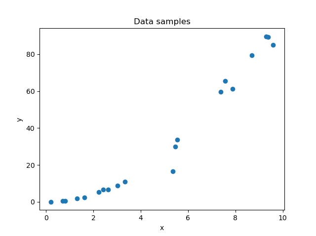
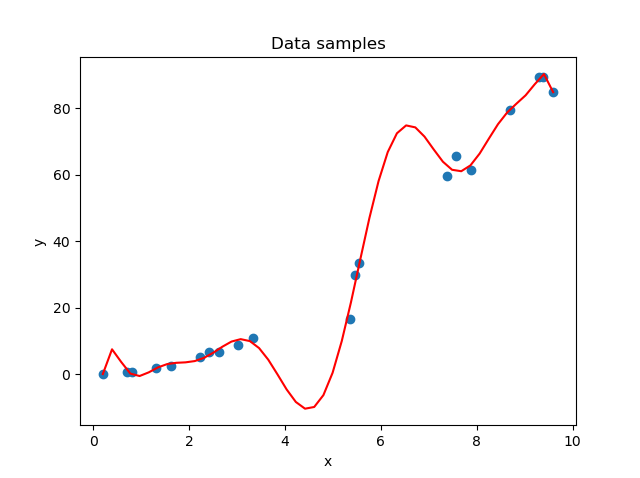
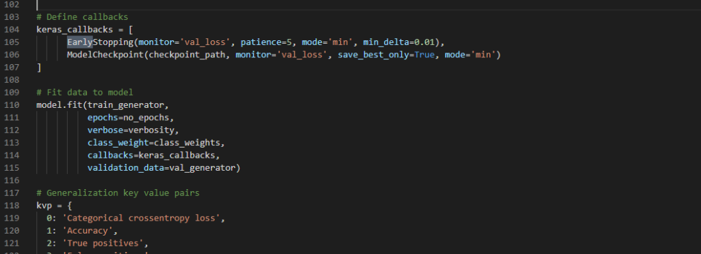

Training a Deep Learning model means that you have to balance between finding a model that works, i.e. that has _predictive power_, and one that works in many cases, i.e. a model that can _generalize well_.

This is a difficult task, because the balance is precise, and can sometimes be difficult to find.

In this article, we will be precisely looking at this balance. We will first take a look at what training a Deep Learning model involves by taking a high-level perspective. We then move forward and check what it means to _overfit_ and _underfit_ those models, and that the balance in between these two is crucial for Machine Learning success. We'll then show you how you can check whether your model is underfitting, and also whether it is overfitting.

This way, you can ensure that you have a model that works in many cases, rather than just a few training ones.

Let's take a look! 😎

**Update 13/Jan/2021:** Ensured that the article is up-to-date. Added a quick answer to the top of the article, changed header information and added links to other articles.

* * *

\[toc\]

* * *

## Quick Answer: How to see if your model is underfitting or overfitting?

[]

Use these steps to determine if your machine learning model, deep learning model or neural network is currently **underfit** or **overfit**.

1. **Ensure that you are using validation loss next to training loss in the training phase.**
2. **When your validation loss is decreasing, the model is still underfit.**
3. **When your validation loss is increasing, the model is overfit.**
4. **When your validation loss is equal, the model is either perfectly fit or in a local minimum.**

If you want to understand the _whys_ in more detail, make sure to keep reading the rest of this tutorial! 🚀

* * *

## Training a Deep Learning model: a high-level process

If we want to understand the concepts of underfitting and overfitting, we must place it into the context of training a Deep Learning model. That's why I think that we should take a look at how such a model is trained first.

At a high level, training such a model involves three main phases. These phases are cyclical, meaning that training a Deep Learning model is an iterative process. These are the three main components of a training step:

1. **Feeding samples to the Deep Learning model.** During a training step, samples from your training dataset are fed forward through the model. We call this the _forwards pass_. For each sample that is fed forward, a prediction is generated.
2. **Comparing the predictions and the ground truth.** The predictions that are generated by the Deep Learning model are compared with the _actual_ target values for the samples, which are called the _ground truth_. These comparisons are then jointly combined into a so-called _loss score_ by a [loss function](https://github.com/mobiletest2016/machine-learning-articles/blob/master/articles/about-loss-and-loss-functions.md). This score indicates how bad your model performs at this time.
3. **Improving the Deep Learning model.** Using a technique called _backpropagation_, we can then (automatically) compute the contribution of the different parts of the Neural Network to the loss score. If we know this contribution, we know into what direction to move in order to improve - the direction here called a _gradient_. Using those gradients and the model, we can use [optimizers](https://github.com/mobiletest2016/machine-learning-articles/blob/master/articles/gradient-descent-and-its-variants.md) for actually optimizing the model.

With these three steps, you'll eventually get a model that is optimized for the dataset that it is trained with.


* * *

## Overfitting and underfitting Machine Learning models

Suppose that we have the following observations, where a relationship \[latex\]\\text{X} \\rightarrow \\text{y}\[/latex\] exists:



We can generate a predictive model that captures this relationship and allows us to predict any value for \[latex\]\\text{y}\[/latex\] within the domain of \[latex\]\\text{x}\[/latex\] displayed in the plot:


_Fitting a model_ is another term that is used for this process of building and training a Deep Learning model.

Although it sounds simple, it can actually be really difficult to do just that. If we end up with a model that has the fit as displayed above, we have struck a precise balance between a model that is _underfit_ and between one that is highly _overfit_.

Time to take a look at the two in more detail.

### What is underfitting a Machine Learning Model?

Sometimes, your Deep Learning model is not able to capture the relationship between your independent variables and your dependent variable(s). In other words, we have then **underfit** our model.

> Underfitting occurs when a statistical model cannot adequately capture the underlying structure of the data. An under-fitted model is a model where some parameters or terms that would appear in a correctly specified model are missing.
> 
> Wikipedia (2003)

In the case of our Deep Learning model, the relationship between \[latex\]\\text{X} \\rightarrow \\text{y}\[/latex\] cannot be captured properly if the model is underfit, and a plot of the fit would look like this:


Underfitting can have many causes and by consequence fixes:

- You haven't trained your model for long enough, and adding extra training time might help you generate a better fit.
- You haven't trained with the appropriate architecture/model type. For example, if your dataset is nonlinear and you used [linear activation functions](https://github.com/mobiletest2016/machine-learning-articles/blob/master/articles/why-nonlinear-activation-functions-improve-ml-performance-with-tensorflow-example.md), your Deep Learning model will not be able to properly capture the patterns from the dataset.

In other words, underfitting occurs when the model shows [high bias and low variance](https://github.com/mobiletest2016/machine-learning-articles/blob/master/articles/machine-learning-error-bias-variance-and-irreducible-error-with-python.md).

### What is overfitting a Machine Learning model?

Above, we looked at one side of the balance between a good fit and a poor one. Let's now take a look at the other one, i.e., what happens when your model is **overfit**.

> The essence of overfitting is to have unknowingly extracted some of the residual variation (i.e. the noise) as if that variation represented underlying model structure.
> 
> Wikipedia (2003)

In each dataset, noise is present, besides the patterns that actually describe the relationship. If we train our model in such a way that it captures these patterns in great detail, we are training a model that is _overfit_. In other words, it will work very well for the data that it is trained on, but does it also work with data that comes from the real world? After all, the noise may not be present there?

If we visualize what overfitting means for our setting, we get the following visualization:



Here, we can clearly see that our models capture much of the noise: what should be a smooth, quadratic rise (the function we actually visualized is the function \[latex\]x^2\[/latex\] at the domain \[latex\]x \\in \[0, 10\]\[/latex\]) is now a noisy one. We therefore have introduced noise into our model which is not present in our 'real world' (i.e., in \[latex\]x^2\[/latex\])!

In the real world, the odds are relatively low that you will produce a model that is _underfit_. Overfitting is the problem: today's real-world datasets are often highly complex and have many variables. Capturing noise is really easy these days!

* * *

## Checking for underfitting/overfitting

### Visualizing loss

When you are training a Deep Learning model, for example with Keras, you specify a [loss function](https://github.com/mobiletest2016/machine-learning-articles/blob/master/articles/about-loss-and-loss-functions.md). This function, which produces a value that tells you something about how bad your model performs, can be constructed based on training data or validation data. We can specify such a loss function in the `model.compile` step.

During training, we always need to rely on validation data when estimating the performance of our model (relying on the training data for estimating model performance is like checking your own homework). That's why we specify a validation split in `model.fit`. Together, this can look as follows:

```
# Compile the model
model.compile(loss=categorical_crossentropy,
              optimizer=Adam(),
              metrics=['accuracy'])

# Fit data to model
model.fit(X_train, y_train,
          batch_size=batch_size,
          epochs=no_epochs,
          verbose=verbosity,
          validation_split=validation_split_size)
```

When we start the training process, we can now both see `loss` (loss based on training data) and `val_loss` (loss based on validation data) besides our epochs:

```
Epoch 1/25
5832/5832 [==============================] - 1s 203us/sample - loss: 2.2721 - accuracy: 0.1811 - val_loss: 2.2729 - val_accuracy: 0.1590
Epoch 2/25
5832/5832 [==============================] - 0s 27us/sample - loss: 2.2347 - accuracy: 0.2172 - val_loss: 2.2235 - val_accuracy: 0.2879
Epoch 3/25
5832/5832 [==============================] - 0s 23us/sample - loss: 2.1743 - accuracy: 0.2723 - val_loss: 2.1465 - val_accuracy: 0.2934
Epoch 4/25
5832/5832 [==============================] - 0s 25us/sample - loss: 2.0708 - accuracy: 0.3014 - val_loss: 2.0082 - val_accuracy: 0.3132
Epoch 5/25
5832/5832 [==============================] - 0s 25us/sample - loss: 1.9090 - accuracy: 0.3527 - val_loss: 1.8271 - val_accuracy: 0.3722
Epoch 6/25
5832/5832 [==============================] - 0s 23us/sample - loss: 1.7152 - accuracy: 0.4504 - val_loss: 1.6274 - val_accuracy: 0.5435
Epoch 7/25
5832/5832 [==============================] - 0s 24us/sample - loss: 1.5153 - accuracy: 0.6020 - val_loss: 1.4348 - val_accuracy: 0.6580
Epoch 8/25
5832/5832 [==============================] - 0s 23us/sample - loss: 1.3304 - accuracy: 0.6965 - val_loss: 1.2606 - val_accuracy: 0.6929
Epoch 9/25
5832/5832 [==============================] - 0s 25us/sample - loss: 1.1723 - accuracy: 0.7443 - val_loss: 1.1096 - val_accuracy: 0.7676
```

We can now manually plot this loss or [use TensorBoard](https://github.com/mobiletest2016/machine-learning-articles/blob/master/articles/how-to-use-tensorboard-with-keras.md) if we want to visualize loss in realtime.

A plot of your validation loss, after some epochs, will look somewhat like this:


### Checking for underfitting

Using validation loss, we can find whether our model is underfitting. Recall that when it does, the model can still gain predictive power without being _too_ trained on the training dataset itself.

The general rule for calling a model underfit is as follows:

- **A model can be considered underfit if your validation loss is still decreasing.**

For this reason: if your validation loss decreases, don't stop the training process.

### Checking for overfitting

Recall, however, that overfitting is the bigger problem these days. Whereas it is relatively easy to fight underfitting (just keep the training process running), avoiding overfitting is more difficult.

But how can we know whether our model is overfitting in the first place?

Here, too, we have a general rule:

- **A model can be considered overfit if your validation loss has been increasing (for some time)**.

Think about what this means: if validation loss starts to increase, the model - when trained - becomes _progressively worse_ during the check.

In other words, it has now started learning patterns that are not present within the dataset.

Especially around the optimum loss can oscillate a bit, so don't stop training immediately; perhaps you are at a local optimum, and loss will decrease further. However, if it keeps increasing, you can stop the training process.



### Find the optimum!

Training a Deep Learning model involves finding the balance between a model that is underfit and one that is overfit, yielding a model that has a _good fit_. As you saw above, we can find this optimum where the change in loss for some iteration is ~0 for a series of epochs. At precisely that time, we can stop the training process.

It is possible to instruct TensorFlow to train your Keras model while automatically monitoring for this balance. Using both the `EarlyStopping` and `ModelCheckpoint` callbacks, you can ensure that your model [stops training when this optimum is reached](https://github.com/mobiletest2016/machine-learning-articles/blob/master/articles/avoid-wasting-resources-with-earlystopping-and-modelcheckpoint-in-keras.md). Isn't that easy!

* * *

## Summary

In this article, we looked at the concepts of overfitting and underfitting for your Deep Learning model. Because, well, what do they mean - and how can we check if our model is underfit or if it is overfit? First of all, we saw what happens during a Deep Learning training process from a high-level perspective. We saw that samples are fed forward through the model, that predictions are generated and compared with the actual targets, and that the model is subsequently improved (partially) based on these computations.

We also saw that when our model is underfit, it is not yet capable of capturing the relevant patterns within the dataset. In other words, if our dataset represents a quadratic function, the function that would be fit would likely be in the shape of a line. If our model is overfit, however, any noise in the dataset disturbs the fit significantly - meaning that it is too focused on the training data at hand.

Validation loss can be used for checking whether your model is underfitting or whether it is overfitting. If you plot validation loss, by configuring it in `model.compile` and `model.fit` in Keras and subsequently generating a plot in TensorBoard, you can estimate how your model is doing. When validation loss keeps decreasing, your model is still underfit. When it continues to rise, overfitting is occurring. You therefore want a model that is trained to be at the precise balance between the two, where the change in loss is zero.

I hope that you have learned something from this article. If you did, please feel free to leave a comment in the comments section below 💬 Please feel free to do the same if you have any questions, comments or other remarks. Regardless of that, thank you for reading MachineCurve today and happy engineering! 😎

* * *

## References

Wikipedia. (2003, January 23). _Overfitting_. Wikipedia, the free encyclopedia. Retrieved November 30, 2020, from [https://en.wikipedia.org/wiki/Overfitting](https://en.wikipedia.org/wiki/Overfitting)
