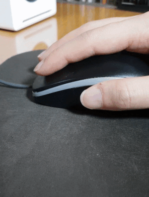
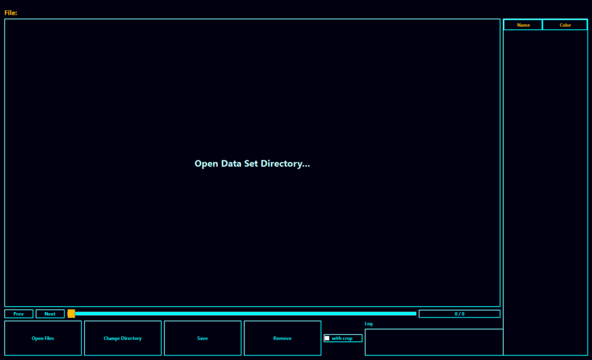
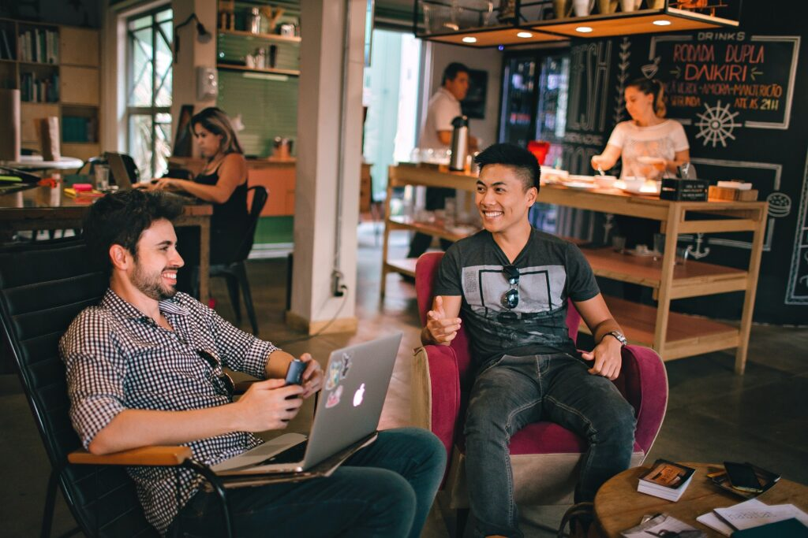
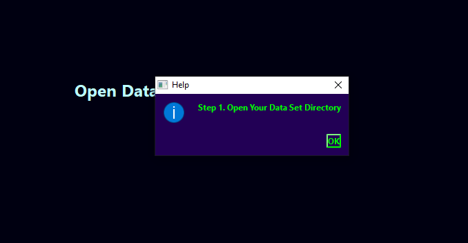
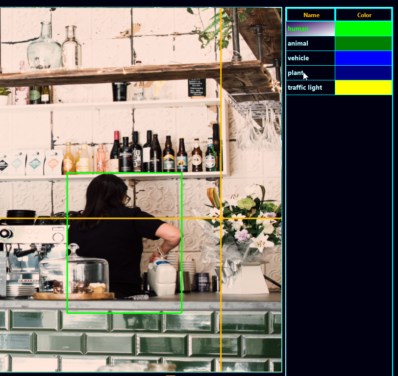
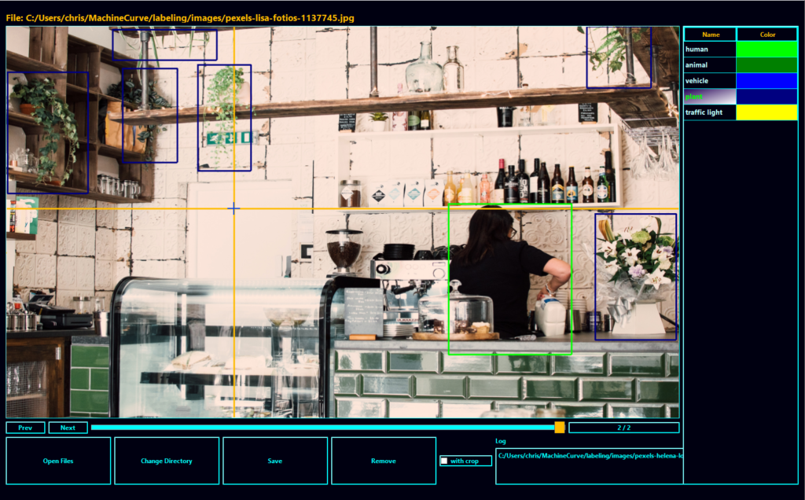

The YOLO object detector family - where YOLO stands for You Only Look Once - is one of the most widely known and used types of Object Detectors. Already at the fifth version in early 2021, YOLO can be trained relatively easily and is optimized for speed - hence looking _once_.

Training your own YOLO object detector requires that you provide a labeled dataset. In this tutorial, we're going to take a look at how you can do that. Using a tool called YoloLabel, which works on Windows and macOS, you will learn how you can generate bounding boxes for your own YOLO object detection model.

After reading it, you will know...

- **How YoloLabel can be used for performing your labeling task.**
- **How YoloLabel is installed.**
- **What the structure of a YOLO label file is.**

Let's take a look! 🚀

* * *

\[toc\]

* * *

## Using YoloLabel for generating labels

Let's take a look at how you can use [YoloLabel](https://github.com/developer0hye/Yolo_Label) for generating bounding boxes for your YOLO object detection dataset. YoloLabel is a tool specifically designed to optimize the labeling process. Rather than using a so-called "drag and drop" method, which is implemented by many labeling tools, YoloLabel favors a "click twice" approach where you click to start generating a bounding box, and click again to stop doing that.

See for yourself how this reduces strain on your arm:

- 
    
- 
    

Instead of "drag and drop", YoloLabel implements "twice click" for labeling. This method is more convenient than the first. Source: [YoloLabel](https://github.com/developer0hye/Yolo_Label), Copyright (c) 2019 Yonghye Kwon, images licensed according to [MIT License](https://github.com/developer0hye/Yolo_Label/blob/master/LICENSE), no changes made.

### Installing YoloLabel

YoloLabel runs on both Windows and macOS machines. Installation instructions can be found [here](https://github.com/developer0hye/Yolo_Label#install-and-run).

### Performing your labeling task

Let's now take a look at labeling some data. This involves a few steps:

1. Opening YoloLabel
2. Loading the dataset and label file
3. Labeling your data
4. Possibly switching between label classes

Let's start with opening YoloLabel.

#### Opening YoloLabel

If you have installed YoloLabel, you either have a file called `YoloLabel.exe` (on Windows) or `YoloLabel.app` available (on macOS). Double click this file. The following window should open:



You can see that the window is divided in three main blocks.

The top left block will display the images that must be labeled. The right block will show the label classes and their color, while the lower block provides control blocks - such as selecting which dataset to open.

From top to bottom, left to right, this is what the blocks do:

- **Prev:** go back to the previous image.
- **Next:** go forward to the next image.
- **Slider:** manually pick an image to label.
- **Progress bar:** see how many images you have already labeled, and how many images are in the dataset in total.
- **Open Files:** load a dataset and label file for labeling.
- **Change Directory:** open a new dataset and label file for labeling.
- **Save:** save all bounding boxes generated in the current image.
- **Remove:** remove the _image_ from the dataset.
    - Removing a bounding box can be done by performing a right click on the bounding box you want to remove.

#### Loading the dataset and label file

Say that we have a dataset that includes the following two pictures:

- []
    
- []
    

Source: pexels.com, Pexels License

And that it is available at some location, say `C:/Users/chris/MachineCurve/labeling/images`.

Clicking **Open Files** will require you to open the directory where your images are saved:

- 
    
- 
    

However, after doing so, it will also request that you provide a _Label List File_ - which is a `.txt` file or a `.names` file.

A label list file contains all the labels that you want to possibly attach to your bounding boxes - and hence represents all the classes that can be present in an image. In other words, they are your target classes.

A `labels.txt` file contains all class labels that you want to use in your labeling task, one per line:

```
human
animal
vehicle
plant
traffic light
```

Note that with YOLO, classes are not represented by text - but rather, by index. In other words, `human` is class `0`, `animal` class `1`, and so on. Make sure to take this into account when handling the labels or fusing the labels from two possibly different datasets!

#### Labeling your data

Once you complete these two steps, you will see the first image in your dataset and two lines - a vertical and a horizontal one - following your mouse cursor. You will also see the labels from your `labels.txt` file on the right, each having a unique color.

It's now time to label your data.


Labeling is really easy. It's simply drawing a bounding box around the objects in the image. For example, for the women playing football/soccer (depending on what country you're from ⚽), we can label as follows:

#### Switching between label classes

Sometimes, more than just one class is visible within an image. For example, for this photo from a cafe, you can see that a human is there - but that the same is true for plants. In that case, you may need to switch between classes.

Which can also be done easily by simply clicking the class you currently want to label for.



And voila, you have now labeled a human being and a few plants:



### Inspecting your label files

Now that we have generated some labels, we can take a look at how YoloLabel converts them into label files. These label files contain all the information YOLO needs for understanding where particular objects are in an input image.

Let's go back to the women:


This is the label file:

```
0 0.558203 0.501340 0.080469 0.294906
0 0.357031 0.492627 0.162500 0.435657
0 0.216016 0.502681 0.194531 0.434316
```

Interesting :)

It will be much easier to understand what the numbers above mean if you knew that they represent `class - center_x - center_y - width - height`. In other words, the class number, the horizontal position of the center of its bounding box, the vertical position of the center of its bounding box, its width and its height.

All values are relative, meaning that e.g. `0.558203` for `center_x` means that the center is at `55.8203%` of the image width. And indeed: the goal keeper is at approximately 55% of the image in terms of width, and indeed at approximately 50% of the screen. The most left woman is at approximately 22% width and 50% height. And the middle one takes approximately 16.3% of the screen's width and 43.6% of the screen's height.

This way, it no longer matters if YOLO resizes the image - it still knows where the bounding boxes are.

Great stuff! 😎

* * *

## Summary

You Only Look Once, or YOLO, is a family of object detection algorithms that is highly popular today. Training your own YOLO model means that you will need to provide a labeled dataset. In this tutorial, you have seen how you can use a tool called YoloLabel for doing that. You now know...

- **How YoloLabel can be used for performing your labeling task.**
- **How YoloLabel is installed.**
- **What the structure of a YOLO label file is.**

I hope that it was useful for your learning process! Please feel free to share what you have learned in the comments section 💬 I’d love to hear from you. Please do the same if you have any questions or other remarks.

Thank you for reading MachineCurve today and happy engineering! 😎

* * *

## References

GitHub. (n.d.). _Developer0hye/Yolo\_Label_. [https://github.com/developer0hye/Yolo\_Label](https://github.com/developer0hye/Yolo_Label)

GitHub. (n.d.). _No CSV export · Issue #39 · developer0hye/Yolo\_Label_. [https://github.com/developer0hye/Yolo\_Label/issues/39](https://github.com/developer0hye/Yolo_Label/issues/39)
