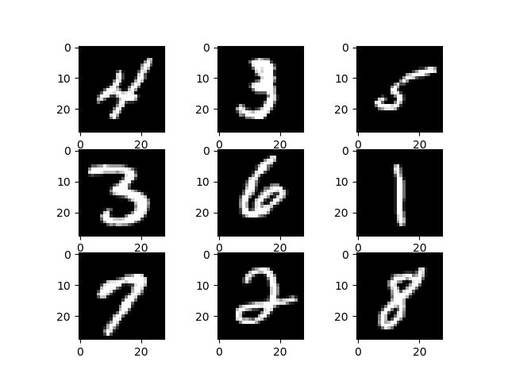
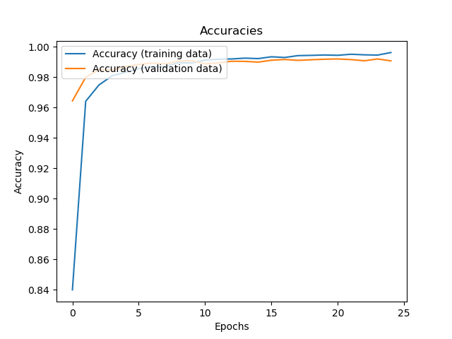
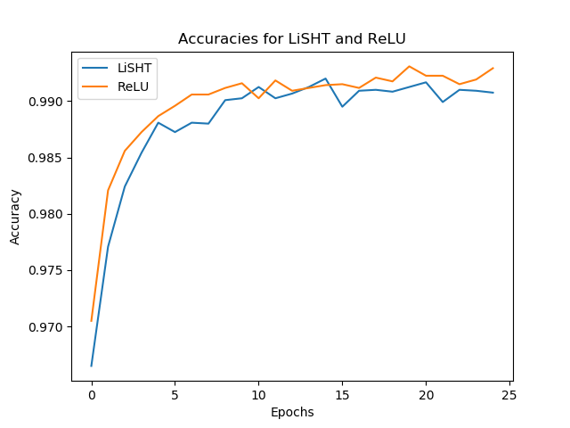
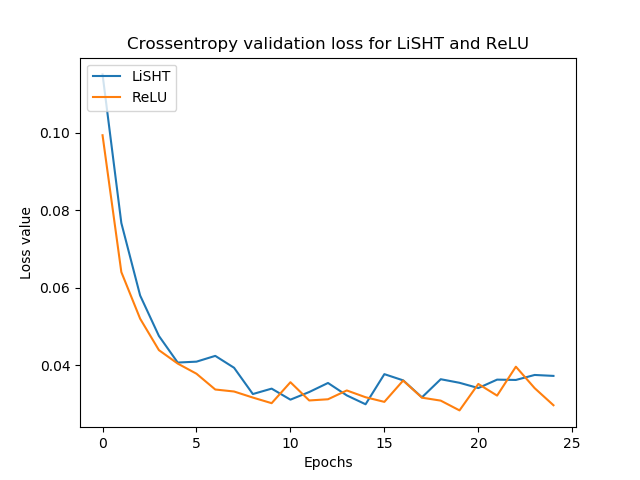
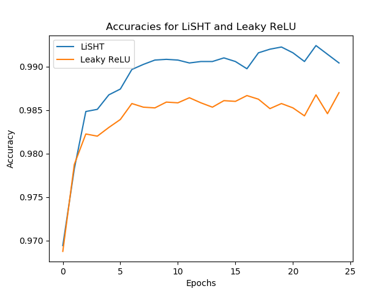
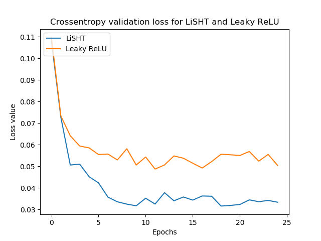

It's very likely that you will use the [ReLU activation function](https://github.com/mobiletest2016/machine-learning-articles/blob/master/articles/implementing-relu-sigmoid-and-tanh-in-keras.md) when creating a neural network. This is unsurprising, since there is a vast landscape of literature that suggests that ReLU performs better than today's other two standard activation functions, Sigmoid and Tanh.

Nevertheless, ReLU has its shortcomings: when you don't configure your network properly, or when you use data that is not normalized before training, the outputs of your neurons may swing substantially during the first phases of training. Since gradients for ReLU are either zero or one, it may be that you cannot escape _zeroes_ when your initial neuron outputs are really small. We then call your neuron dead, and with many dead neurons, you essentially deprive your neural network from its ability to achieve acceptable performance.

Fortunately, new activation functions have been designed that attempt to reduce the impact of this inherent shortcoming of the ReLU activation function. For example, [Swish](https://github.com/mobiletest2016/machine-learning-articles/blob/master/articles/why-swish-could-perform-better-than-relu.md) was designed to make ReLU more smooth. However, [LiSHT](https://github.com/mobiletest2016/machine-learning-articles/blob/master/articles/beyond-swish-the-lisht-activation-function.md) is a very new activation function that attempts to reduce the ReLU shortcomings indirectly. It essentially manipulates the Sigmoid function (which does not result in dying neurons, but in [vanishing gradients](https://github.com/mobiletest2016/machine-learning-articles/blob/master/articles/random-initialization-vanishing-and-exploding-gradients.md) instead - which is just as worse). Fortunately, with LiSHT, the impact of this vanishing gradients problem is much less severe, and it may thus be a good candidate that hovers between ReLU and Sigmoid.

But if LiSHT is to gain traction in the machine learning community, it must be usable for your own machine learning projects. This renders the question: **how can LiSHT be implemented with Keras**? Precisely the question that we'll attempt to answer with this blog.

First, we provide a brief recap about LiSHT, although this will primarily be a reference [to our other blog post](https://github.com/mobiletest2016/machine-learning-articles/blob/master/articles/beyond-swish-the-lisht-activation-function.md). Subsequently, we'll use the Keras deep learning framework to implement LiSHT into a [ConvNet](https://github.com/mobiletest2016/machine-learning-articles/blob/master/articles/a-simple-conv3d-example-with-keras.md) that is trained for [classifying the MNIST image dataset](https://github.com/mobiletest2016/machine-learning-articles/blob/master/articles/how-to-create-a-cnn-classifier-with-keras.md). Before wrapping up, we'll also show how the model performs - and compare it to the results of _standard_ ReLU activation as well as _Leaky_ ReLU.

After reading this tutorial, you will...

- **Understand what the LiSHT activation function is, and how it can be useful.**
- **Know how you can define your own LiSHT function with TensorFlow 2 / Keras.**
- **See how to use this activation functions in a real TensorFlow 2 / Keras model.**

Let's go! 😄

**Update 17/Mar/2021:** updated the article to ensure that it is up-to-date in 2021. Checked the article for renewal and updated the code so that it can be used with TensorFlow 2.

* * *

\[toc\]

* * *

## Full code example: LiSHT with TensorFlow and Keras

It can be the case that you want a quick and full example where the **LiSHT activation function is applied**. Below, you can see a fully working example for TensorFlow 2 based Keras. If you want to understand LiSHT in mored detail, or want to find out how all the code works, then make sure to read the rest of this tutorial as well! 🚀

```
import tensorflow
from tensorflow.keras.datasets import mnist
from tensorflow.keras.models import Sequential
from tensorflow.keras.layers import Dense, Dropout, Flatten
from tensorflow.keras.layers import Conv2D, MaxPooling2D
import numpy as np
import matplotlib.pyplot as plt

# LiSHT
def LiSHT(x):
  return x * tensorflow.math.tanh(x)

# Model configuration
img_width, img_height = 28, 28
batch_size = 250
no_epochs = 25
no_classes = 10
validation_split = 0.2
verbosity = 1

# Load MNIST dataset
(input_train, target_train), (input_test, target_test) = mnist.load_data()

# Reshape data
input_train = input_train.reshape(input_train.shape[0], img_width, img_height, 1)
input_test = input_test.reshape(input_test.shape[0], img_width, img_height, 1)
input_shape = (img_width, img_height, 1)

# Parse numbers as floats
input_train = input_train.astype('float32')
input_test = input_test.astype('float32')

# Normalize data: [0, 1].
input_train = input_train / 255
input_test = input_test / 255

# Convert target vectors to categorical targets
target_train = tensorflow.keras.utils.to_categorical(target_train, no_classes)
target_test = tensorflow.keras.utils.to_categorical(target_test, no_classes)

# Create the model
model = Sequential()
model.add(Conv2D(32, kernel_size=(3, 3), activation=LiSHT, input_shape=input_shape))
model.add(MaxPooling2D(pool_size=(2, 2)))
model.add(Dropout(0.25))
model.add(Conv2D(64, kernel_size=(3, 3), activation=LiSHT))
model.add(MaxPooling2D(pool_size=(2, 2)))
model.add(Dropout(0.25))
model.add(Flatten())
model.add(Dense(256, activation=LiSHT))
model.add(Dense(no_classes, activation='softmax'))

# Compile the model
model.compile(loss=tensorflow.keras.losses.categorical_crossentropy,
              optimizer=tensorflow.keras.optimizers.Adam(),
              metrics=['accuracy'])

# Fit data to model
history = model.fit(input_train, target_train,
            batch_size=batch_size,
            epochs=no_epochs,
            verbose=verbosity,
            validation_split=validation_split)

# Generate generalization metrics
score = model.evaluate(input_test, target_test, verbose=0)
print(f'Test loss: {score[0]} / Test accuracy: {score[1]}')

# Plot history: Crossentropy loss
plt.plot(history.history['loss'], label='Crossentropy loss (training data)')
plt.plot(history.history['val_loss'], label='Crossentropy loss (validation data)')
plt.title('Crossentropy loss')
plt.ylabel('Loss value')
plt.xlabel('Epochs')
plt.legend(loc="upper left")
plt.show()

# Plot history: Accuracies
plt.plot(history.history['accuracy'], label='Accuracy (training data)')
plt.plot(history.history['val_accuracy'], label='Accuracy (validation data)')
plt.title('Accuracies')
plt.ylabel('Accuracy')
plt.xlabel('Epochs')
plt.legend(loc="upper left")
plt.show()
```

* * *

## Recap: what is LiSHT?

LiSHT is a relatively new activation function, proposed by Roy et al. in their early 2019 [paper on ArXiv](https://arxiv.org/abs/1901.05894). It stands for a **Linearly Scaled Hyperbolic Tangent** and is non-parametric in the sense that `tanh(x)` is scaled linearly with `x` without the need for manual configuration by means of some parameter.

Its formula - \[latex\]LiSHT(x) = x \\times tanh(x)\[/latex\] leads to the following visualization, where LiSHT is visualized in green:

[](https://www.machinecurve.com/wp-content/uploads/2019/11/lisht_visualized.png)

In terms of the derivative, this has the effect that the _range_ of the derivative function - and hence the computed gradients - is expanded. This is expected to reduce the impact of the vanishing gradients problem. I'd recommend to read [MachineCurve's other blog post](https://github.com/mobiletest2016/machine-learning-articles/blob/master/articles/beyond-swish-the-lisht-activation-function.md) for more information about the theoretical aspects of the LiSHT activation function.

[](https://www.machinecurve.com/wp-content/uploads/2019/11/lisht_derivs.png)

* * *

## Creating your own activation function with Keras

In this blog post, we'll focus on how to implement LiSHT with Keras instead. Keras, the deep learning framework for Python that I prefer due to its flexibility and ease of use, supports the creation of custom activation functions. You can do so by creating a regular Python definition and subsequently assigning this def as your activation function.

For example, for LiSHT:

```
# LiSHT
def LiSHT(x):
  return x * K.tanh(x)
```

Where `K` is the Keras backend, imported as `from keras import backend as K` .

Note that using Numpy directly does not work when creating a custom function with Keras - you'll run into the following error:

```
NotImplementedError: Cannot convert a symbolic Tensor (2nd_target:0) to a numpy array.
```

The fix is simple - replace your Numpy based tanh (i.e. `np.tanh(x)`) with the Keras based one - `K.tanh(x)`. Contrary to Numpy, the `K` backend performs the tanh operation at the tensor level.

Subsequently, you can use the created def in arbitrary Keras layers - e.g. with the Sequential API:

```
model.add(Dense(256, activation=LiSHT))
```

* * *

## Creating your LiSHT model with Keras

Now that we've found how to create custom activation functions with Keras, we can start working on our LiSHT CNN. First, we'll take a look at the dataset we're going to use today, and the model architecture that we're going to create. Subsequently, we create the model, start training and discuss model performance.

### Today's dataset

A supervised machine learning model requires a dataset that can be used for training. For the sake of simplicity, we use a relatively simple one today: the MNIST dataset.

This dataset contains thousands of handwritten digits - i.e., numbers between 0 and 9 - that are all 28 by 28 pixels. It is one of the standard datasets used in computer vision education for its simplicity and extensiveness, and hence is a good candidate for explaining how to create the model.

[](https://www.machinecurve.com/wp-content/uploads/2019/06/mnist-visualize.png)

What's even better: the Keras API contains a pointer to the MNIST dataset already. That is, we can import the data and assign it to Python variables quite easily - by calling `load_data` with some Keras function. This is also why it's good to use MNIST in an educational setting.

All right, let's now find out what you need in order to run the model.

### What you'll need to run the model

Put simply, these are the software requirements for running this Keras model:

- **Keras itself** - which is obvious.
- By consequence, you'll also need to install **Python**, preferably version 3.6+.
- You also need one of the backends: **Tensorflow, Theano or CNTK**. We prefer Tensorflow, since it has been integrated deeply in today's Keras versions (strictly speaking, it's the other way around, but OK).
- Finally, you'll also need **Numpy** and **Matplotlib** for data processing and visualization purposes.

### Let's go: stating our imports

Now that we know what we need, we can actually create our model. Open up your file explorer, navigate to a directory of your choice and create a Python file, such as `model_lisht.py`. Next, open this file in your code editor of choice (which preferably supports Python syntax highlighting). We can now start coding! 😄

We first define our imports:

```
import tensorflow
from tensorflow.keras.datasets import mnist
from tensorflow.keras.models import Sequential
from tensorflow.keras.layers import Dense, Dropout, Flatten
from tensorflow.keras.layers import Conv2D, MaxPooling2D
import numpy as np
import matplotlib.pyplot as plt
```

As you can see, they relate strongly to the imports specified in the previous section. You'll import TensorFlow, the MNIST dataset, the Sequential API, and a variety of Keras layers.

Finally, you import Numpy and Matplotlib - as said, for data processing and visualization purposes.

### Defining LiSHT and model configuration

The next thing we do is defining LiSHT in terms of a Python definition:

```
# LiSHT
def LiSHT(x):
  return x * tensorflow.math.tanh(x)
```

Quite simple, actually - we transform some input \[latex\]x\[/latex\] into an output that follows the LiSHT equation of \[latex\]x \\times tanh(x)\[/latex\].

For doing so, we use `tensorflow.math` based `tanh` because it can run with Tensors adequately.

Subsequently, we add variables for model configuration:

```
# Model configuration
img_width, img_height = 28, 28
batch_size = 250
no_epochs = 25
no_classes = 10
validation_split = 0.2
verbosity = 1
```

As MNIST images are 28 pixels wide and 28 pixels high, we specify `img_height` and `img_width` to be 28. We also use a batch size of 250, which means that - even though we don't truly use the gradient descent optimizer - we're taking a [minibatch](https://github.com/mobiletest2016/machine-learning-articles/blob/master/articles/gradient-descent-and-its-variants.md) approach.

Twenty-five epochs are used for training. This is just a fixed number and is based on my estimate that with a relatively simple dataset quite accurate performance must be achievable without extensive training. In your own projects, you must obviously configure the number of epochs to an educated estimate of your own, or use smart techniques like [EarlyStopping](https://github.com/mobiletest2016/machine-learning-articles/blob/master/articles/avoid-wasting-resources-with-earlystopping-and-modelcheckpoint-in-keras.md) instead.

We use 20% of our training data for validation purposes and set model verbosity to `True` (by means of '1'), essentially outputting everything on screen. This is useful for educational settings, but slightly slows down the training process. Choose wisely in your own project :)

### Importing and preparing data

We next import our data. As said before, this is essentially a one-line statement due to the way the MNIST dataset is integrated in TensorFlow / the Keras library:

```
# Load MNIST dataset
(input_train, target_train), (input_test, target_test) = mnist.load_data()
```

When running, it downloads the dataset automatically, and if you downloaded it before, it will use your cache to speed up the training process.

Next, we add code for data processing and preparation:

```
# Reshape data
input_train = input_train.reshape(input_train.shape[0], img_width, img_height, 1)
input_test = input_test.reshape(input_test.shape[0], img_width, img_height, 1)
input_shape = (img_width, img_height, 1)

# Parse numbers as floats
input_train = input_train.astype('float32')
input_test = input_test.astype('float32')

# Normalize data: [0, 1].
input_train = input_train / 255
input_test = input_test / 255

# Convert target vectors to categorical targets
target_train = tensorflow.keras.utils.to_categorical(target_train, no_classes)
target_test = tensorflow.keras.utils.to_categorical(target_test, no_classes)
```

This code essentially:

- Reshapes data based using the channels-last strategy by default required in TensorFlow 2.
- Parses numbers as floats, which is estimated to speed up the training process (Quora, n.d.).
- Normalizes the data.
- Converts target vectors into categorical format, allowing us to use [categorical crossentropy loss](https://github.com/mobiletest2016/machine-learning-articles/blob/master/articles/how-to-use-binary-categorical-crossentropy-with-keras.md) for evaluating training and validation performance.

### Creating our model architecture

Next, we specify the architecture of our model. We use two convolutional blocks with max pooling and dropout, as well as two densely-connected layers. Please [refer to this post](https://github.com/mobiletest2016/machine-learning-articles/blob/master/articles/how-to-create-a-cnn-classifier-with-keras.md) if you wish to understand these blocks in more detail. Here's the code:

```
# Create the model
model = Sequential()
model.add(Conv2D(32, kernel_size=(3, 3), activation=LiSHT, input_shape=input_shape))
model.add(MaxPooling2D(pool_size=(2, 2)))
model.add(Dropout(0.25))
model.add(Conv2D(64, kernel_size=(3, 3), activation=LiSHT))
model.add(MaxPooling2D(pool_size=(2, 2)))
model.add(Dropout(0.25))
model.add(Flatten())
model.add(Dense(256, activation=LiSHT))
model.add(Dense(no_classes, activation='softmax'))
```

See how we're using LiSHT here?

We simply add the `LiSHT` Python definition to the layers by specifying it as the `activation` attribute. Note that we omit the quotes (`'`) i.e. we don't supply the definition as Strings, but as the definition. This allows Keras to directly use our custom LiSHT activation function.

### Compiling model and starting training

Next, we compile our model with the hyperparameters set in the _model configuration_ section and start our training process.

We store the training history in the `history` object, for [visualizing model performance](https://github.com/mobiletest2016/machine-learning-articles/blob/master/articles/how-to-visualize-the-training-process-in-keras.md) over time.

```
# Compile the model
model.compile(loss=tensorflow.keras.losses.categorical_crossentropy,
              optimizer=tensorflow.keras.optimizers.Adam(),
              metrics=['accuracy'])

# Fit data to model
history = model.fit(input_train, target_train,
            batch_size=batch_size,
            epochs=no_epochs,
            verbose=verbosity,
            validation_split=validation_split)
```

### Evaluation metrics and visualizations

We next add code for testing the _generalization power_ of our model and for visualizing the model history:

```
# Generate generalization metrics
score = model.evaluate(input_test, target_test, verbose=0)
print(f'Test loss: {score[0]} / Test accuracy: {score[1]}')

# Plot history: Crossentropy loss
plt.plot(history.history['loss'], label='Crossentropy loss (training data)')
plt.plot(history.history['val_loss'], label='Crossentropy loss (validation data)')
plt.title('Crossentropy loss')
plt.ylabel('Loss value')
plt.xlabel('Epochs')
plt.legend(loc="upper left")
plt.show()

# Plot history: Accuracies
plt.plot(history.history['accuracy'], label='Accuracy (training data)')
plt.plot(history.history['val_accuracy'], label='Accuracy (validation data)')
plt.title('Accuracies')
plt.ylabel('Accuracy')
plt.xlabel('Epochs')
plt.legend(loc="upper left")
plt.show()
```

### Full model code

...and finally arrive at the full model as specified as follows:

```
import tensorflow
from tensorflow.keras.datasets import mnist
from tensorflow.keras.models import Sequential
from tensorflow.keras.layers import Dense, Dropout, Flatten
from tensorflow.keras.layers import Conv2D, MaxPooling2D
import numpy as np
import matplotlib.pyplot as plt

# LiSHT
def LiSHT(x):
  return x * tensorflow.math.tanh(x)

# Model configuration
img_width, img_height = 28, 28
batch_size = 250
no_epochs = 25
no_classes = 10
validation_split = 0.2
verbosity = 1

# Load MNIST dataset
(input_train, target_train), (input_test, target_test) = mnist.load_data()

# Reshape data
input_train = input_train.reshape(input_train.shape[0], img_width, img_height, 1)
input_test = input_test.reshape(input_test.shape[0], img_width, img_height, 1)
input_shape = (img_width, img_height, 1)

# Parse numbers as floats
input_train = input_train.astype('float32')
input_test = input_test.astype('float32')

# Normalize data: [0, 1].
input_train = input_train / 255
input_test = input_test / 255

# Convert target vectors to categorical targets
target_train = tensorflow.keras.utils.to_categorical(target_train, no_classes)
target_test = tensorflow.keras.utils.to_categorical(target_test, no_classes)

# Create the model
model = Sequential()
model.add(Conv2D(32, kernel_size=(3, 3), activation=LiSHT, input_shape=input_shape))
model.add(MaxPooling2D(pool_size=(2, 2)))
model.add(Dropout(0.25))
model.add(Conv2D(64, kernel_size=(3, 3), activation=LiSHT))
model.add(MaxPooling2D(pool_size=(2, 2)))
model.add(Dropout(0.25))
model.add(Flatten())
model.add(Dense(256, activation=LiSHT))
model.add(Dense(no_classes, activation='softmax'))

# Compile the model
model.compile(loss=tensorflow.keras.losses.categorical_crossentropy,
              optimizer=tensorflow.keras.optimizers.Adam(),
              metrics=['accuracy'])

# Fit data to model
history = model.fit(input_train, target_train,
            batch_size=batch_size,
            epochs=no_epochs,
            verbose=verbosity,
            validation_split=validation_split)

# Generate generalization metrics
score = model.evaluate(input_test, target_test, verbose=0)
print(f'Test loss: {score[0]} / Test accuracy: {score[1]}')

# Plot history: Crossentropy loss
plt.plot(history.history['loss'], label='Crossentropy loss (training data)')
plt.plot(history.history['val_loss'], label='Crossentropy loss (validation data)')
plt.title('Crossentropy loss')
plt.ylabel('Loss value')
plt.xlabel('Epochs')
plt.legend(loc="upper left")
plt.show()

# Plot history: Accuracies
plt.plot(history.history['accuracy'], label='Accuracy (training data)')
plt.plot(history.history['val_accuracy'], label='Accuracy (validation data)')
plt.title('Accuracies')
plt.ylabel('Accuracy')
plt.xlabel('Epochs')
plt.legend(loc="upper left")
plt.show()
```

* * *

## How well does LiSHT perform?

Here, we'll take a look how well LiSHT performs. Consider these checks to be relatively quick in nature - using the MNIST (and hence a simple) dataset, using 25 epochs only, without any statistical tests whatsoever.

They thus do not say _everything_ about how well LiSHT performs, but give you an idea. First, I compare LiSHT with traditional ReLU, by retraining the TensorFlow 2 / Keras based CNN we created before and comparing histories. Subsequently, I compare LiSHT to Leaky ReLU, also by retraining the particular CNN. Let's find out how well it performs!

### LiSHT performance in general

This is how well LiSHT performs as a baseline:

[](https://www.machinecurve.com/wp-content/uploads/2019/11/lisht_ce_loss.png)

[](https://www.machinecurve.com/wp-content/uploads/2019/11/lisht_accuracy.png)

These graphs seem to be quite normal: fast-increasing/fast-decreasing accuracy and loss values at first, slowing down when the number of epochs increase. LiSHT also generalizes well with the MNIST dataset, achieving test accuracy of 99.2%.

```
Test loss: 0.02728017502297298 / Test accuracy: 0.9922000169754028
```

### Comparing LiSHT to ReLU

I compared LiSHT with ReLU by training the same ConvNet with both LiSHT and ReLU, with exactly the same settings. These are the results:

- [](https://www.machinecurve.com/wp-content/uploads/2019/11/lisht_relu_acc.png)
    
- [](https://www.machinecurve.com/wp-content/uploads/2019/11/lisht_relu_ce.png)
    

Results are close, but in terms of _validation_ loss and accuracy, ReLU seems to win from LiSHT.

But if you use a model in practice, it's likely that you're more interested in generalization power - and we also have these metrics.

```
LiSHT - Test loss: 0.023941167211306312 / Test accuracy: 0.9930999875068665
ReLU - Test loss: 0.025442042718966378 / Test accuracy: 0.9922999739646912
```

Even though the difference is small (only ~0.08%), LiSHT performs better than ReLU in this case. What's more, it seems to be that it's not only more confident about its predictions, but actually produces better results (as indicated by the lower test loss value). This is promising, but possibly not statistically significant.

This means that LiSHT and ReLU do not really produce different results in normal training scenarios. Let's now take a look at Leaky ReLU performance vs LiSHT.

### Comparing LiSHT to Leaky ReLU

- [](https://www.machinecurve.com/wp-content/uploads/2019/11/lisht_leaky_acc.png)
    
- [](https://www.machinecurve.com/wp-content/uploads/2019/11/lisht_leaky_ce.png)
    

The differences are a bit larger when comparing LiSHT with Leaky ReLU. The new activation function performs better, as can be seen in the plots. This is also visible when testing the models with our test dataset:

```
LiSHT - Test loss: 0.031986971908376474 / Test accuracy: 0.9905999898910522
Leaky ReLU - Test loss: 0.04289412204660111 / Test accuracy: 0.9879000186920166
```

* * *

## Summary

In this blog post, we implemented the LiSHT activation function with TensorFlow 2, using the Keras deep learning library. Empirically, with a simple test, we showed that it performs well compared to ReLU, and even better compared to Leaky ReLU. Note that this may mean that it does not matter much whether you use ReLU or LiSHT when you don't face the dying ReLU problem. If you do, however, it might be the case that you actually gain better results given their derivatives, while not being too sensitive to the vanishing gradients problem. However, that's for another time 😊

Thanks for reading MachineCurve today, and I hope you've learnt something! If you did, please feel free to leave a comment below 👇 I'll happily answer your comments and answer any questions you may have.

Thanks again - and happy engineering! 😎

* * *

## References

Roy, S. K., Manna, S., Dubey, S. R., & Chaudhuri, B. B. (2019). LiSHT: Non-Parametric Linearly Scaled Hyperbolic Tangent Activation Function for Neural Networks. [_arXiv preprint arXiv:1901.05894_.](https://arxiv.org/abs/1901.05894)

Quora. (n.d.). When should I use tf.float32 vs tf.float64 in TensorFlow? Retrieved from [https://www.quora.com/When-should-I-use-tf-float32-vs-tf-float64-in-TensorFlow](https://www.quora.com/When-should-I-use-tf-float32-vs-tf-float64-in-TensorFlow)
