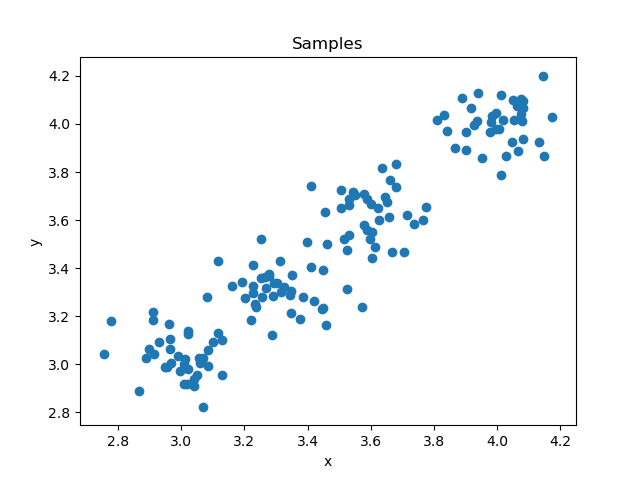
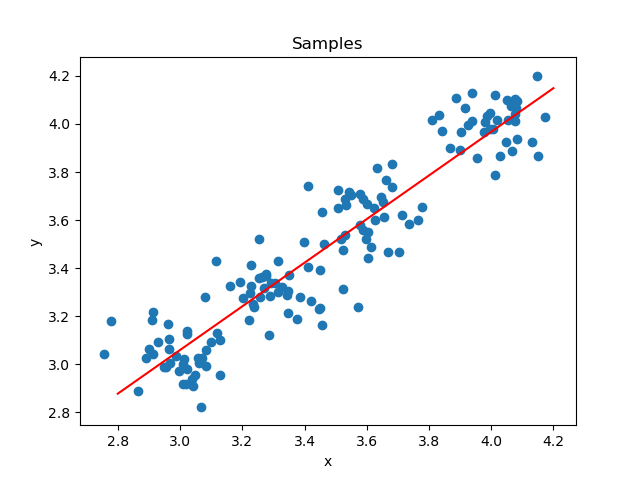
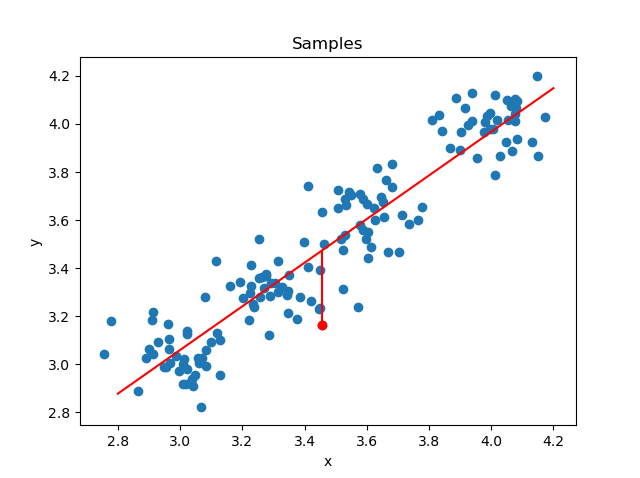

Sometimes, life is easy. There are times when you are building a Machine Learning model for regression and you find your data to be linear. In other words, a regression model can be fit by means of a straight line. While these cases are relatively rare, **linear regression** is still a useful tool for in your Machine Learning toolkit.

What is Linear Regression? And how does it work? That's what we will investigate in today's Machine Learning article. It is structured as follows. First of all, we will be introducing Linear Regression conceptually, specifically Ordinary Least Squares based Linear Regression. We'll look at what regression is in the first place, and then introduce the linear variant - explaining the maths behind it in an intuitive way, so that it'll be entirely clear what is going on. We also cover how Linear Regression is performed, i.e., how after regressing a fit the model is improved, yielding better fits.

Subsequently, we'll move from theory into practice, and implement Linear Regression with Python by means of the Scikit-learn library. We will generate a dataset where a linear fit can be made, apply Scikit's `LinearRegression` for performing the Ordinary Least Squares fit, and show you with step-by-step examples how you can implement this yourself.

Let's take a look :)

* * *

\[toc\]

* * *

## Introducing Linear Regression

In this section, we will be looking at how Linear Regression is performed by means of an Ordinary Least Squares fit. For doing so, we will first take a look at regression in general - what is it, and how is it useful? Then, we'll move forward to Linear Regression, followed by looking at the different types for performing regression analysis linearly. Finally, we zoom in on the specific variant that we will be using in this article - Oridnary Least Squares based linear regression - and will explore how it works.

Of course, since we're dealing with a method for Machine Learning, we cannot fully move away from maths. However, I'm not a big fan of writing down a lot of equations without explaining them. For this reason, we'll explain the math in terms of _intuitions_, so that even though when you cannot fully read the equations, you will understand what is going on.

### What is Regression?

Most generally, we can define regression as follows:

> Regression analysis is a set of statistical processes for estimating the relationships between a dependent variable (often called the 'outcome variable') and one or more independent variables (often called 'predictors', 'covariates', or 'features').

In other words, suppose that we have the following dataset:

| **No. Projects completed** | **No. Successful project** | **No. Positive reviews** | **Salary increase (%/100)** |
| --- | --- | --- | --- |
| 2 | 2 | 1 | 0.05 |
| 4 | 1 | 2 | 0.00 |
| 1 | 0 | 1 | 0.00 |
| 2 | 2 | 5 | 0.12 |
| 3 | 3 | 2 | 0.10 |
| 4 | 2 | 1 | 0.05 |
| … | … | … | … |

And suppose that our goal is to build a predictive model where we explore whether any or a combination of the variables \[latex\]\\text{projects\_completed}\[/latex\], \[latex\]\\text{successful\_projects}\[/latex\] or \[latex\]\\text{positive\_reviews}\[/latex\] can predict the annual salary increase, i.e. \[latex\]\\text{salary\_increase}\[/latex\].

In other words, we explore whether:

\[latex\]\\text{\\{projects\_completed, successful\_projects, positive\_reviews\\}} \\rightarrow \\text{salary\_increase}\[/latex\]

Here, \[latex\]\\text{salary\_increase}\[/latex\] is a _continuous variable_, meaning that it can take any 'real value', i.e. any positive and negative number with decimals. Salary increases can be 0.00, even negative (if our salary would decrease, e.g. -0.05), or really positive if performed well (0.12 or 12% to give just one example).

[Contrary to classification](https://github.com/mobiletest2016/machine-learning-articles/blob/master/articles/3-variants-of-classification-problems-in-machine-learning.md), where we attempt to assign some inputs to one of multiple categories (and where hence the output is a _discrete_ variable), this is a regression problem. Generating a predictive model here thus means that we attempt to capture patterns which ensure us to make a mapping between input values and a real-valued outcome. In other words, we attempt to estimate the salary increase based on the input variables.

Here, the salary is the dependent variable, whereas the three others are the independent ones.

### What is Linear Regression?

When we perform the regression in a linear way, i.e. by fitting a straight line through the data, we call our approach a **Linear Regression** problem.

In the example below, you can see what is meant with Linear Regression. You can see a dataset with points in a two-dimensional space, e.g. with variables \[latex\]x\[/latex\] and \[latex\]y\[/latex\]. This regression problem is called a _**Simple**_ **Linear Regression** problem, because there is "one explanatory variable" (i.e., \[latex\]x\[/latex\]; Wikipedia, 2005).

In that case, the regression problem can be written as \[latex\]y = \\alpha + \\beta x\[/latex\]. The slope of the line is represented by \[latex\]\\beta\[/latex\] whereas the y-interceptor (i.e. the value for \[latex\]y\[/latex\] where the line crosses the axis). In the image below, the y intercept is 5. If you've had some maths in high school, you likely recognize the function \[latex\] y = ax + b\[/latex\] here. It's exactly the same.


However, not every Linear Regression problem is a _simple_ one. In those cases, we call the regression problem one of _multiple_ variables, and hence **Multiple Linear Regression**, also known as multivariable linear regression. In that case, we can write the formula as follows (Wikipedia, 2001):

\[latex\]y\_i = \\beta\_0 + \\beta\_1x\_{i1} + … + \\beta\_px\_{ip} + \\epsilon\_i\[/latex\]

In other words, the outcome is a combination of the input values from the input vector \[latex\]\\textbf{x}\[/latex\] multiplied by the corresponding weights, which have been learned during the fit. Generating the _outcome_ of the function, once fit, is therefore really simple. But let's now take a better look at how the fit is made, because that is the core of the Linear Regression type that we will be using today.

### Linear Regression Types

Indeed, the _type_ of Linear Regression problem, because there are multiple ways to solve such a problem. The _solving_ here involves estimating the values for \[latex\]B\_i\[/latex\], where \[latex\]i \\in {0, 1, ..., p}\[/latex\]. These are common methods for solving a linear regression problem:

- **Least-squares estimation:** in this class of methods, the goal is to minimize the sum of mean squared loss. There are three primary techniques that are in use here: Ordinary Least Squares (OLS), Weighted Least Squares (WLS) and Generalized Least Squares (GLS). We will be using OLS in this article.
- **Maximum-likelihood estimation:** we can also use a probability based way of estimating should the distribution of the error terms be known.
- **Other techniques**, such as Bayesian linear regression, Quantile regression, Mixed models, Principal component regression, and so on. These are not commonly used.

Above, you read that we will be using Ordinary Least Squares regression. Let's now take a look at how it works in more detail.

### How is Ordinary Least Squares Linear Regression performed?

With Ordinary Least Squares regression, the goal is to minimize the sum of mean squared loss by means of some hyperplane. Recall the concept of a hyperplane from [Support Vector Machines](https://github.com/mobiletest2016/machine-learning-articles/blob/master/articles/using-radial-basis-functions-for-svms-with-python-and-scikit-learn.md): if our feature space has \[latex\]N\[/latex\] dimensions, a hyperplane is \[latex\]N-1\[/latex\]-dimensional. In other words, in the image above, which shows a twodimensional feature space, our hyperplane is the line.

Indeed, regression always attempts to generate a hyperplane which allows us to produce real-valued output for the input vector that we provide.

Suppose that we would generate some samples:

```
from sklearn.datasets import make_blobsx
import numpy as np
import matplotlib.pyplot as plt

# Configuration options
num_samples_total = 150
cluster_centers = [(3,3), (3.3, 3.3), (3.6, 3.6), (4, 4)]
num_features = 1
epsilon = 0.3
min_samples = 18

# Generate data
X, _ = make_blobs(n_samples = num_samples_total, centers = cluster_centers, n_features = num_features, center_box=(0, 1), cluster_std = 0.10)

# Generate scatter plot for training data
plt.scatter(X[:,0], X[:,1], marker="o", picker=True)
plt.title(f'Samples')
plt.xlabel('x')
plt.ylabel('y')
plt.show()
```



As the data seems to be somewhat linear, we can draw a line through it, which represents a fit to the data. This fit was generated with NumPy's `polyfit` function, with a first-degree polynomial fit (i.e. a linear fit):



If we select one point (randomly), draw a vertical line to the hyperplane and measure its distance, we have measured the **residual** for a point. The residual, here, is the difference between the _observed_ value and the _estimated_ value. In other words, it tells us something about how well the model has performed when generating the prediction for that point. The larger the residual, the worse the model performs.

As you can see, the (absolute value for the) residual here is relatively large.



Residuals are calculated as \[latex\]y\_i - \\hat{y\_i}\[/latex\], where \[latex\]y\_i\[/latex\] is the observed value (the value from the dataset) and \[latex\]\\hat{y\_i}\[/latex\] is the prediction. As you can see, if the line lies above the observed/dataset value, \[latex\]y\_i < \\hat{y\_i}\[/latex\], and \[latex\]y\_i > \\hat{y\_i}\[/latex\] otherwise.

Now, a naïve approach for computing how good the fit is, is summing together all residuals: \[latex\]\\sum\_{i=0}^{p} y\_i - \\hat{y\_i}\[/latex\]. But is this a good approach?

No.

It is quite problematic, to say the least. As you can see, the line is fit somewhere in the middle of the data. Approximately 50% of the samples lie above the fit while the other lies below the fit. If we would just sum all the residuals, we would expect the outcome of the sum to be somewhere close to zero. As if the model is not off for many of the samples. Doesn't work.

Fortunately, some smart people have thought about a relatively easy fix: what if, instead of taking the residual value for each point, we would take the residual value squared? In other words, what if we would take \[latex\](y\_i - \\hat{y\_i})^2\[/latex\] and hence compute \[latex\]\\sum\_{i=0}^{p} (y\_i - \\hat{y\_i})^2\[/latex\] which is known as the **sum of squared resisudals**, **error sum of squares** or **residual sum of squares**?

Our problem is solved. And so is the regression problem, because if we minimize this sum and select the argument, i.e. \[latex\]\\text{argmin} \\sum\_{i=0}^{p} (y\_i - \\hat{y\_i})^2\[/latex\], we'll find the set of weights / coefficients / values \[latex\]\\beta\[/latex\] with which we can compute the output value. Since the function has a global minimum, there is a unique set of values with which the sum is minimized (Wikipedia, 2001).

We will now take a look at how we can implement OLS based Linear Regression with Python.

* * *

## Implementing OLS Linear Regression with Python and Scikit-learn

Let's now take a look at how we can generate a fit using **Ordinary Least Squares** based Linear Regression with Python. We will be using the Scikit-learn Machine Learning library, which provides a `LinearRegression` implementation of the OLS regressor in the `sklearn.linear_model` API.

Here's the code. Ensure that you have Scikit-learn installed on your machine (`pip install scikit-learn`), as well as `numpy` and `matplotlib`. We'll walk through the code step-by-step first before we show the code.

- As the first step, we define the imports for our model. From `sklearn.datasets` we import `make_blobs`, which allows us to create the blobs of data which jointly compose the linear-like dataset. We import `LinearRegression` for generating the OLS fit. Finally, we import the Matplotlib PyPlot API as `plt` for visualizing the fit towards the end.
- Then, we specify some configuration options. We'll generate 150 samples randomly, at four centers (which overlap due to a low cluster standard deviation). Each sample has two features.
- We then generate the blobs and construct the true `X` and `y` variables based on the data in `X`. Since when working with 1D arrays Scikit-learn requires us to reshape the data, we'll use `.reshape(-1, 1)` here, which makes it a 2D array again (with an empty second dimension).
- Then, we perform the OLS based fit: we instantiate the linear regressor by means of `LinearRegression()` and immediately fit the data by means of `.fit(X, y)`. We print the formula of the fit, which in our case is `y = 0.9553431556159293x + 0.15085887517191932`.
- Then, we generate predictions for the original data, so that we can visualize the fit on top of the data itself, which we finally do with the `.scatter(...)` and `.plot(...)` calls. The rest is Matplotlib boilerplate code.

Voilà, performing an Ordinary Least Squares based linear fit is easy - especially now that you know how it works under the hood!

```
from sklearn.datasets import make_blobs
from sklearn.linear_model import LinearRegression
import numpy as np
import matplotlib.pyplot as plt

# Configuration options
num_samples_total = 150
cluster_centers = [(3,3), (3.3, 3.3), (3.6, 3.6), (4, 4)]
num_features = 2

# Generate data
X, _ = make_blobs(n_samples = num_samples_total, centers = cluster_centers, n_features = num_features, center_box=(0, 1), cluster_std = 0.10)

# Reshape X and create y
y = X[:,1].reshape(-1, 1)
X = X[:,0].reshape(-1, 1)

# Perform OLS fit
reg = LinearRegression().fit(X, y)
print('y = {}x + {}'.format(reg.coef_[0][0], reg.intercept_[0]))

# Generate predictions
y_pred = reg.predict(X)

# Generate scatter plot for training data
plt.scatter(X, y, marker="o", picker=True)
plt.plot(X, y_pred, color='red')
plt.title(f'Samples and OLS Linear Regression fit')
plt.xlabel('x')
plt.ylabel('y')
plt.show()
```

This is the plot that is generated after the fit is complete:


* * *

## Summary

In this article, we focused on performing Regression Analysis with Python, and more specifically, performing a Linear Regression analysis for some dataset by using an Ordinary Least Squares fit. We first looked at regression in general. We saw that it is used to predict a continuous dependent variable using a set of independent variables. If it's a linear fit that is generated, we call it linear regression. Ordinary Least Squares fit is one of the techniques for estimating the coefficients / values for the linear function, and it works by minimizing the sum of squared residuals, which are the distances between the points and the estimations.

Once we knew how OLS based Linear Regression works conceptually, we moved towards a more practical part. Using Python and Scikit-learn, we implemented an OLS based regression model using its `LinearRegression` model. We saw that we were capable of generating a fit which captures the data as good as it can. In a step-by-step example, you have seen how you can create such a model yourself.

I hope that this article was useful to you and that you have learned something today! If you did, please feel free to share it in the comments section below 💬 If you have any questions, I'd love to hear from you through the **Ask a question** button, which allows you to ask your question to our readers.

[Ask a question](https://web.archive.org/web/https://www.machinecurve.com/index.php/add-machine-learning-question/)

Thank you for reading MachineCurve today and happy engineering! 😎

* * *

## References

Wikipedia. (2004, July 15). _Regression analysis_. Wikipedia, the free encyclopedia. Retrieved December 10, 2020, from [https://en.wikipedia.org/wiki/Regression\_analysis](https://en.wikipedia.org/wiki/Regression_analysis)

Wikipedia. (2001, May 20). _Linear regression_. [https://en.wikipedia.org/wiki/Linear\_regression](https://en.wikipedia.org/wiki/Linear_regression)

Wikipedia. (2005, September 1). _Simple linear regression_. Wikipedia, the free encyclopedia. Retrieved December 10, 2020, from [https://en.wikipedia.org/wiki/Simple\_linear\_regression](https://en.wikipedia.org/wiki/Simple_linear_regression)

Wikipedia. (2005, March 26). _Ordinary least squares_. [https://en.wikipedia.org/wiki/Ordinary\_least\_squares](https://en.wikipedia.org/wiki/Ordinary_least_squares)

NumPy. (n.d.). _Numpy.polyfit — NumPy v1.19 manual_. [https://numpy.org/doc/stable/reference/generated/numpy.polyfit.html](https://numpy.org/doc/stable/reference/generated/numpy.polyfit.html)

Scikit-learn. (n.d.). _Sklearn.linear\_model.LinearRegression — scikit-learn 0.23.2 documentation_. scikit-learn: machine learning in Python — scikit-learn 0.16.1 documentation. Retrieved December 10, 2020, from [https://scikit-learn.org/stable/modules/generated/sklearn.linear\_model.LinearRegression.html#sklearn.linear\_model.LinearRegression.fit](https://scikit-learn.org/stable/modules/generated/sklearn.linear_model.LinearRegression.html#sklearn.linear_model.LinearRegression.fit)
