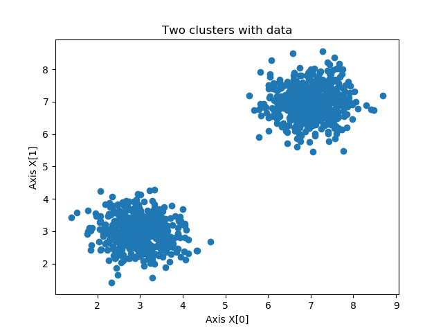
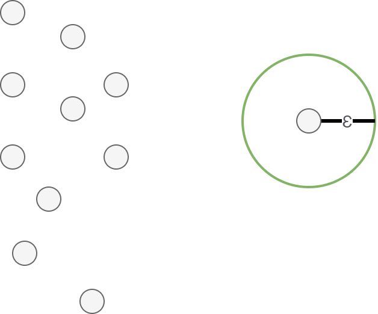
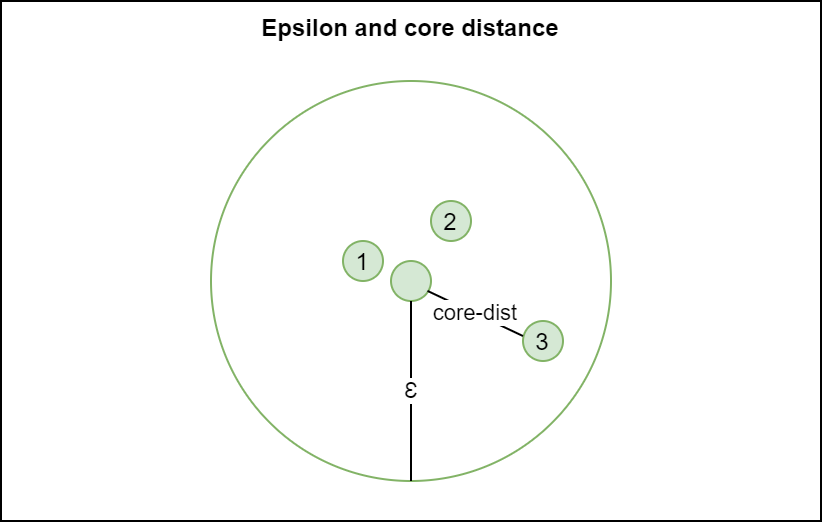
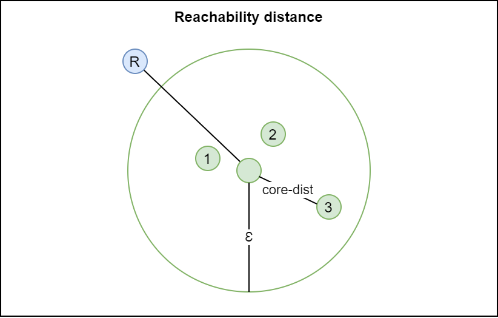
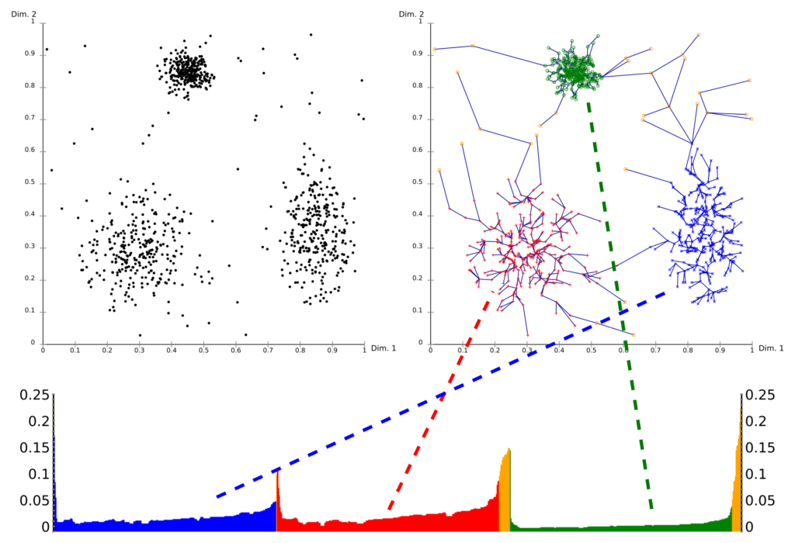
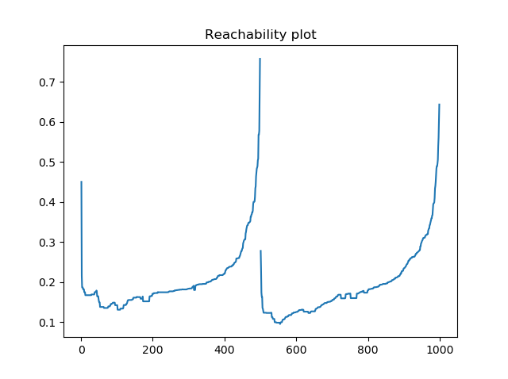

Unsupervised Machine Learning problems involve clustering, adding samples into groups based on some measure of similarity because no labeled training data is available. There are many algorithms for clustering available today. OPTICS, or _Ordering points to identify the clustering structure,_ is one of these algorithms. It is very similar to [DBSCAN](https://github.com/mobiletest2016/machine-learning-articles/blob/master/articles/performing-dbscan-clustering-with-python-and-scikit-learn.md), which we already covered in another article. In this article, we'll be looking at how to use OPTICS for clustering with Python.

It is structured as follows. Firstly, in order to provide you with the necessary context, we will briefly look at clustering. We will see what it is and how it works generally speaking. Then, we'll move on to the conceptual details of OPTICS. We will take a look at its components, the algorithm and its dendogram output called a _reachability plot_, and how to generate clusters from the diagram.

Once we know the ins and outs of the components and the algorithm, we move forward to a practical implementation using `OPTICS` in Scikit-learn's `sklearn.cluster` module. We will see how we can generate a dataset for which we can generate clusters, and will apply OPTICS to generate them. Using this step-by-step example, you will see how you can build an OPTICS based clustering model with Python.

In other words, after reading this article, you'll both know how OPTICS works and have the skills to apply it to your own Machine Learning problem.

Let's take a look! :)

* * *

\[toc\]

* * *

## What is clustering?

Before we start looking at how OPTICS works, it is worthwhile to consider clustering in general first. Because, well, what is clustering?

Let's take a look at a definition.

> **Cluster analysis** or **clustering** is the task of grouping a set of objects in such a way that objects in the same group (called a **cluster**) are more similar (in some sense) to each other than to those in other groups (clusters).
> 
> Wikipedia (2004)

In other words, suppose that we have a dataset like this one:



Intuitively, we can already see that there are two groups of data: one towards the bottom left part of the plot, another towards the upper right part of the plot.

But the machine doesn't know this yet. Rather, it just has an array with samples and their corresponding $X\[0\]$ and $X\[1\]$ positions, allowing us to generate the plot.

Clustering algorithms are designed to select points which look like each other (and hence have high similarity) and assign them to the same group. In other words, if such an algorithm is deployed for the dataset visualized above, the desired end goal is that it finds the samples in the left corner so similar with respect to the ones in the right corner that it assigns group 0 to the bottom left ones, and 1 to the upper right ones.

> **Unsupervised learning** is a type of machine learning that looks for previously undetected patterns in a data set with no pre-existing labels and with a minimum of human supervision.
> 
> Wikipedia (2003)

In doing so, they have no information about the actual groups; they just have the positions. This is why clustering algorithms are called _unsupervised_: no pre-existing labels are there, and yet they are capable of finding patterns allowing us to group the samples. Really nice!

OPTICS is such a clustering algorithm. Now that we know about clustering in general, let's take a look at how it works :)

* * *

## Introducing OPTICS: a relative of DBSCAN

**Ordering points to identify the clustering structure**, or OPTICS, is an algorithm for density based clustering. It's quite an old algorithm already, as it was presented in 1999. Nevertheless, it is still a good algorithm today - not everything that's no longer new and shiny must be discarded. It is similar to the [DBSCAN algorithm](https://github.com/mobiletest2016/machine-learning-articles/blob/master/articles/performing-dbscan-clustering-with-python-and-scikit-learn.md) for clustering, an extension even, and hence borrows some of its components as well as its algorithmic components.

Let's take a look at OPTICS here. Firstly, we'll take a look at OPTICS' components, followed by taking a look at its algorithm. The outcome of this algorithm is a [dendrogram](https://en.wikipedia.org/wiki/Dendrogram) (which shows the tree-like structure of the data by means of the _reachability distance_, which is one of the components that we will cover next). Once we know the output of the algorithm, we'll move on to interpreting this diagram, answering the questions how we can generate the clusters from this reachability plot.

### OPTICS components

Let's first take a look at the components of the OPTICS method.

#### Epsilon parameter

The first parameter is the epsilon parameter, or $\\epsilon$. It is a distance parameter in the sense that for any point $p$, the epsilon defines a distance around the point, like this:



#### MinPts parameter

Another parameter is $\\text{minPts}$, or the _minimum amount of points_ parameter. It is used together with epsilon because it illustrates how many points must be within the $\\epsilon$ distance of a point $p$ (including the point) in order to form a cluster.

#### Core points

When the point $p$ has $\\text{minPts}$ within its $\\epsilon$ distance including itself, we say that it is a core point and that it has sufficient amount of points in its $\\epsilon \\text{-neighborhood}$ for becoming one. A core point always represents a cluster. Possibly, it is still in formation, meaning that it will merge with other clusters later. We'll see how this happens when we take a look at the OPTICS algorithm.


#### Core distance

If you have read the article about [DBSCAN](https://github.com/mobiletest2016/machine-learning-articles/blob/master/articles/performing-dbscan-clustering-with-python-and-scikit-learn.md), you might have thought that many of these concepts are familiar. And in fact, they are! All concepts covered so far are also components of the DBSCAN algorithm. The next one, **core distance**, is however unique to OPTICS. Let's take a look.

Core distance is defined as follows. For any point $p$ with some epsilon $\\epsilon$ and hence an epsilon neighborhood $N\_\\epsilon(p)$:

\[mathjax\]

$$\\begin{equation}  
\\text{core-dist}\_{\\epsilon , \\text{minPts}}(p) =  
\\begin{cases}  
\\text{undefined}, & \\text{if}\\ |N\_{\\epsilon}(p)| < \\text{minPts} \\\\  
\\text{minPts-th smallest distance in } N\_{\\epsilon}(p), & \\text{otherwise} \\  
\\end{cases}  
\\end{equation}$$

In other words, the core distance is undefined if the number of points in the neighborhood (including $p$ itself) is lower than the minimum number of points required. This makes sense: if the point is no core point, it does not have a core distance.

In the other case, however, it's the $\\text{minPts-th smallest distance in } N\_{\\epsilon}(p)$. This is a very generic description of the point in the epsilon neighborhood located farthest away from the core point; in the case of $\\text{minPts} = 3$, it would be the 3rd smallest distance. For this reason, the core distance also describes the **minimum value for epsilon in order to keep the point a core point.** Using the distance, in the algorithm, we can keep merging clusters by (1) knowing that they are close to a core point and hence reachable thus part of the cluster, and (2) do so in an extensive way, growing the cluster time after time.

If this is a bit abstract to you, don't worry - we'll get back to this when describing the algorithm!



#### Reachability distance

While the core distance expresses the _minimum distance to keep a point a core point_, the **reachability distance** expresses the distance which is reachable from a core point.

It is expressed as follows in terms of an arbitrary point $o$ that is reached from a point $p$:

$$\\begin{equation}  
\\text{reach-dist}\_{\\epsilon , \\text{minPts}}(o, p) =  
\\begin{cases}  
\\text{undefined}, & \\text{if}\\ |N\_{\\epsilon}(p)| < \\text{minPts} \\\\  
\\text{max}(\\text{core-dist}\_{\\epsilon , \\text{minPts}}(p), dist(p,o)), & \\text{otherwise} \\  
\\end{cases}  
\\end{equation}$$

If $p$'s epsilon neighborhood has insufficient points, it is not a core point and hence cannot be used in reaching another point. This is similar to direct reachability and reachability in DBSCAN. For this reason, if this happens, the reachability distance is set to undefined.

If it is a core point, the reachability distance is either the core distance or the distance between $p$ and $o$, whichever is bigger. In other words, any point within either the core or reachability distance can be reached from that particular core point. This allows us to continue constructing clusters.

In the example below, the reachability distance from the core point to point 1 equals the core distance, because it is bigger. However, for a random point R, the reachability distance equals the _distance_ to that point, because that one is bigger than the core distance.



To summarize:

- Points that are part of local clusters can be identified by means of **core points**, using the concepts of epsilon and minimum number of points borrowed from the DBSCAN algorithm.
- After a local cluster has been identified, points in the vicinity must be identified for whether they are part of the cluster or not. For this reason we compute the **core distance**, the minimum distance from a point in order to remain a core point, and the **reachability distance** for another point, which expresses how far away the point is located from that point.

It's now time to look at the OPTICS algorithm itself. We shall see that from one core point forward, the algorithm will continue to search for cluster extensions by (1) identifying whether possible extensions are dense enough, by means of core distance, and (2) what their distance from the most dense parts of the cluster are, by ordering based on reachability distance.

### OPTICS algorithm

Let's now take a closer look at the OPTICS algorithm. We'll start our algorithm with an ordered list that is empty. We also maintain a list with processed points.

`ordered list = empty list`.

`processed points = empty list`

Here's how OPTICS works.

#### The main loop

The main part of the OPTICS algorithm is the **main loop** (Wikipedia, 2009). It describes the optics function:

- The function `OPTICS` can be called with a database (`DB`), and values for epsilon and minimum amount of points.
- For each point in the database, we first set reachability distance to `undefined`; we must compute it later.
- Then, for each unprocessed point, we perform the following:
    - We get the $\\epsilon \\text{-neighborhood}$ for the point.
    - We mark p as processed (we looked at it).
    - We push p to the ordered list (it's the first point we're looking at).
    - We now look at the core distance of p: if it's not undefined (i.e. if it is a core point), we will look further. If it is no core point, we move on to the next unprocessed point.
        - For core points, we initialize an empty priority queue i.e. a queue where the most important values are read from first. We then call the update function which we will discuss in the next section, which orders the priority queue based on reachability distance.
        - For the ordered priority queue (where we shall see that lowest reachability distance from the core point $p$ and hence the closest points are covered first), for each point, we get its neighbors. We then mark the point $q$ as processed and output it to the ordered list. If it's a core point as well, we can extend the priority queue as the clusters are close to each other and likely belong to the same bigger cluster. Extending the priority queue through update means that more points are added to the reachability-distance ordered Seeds list.
    - In other words, the algorithm keeps expanding on a particular point _until_ none of the unprocessed points have a core distance anymore (i.e. aren't core points). These are the outliers.

```
function OPTICS(DB, eps, MinPts) is
    for each point p of DB do
        p.reachability-distance = UNDEFINED
    for each unprocessed point p of DB do
        N = getNeighbors(p, eps)
        mark p as processed
        output p to the ordered list
        if core-distance(p, eps, MinPts) != UNDEFINED then
            Seeds = empty priority queue
            update(N, p, Seeds, eps, MinPts)
            for each next q in Seeds do
                N' = getNeighbors(q, eps)
                mark q as processed
                output q to the ordered list
                if core-distance(q, eps, MinPts) != UNDEFINED do
                    update(N', q, Seeds, eps, MinPts)
```

In the next sections, we will both describe the update function and how we can derive clusters from the output of the algorithm.

#### The update function

Above, at two places, a call is made to an `update` function which updates the Seeds queue, or in other words, the priority queue. Updating always happens because either the queue is empty (in other words, at the start of the algorithm, or when all close points have been covered and unprocessed points remain) or because new points have been found to extend the cluster with.

Updating happens in the following way:

- First of all, for the point $p$for which the neighborhood is passed along, the core distance is computed. In other words, we then know what the minimum distance is to keep the neighborhood a true neighborhood.
- For each point in the neighborhood, if not processed, we compute the reachability distance. If it's undefined (i.e. because the point has never been touched before) we set the reachability distance and insert it to the priority queue at precisely that distance.
- If it is already set, though, we update the queue and move it forward if the new reachability distance is lower than the old one.

In other words, during the extension, we continuously change the order in the priority queue, where points with lower reachability distance (and hence points closer to the cluster's center points) are added earlier.

```
function update(N, p, Seeds, eps, MinPts) is
    coredist = core-distance(p, eps, MinPts)
    for each o in N
        if o is not processed then
            new-reach-dist = max(coredist, dist(p,o))
            if o.reachability-distance == UNDEFINED then // o is not in Seeds
                o.reachability-distance = new-reach-dist
                Seeds.insert(o, new-reach-dist)
            else               // o in Seeds, check for improvement
                if new-reach-dist < o.reachability-distance then
                    o.reachability-distance = new-reach-dist
                    Seeds.move-up(o, new-reach-dist)
```

#### Combining the main loop and update function

Combining the main loop and the update function, we therefore see the following behavior emerge:

1. We keep iterating until each point has been processed.
2. For each unprocessed point, we attempt to process as many related points by taking a look at neighborhoods and extending these neighborhoods until no close points can be found anymore.
3. All distances are added to an ordered list. This ordered list hence, for each cluster, contains reachability distances in an ascending way. Outliers represent the cutoff points for determining the clusters. We will illustrate how this works by means of the reachability plot.

### Generating clusters from the reachability plot

The 'ordered list' we just covered above is displayed in the image below, a so-called **reachability plot**. In this plot, the reachability distances for each point are mapped. Clearly, from one point, we can see how the clusters have been extended in a reachability distance-based ascending ordering: for the blue cluster, the distance ascends until it moves towards a red one; then towards a green one.

The valleys therefore represent clusters and can be considered as being clusters, whereas the peaks represent the cutoff points, sometimes even with outliers in between.

Generating clusters from the reachability plot can therefore naïvely be performed by means of taking a cutoff value, where an arbitrary y value marks the change in cluster. If done so, the clustering algorithm works in a similar way to DBSCAN, because a threshold is taken just like DBSCAN does. However, more advanced methods exist as well (Wikipedia, 2009).



### OPTICS vs DBSCAN

OPTICS shares many components with DBSCAN. The epsilon value and minimum number of points are shared and, together with the concepts of core points and reachable points (by implication of the reachability distance) overlap. One of the key differences is the way that clusters are computed: rather than by picking a fixed value (DBSCAN), a different method can be applied with OPTICS.

For this reason, OPTICS is preferable over DBSCAN when your clusters have varying density. In other cases, the choice for algorithm does not really matter.

* * *

## Building an OPTICS model with Python and Scikit-learn

Now that we understand how OPTICS works, we can take a look at implementing it with Python and Scikit-learn.

With the following code, we can perform OPTICS based clustering on a random blob-like dataset. It works as follows.

- First of all, we make all the imports; `make_blobs` for generating the data, `OPTICS` for clustering, and NumPy and Matplotlib for numbers processing and visualization, respectively.
- Then, we specify a range of configuration options. We will generate 1000 samples in total around two centers, so that we'll get two blobs of data. We set epsilon and min\_samples to values that we derived during testing, as well as the method for clustering and the distance metric.
    - The values for `cluster_method` can be `xi` and `dbscan`. With `xi`, a cluster-specific method will be used for extracting clusters. With `dbscan`, a fixed threshold will be used for extracting the clusters from the recahability plot.
    - Many metrics can be specified under `metric`. The Minkowski distance is the default one. See all metrics [here](https://scikit-learn.org/stable/modules/generated/sklearn.cluster.OPTICS.html).
- We next generate data: two blobs of data, with `make_blobs`.
- Based on this data, we perform OPTICS-based clustering, with epsilon, minimum number of samples, cluster method and metric defined. We immediately fit the data so that the clusters are generated.
- We then print some information about the number of clusters and noisy samples, and finally generate a scatter plot.

```
from sklearn.datasets import make_blobs
from sklearn.cluster import OPTICS
import numpy as np
import matplotlib.pyplot as plt

# Configuration options
num_samples_total = 1000
cluster_centers = [(3,3), (7,7)]
num_classes = len(cluster_centers)
epsilon = 2.0
min_samples = 22
cluster_method = 'xi'
metric = 'minkowski'

# Generate data
X, y = make_blobs(n_samples = num_samples_total, centers = cluster_centers, n_features = num_classes, center_box=(0, 1), cluster_std = 0.5)

# Compute OPTICS
db = OPTICS(max_eps=epsilon, min_samples=min_samples, cluster_method=cluster_method, metric=metric).fit(X)
labels = db.labels_

no_clusters = len(np.unique(labels) )
no_noise = np.sum(np.array(labels) == -1, axis=0)

print('Estimated no. of clusters: %d' % no_clusters)
print('Estimated no. of noise points: %d' % no_noise)

# Generate scatter plot for training data
colors = list(map(lambda x: '#3b4cc0' if x == 1 else '#b40426', labels))
plt.scatter(X[:,0], X[:,1], c=colors, marker="o", picker=True)
plt.title(f'OPTICS clustering')
plt.xlabel('Axis X[0]')
plt.ylabel('Axis X[1]')
plt.show()
```

Running the algorithm yields the following scatter plot:


We can also easily generate the reachability plot:

```
# Generate reachability plot
reachability = db.reachability_[db.ordering_]
plt.plot(reachability)
plt.title('Reachability plot')
plt.show()
```



* * *

## Summary

In this article, we took a look at the OPTICS algorithm for clustering. Similar to the DBSCAN algorithm, but notably different, it can be used for clustering when the density of your clusters is different. This is something that DBSCAN cannot do so well.

First of all, we looked at what clustering is in the first place. We saw that clustering algorithms can be used to group samples in a dataset based on similarity. Then, we moved on to OPTICS, and studied its components. We saw that similar to DBSCAN, OPTICS also works with epsilon and a minimum number of points, which specifies a distance around a point and a minimum number of points (including the point itsefl) to be within this distance in order to classify the point as a core point. Core points represent dense points, and using the core distance and reachability distance, OPTICS is capable of grouping samples together.

We saw that OPTICS works by ordering based on reachability distance while expanding the clusters at the same time. The output of the OPTICS algorithm is therefore an ordered list of reachability distances, which by means of thresholds or different techniques we can split into clusters. This way, we're able of generating clusters for groups of data that have varying densities.

[Ask a question](https://web.archive.org/web/https://www.machinecurve.com/index.php/add-machine-learning-question/)

I hope that you have learned something from today's article. If you did, please feel free to leave a message in the comments section! 💬 Please also leave remarks and comments, or leave them through the **Ask Questions** button. Thank you for reading MachineCurve today and happy engineering! 😎

* * *

## References

Wikipedia. (2009, April 21). _OPTICS algorithm_. Wikipedia, the free encyclopedia. Retrieved December 9, 2020, from [https://en.wikipedia.org/wiki/OPTICS\_algorithm](https://en.wikipedia.org/wiki/OPTICS_algorithm)

Scikit-learn. (n.d.). _Sklearn.cluster.OPTICS — scikit-learn 0.23.2 documentation_. scikit-learn: machine learning in Python — scikit-learn 0.16.1 documentation. Retrieved December 9, 2020, from [https://scikit-learn.org/stable/modules/generated/sklearn.cluster.OPTICS.html](https://scikit-learn.org/stable/modules/generated/sklearn.cluster.OPTICS.html)

Wikipedia. (2004, May 21). _Cluster analysis_. Wikipedia, the free encyclopedia. Retrieved December 11, 2020, from [https://en.wikipedia.org/wiki/Cluster\_analysis](https://en.wikipedia.org/wiki/Cluster_analysis)

Wikipedia. (2003, May 25). _Unsupervised learning_. Wikipedia, the free encyclopedia. Retrieved December 11, 2020, from [https://en.wikipedia.org/wiki/Unsupervised\_learning](https://en.wikipedia.org/wiki/Unsupervised_learning)
