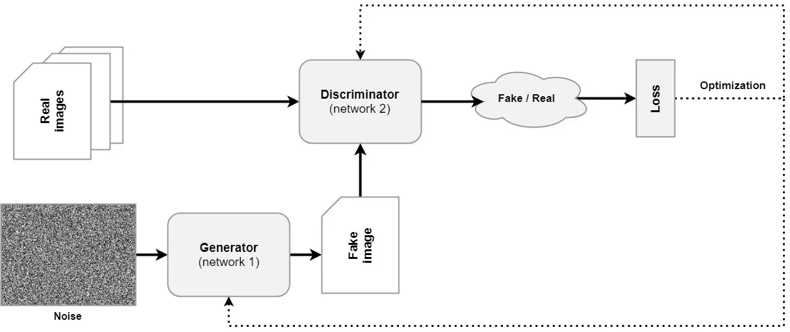
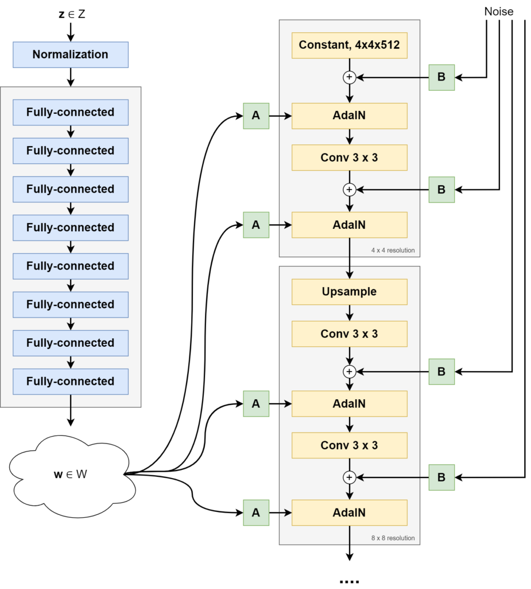
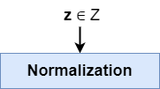
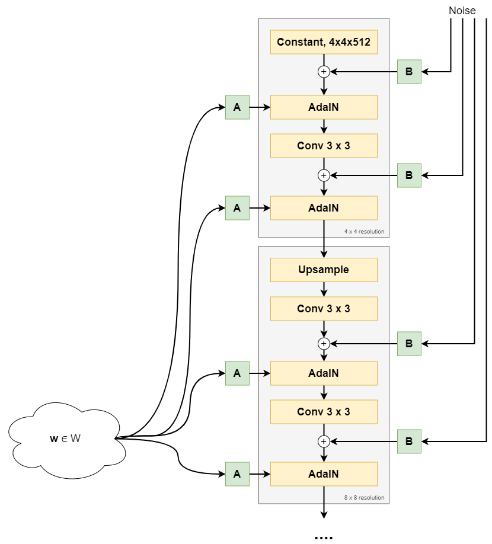
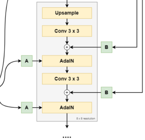

Generative Adversarial Networks have been the go-to machine learning technique for generative content in the past few years. Seemingly magically converting random inputs into highly detailed outputs, they have found applications in generating images, generating music, and even generating medication.

**StyleGAN** is a GAN type that really moved the state-of-the-art in GANs forward. When the paper introducing StyleGAN, "[A style-based generator architecture for generative adversarial networks](https://arxiv.org/abs/1812.04948)" by Karras et al. (2018) appeared, GANs required heavy regularization and were not able to produce such stunning results as they are known for today.

In this article, we'll dive deep into the StyleGAN architecture. Firstly, we introduce the high-level architecture of a classic or vanilla GAN, so that we can subsequently introduce StyleGAN's high-level architecture and compare both. This already sheds some light on high-level differences and how StyleGAN is radically different compared to approaches that were prominent at the time. Then, we'll take a look at each individual StyleGAN component and discuss it in detail. This way, you'll also learn about what's beyond the high level details, and understand the impact of each individual component.

Are you ready? Let's go! 😎

* * *

\[toc\]

* * *

## Classic GANs, a recap

Before we dive into StyleGAN, let's take a look at the high-level architecture of a classic Generative Adversarial Network first. As you can see, it is composed of two main components - a **generator**, which generates fake images, and a **dicriminator**, which has the task of correctly distinguishing between fake and real images.

The discriminator is trained with real images, which have a specific statistical distribution - the _data distribution_. The generator takes a sample from some distribution - also called the _latent_ distribution because after training, it is structured in such a way that it mimics the data distribution - and converts it into a fake image.

Both real and fake images are fed to the discriminator during training, after which a loss value is computed. Both models are optimized given this loss value. The discriminator will face a hard time detecting fake from real images after a while, because the generator will be able to generate progressively more accurate outputs. The same is also true; the generator will become better and better, because it will find idiosyncrasies in the data that it will exploit.

In other words, the scenario can be viewed as a counterfeiter vs the police situation, where the counterfeiter becomes progressively better, until the discriminator may not even be capable anymore of detecting fake images when compared to real ones. That's the moment when the generator is ready for the real world: its latent distribution then almost equals the data distribution and it's capable of generating real images on its own.

### Problems with classic Generative Adversarial Networks

While quite a bit of a breakthrough when the first GAN paper appeared in 2014. In "[Generative adversarial networks](https://arxiv.org/abs/1406.2661)", Goodfellow et al. (2014) introduced the training procedure that was discussed above. Soon, however, it became clear that training a classic GAN results in a few issues - as becomes clear from Karras et al. (2018) as well. Here's two of the main issues solved by StyleGAN:

- **Generators operate as black boxes.** Latent spaces of classic GANs were poorly understood at the time of writing the Karras et al. paper.
- **GANs must be heavily regularized.** The game played between the generator and discriminator is a fine one - and it proved to be very easy that one of the two overpowers the other early in the training process. When this happens, the other cannot recover, and expectations never materialize. Heavy regularization must be applied to solve this issue.
- **There is little control over image synthesis.** A great latent space is structured according to some kind of order. In other words, if I were to pick a sample and move a bit, the generated image should at least resemble the image of my picked sample. And changes should be comparable across [generators](https://github.com/mobiletest2016/machine-learning-articles/blob/master/articles/an-introduction-to-dcgans.md) of [different kinds](https://github.com/mobiletest2016/machine-learning-articles/blob/master/articles/conditional-gans-cgans-explained.md). But they aren't.

Let's now take a look at StyleGAN. Rather than building a whole image from a latent vector, it uses the latent space to _control_ the synthesis process. In other words, rather than providing the foundation for generation, StyleGAN provides the steering wheel with which it's possible to control what can be generated. And more smartly, it separates noisy and stochastic details (such as the generation of where hairs are located) from more fixed components (such as whether a person in a generated image is wearing glasses). Let's take a look at StyleGAN at a high level now.

* * *

## StyleGAN, a high-level overview

The figure below shows you the high-level architecture of StyleGAN, as found in Karras et al. (2018).

There are two vertical blocks involved:

- The **mapping network**, called \[latex\]f\[/latex\], is visible on the left. It maps a (normalized) latent vector \[latex\]\\textbf{z} \\in Z\[/latex\] into another vector \[latex\]\\textbf{w}\[/latex\] from an intermediate latent space, called \[latex\]W\[/latex\]. This mapping network is a simple set of fully-connected feedforward layers.
- The **synthesis network**, called \[latex\]g\[/latex\] and visible on the right, uses \[latex\]\\textbf{w}\[/latex\] to generate a "style" that controls the image synthesis process. It begins with a Constant, \[latex\]4 \\times 4 \\times 512\[/latex\] dimensional vector. Scaled noise samples (\[latex\]\\text{B}\[/latex\]) are generated and added to this Constant tensor. Subsequently, the style (\[latex\]\\text{A}\[/latex\]) is added via Adaptive Instance Normalization (AdaIN) operations, after which a convolution operation is applied. This is followed by another noise addition and AdaIN-based styling operation. We then arrive at an image at a 4x4 pixel resolution. In the next block, the image is upsampled, and the same is performed again, arriving at an 8x8 pixel resolution. This is repeated until the image is 1024x1024 pixels.

Clearly, we can already see a big difference between classic GANs and StyleGAN. The latent vector \[latex\]\\textbf{z}\[/latex\] is no longer used directly in the image synthesis process. Interestingly, and even surprising the authors of the StyleGAN paper, starting with a Constant tensor was possible and even produced good results.

Rather than being the foundation of the image synthesis process, \[latex\]\\textbf{z}\[/latex\] is now used to generate styles that _control_ the synthesis process.

If you do not understand everything that was written above, don't worry. It's an extreme summarization and only highlights what happens at a high level. If you want to dive into StyleGAN in depth, let's now spend some time looking at the details. If, however, you're having trouble understanding basic GAN concepts such as a _latent space_ or _latent vector_, it may be best to read the [introduction to GANs article](https://github.com/mobiletest2016/machine-learning-articles/blob/master/articles/generative-adversarial-networks-a-gentle-introduction.md) first.

StyleGAN architecture. Source: Karras et al. (2018)

* * *

## StyleGAN in more detail

We will now look at the mapping and synthesis networks and their individual components in more detail. This allows you to get a detailed understanding of how StyleGAN works.

### The mapping network f

We start with the mapping network, also called \[latex\]f\[/latex\]. It takes a latent vector \[latex\]\\textbf{z}\[/latex\] sampled from the original latent distribution and performs a learned mapping to an intermediate latent vector, \[latex\]\\textbf{w}\[/latex\]. This mapping is performed with a stack of fully-connected layers in a neural network.

#### Sampling latent vectors z

Before any forward pass - whether during training or inference - the latent vector \[latex\]\\textbf{z}\[/latex\] is **sampled from the original latent distribution**.

A standard normal distribution is used for mapping the latent vectors \[latex\]\\textbf{z}\[/latex\] in StyleGAN. This is a common distribution to sample from when it comes to GANs.

According to the paper, its latent space is 512-dimensional (Karras et al., 2018).

#### Latent vector normalization

Neural networks are notorious for suffering from poor performance when inputs aren't normalized or, even better, standardized. By means of a **normalization** **step**, the vector can be made ready for input. [Min-max normalization](https://github.com/mobiletest2016/machine-learning-articles/blob/master/articles/how-to-normalize-or-standardize-a-dataset-in-python.md) is one of the options. [Standardization](https://github.com/mobiletest2016/machine-learning-articles/blob/master/articles/how-to-normalize-or-standardize-a-dataset-in-python.md) is too.

If you use a _standard normal_ _distribution_ in your StyleGAN implementation, it's questionable whether you'll need this normalization step - as your inputs will already have zero mean and unit variance. Still, it doesn't hurt to keep it in.

#### The stack of fully-connected feedforward layers to generate intermediate latent vector w

Your (potentially normalized) sampled latent vector \[latex\]\\textbf{z}\[/latex\] is now ready for input. **It's fed to the actual _mapping network_**, which is a neural network with 8 trainable [fully connected (or Dense) layers](https://github.com/mobiletest2016/machine-learning-articles/blob/master/articles/how-to-create-a-basic-mlp-classifier-with-the-keras-sequential-api.md) a.k.a. a Multilayer Perceptron or MLP. It produces another vector, an intermediate latent vector \[latex\]\\textbf{w}\[/latex\]. This is the latent vector that will be used by the synthesis network for generating the output image.

The mapping is nonlinear, meaning that each fully-connected layer has an activation function, typically a ReLU or LeakyReLU one.

Intermediate latent vector w is also 512-dimensional (Karras et al., 2018).

Now, the question you likely ask, **why do we need such a mapping in the first place?**

For this, we'll have to take a look at a concept called _entanglement_. When something is entangled, it....

> \[has become\] twisted together with or caught in.
> 
> Google, when searching for 'entangled definition'

If a latent space were _disentangled_, it would contain of linear subspaces (Karras et al., 2018). In normal English, this means that there are parts of the dimensions of the latent space that control certain aspects of the image.

For example, if our 512-dimensional latent space \[latex\]Z\[/latex\] would be fully disentangled and were to be part of a GAN trained on faces, dimension 1 would control glasses, dimension 2 hair, dimension 3 face shape, and so on. By simply moving in one dimension, one would have full control over a minor part, and generating images of choice would be really easy.

Unfortunately, GANs usually don't have disentangled spaces. We saw it before - classic GANs offer the machine learning engineer little control over its latent space. This is a simpler way of writing that latent spaces are entangled.

The authors propose that having a mapping network convert the originally sampled latent vector \[latex\]\\textbf{z}\[/latex\] into an intermediate vector \[latex\]\\textbf{w}\[/latex\] from a learned and intermediate latent distribution \[latex\]W\[/latex\] ensures that sampling for the synthesis process is not done from a _fixed distribution_ - such a the standard normal distribution with all its characteristics and ideosyncrasies. Rather, it is performed from a _learned distribution_. This learned distribution is learned in such a way, that it is as disentangled as possible, which originates from pressure from the Generator because it produces better outcomes doing so (Karras et al., 2018).

Indeed, having such a network improves all metrics that describe distribution entanglement and the eventual synthesis performed from the learned latent distribution compared with the data distribution from the real images. As 8 layers in the mapping network produced the best result, 8 layers are chosen (Karras et al., 2018).

#### So, in other words

- A latent vector \[latex\]\\textbf{z}\[/latex\] is sampled from a chosen distribution, usually a standard normal distribution, and is 512-dimensional.
- It's fed through a 8-layer nonlinear MLP, producing a 512-dimensional intermediate latent vector \[latex\]\\textbf{w}\[/latex\] that will be used by the synthesis network to control the styles of the image being generated.
- The nonlinear learned mapping is necessary to reduce entanglement of the latent space used by the synthesis network (generator). This allows StyleGAN to significantly improve control over the latent space as well as to produce better results.

### The synthesis network g

Now that we understand why the _mapping network_ produces an intermediate latent vector, and how it does that, it's time to see how it's used for generating the output image. In other words, let's take a look at the **synthesis network**. This network is also called \[latex\]g\[/latex\].

A high-level overview of the first part of the synthesis network, up to and including the 8x8 resolution.

### Synthesis blocks

In the image above, you can see that StyleGAN's synthesis network utilizes **synthesis blocks** - which progressively build the image by upsampling the image resolution from 4x4, to 8x8, to 16x16, ... eventually to 1024x1024 pixels.

Core components of each StyleGAN synthesis blocks are:

- **Upsampling (except for the first synthesis block).** The output of the previous synthesis block is made bigger so that it can subsequently be processed.
- **Convolution layer.**
- **Adaptive Instance Normalization (AdaIN).**
- **Style vectors (A) and noise vectors (B)**.

We'll take a look at each individual component in more detail next. You will then discover what each component does in StyleGAN. Let's first start with the beginning point of the first synthesis block: the `Constant` Tensor that the image is built from!

#### The Constant starting point in the first synthesis block

Yes, you heard it correctly - the starting point of StyleGAN's synthesis block is a **constant value**.

This is a complete difference in design compared to previous GANs, which all started with the sample drawn from latent space.

This input is learned, and initialized as ones (Karras et al., 2018). In other words, after each epoch, the constant changes slightly - but _within each epoch_, it remains the same.

#### Styles and noise, two important synthesis elements

The Constant Tensor is now processed by the rest of the synthesis block. Although we'll discuss each component in the block in more detail now, it's important to know that there are two high-level concepts that will come back:

- **Styles.** The Constant is like the 'back bone' being used for any kind of synthesis. Like a painter, which has a specific style, the _high-level components_ in a generated image are adapted by what is known as a 'style'.
- **Noise.** If you'd feed the same Constant Tensor to the synthesis block having the same styles, you'd get precisely the same image over and over again. This is not realistic: you will read about e.g. wind having an impact on how someone is pictured. In other words, there is randomness involved in generating a picture, and this is achieved through noise.

#### How noise is generated and added

The first thing that happens with the Constant value is that **_noise_** is added to it.

The need for noise can be best explained when one notes hair in a picture.

Suppose that the picture below was generated by StyleGAN. It wasn't, but suppose it is. You can see that it contains a variety of components which all have different granularity:

- The **lower-granularity components,** such as the head (and specifically its position), the torso, and so forth. For each instance of class _human_, they are relatively equal.
- The **higher-granularity components**, instead - like the hair - differ _between people_ but also _between pictures of the same person_. The position of one's hair in a picture is dependent on relatively deterministic choices - like one's hair style - but also on seemingly random impacts, like wind.

Noise is what determines these higher-granularity components. The position of the woman's hair in the picture below? If it were generated by a StyleGAN, it wouldn't have been driven by the styles you will hear about next, but by randomness - and thus noise.

The noise Tensor is drawn from a Gaussian distribution (Karras et al., 2018).

#### How w is converted into styles

Now that we know how noise adds randomness to a generated picture, it's time to take a look at _**styles**_ and how they control the image synthesis process.

This starts with the latent vector **w** generated by the mapping network.

This vector is fed to what is called **A** in the overview below - the learned _affine transformations_ part of the neural network.

> In [Euclidean geometry](https://en.wikipedia.org/wiki/Euclidean_geometry), an **affine transformation**, or an **affinity** (from the Latin, _affinis_, "connected with"), is a [geometric transformation](https://en.wikipedia.org/wiki/Geometric_transformation) that preserves [lines](https://en.wikipedia.org/wiki/Line_(geometry)) and [parallelism](https://en.wikipedia.org/wiki/Parallelism_(geometry)) (but not necessarily [distances](https://en.wikipedia.org/wiki/Euclidean_distance) and [angles](https://en.wikipedia.org/wiki/Angle)).
> 
> https://en.wikipedia.org/wiki/Affine\_transformation

If, for example we would have the vector \[latex\]\\begin{bmatrix}2 \\\\ 3 \\end{bmatrix}\[/latex\], an affine transform would be able to produce vector \[latex\]\\begin{bmatrix}4 \\\\ 6 \\end{bmatrix}\[/latex\] (a scale 2 with the same _lines_ in space but only longer, and hence no _distances_ preserved).

Conceptually, this means that affine transforms can _change the image components without overhauling the image_, because the affine transformation outputs must be "connected with" the input, being the latent vector **w**.

The input vector **w** is transformed into style \[latex\]\\textbf{y}\[/latex\] where \[latex\]\\textbf{y} = (\\textbf{y}\_s, \\textbf{y}\_b)\[/latex\]. These are the _scale_ and _bias_ components of the style, respectively (and you will learn below how they are used). They have the same shape as the synthesis Tensor they will control.

The affine transformations are learned during training and hence are the components that can be used to _control_ the image synthesis process for the lower-granularity components, such as the hair style, skin color, and so forth - whereas, remember, the randomness is used to control the _position_ of for example the indivudial hairs.

You should now be able to explain how _styles_ and _randomness_ allows us to generate a unique image. Let's now take a more precise look at _how_ styles can control image generation.

#### Adaptive Instance Normalization based style addition

The **how** related to style addition is a vector addition of two vectors:

- The **noise-added Constant Tensor** (in the first, 4x4 pixels synthesis block) or the **produced Tensor so far** (for the other synthesis blocks).
- The **affine transformation**, but then **Adaptive Instance Normalization** (AdaIN) normalized.

This is what AdaIN looks like:

Here, \[latex\]\\textbf{x}\_i\[/latex\] is the \[latex\]i\[/latex\]th feature map from the input Tensor (i.e., the \[latex\]i\[/latex\]th element from the vector), and \[latex\]\\textbf{y}\[/latex\] is the affine transformation generated style.

You can see in the middle part that the feature map is first normalized (or rather, [standardized](https://github.com/mobiletest2016/machine-learning-articles/blob/master/articles/how-to-normalize-or-standardize-a-dataset-in-python.md)) to zero mean, unit variance - and subsequently _scaled_ by the \[latex\]i\[/latex\]th element from the style's scale component, and the \[latex\]i\[/latex\]th bias component is added subsequently.

In other words, AdaIN ensures that the generated _styles_ can **control** the (normalized) synthesis input by changing scale and/or bias. This is how styles control the image synthesis process on the noise-added input Tensor!

#### The second and higher synthesis blocks - upsampling, then control

The text above primarily focused on the first synthesis block - the output of which is a 4 by 4 pixels image. As you can imagine, this is barely enough to be impressed with :)

Subsequent synthesis blocks (8x8, 16x16, up to 1024x1024 pixels) work slightly differently compared to the first synthesis block:

- First, **bilinear upsampling** is applied to upsample the image, after which a **[2d Convolutional layer with 3x3 kernel](https://github.com/mobiletest2016/machine-learning-articles/blob/master/articles/how-to-use-conv2d-with-keras.md)** is used for learned downsampling.
- Subsequently, **noise is added**, after which an **AdaIn** operation for style control is performed.
- Then, another **downsampling** is operated with a similar Convolutional layer, after which another noise-and-style-control is performed.

For the first layer, this yields an 8x8 pixels image, and so forth.

#### The end result

The end result of StyleGAN when trained on faces is really cool! :)

Source: Karras et al. (2018) and [https://github.com/NVlabs/stylegan/blob/master/stylegan-teaser.png](https://github.com/NVlabs/stylegan/blob/master/stylegan-teaser.png), [CC Attribution-NonCommercial 4.0 International license](https://creativecommons.org/licenses/by-nc/4.0/).

* * *

## References

Karras, T., Laine, S., & Aila, T. (2018). [A style-based generator architecture for generative adversarial networks.](https://arxiv.org/abs/1812.04948) _arXiv preprint arXiv:1812.04948_.

Goodfellow, I. J., Pouget-Abadie, J., Mirza, M., Xu, B., Warde-Farley, D., Ozair, S., … & Bengio, Y. (2014). [Generative adversarial networks.](https://arxiv.org/abs/1406.2661) _arXiv preprint arXiv:1406.2661_.
