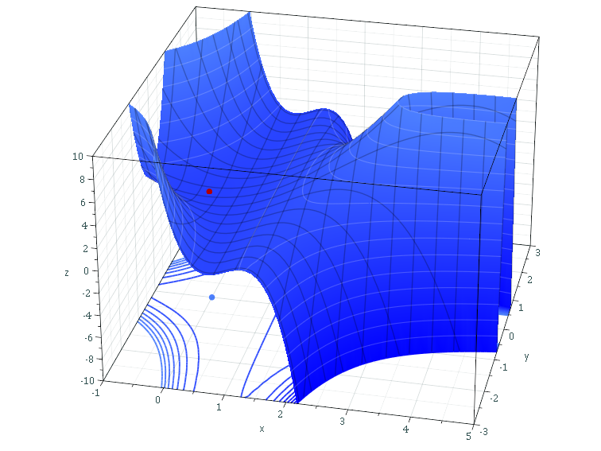
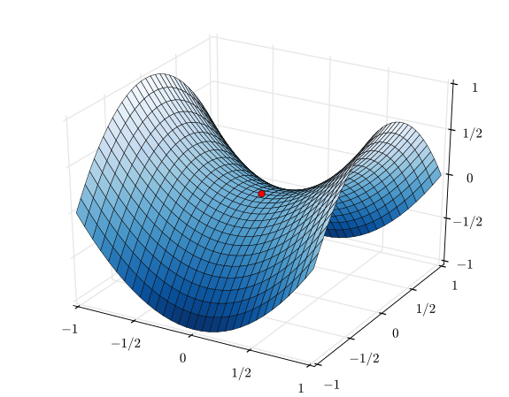
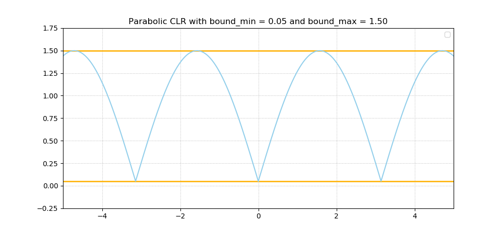
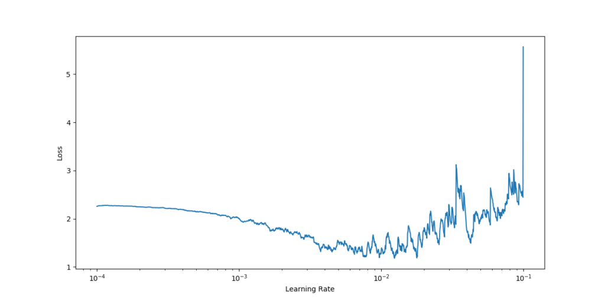
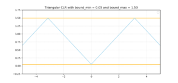

At a high level, training supervised machine learning models involves a few easy steps: feeding data to your model, computing loss based on the differences between predictions and ground truth, and using loss to improve the model with an optimizer.

However, practice isn't so simple. For example, it's possible to choose multiple optimizers - ranging from traditional [Stochastic Gradient Descent](https://github.com/mobiletest2016/machine-learning-articles/blob/master/articles/gradient-descent-and-its-variants.md) to [adaptive optimizers](https://github.com/mobiletest2016/machine-learning-articles/blob/master/articles/extensions-to-gradient-descent-from-momentum-to-adabound.md), which are also very common today.

Say that you settle for the first - Stochastic Gradient Descent (SGD). Likely, in your deep learning framework, you'll see that the _learning rate_ is a parameter that can be configured, with a default value that is preconfigured most of the times.

Now, what is this learning rate? Why do we need them? And more importantly - what value do we choose? We'll start our blog by taking a brief look at these questions, refering to other blog posts that we wrote for more details.

We do so because the core of this blog post is the concept of a **Cyclical Learning Rate**, introduced by Smith (2017). In his research, Smith showed that such learning rates can perform much better compared to classic ones, such as SGD or even adaptive optimizers. That is, they can reach lower loss in much shorter time. That would be great for optimization, which is often a long wait - especially when your models are large.

But why does this work? And what types of Cyclical Learning Rates (CLRs) are out there? How do you configure Cyclical Learning Rates? Many new questions - which are all valid, and will be answered in this blog post :) Beyond the first part, focusing on learning rates at a high level, we'll focus on these things:

1. Introducing the concept of a Cyclical Learning Rate and why they can improve the performance of your machine learning model.
2. Show you that the learning rate cycles of CLRs can be linear, parabolic and sinusoidal.
3. How to configure CLRs once you choose to use them.
4. Building a real-world Cyclical Learning Rate example with Keras.

Now, that's quite some work we'll do today! Fear not, I'll make sure to guide you through the process as smoothly as possible, explaining every choice I make as we go.

Are you ready? Let's go! 😎

* * *

\[toc\]

* * *

## What are learning rates and why do we need them?

The first thing we need to do before we can introduce Cyclical Learning Rates - and why they are useful - is to introduce you to the concept of a learning rate.

If you already know what learning rates are, I suggest you skip this section. However, if you're interested in sharpening your understanding, then make sure to read on :)

Training a supervised machine learning model, as we already illustrated above, can be captured in a [few steps](https://github.com/mobiletest2016/machine-learning-articles/blob/master/articles/about-loss-and-loss-functions.md/#the-high-level-supervised-learning-process) that are easy in theory. One of these steps is computing the _gradient_, i.e. the estimated change, that can be used to change the model - doing so would likely improve it in the next iteration.

The backpropagation, with its "change with respect to layer X (...) with respect to the loss value" logic, is used to compute the gradient for a particular layer. Upstream gradients are often more complex to compute, with problems like the [vanishing gradients problem](https://github.com/mobiletest2016/machine-learning-articles/blob/master/articles/random-initialization-vanishing-and-exploding-gradients.md) as a result.

However, we're not here today to complain about issues with gradients :) Rather, we're here to see what learning rates are.

For this, we'll have to stick to the gradient, but we'll also require a little bit of imagination. Suppose that you are walking down a mountain, and your goal is to end at the _valley_; that is, the _global minimum_ of that particular relief.

Such a mountainous scenario can be represented by the mathematical plot below:



_Source: [Sam Derbyshire](https://en.wikipedia.org/wiki/User:Sam_Derbyshire "wikipedia:User:Sam Derbyshire") at [Wikipedia](https://en.wikipedia.org/wiki/ "wikipedia:") [CC BY-SA 3.0](http://creativecommons.org/licenses/by-sa/3.0/ "Creative Commons Attribution-Share Alike 3.0"), [Link](https://commons.wikimedia.org/w/index.php?curid=48728184)_

However, it must be clear that the _valley_ depicted here - i.e., the _red dot_ - is only a local valley. As you can see, by walking further, you can descend even further. However, let's now assume that you're in the top left part while descending, and with the aim to arrive at that red dot.

What do you do?

You set steps. Steps in the direction of the red dot. This is the role of the backpropagation algorithm: computing the gradient (i.e. the step) that can be taken towards the red are.

But how large should these steps be? That's a critical question as well. If your steps are too small, it will take an eternity before you arrive at the red dot. If they are too large, you may never arrive at all, because you keep overstepping the dot, left and right, back and forth.

This is where the learning rate enters the picture. With the learning rate, you control the step size. As you might guess by now, a high-level description of the formula to alter the weights of your machine learning model for every iteration is this:

_Weight update = Previous weights - Learning rate x Gradient_

By setting the learning rate to small values (e.g. $0.001$), you ensure that steps are small enough in order to converge towards the minimum and arrive at a position close to a minimum. If you set it too large (e.g. $0.5$), you might overshoot the minimum every time. However, it would speed up learning in the beginning, while you're still at the top of the mountain and can afford to take large steps. This is precisely the problem [why fixed learning rates aren't a good idea](https://github.com/mobiletest2016/machine-learning-articles/blob/master/articles/problems-with-fixed-and-decaying-learning-rates.md), and why you need to be careful with decaying learning rates as well.

* * *

## Introducing Cyclical Learning Rates

In his paper, Smith (2017) argues that "increasing the learning rate might have a short term negative effect and yet achieve a longer term beneficial effect".

But why is this the case?

Let's take a look at a nasty phenomenon that you can encounter when training machine learning models - saddle points.

### Saddle points are problematic for machine learning success

Wikipedia (2004) defines a saddle point as follows:

> In mathematics, a **saddle point** or **minimax point** is a point on the surface of the graph of a function where the slopes (derivatives) in orthogonal directions are all zero (a critical point), but which is not a local extremum of the function.
> 
> [Wikipedia (2004)](https://en.wikipedia.org/wiki/Saddle_point)

Indeed, it's a point where the gradient is zero - while it's no minimum. Such points often look like this and have an upward direction from the front and towards the right, while having a downward one from the left and towards the end:

- []
    
- []
    

_Two landscapes with saddle points. On the left, it's most visible - while on the right, it's in between two maxima. | Left: By [Nicoguaro](//commons.wikimedia.org/wiki/User:Nicoguaro "User:Nicoguaro") - Own work, [CC BY 3.0](https://creativecommons.org/licenses/by/3.0 "Creative Commons Attribution 3.0"), [Link](https://commons.wikimedia.org/w/index.php?curid=20570051) | Right: By [Nicoguaro](//commons.wikimedia.org/wiki/User:Nicoguaro "User:Nicoguaro") - Own work, [CC BY 4.0](https://creativecommons.org/licenses/by/4.0 "Creative Commons Attribution 4.0"), [Link](https://commons.wikimedia.org/w/index.php?curid=48854962)_

As noted above, saddle points are infamous for getting in the way of adequately performing machine learning models.

This occurs because _the gradient is zero, while they don't represent a minimum_.

As you know, during optimization, a model will compute the gradient given some loss and will steer your weights into the direction so that the gradient becomes zero.

As minimums have zero gradients, this is good - except for the fact that saddle points have them too. Once your weights are pushed in a direction where a saddle point ensures that you find a gradient of zero, your model will stop improve.

This is bad.

What's more, it may be that saddle points are even worse than finding local minima, where gradients are also zero and which are thus also a problem when your goal is to find the global minimum (Dauphin et al., 2015).

Hence, we need a way out of there. Various adaptations to learning rates, such as momentum, are of help here - as the rolling momentum, for example, may ensure that your updates "shoot" further than the saddle point, ensuring that your model will continue improving.

### Cyclical Learning Rates against saddle points

Precisely this problem is why Smith (2017) argued that "increasing the learning rate might have a short term negative effect and yet achieve a longer term beneficial effect".

From everything above, we can observe that when the learning rate gets too small around local minima and saddle points, we can't escape them anymore.

However, if learning rates are too large globally, then we will no longer find the global minimum.

Now, if we increase the learning rate, the effect on the short term may be negative - a higher loss value, for example because loss moves up the mountain - while the long-term effect is positive, as you escape the saddle points and minimas.

However, we don't want the learning rate to increase all the time: over time, you should likely be near your global minimum, and with increasing learning rate you would overstep the minimum time after time.

Here, the concept of a **Cyclical Learning Rate** or CLR may help. Introduced by Smith (2017), a CLR simply means that your learning rate moves back and forth between a low and a high learning rate. Thus: when it's high, you can escape saddle points and local minima, while stepping close to your global minimum when it's low. Or, indeed, experience a short term negative effect and yet achieve a longer term beneficial one.

Let's now take a look at some of these Cyclical Learning Rates.

### Forms of Cyclical Learning Rates: linear, parabolic and sinusoidal CLRs

In his paper, Smith (2017) describes three types of CLRs. The first is a linear one, also known as a triangular one, which looks as follows:

[]

As you can see, the learning rate moves back and forth between a low one ($bound\_{min} = 0.05$) and quite a high one ($bound\_{max} = 1.50$). The same is true for the next one, except that movement is _smooth_ here - it's a sinusoidal one:

[]

A third one reported in Smith (2017) is neither linear nor sinusoidal, but rather parabolic in nature:

[]

All three of them share the characteristic that the learning rate moves back and forth between a _minimum_ and a _maximum_ bound, ensuring that saddle points and local minima can be escaped while your training process can truly reach global ones. Experiments with those various forms showed that results were equivalent. For the sake of simplicity, Smith (2017) thus chose to use triangular learning rates in the rest of his work.

* * *

### Decaying the bounds over time

In some cases, it's desirable to let the bounds decay over time (Smith, 2017). This ensures that the learning varies less and less once the epochs pass - that is, presumably, when you reach the global minimum. Below, you'll see an example for parabolic-like CLR with exponential bound decay. Another approach lets the learning rates decay in a triangular fashion, i.e. by cutting them in half after every iteration.

[]

## Approach to using CLRs in your neural network

Let's now take a look at **a step-wise approach** for using and configuring Cyclical Learning Rates in your neural network.

Globally, configuration goes as follows:

1. You choose to use CLRs in your neural network.
2. You choose a style of cycling (i.e., linear, parabolic or sinusoidal) and whether your bounds decay over time.
3. You set the _cycle length_; that is, the length of the phase of your cycle;
4. You set the _minimum bound_ and the _maximum bound_, and possibly, your _decay policy_.

Above, we already saw that triangular (a.k.a. linear) cycling often works best. Let's now take a look at finding cycle lengths and minimum and maximum bounds.

### How to find cycle length for Cyclical Learning Rates?

The length of a cycle and the input parameter stepsize can be easily computed from the number of iterations in an epoch. An epoch is calculated by dividing the number of training images by the batchsize used. For example, CIFAR-10 has 50, 000 training images and the batchsize is 100 so an epoch = 50, 000/100 = 500 iterations. The final accuracy results are actually quite robust to cycle length but experiments show that it often is good to set stepsize equal to 2 − 10 times the number of iterations in an epoch. For example, setting stepsize = 8 ∗ epoch with the CIFAR-10 training run (as shown in Figure 1) only gives slightly better results than setting stepsize = 2 ∗ epoch.

According to Smith (2017), choosing a cycle length for CLRs is pretty easy:

**You compute the number of iterations in an epoch and set the cycle length - i.e. the `stepsize` input parameter - to 2 to 10 times this value.**

As we know, one epoch is the full forward pass of all the samples in your training set. So, for example, if your training set has 60.000 images, and you use a batch size of 250, your step size must be configured to be within $2 \* \\frac{60.000}{250} = 2 \* 240 = 480$ and $10 \* \\frac{60.000}{250} = 10 \* 240 = 2400$ .

### How to find minimum and maximum bounds for Cyclical Learning Rates?

Another question that is raised often is _how to find the minimum and the maximum bounds_ for Cyclical Learning Rates.

Smith (2017) also provides an answer to this question.

This one's easy too: **we use the Learning Rate Range Test**.

Indeed, that test [which we already encountered](https://github.com/mobiletest2016/machine-learning-articles/blob/master/articles/finding-optimal-learning-rates-with-the-learning-rate-range-test.md) when estimating proper starting LRs for learning rate decay.

This time, we'll use it a little bit differently, though. With the Learning Rate Range Test, we let the model run for several epochs, while the learning rate increases over time. For every learning rate, we get the loss value - and this information tells us something about the bounds we need to set.

For the linear policy, the mechanism is simple (Smith, 2017):

- The base learning rate is set to the minimum value that we want to test for;
- The max learning rate to the maximum value that we want to test for;
- The `stepsize` is equaled to the `number of iterations` in the range test.
- When the loss value starts to decrease rapidly (or accuracy starts to increase rapidly), note the value for the learning rate.
- Do the same when the improvement starts to flatten, i.e. when a plateau occurs.

Use these values for the `min_bound` and `max_bound` in your Cyclical Learning Rate. This is a good value, as this range captures the biggest improvement and hence the optimum learning rate is likely somewhere within the bounds - and thus encountered during the cycles (Smith, 2017).

* * *

## A Keras example for Cyclical Learning Rates

Let's now take a look at how we can implement Cyclical Learning Rates with the Keras framework for deep learning.

To make this work, we use two great open source implementations of:

- The **[Learning Rate Range Test](https://gist.github.com/WittmannF/c55ed82d27248d18799e2be324a79473)**, which was created by Fernando Wittmann ([mirror](https://gist.github.com/christianversloot/f5d647503b47249adbd1f9633183ea49));
- The **[Cyclical Learning Rates](https://github.com/bckenstler/CLR)**, which were created by Brad Kenstler ([mirror](https://github.com/christianversloot/CLR)).

### Today's Keras model

The first thing that we have to do is define today's Keras model. We'll use a model that is very similar to the one created for [sparse categorical crossentropy](https://github.com/mobiletest2016/machine-learning-articles/blob/master/articles/how-to-use-sparse-categorical-crossentropy-in-keras.md), with a few adaptations. If you want to learn how to build this model from the ground up, it's wise if you read the post linked above. Therefore, we'll continue with (a large part) of that model here without further explanation.

Create a folder containing a Python file, such as `base_model.py`. In this file, add the following code:

```
from tensorflow.keras.datasets import mnist
from tensorflow.keras.models import Sequential
from tensorflow.keras.layers import Dense, Flatten, Conv2D, MaxPooling2D
from tensorflow.keras.losses import sparse_categorical_crossentropy
from tensorflow.keras.optimizers import Adam
import matplotlib.pyplot as plt
from CLR.clr_callback import CyclicLR
from LRF.lr_finder import LRFinder

# Model configuration
batch_size = 50
img_width, img_height, img_num_channels = 28, 28, 1
loss_function = sparse_categorical_crossentropy
no_classes = 10
no_epochs = 15
optimizer = Adam()
validation_split = 0.2
verbosity = 1

# Load CIFAR-100 data
(input_train, target_train), (input_test, target_test) = mnist.load_data()

# Determine shape of the data
input_shape = (img_width, img_height, img_num_channels)

# Parse numbers as floats
input_train = input_train.astype('float32').reshape((input_train.shape[0], img_width, img_height, img_num_channels))
input_test = input_test.astype('float32').reshape((input_test.shape[0], img_width, img_height, img_num_channels))

# Normalize data
input_train = input_train / 255
input_test = input_test / 255

# Create the model
model = Sequential()
model.add(Conv2D(32, kernel_size=(3, 3), activation='relu', input_shape=input_shape))
model.add(MaxPooling2D(pool_size=(2, 2)))
model.add(Conv2D(64, kernel_size=(3, 3), activation='relu'))
model.add(MaxPooling2D(pool_size=(2, 2)))
model.add(Flatten())
model.add(Dense(256, activation='relu'))
model.add(Dense(128, activation='relu'))
model.add(Dense(no_classes, activation='softmax'))
```

### A Learning Rate Range Test for Cyclical Learning Rates

Do note above that one thing is different compared to the sparse categorical crossentropy model: we import the code for Cyclical Learning Rates as `CLR` and the one for the Learning Rate Range Test as `LRFinder` - as you can see here:

```
from CLR.clr_callback import CyclicLR
from LRF.lr_finder import LRFinder
```

But how to install these packages?

Let's take a look.

#### Adding the LRFinder package

Adding the package for the Learning Rate Range test is simple.

- In the folder where your `base_model.py` file is stored, create a folder named `LRF`.
- In this new folder, create a file called `lr_finder.py`.
- Add the code [you can find here](https://gist.github.com/WittmannF/c55ed82d27248d18799e2be324a79473) ([mirror](https://gist.github.com/christianversloot/f5d647503b47249adbd1f9633183ea49)) to this file.

Now you can use Fernando Wittmann's Learning Rate Range Test implementation with your Keras model! :)

#### Adding the CLR package

Adding the package for Cyclical Learning Rates is also quite easy. It requires that you have installed Git on your machine - search for "how to install Git" on Google if you haven't installed Git yet.

Open a terminal and `cd` to the folder where your `base_model.py` file is stored.

Then execute a Git clone: `git clone https://github.com/bckenstler/CLR.git` (use the [mirror](https://github.com/christianversloot/CLR) if the repository is no longer available).

Now, the CLR repository should clone to a new folder called `CLR` - which is precisely what you need in your `base_model.py`.

Voila, you can now also use Brad Kenstler's CLR implementation with your Keras modal :)

Time to use them! 😎

### A Learning Rate Range Test for Cyclical Learning Rates

The first thing we'll have to find out is the cycle length.

Then, we need to identify the minimum and maximum bounds. The Learning Rate Range Test is what we can use for this. Let's add some code for using `LRFinder`:

```
##
## LR Finder specific code
##

# Compile the model
model.compile(loss=loss_function,
              optimizer=optimizer,
              metrics=['accuracy'])
```

First, we compile the model - that is, create a true instance with our specified loss function and optimizer.

Then, we specify a few configuration options:

```
# Configuration settings for LR finder
start_lr = 1e-4
end_lr = 1e0
no_epochs = 10
```

We will try to find the best learning rate within the range between $10^{-4}$ and $10^0 = 1$. We do so in ten epochs.

We then define the Learning Rate Range Test as `lr_finder` and add it as a Keras callback to `model.fit`:

```
# Define LR finder callback
lr_finder = LRFinder(min_lr=start_lr, max_lr=end_lr)

# Perform LR finder
model.fit(input_train, target_train, batch_size=batch_size, callbacks=[lr_finder], epochs=no_epochs)
```

Now, when we run the Python file (i.e. `python base-model.py`), the training process for finding the optimal learning rate should begin. Once it finished, you should see a visualization pop up immediately which looks somewhat like this one:

[]

Interpreting this plot leads to the conclusion that a decrease in loss (i.e., model improvement) starts immediately - which means that we'll choose $10^{-4}$ as the lower bound for our cyclical learning rate.

We observe a plateau around $10^{-2}$, after which loss values become unstable. Hence, we choose this as the value for our upper bound, and set the bounds accordingly next.

### Applying CLRs in the Keras model

Now that we know which bounds we'll use, we can remove all Learning Rate Range Test specific code. That is, remove everything up to and including:

```
##
## LR Finder specific code
##
```

Ensure that your code now ends at the `model.add`s for the layers.

If they do, let's move on - and add the Cyclical Learning Rate implementation.

The first thing that we'll have to do is to specify the options:

```
# Set CLR options
clr_step_size = int(4 * (len(input_train)/batch_size))
base_lr = 1e-4
max_lr = 1e-2
mode='triangular'
```

Clearly, our learning rate range is configured as we found it to be optimal. What's more, we specify the `clr_step_size` in line with the estimates provided by Smith (2017): within 2 to 10 times the number of iterations per epoch - i.e. the length of our training set divided by the batch size.

[]

The `mode` is set to triangular: that's equal to linear mode. We don't use `triangular2` or `exp_range`, which are also supported and would represent decaying bounds.

We can then define the callback for our Keras model:

```
# Define the callback
clr = CyclicLR(base_lr=base_lr, max_lr=max_lr, step_size=clr_step_size, mode=mode)
```

The only thing that is left by then is model compilation with `model.compile` and starting the training process with `model.fit`. Note the use of the callback during the `fit`!

```
# Compile the model
model.compile(loss=loss_function,
              optimizer=optimizer,
              metrics=['accuracy'])

# Fit data to model
history = model.fit(input_train, target_train,
            batch_size=batch_size,
            epochs=no_epochs,
            verbose=verbosity,
            validation_split=validation_split,
            callbacks=[clr])
```

There you go! If you call `python base_model.py` again, training will now begin with a cyclical learning rate 😎

* * *

## Summary

In this blog post, we looked at the concept of Cyclical Learning Rates - a type of learning rate configuration introduced by Leslie Smith, and specifically Smith (2017).

In order to introduce them successfully, we first looked at learning rates. What are they? How should they be configured? Why shouldn't they preferably be constant or decay over time? That is, because humans still need to configure them - and guess them - even though a test is available for this these days. Additionally, static learning rates will be too low in the first stages of the training process, while too high in the later stages.

Cyclical Learning Rates can solve this. By letting the learning rate oscillate back and forth between a lower and an upper bound, it's possible to avoid this - while even overcoming the problem of saddle points and local minima. We discussed the forms of CLRs available, as well as the decay of the bounds of your CLR.

Then, we moved on to an implementation for the Keras deep learning framework - by using open source additions to Keras, created by third party developers. Thanks guys! :)

I hope this blog post has helped you understand learning rates and specifically Cyclical ones. If it did, please drop a message in the comments box below 👇 I'd be happy to read your comment! Make sure to do the same if you have questions, if you spot a mistake or if you have any general remarks.

Thank you for reading MachineCurve today and happy engineering! 😎

* * *

## References

Smith, L. N. (2017, March). [Cyclical learning rates for training neural networks](https://arxiv.org/abs/1506.01186). In _2017 IEEE Winter Conference on Applications of Computer Vision (WACV)_ (pp. 464-472). IEEE.

Wikipedia. (2004, May 7). Saddle point. Retrieved from [https://en.wikipedia.org/wiki/Saddle\_point](https://en.wikipedia.org/wiki/Saddle_point)

Dauphin, Y., De Vries, H., & Bengio, Y. (2015). [Equilibrated adaptive learning rates for non-convex optimization](http://papers.nips.cc/paper/5870-equilibrated-adaptive-learning-rates-for-non-convex-optimization). In _Advances in neural information processing systems_ (pp. 1504-1512).

Kenstler, B. (2018, March 11). CLR. Retrieved from [https://github.com/bckenstler/CLR](https://github.com/bckenstler/CLR)

Wittmann, F. (n.d.). Learning Rate Finder as a Keras Callback. Retrieved from [https://gist.github.com/WittmannF/c55ed82d27248d18799e2be324a79473](https://gist.github.com/WittmannF/c55ed82d27248d18799e2be324a79473)
