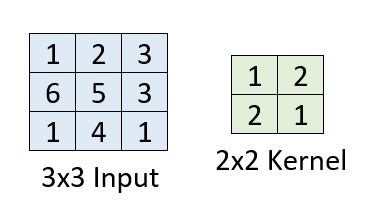
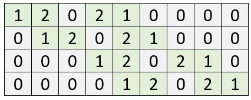
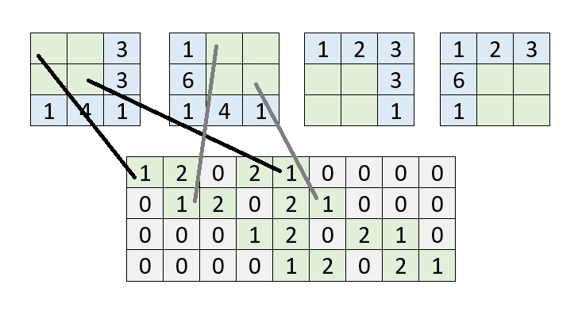
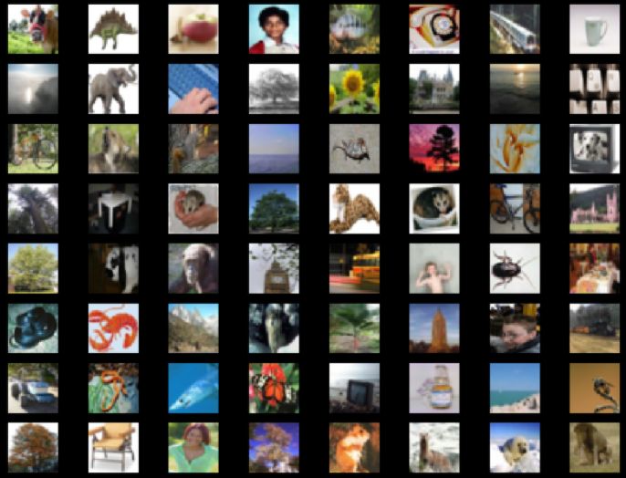

Recently, we've looked at convolutional layers and certain variations to see how they can be used in machine learning problems. Today, we'll focus on a variant called _transposed convolution_, which can be used for upsampling images (making them larger) or finding the original representation of a convolutional filter map.

We'll first cover a normal convolution before we introduce transposed ones. We do so by means of the convolution matrix. Hope you'll enjoy!

After reading this tutorial, you will understand...

- What normal convolutions do.
- How transposed convolutions can be used for reversing the output of your ConvNet.
- Applications of transposed convolutions.

Let's take a look! 🚀

* * *

**Update 09/Feb/2021:** ensure that article is up to date.

**Update 01/Mar/2020:** adapted images for the "normal convolution" to make them equal to the convolution matrix example.

* * *

\[toc\]

* * *

## Summary: understanding transposed convolutions

Convolutional Neural Networks are used for computer vision projects and can be used to automatically extract features from inputs like photos and videos. These neural networks employ so-called convolutional layers that convolve (slide) over the input image, try to detect patterns, and adapt weights accordingly during the training process - allowing learning to occur.

Sometimes, however, you want the opposite to happen: invert the output of a convolutional layer and reconstruct the original input. This is for example the case with autoencoders, where you use normal convolutions to learn an encoded state and subsequently decode them into the original inputs. If done successfully, the encoded state can be used as a lower-dimensional representation of your input data, for dimensionality reduction.

Transposed convolutional layers can be used for this purpose. Rather than performing interpolation, they learn a set of weights that can be used to reconstruct original inputs. They can be trained jointly with convolutional layers during the training process. In this article, we'll cover transposed convolutions in more detail. We'll show you how they work and how they are applied.

* * *

## What does a normal convolution do?

If we wish to understand transposed convolutions, we must be able to compare them with something - and that something, in our case, is a normal convolution.

Let's look at one:

[]

More specifically, we're looking at a convolution of a one-channel image: this is likely a grayscale image. Normally, you would convolve over multiple channels, and you would likely use multiple kernels. For the sake of simplicity, our image has one channel and we use N = 1 kernels.

It must now follow why the 2x2 kernel produces a 2x2 output when convolving over a 3x3 image. I'll briefly recap it next.

When the convolution process starts, the kernel is placed at the upper left corner. It performs element-wise multiplications and hence, produces a scalar output (a number) for the overlapping area. It then moves one step to the right, performs the same thing, but then cannot move any further to the right.

It then simply moves one down, if possible, and does the same trick again. Once it can no longer go to the right, it will attempt to move one down, but cannot do so for the simple reason that we've already reached the end of the image. The convolution operation then stops. Note that in the first row, two scalar values were produced, as well as in the second row. These two times two scalar values produce the 2x2 output displayed in the image above.

_Note that we assume a stride of 1 in this example._

If you wish to understand normal convolutions in more detail, I suggest that you take a look at [this post](https://github.com/mobiletest2016/machine-learning-articles/blob/master/articles/convolutional-neural-networks-and-their-components-for-computer-vision.md) before moving on.

* * *

## The goal: reconstructing the original input

Now what if your goal is to do the opposite: given a _summary_, i.e. the result of the convolution, reconstructing the original input?

We call this "upsampling".

Like this:

[]

You have multiple options.

### Traditional interpolation techniques

First and foremost, it is possible to use traditional interpolation techniques to make your image larger. For example, you could use bicubic or bilinear interpolation to achieve the result you're interested in. However, they're not too flexible: they simply compute an estimate of the interpolated pixel values based on their surroundings. In the case of making images larger without losing a sense of detail, we might be interested in a _different approach_ - one where the _means of interpolation_ is learnt based on the target data. Regular and transposed convolutions then enter the spotlight.

### Regular convolutions - or not?

First, as described more lengthily in [Dumoulin & Francesco (2016)](http://arxiv.org/abs/1603.07285), you can employ a regular convolution operation. This, however, might not be the most efficient route towards reconstructing the original image:

> Finally note that it is always possible to emulate a transposed convolution with a direct convolution. The disadvantage is that it usually involves adding many columns and rows of zeros to the input, resulting in a much less efficient implementation.
> 
> Dumoulin & Francesco (2016)

(note that the paper gives many examples - it's a good recommendation if you wish to understand it in even greater detail!)

Let's now look at our third possible approach: a _transposed convolution._

* * *

## Transposed Convolution

Rather, we must find another way of doing so. Enter the transposed convolution. We'll discuss this way of working next in a multi-stage fashion. Firstly, we describe how forward and backwards passes are normally covered by a convolutional layer and how they are inverted in a transposed convolution.

Secondly, we represent the normal convolution with a Convolution Matrix - it's the first step to demonstrating the power of a transposed convolution. Additionally, we'll compute the normal convolution output based on this matrix to demonstrate that we'll achieve the same result.

Subsequently, we'll introduce the transposed convolution based on the Convolution Matrix we defined earlier, and show that it's indeed possible to reconstruct the original input.

### Representing the normal convolution with a Convolution Matrix

Let's now see how we can represent the normal convolution by means of a Convolution Matrix. We can use this matrix to demonstrate how the Transposed Convolution works (Dumoulin & Visin, 2016).

Suppose that we're performing convolutions with a 2x2 kernel on a 3x3 input image, like this:

With our understanding of how regular convolutions work, it's not surprising to find that we'll end up with a 2x2 output or feature map:

We can also represent this operation as a Convolution Matrix.

**What is a convolution matrix?**

It's a matrix which demonstrates all positions of the kernel on the original image, like this:

One who looks closely, will notice that each row represents a position of the kernel on top of the image: in the first row, for example, the kernel is positioned at the top left of the image. The {1, 2, 0} at the first row of the convolution matrix therefore represents the effect of the convolution at the first row of the input image. The {2, 1, 0} represents the effect of the convolution at the second row of the input image. Since at this point in time, the convolution is not applied in either the 3rd column or the 3rd row, either the third column value of the first and second row _and_ all the third row values are 0.

Note that when the kernel moves to the right in the second iteration, the current position is represented by the second row of the convolution matrix, and so on. The convolution matrix therefore describes the full convolutional operation of the kernel on the input image.

### Computing the normal convolution output with a Convolution Matrix

The convolution matrix can be used to compute the output of a normal convolution. Doing so is really simple, namely, by flattening the input image into a (9x1) feature vector:

It's possible to represent the 3 x 3 image as an 1 x 9 image instead, which essentially allows you to contain the same amount of data in the same ordering - by breaking the 1 x 9 image apart after each 3rd block and stacking the 1 x 3 blocks together, you'll arrive at the 3 x 3 image again.

The fun thing is that we can multiply this (9x1) matrix with the (4x9) convolution matrix and hence achieve a (4x9) x (9x1) = (4x1) output:

When turning it around, breaking it into blocks of two and stacking them vertically, we see that it's the same as what we saw earlier:

We can thus express the convolutional operation by means of a convolution matrix!

### From output back to the input: the Transposed Convolution

Now suppose that this is your input:

While this is your desired output:

The energy is preserved while the image was upsampled. That's our goal.

Or, in other words: you're trying to do the opposite - going backwards from a summarized version of the original input to the original input, rather than creating the summary.

We'll now find why we call the type of convolution _transposed_, as we can also represent this by means of the convolution matrix - although not the original one, but its transpose:

a.k.a. the one where the columns have become rows and vice-versa.

The input can also be represented as follows:

You may now have noticed that once again, we're in a situation in which we can perform a matrix multiplication: we now have a (9x4) matrix and a (4x1) matrix, which we can multiply to arrive at a (9x1) matrix or, when broken apart, the (3x3) matrix we were looking for!

### Implementations in deep learning frameworks: normal convolution, transposed matrix

There are effectively two ways of implementing the transposed convolution (Theano, n.d.):

- By applying a regular convolution with many zeroes in padding, to effectively add a _fractional_ stride - however, this is very inefficient as you'll substantially increase the number of multiplications that are necessary to find your results.
- By applying a regular convolution, however also swapping the so-called _forward_ and _backwards pass_. That is, in a normal convolution, when data is fed forward, the output shape gets smaller due to the properties of such convolutions. However, when you swap them, you'll effectively compute the backwards pass - and make the input larger. This _swap_ can be achieved by transposing the convolution matrix, indeed similar as to what we just saw above! Hence, also, the name _transposed_ convolutions.

Frameworks such as TensorFlow and Theano implement transposed convolutions in this way or by using a very similar one.

### Learnable kernels are what make Transposed convolutions different

Now, one may wonder:

**Why should I use transposed convolutions rather than traditional interpolation techniques?**

Although this is slightly dependent on why you intend to use such convolutions, there may be very good reasons for doing so.

Note that in both the **regular convolution matrix** and the **transposed one**, the non-zero fields are determined by the _kernel_.

And the kernel is _learnt over time_, as during model optimization they are adapted continuously to better reflect the relationships underlying your dataset.

What this means is that, contrary to regular interpolation techniques, you can _learn_ kernels first (e.g. by applying regular convolution operations on your data), and subsequently using them to define your _transposed convolution_, in order to find your original data - or at least, something that hopefully looks like it.

This, in itself, allows one to use them for very interesting applications.

* * *

## Applications of transposed convolutions

Firstly, it is of course possible to perform upsampling operations with transposed convolutions. That is, when you have a smaller image, you can make it larger by applying transposed convolutions. Note that you'll have to learn the weights in order to do so - which might mean that you're better off with traditional interpolation if you want fast results.

Secondly, transposed convolutions can be used in [Generative Adversarial Networks](https://github.com/mobiletest2016/machine-learning-articles/blob/master/articles/this-person-does-not-exist-how-does-it-work.md) (Shibuya, 2019). Those networks randomly generate a small matrix and use fractionally-strided convolutions (another name to describe transposed convolutions, but then perhaps in the relatively inefficient implementation of regular convolutions with fractional strides) to upsample them to true images. The weights that have been learnt in the process allow for the upsampling of the random noise to the actual image.

Thirdly, they're also used in _segmantic segmentation_, where you wish to [classify](https://github.com/mobiletest2016/machine-learning-articles/blob/master/articles/how-to-create-a-cnn-classifier-with-keras.md/#what-is-a-classifier) each pixel of an image into a certain category (Shibuya, 2019). They work by generating predictions for intermediate results achieved with convolutions, subsequently upsamling those to find predictions for the originally-shaped input image.

Finally, and perhaps more recently, they are used in what is called a _convolutional autoencoder_. In those, convolutional layers are used to find an _encoding_ for some input, i.e. a representation of the original input in much lower dimensionality. A clear example would be a radar image with a landmine and one without a landmine; for the latter, one could train an autoencoder to find a particular encoding. However, autoencoders also contain a _decoding_ side: given some encoded input, it attempts to find the original output (by, unsurprisingly, upsampling layers such as transposed convolutions). By comparing the original input image with the output image, it's possible to identify whether the input belongs to a certain class. In our case, that would be landmine yes/no, and 'yes' would only be the case if the decoded encoding really looks like the original image, since then the landmine-trained encoding worked well.

* * *

## Summary

In this blog, we've seen how transposed convolutions work and what they can be used for. We've looked at convolution matrices that can be used for upsampling and demonstrated how both the regular convolution matrix and the transposed one are defined by the kernels that can be learnt. Interesting application areas are upsampling, GANs, semantic segmentation and autoencoders.

Thank you for reading! I hope this blog has made things a bit more clear :-) Would you kindly let me know in the comments? 👇 If not - or if you have questions or remarks - please feel free to write a comment as well! I'm more than happy to reply. Should I've made a mistake, which can happen, I'll gladly adapt my blog and note you as a contributor. Thank you!

* * *

## References

Dumoulin, Vincent, en Francesco Visin. “A guide to convolution arithmetic for deep learning”. arXiv:1603.07285 \[cs, stat\], March 2016. arXiv.org, [http://arxiv.org/abs/1603.07285](http://arxiv.org/abs/1603.07285).

Theano. (n.d.). Convolution arithmetic tutorial — Theano 1.0.0 documentation. Retrieved from [http://deeplearning.net/software/theano/tutorial/conv\_arithmetic.html#transposed-convolution-arithmetic](http://deeplearning.net/software/theano/tutorial/conv_arithmetic.html#transposed-convolution-arithmetic)

Shibuya, N. (2019, January 1). Up-sampling with Transposed Convolution. Retrieved from [https://medium.com/activating-robotic-minds/up-sampling-with-transposed-convolution-9ae4f2df52d0](https://medium.com/activating-robotic-minds/up-sampling-with-transposed-convolution-9ae4f2df52d0)
