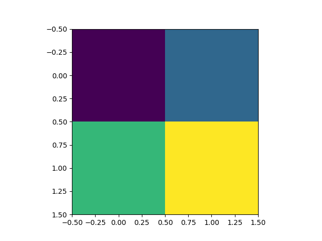
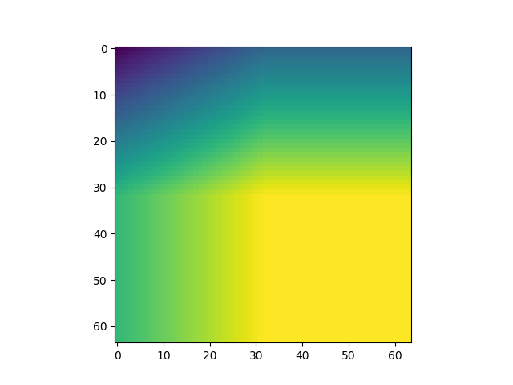
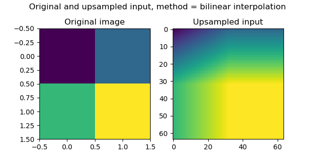
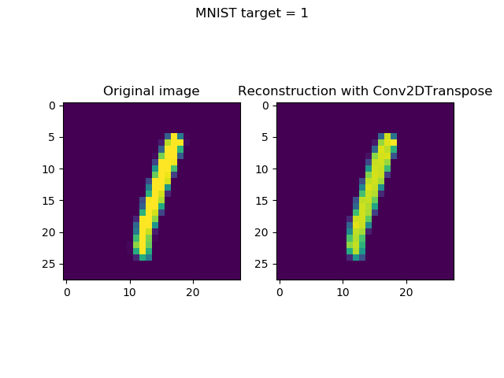

The _Convolutional layers_ section of the Keras API contains the so-called UpSampling2D layer. But what does it do? And how can it be used in real neural networks? This is not clear up front, but there are some interesting applications.

In today's blog post, we'll cover the concept of upsampling - first with a very simple example using UpSampling2D and bilinear interpolation. We then extend this idea to the concept of an autoencoder, where the Keras upsampling layer can be used together with convolutional layers in order to construct (or reconstruct) some image based on an encoded state. This shows how UpSampling2D can be used with Keras. Of course, we'll also cover the differences with transposed convolutions - being the Conv2DTranspose layer.

All right, let's go! 😀

\[toc\]

## What is upsampling?

Suppose that you have the following list:

`[0. 0.5 1. 1.5]`

...which can be reshaped into a (2, 2) image:

```
[[0. 0.5]
 [1. 1.5]]
```

That, in turn can be visualized as follows:

[]

It's a bit blocky, isn't it?

Wouldn't it be a good idea if we applied some _smoothing_ here, so that we could get something like this?

[]

That's a lot better, isn't it? 😊

We just applied an upsampling operation - we made the image larger and larger (look at the axes!), yet also applied _interpolation_, hence averaging, creating the nice smoothness.

### Simple upsampling example with Keras UpSampling2D

Keras, the deep learning framework I really like for creating deep neural networks, provides an upsampling layer - called [UpSampling2D](https://keras.io/layers/convolutional/#upsampling2d) - which allows you to perform this operation within your neural networks. In fact, the plots were generated by using the Keras Upsampling2D layers in an upsampling-only model.

Let's see how we did that, understanding upsampling in more detail, before we move on to more advanced examples.

```
import keras
from keras.models import Sequential
from keras.layers import UpSampling2D
import matplotlib.pyplot as plt
import numpy as np
```

First, we import some libraries that we need:

- Keras, being the deep learning framework that provides the UpSampling2D layer.
- The Sequential API, which we will use to stack multiple UpSamplign2D layers on top of each other.
- UpSampling2D itself, of course.
- Matplotlib, more specifically its PyPlot library, to generate the visualizations.
- Numpy, to reshape the original list into an image-like format (see the example above, with the four-number list).

Then, we generate some data and measure some input-related values, such as the shape, as well as the shape of the entire _model input_ (which requires some notion about [image channels](https://en.wikipedia.org/wiki/Channel_(digital_image)), hence adding an extra 1):

```
# Generate some data
input_flattened = np.arange(0, 2, 0.5)
input_image = np.reshape(input_flattened, (2, 2, 1))
input_image_shape = np.shape(input_image)
input_image_shape = (input_image_shape[0], input_image_shape[1], 1)
```

Next, we specify a simple model architecture:

```
# Create the model
model = Sequential()
model.add(UpSampling2D((32, 32), input_shape=input_image_shape, interpolation='bilinear'))
model.summary()
model.summary()
```

As you can see, we use UpSampling2D five times. The settings are to be understood as follows:

- (32, 32) is the _size_ of the upsampling operation - i.e., how many times upsampling must take place. In our case, we upsample 32 times.
- The input shape is the shape of the model input that we just determined before.
- The interpolation setting is the choice for interpolation algorithm you use - it's possible to use [bilinear](https://en.wikipedia.org/wiki/Bilinear_interpolation) and [nearest neighbor](https://en.wikipedia.org/wiki/Nearest-neighbor_interpolation) interpolation.

Next, we generate a 'prediction' - even though we already know the outcome of our Upsampling operation :)

```
# Perform upsampling
model_inputs = np.array([input_image])
outputs_upsampled = model.predict(model_inputs)

# Get output
output_upsampled = outputs_upsampled[0]
```

Finally, we visualize the original and the upsampled version together:

```
# Visualize input and output
fig, axes = plt.subplots(1, 2)
axes[0].imshow(input_image[:, :, 0]) 
axes[0].set_title('Original image')
axes[1].imshow(output_upsampled[:, :, 0])
axes[1].set_title('Upsampled input')
fig.suptitle(f'Original and upsampled input, method = bilinear interpolation')
plt.show()
```

Which produces the following result:

[]

Unsurprisingly, that's quite equal to the examples we saw above 😎

If you wish to get the code of this simple example in full, here you go:

```
import keras
from keras.models import Sequential
from keras.layers import UpSampling2D
import matplotlib.pyplot as plt
import numpy as np

# Generate some data
input_flattened = np.arange(0, 2, 0.5)
input_image = np.reshape(input_flattened, (2, 2, 1))
input_image_shape = np.shape(input_image)
input_image_shape = (input_image_shape[0], input_image_shape[1], 1)

# Create the model
model = Sequential()
model.add(UpSampling2D((32, 32), input_shape=input_image_shape, interpolation='bilinear'))
model.summary()
model.summary()

# Perform upsampling
model_inputs = np.array([input_image])
outputs_upsampled = model.predict(model_inputs)

# Get output
output_upsampled = outputs_upsampled[0]

# Visualize input and output
fig, axes = plt.subplots(1, 2)
axes[0].imshow(input_image[:, :, 0]) 
axes[0].set_title('Original image')
axes[1].imshow(output_upsampled[:, :, 0])
axes[1].set_title('Upsampled input')
fig.suptitle(f'Original and upsampled input, method = bilinear interpolation')
plt.show()
```

* * *

## Applying UpSampling2D in neural networks

All right - while that example was very simple, it's likely not why you're here: you wish to understand how UpSampling2D can be used in _real_ applications.

That makes sense, so let's take a look at one advanced application: autoencoders.

### Advanced usage of UpSampling2D: autoencoders

This is an autoencoder:

[]

In short, it's a network that is composed of the following components:

- Some input, which in the case above is an _image_ (this is not necessary per se).
- An _encoder_ function, which has been learnt and encodes the input into lower-dimensional form.
- By consequence, an encoded state, which represents the encoding.
- A _decoder_ function, which has also been learnt and attempts to decode the encoded state into what has been learnt. In our case, this was the reconstructed image, but it may also be something entirely different.

There is a large number of autoencoder types, but if we are speaking about convolutional autoencoders, it's possible to build them with [transposed convolutions](https://github.com/mobiletest2016/machine-learning-articles/blob/master/articles/understanding-transposed-convolutions.md) (in Keras: [Conv2DTranspose](https://github.com/mobiletest2016/machine-learning-articles/blob/master/articles/conv2dtranspose-using-2d-transposed-convolutions-with-keras.md)) or with upsampling (UpSampling2D, what we saw above) and regular convolutions. Click the links if you wish to know more about this first approach. In this post, we'll cover the latter.

### How is UpSampling2D different from Conv2DTranspose?

What's important, before we actually continue and create a Keras model based on UpSampling2D and Conv2D layers, is to understand that it is similar to Conv2DTranspose, but slightly different (StackExchange, n.d.).

First, upsampling layers are not trainable. In Keras, the Tensorflow backend simply calls the function `resize_images`, which simply resizes the image by means of interpolation (StackExchange, n.d.). Transposed convolutions are trainable: while upsampling layers use a mathematical definition (i.e., interpolation), transposed convolutions _learn_ how to upsample, and are hence highly data-specific.

One argument in favor of upsampling layers could thus be that you have data required to be upsampled, while sharing quite some differences within the dataset. If you have relatively similar data (such as the MNIST digits), then transposed convolutions might be the better choice. This all depends on you.

Second, upsampling layers do not suffer from the so-called checkerboard effect - while transposed convolutions do, if you don't configure them well (Odena et al., 2016). Because of the way convolutions (and also transposed convolutions) slide over the (encoded) image, if you don't configure your stride and kernel size well, they overlap, producing checkerboard-like structures in your image. [Take a look at this post to find a really good explanation with examples.](https://distill.pub/2016/deconv-checkerboard/)

### Why UpSampling2D and Conv2D must be used together

When performing such an upsampling operation, e.g. with the Upsampling2D layer in Keras, you must always apply Conv2D as well?

The why is explained very well in chapter 4 of [“A guide to convolution arithmetic for deep learning”](https://arxiv.org/abs/1603.07285) by Dumoulin & Visin (2016): the combination of upsampling and the convolution, if applied well, equals the effect of the transposed convolution. This hence allows us to reconstruct the image into its original size, presumably without losing a lot of details (which would have happened with upsampling alone, if such reconstruction would have been possible at all).

## Building your model with Keras

Let's now see if we can actually build the model with Keras!

### What we'll create today

Remember that picture of the autoencoder?

[]

That's what we will build, and it looks like this:


We first use Conv2D and MaxPooling layers to downsample the image (i.e., the encoder part), and subsequently use UpSampling2D and Conv2D to upsample it into our desired format (i.e., the decoder part, which in our case attempts reconstructing the original input). Note that the upsampling and convolutional layer [must be used together](#why-upsampling2d-and-conv2d-must-be-used-together) due to its equality to [transposed convolutions](https://github.com/mobiletest2016/machine-learning-articles/blob/master/articles/conv2dtranspose-using-2d-transposed-convolutions-with-keras.md). Note that traditionally, before Conv2DTranspose was available and fast enough, upsampling and Conv2D were really popular, and even used by François Chollet, the creator of the Keras framework (Keras Blog, n.d.).

Today, the general consensus is this: "While the transpose convolution is more efficient, the article advocates for upsampling + convolution since it does not suffer from the checkerboard artifact" (StackExchange, n.d.). For your practical settings, thus check whether you are sensitive to the checkerboard effect (TLDR: it happens more often when you have image-like data with very flashy colors, and high contrasts), and based on this choose which approach to use (TLDR: checkerboard effect with Conv2DTranspose can be avoided by configuring your stride and kernel size correctly, see Odena et al. 2016).

### What you'll need to run the model

Now, let's see what we need to run the model:

- **Python**, obviously, since we create the code in this language.
- **Keras**, as well, which is the deep learning framework we're using today.
- One of the Keras backends - and preferably **Tensorflow** (or Tensorflow GPU), given its deep integration with Keras today.
- **Matplotlib**, for generating visualizations (not mandatory, but you'll have to remove a few lines of code later if you wish to omit it)
- **Numpy**, for numbers processing.

### Model imports

Open up your Explorer, and at a location of your choice, create a Python file called `upsampling2d.py`. Open this file in your code editor, and let's start coding 😊

We first import the things we need:

```
import keras
from keras.datasets import mnist
from keras.models import Sequential
from keras.layers import Conv2D, UpSampling2D, MaxPooling2D
import matplotlib.pyplot as plt
import numpy as np
```

We'll need the `mnist` dataset as we're going to use it for training our autoencoder. We need the `Sequential` API for stacking all the layers, in this case being `Conv2D`, `Upsampling2D` and `MaxPooling2D` (check the architectural diagram above to see where they fit in).

Additionally, we need the Matplotlib Pyplot library, and an instance of Numpy.

### Configuration options

Next, we specify some configuration options:

```
# Model configuration
img_width, img_height = 28, 28
batch_size = 25
no_epochs = 25
no_classes = 10
validation_split = 0.2
verbosity = 1
```

As we're using the MNIST dataset today (see image), we set width and height to 28 pixels. We use a 25 batch size, which allows us to capture slightly more of the gradient accuracy with respect to the balance between [batch gradient descent and stochastic gradient descent](https://github.com/mobiletest2016/machine-learning-articles/blob/master/articles/gradient-descent-and-its-variants.md) (even though we don't use a GD-like optimizer, the effect must be similar). The number of classes is, by definition of the distinct number of digits available, ten - zero to nine. We use 20% of our training data for validation, and set verbosity to True, outputting everything on screen. While this slows down the training process slightly, it helps you understand and see what happens. Set it to False (zero) if you wish to see the outputs only.

[]

### Loading & preparing data

Next, we load, reshape, cast and normalize the data:

```
# Load MNIST dataset
(input_train, target_train), (input_test, target_test) = mnist.load_data()

# Reshape data
input_train = input_train.reshape(input_train.shape[0], img_width, img_height, 1)
input_test = input_test.reshape(input_test.shape[0], img_width, img_height, 1)
input_shape = (img_width, img_height, 1)

# Parse numbers as floats
input_train = input_train.astype('float32')
input_test = input_test.astype('float32')

# Normalize data
input_train = input_train / 255
input_test = input_test / 255
```

As we use the MNIST dataset, it makes sense to use the Keras API, which provides this dataset out of the box. It must however be reshaped into the correct shape, being the image width, image height and _one channel_. Subsequently, we cast the data type into float32 format, which presumably speeds up the training process. Finally, we normalize the data, which your neural network appreciates.

### Creating the model architecture

Next, we create the model architecture in line with the architectural visualization from earlier:

```
# Create the model
model = Sequential()
model.add(Conv2D(8, (2, 2), activation='relu', kernel_initializer='he_uniform', padding='same', input_shape=input_shape))
model.add(MaxPooling2D((2, 2), padding='same'))
model.add(Conv2D(8, (2, 2), activation='relu', kernel_initializer='he_uniform', padding='same'))
model.add(MaxPooling2D((2, 2), padding='same'))
model.add(Conv2D(8, (2, 2), strides=(2,2), activation='relu', kernel_initializer='he_uniform', padding='same'))
model.add(Conv2D(8, (2, 2), activation='relu', kernel_initializer='he_uniform', padding='same'))
model.add(UpSampling2D((2, 2), interpolation='bilinear'))
model.add(Conv2D(8, (2, 2), activation='relu'))
model.add(UpSampling2D((2, 2), interpolation='bilinear'))
model.add(Conv2D(8, (2, 2), activation='relu', kernel_initializer='he_uniform', padding='same'))
model.add(UpSampling2D((2, 2), interpolation='bilinear'))
model.add(Conv2D(1, (2, 2), activation='sigmoid', padding='same'))

model.summary()
```

We use the Conv2D, MaxPooling2D and UpSampling2D layers as defined before. What's important to note is that we use `bilinear` interpolation, which empirically does not produce different results from `nearest` interpolation - at least in this case.

One more thing: as we activate with `relu`, [we must use He init](https://github.com/mobiletest2016/machine-learning-articles/blob/master/articles/he-xavier-initialization-activation-functions-choose-wisely.md), and hence we do so.

The `model.summary()` call generates a nice summary on the fly:

```
_________________________________________________________________
Layer (type)                 Output Shape              Param #
=================================================================
conv2d_1 (Conv2D)            (None, 28, 28, 8)         40
_________________________________________________________________
max_pooling2d_1 (MaxPooling2 (None, 14, 14, 8)         0
_________________________________________________________________
conv2d_2 (Conv2D)            (None, 14, 14, 8)         264
_________________________________________________________________
max_pooling2d_2 (MaxPooling2 (None, 7, 7, 8)           0
_________________________________________________________________
conv2d_3 (Conv2D)            (None, 4, 4, 8)           264
_________________________________________________________________
conv2d_4 (Conv2D)            (None, 4, 4, 8)           264
_________________________________________________________________
up_sampling2d_1 (UpSampling2 (None, 8, 8, 8)           0
_________________________________________________________________
conv2d_5 (Conv2D)            (None, 7, 7, 8)           264
_________________________________________________________________
up_sampling2d_2 (UpSampling2 (None, 14, 14, 8)         0
_________________________________________________________________
conv2d_6 (Conv2D)            (None, 14, 14, 8)         264
_________________________________________________________________
up_sampling2d_3 (UpSampling2 (None, 28, 28, 8)         0
_________________________________________________________________
conv2d_7 (Conv2D)            (None, 28, 28, 1)         33
=================================================================
Total params: 1,393
Trainable params: 1,393
Non-trainable params: 0
```

Only 1.4K trainable parameters. Shouldn't be too difficult to train this model :-)

### Compiling model & fitting data

Next, we compile the model and fit the data:

```
# Compile and fit data
model.compile(optimizer='adam', loss='binary_crossentropy')
model.fit(input_train, input_train,
                epochs=no_epochs,
                batch_size=batch_size,
                validation_split=validation_split)
```

Compiling is done with the default choices - being the [Adam optimizer](https://github.com/mobiletest2016/machine-learning-articles/blob/master/articles/extensions-to-gradient-descent-from-momentum-to-adabound.md) and [binary crossentropy loss](https://github.com/mobiletest2016/machine-learning-articles/blob/master/articles/how-to-use-binary-categorical-crossentropy-with-keras.md). As we wish to reconstruct the original input, we set `input_train` to be both the _input_ and the _target_, and further configure the number of epochs, batch size and validation split as configured before.

### Generating & visualizing reconstructions

Generating reconstructions and visualizing them simply boils down to two things:

- Taking the first _n_ (in our case, `n = 8`) samples from the test set. (Note that you may choose any selection algorithm here, but this is up to you.) Subsequently, generating predictions (i.e. an encoded state followoed by a reconstruction) for these inputs.
- Once they have been generated, visualizing input and reconstruction together, per sample.

It can be done with the following code:

```
# Generate reconstructions
num_reconstructions = 8
samples = input_test[:num_reconstructions]
targets = target_test[:num_reconstructions]
reconstructions = model.predict(samples)

# Plot reconstructions
for i in np.arange(0, num_reconstructions):
  # Get the sample and the reconstruction
  sample = samples[i][:, :, 0]
  reconstruction = reconstructions[i][:, :, 0]
  input_class = targets[i]
  # Matplotlib preparations
  fig, axes = plt.subplots(1, 2)
  # Plot sample and reconstruciton
  axes[0].imshow(sample)
  axes[0].set_title('Original image')
  axes[1].imshow(reconstruction)
  axes[1].set_title('Reconstruction with UpSampling2D')
  fig.suptitle(f'MNIST target = {input_class}')
  plt.show()
```

### Full model code

If you are interested in the full model code only, which is perfectly fine, here you go:

```
import keras
from keras.datasets import mnist
from keras.models import Sequential
from keras.layers import Conv2D, UpSampling2D, MaxPooling2D
import matplotlib.pyplot as plt
import numpy as np

# Model configuration
img_width, img_height = 28, 28
batch_size = 25
no_epochs = 25
no_classes = 10
validation_split = 0.2
verbosity = 0

# Load MNIST dataset
(input_train, target_train), (input_test, target_test) = mnist.load_data()

# Reshape data
input_train = input_train.reshape(input_train.shape[0], img_width, img_height, 1)
input_test = input_test.reshape(input_test.shape[0], img_width, img_height, 1)
input_shape = (img_width, img_height, 1)

# Parse numbers as floats
input_train = input_train.astype('float32')
input_test = input_test.astype('float32')

# Normalize data
input_train = input_train / 255
input_test = input_test / 255

# Create the model
model = Sequential()
model.add(Conv2D(8, (2, 2), activation='relu', kernel_initializer='he_uniform', padding='same', input_shape=input_shape))
model.add(MaxPooling2D((2, 2), padding='same'))
model.add(Conv2D(8, (2, 2), activation='relu', kernel_initializer='he_uniform', padding='same'))
model.add(MaxPooling2D((2, 2), padding='same'))
model.add(Conv2D(8, (2, 2), strides=(2,2), activation='relu', kernel_initializer='he_uniform', padding='same'))
model.add(Conv2D(8, (2, 2), activation='relu', kernel_initializer='he_uniform', padding='same'))
model.add(UpSampling2D((2, 2), interpolation='bilinear'))
model.add(Conv2D(8, (2, 2), activation='relu'))
model.add(UpSampling2D((2, 2), interpolation='bilinear'))
model.add(Conv2D(8, (2, 2), activation='relu', kernel_initializer='he_uniform', padding='same'))
model.add(UpSampling2D((2, 2), interpolation='bilinear'))
model.add(Conv2D(1, (2, 2), activation='sigmoid', padding='same'))

model.summary()

# Compile and fit data
model.compile(optimizer='adam', loss='binary_crossentropy')
model.fit(input_train, input_train,
                epochs=no_epochs,
                batch_size=batch_size,
                validation_split=validation_split)

# Generate reconstructions
num_reconstructions = 8
samples = input_test[:num_reconstructions]
targets = target_test[:num_reconstructions]
reconstructions = model.predict(samples)

# Plot reconstructions
for i in np.arange(0, num_reconstructions):
  # Get the sample and the reconstruction
  sample = samples[i][:, :, 0]
  reconstruction = reconstructions[i][:, :, 0]
  input_class = targets[i]
  # Matplotlib preparations
  fig, axes = plt.subplots(1, 2)
  # Plot sample and reconstruciton
  axes[0].imshow(sample)
  axes[0].set_title('Original image')
  axes[1].imshow(reconstruction)
  axes[1].set_title('Reconstruction with UpSampling2D')
  fig.suptitle(f'MNIST target = {input_class}')
  plt.show()
```

## The results: visualized reconstructions

Now open up a terminal, `cd` into the folder where your `upsampling2d.py` file is located, and execute `python upsampling2d.py`. When you have all the dependencies, you'll notice that the training process will start - possibly with a download of the MNIST dataset first.

Once the training process finishes, it's likely that you'll arrive at a loss value of approximately 0.11. While this is quite good, it's a bit worse than the [Conv2DTranspose](https://github.com/mobiletest2016/machine-learning-articles/blob/master/articles/conv2dtranspose-using-2d-transposed-convolutions-with-keras.md) we achieved of approximately 0.05.

Visualizing the inputs and reconstructions produces this result:

- []
    
- []
    
- []
    
- []
    
- []
    
- []
    
- []
    
- []
    

### Comparison with Conv2DTranspose reconstructions

The losses are different - approximately 0.11 for the UpSampling2D model against 0.05 for the Conv2DTranspose model.

I was curious to see whether these results are clearly visible in the visualizations, so I've put together the UpSampling2D and Conv2DTranspose reconstructions together with the original inputs.

The answer, unfortunately, is yes - the differences in loss are visible.

Take a look for yourself:

- []
    
- []
    
- []
    
- []
    
- []
    
- []
    
- []
    
- []
    
- []
    
- []
    
- []
    
- []
    
- []
    
- []
    
- []
    
- []
    

### UpSampling2D vs Conv2DTranspose ease of use

What's more, I found creating the model with UpSampling2D and Conv2D layers slightly more difficult than using Conv2DTranspose.

This was not necessarily due to getting the _correct shape_ - going back towards the (28, 28, 1) input shape - but primarily due to _getting the loss low enough with my architecture_. I felt that it was more difficult to achieve the Conv2DTranspose loss with UpSampling2D and Conv2D - which can be seen in the comparison above.

## Summary

However, this does not mean that you should skip on UpSampling2D/Conv2D altogether. No: we saw in today's blog post that it's the traditional choice, now often replaced by transposed convolutions, but still useful if you face checkerboard patterns in your reconstructions.

Today, we saw what upsampling is, how UpSampling2D can be used in Keras, and how you can combine it with Conv2D layers (and MaxPooling2D) to generate an 'old-fashioned' autoencoder.

Hope you've learnt something today! 😊 If you did, please let me know in the comments box below. But please do the same if you didn't, if you have questions, or when you have other remarks. I'll then try to improve this blog post based on your feedback 😁

Thank you for reading MachineCurve today and happy engineering! 😎

## References

Keras. (n.d.). Convolutional Layers: UpSampling2D. Retrieved from [https://keras.io/layers/convolutional/#upsampling2d](https://keras.io/layers/convolutional/#upsampling2d)

StackExchange. (n.d.). In CNN, are upsampling and transpose convolution the same? Retrieved from [https://stats.stackexchange.com/questions/252810/in-cnn-are-upsampling-and-transpose-convolution-the-same](https://stats.stackexchange.com/questions/252810/in-cnn-are-upsampling-and-transpose-convolution-the-same)

Odena, A., Dumoulin, V., & Olah, C. (2016, October 17). Deconvolution and Checkerboard Artifacts. Retrieved from [https://distill.pub/2016/deconv-checkerboard/](https://distill.pub/2016/deconv-checkerboard/)

Dumoulin, Vincent, en Francesco Visin. “A guide to convolution arithmetic for deep learning”. arXiv:1603.07285 \[cs, stat\], March 2016. arXiv.org, [http://arxiv.org/abs/1603.07285](http://arxiv.org/abs/1603.07285).

StackOverflow. (n.d.). What is the the difference between performing upsampling together with strided transpose convolution and transpose convolution with stride 1 only? Retrieved from [https://stackoverflow.com/questions/48226783/what-is-the-the-difference-between-performing-upsampling-together-with-strided-t](https://stackoverflow.com/questions/48226783/what-is-the-the-difference-between-performing-upsampling-together-with-strided-t)

Keras Blog. (n.d.). Building Autoencoders in Keras. Retrieved from [https://blog.keras.io/building-autoencoders-in-keras.html](https://blog.keras.io/building-autoencoders-in-keras.html)
