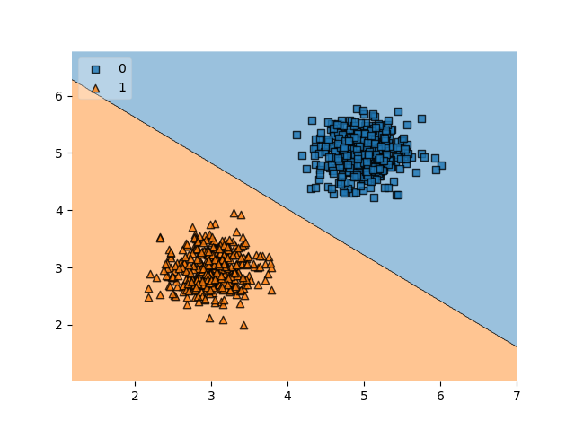
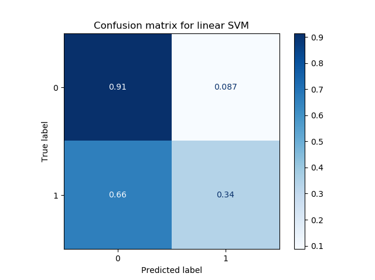
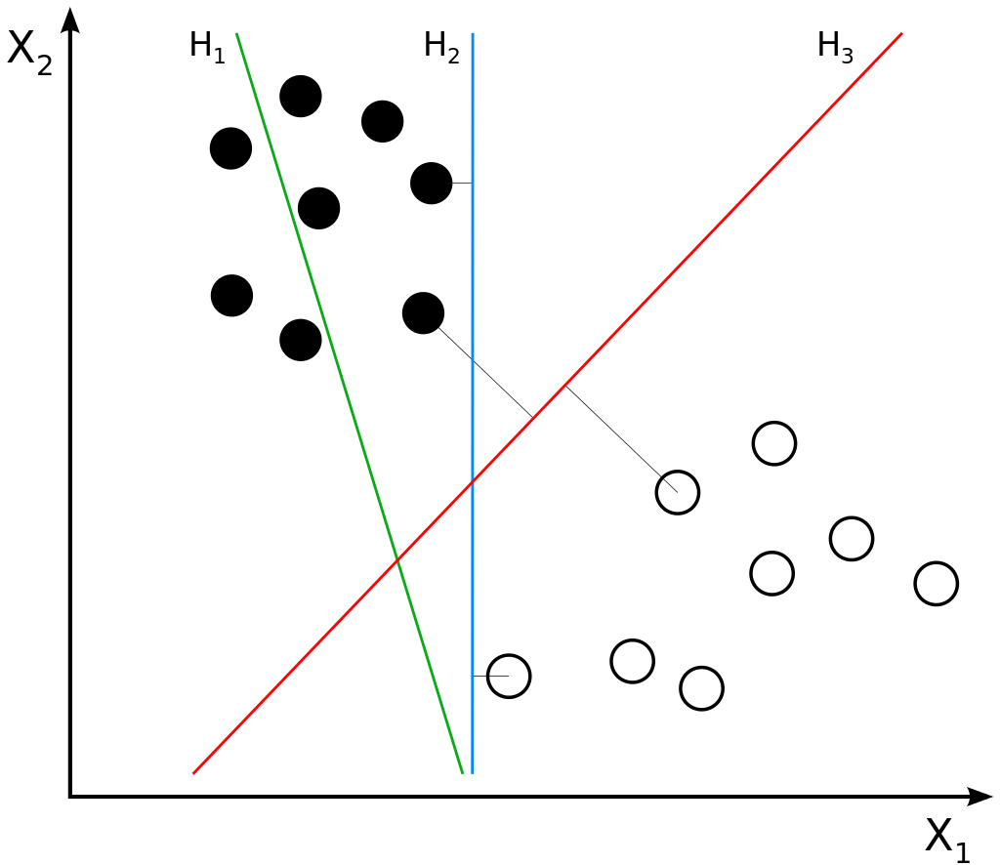
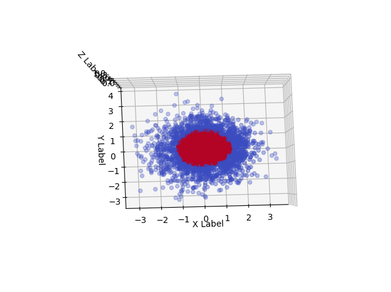
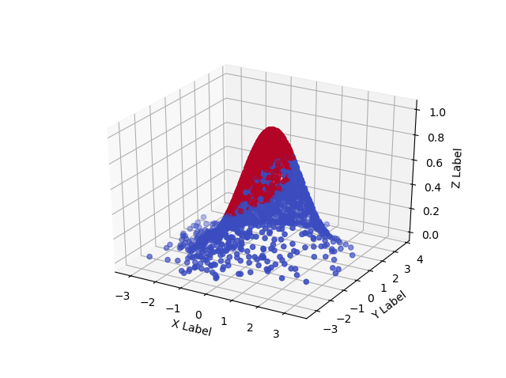
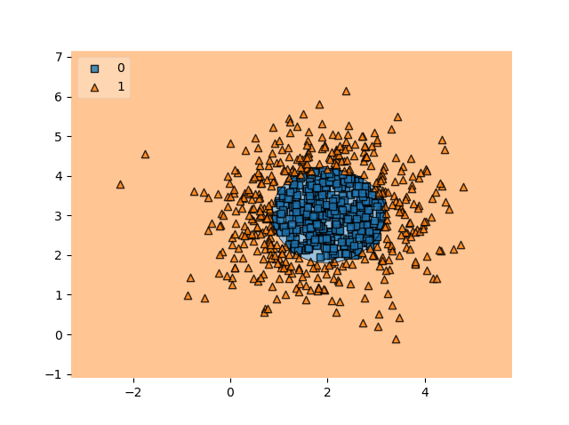
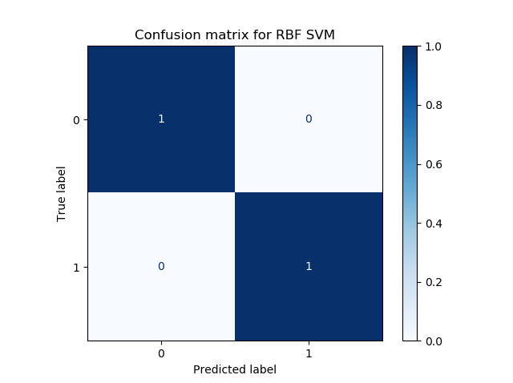
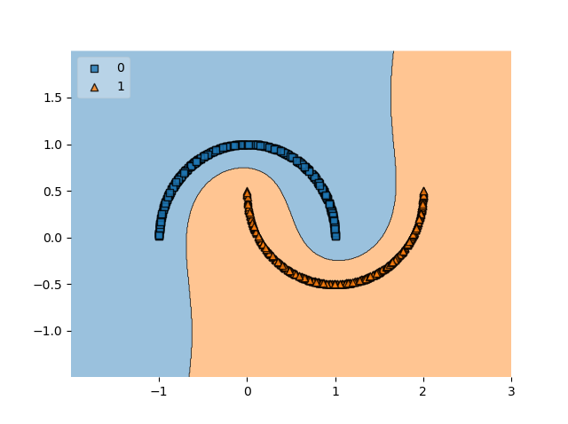

There is a wide variety of Machine Learning algorithms that you can choose from when building a model. One class of models, Support Vector Machines, is used quite frequently, besides Neural Networks, of course. SVMs, as they are abbreviated, can be used to successfully build nonlinear classifiers, an important benefit of a Machine Learning model.

However, contrary to Neural Networks, you have to choose the specific kernel with which a mapping towards a linearly separable dataset is created, yourself. **Radial Basis Functions** can be used for this purpose, and they are in fact the default kernel for Scikit-learn's nonlinear SVM module. But what are these functions? And how do they help with SVMs, to generate this "linearly separable dataset"? We take a look at all these questions in this article.

It is structured as follows. First of all, we take a look at introducing nonlinearity to Support Vector Machines. It shows why linear SVMs have difficulties with fitting on nonlinear data, and includes a brief analysis about how SVMs work in the first place. Secondly, we introduce Radial Basis Functions conceptually, and zoom into the RBF used by Scikit-learn for learning an RBF SVM. This is precisely what we will do thirdly: create an actual RBF based Support Vector Machine with Python and Scikit-learn. We walk you through the process **step-by-step**, so that you can understand each detail and hence grasp the concept as a whole.

Let's take a look!

**Update 08/Dec/2020:** added link to PCA article.

* * *

\[toc\]

* * *

## Introducing nonlinearity to Support Vector Machines

If we want to understand why Radial Basis Functions can help you with training a Support Vector Machine classifier, we must first take a look at _why_ this is the case.

And the only way we can do so is by showing when it does _not_ work as expected, so we're going to build [a simple linear SVM classifier](https://github.com/mobiletest2016/machine-learning-articles/blob/master/articles/creating-a-simple-binary-svm-classifier-with-python-and-scikit-learn.md) with Scikit-learn.

### Creating a linear classifier

[]

Suppose that we have a dataset as the one pictured on the right. We can see two blobs of data that are linearly separable. In other words, we can draw a line which is capable of fully separating the two classes from each other.

We can now create a **linear** **classifier** using **Support Vector Machines**. The code below illustrates how we can do this.

- **We perform some imports.** First of all, for visualization purposes, we import `matplotlib.pyplot`. Then, we also import `numpy`, for numbers processing. From `sklearn`, we import a lot of functions: `make_blobs` for generating the blobs we see on the right, `SVC` which represents a Support Vector Machine Classifier, `train_test_split` for [generating a training and testing set](https://github.com/mobiletest2016/machine-learning-articles/blob/master/articles/how-to-easily-create-a-train-test-split-for-your-machine-learning-model.md), and two `metrics` for plotting a [confusion matrix](https://github.com/mobiletest2016/machine-learning-articles/blob/master/articles/how-to-create-a-confusion-matrix-with-scikit-learn.md) and displaying accuracy score. Finally, we import `plot_decision_regions` from [Mlxtend](https://github.com/mobiletest2016/machine-learning-articles/blob/master/articles/how-to-visualize-the-decision-boundary-for-your-keras-model.md) to plot the decision boundary of our model.
- **We specify configuration options**. These are mainly related to the dataset that is created for our model. Our blobs will have a total of 2500 samples, there will be two clusters with centers at \[latex\](3, 3)\[/latex\] and \[latex\](5, 5)\[/latex\] (this matches with the image!) and hence an equal number of classes.
- **We generate and process the dataset**. This involves invoking `make_blobs` to generate the linearly separable clusters and generating the [train/test split](https://github.com/mobiletest2016/machine-learning-articles/blob/master/articles/how-to-easily-create-a-train-test-split-for-your-machine-learning-model.md).
- **We create and train the Support Vector Machine**. This involves initializing the `SVC` and fitting the _training_ data to it. Note explicitly that we use a _linear_ kernel. In other words, we create a SVM that works with linear data - and this is a crucial fact for the rest of this article!
- **We evaluate the model**. We generate a [confusion matrix](https://github.com/mobiletest2016/machine-learning-articles/blob/master/articles/how-to-create-a-confusion-matrix-with-scikit-learn.md), compute accuracy based on [predictions](https://github.com/mobiletest2016/machine-learning-articles/blob/master/articles/how-to-predict-new-samples-with-your-keras-model.md), and [plot the decision boundary](https://github.com/mobiletest2016/machine-learning-articles/blob/master/articles/how-to-visualize-the-decision-boundary-for-your-keras-model.md) for our model.

Let's now run the model - ensure that you have installed the Python packages (`matplotlib`, `numpy`, `scikit-learn` and `mlxtend`) and run the code!

```
import matplotlib.pyplot as plt
import numpy as np
from sklearn.datasets import make_blobs
from sklearn.svm import SVC
from sklearn.model_selection import train_test_split
from sklearn.metrics import plot_confusion_matrix, accuracy_score
from mlxtend.plotting import plot_decision_regions

# Configuration options
num_samples_total = 2500
cluster_centers = [(5,5), (3,3)]
num_classes = len(cluster_centers)

# Generate data
X, y = make_blobs(n_samples = num_samples_total, centers = cluster_centers, n_features = num_classes, center_box=(0, 1), cluster_std = 0.30)

# Split into training and testing data
X_train, X_test, y_train, y_test = train_test_split(X, y, test_size=0.33, random_state=42)

# Create the SVM
svm = SVC(random_state=42, kernel='linear')

# Fit the data to the SVM classifier
svm = svm.fit(X_train, y_train)

# Evaluate by means of a confusion matrix
matrix = plot_confusion_matrix(svm, X_test, y_test,
                                 cmap=plt.cm.Blues,
                                 normalize='true')
plt.title('Confusion matrix for linear SVM')
plt.show(matrix)
plt.show()

# Generate predictions
y_pred = svm.predict(X_test)

# Evaluate by means of accuracy
accuracy = accuracy_score(y_test, y_pred)
print(f'Model accuracy: {accuracy}')

# Plot decision boundary
plot_decision_regions(X_test, y_test, clf=svm, legend=2)
plt.show()
```

### Evaluating model performance

After the model finishes training, we get two plots and an accuracy metric printed on screen.

```
Model accuracy: 1.0
```

- []
    
- []
    

We can see that our classifier works perfectly. Our confusion matrix illustrates that _all_ examples have been classified correctly, and the reason why becomes clear when looking at the decision boundary plot: _it can perfectly separate the blobs_.

But this is what we already expected, didn't we? ;-)

### What happens when our data becomes nonlinear?

Now suppose that instead we had a dataset that cannot be separated linearly, i.e. by drawing a line, like this one:

[]

We can also try to use a linear Support Vector Machine by making a few changes to our model code.

- Instead of `make_blobs`, we use `make_gaussian_quantiles` to generate the Gaussian data.
- For this reason, we also specify different Configuration options.

```
import matplotlib.pyplot as plt
import numpy as np
from sklearn.datasets import make_gaussian_quantiles
from sklearn.svm import SVC
from sklearn.model_selection import train_test_split
from sklearn.metrics import plot_confusion_matrix, accuracy_score
from mlxtend.plotting import plot_decision_regions

# Configuration options
num_samples_total = 2500
gaussian_mean = (2,3)
num_classes_total = 2
num_features_total = 2

# Generate data
X, y = make_gaussian_quantiles(n_features=num_features_total, n_classes=num_classes_total, n_samples=num_samples_total, mean=gaussian_mean)

# Split into training and testing data
X_train, X_test, y_train, y_test = train_test_split(X, y, test_size=0.33, random_state=42)

# Create the SVM
svm = SVC(random_state=42, kernel='linear')

# Fit the data to the SVM classifier
svm = svm.fit(X_train, y_train)

# Evaluate by means of a confusion matrix
matrix = plot_confusion_matrix(svm, X_test, y_test,
                                 cmap=plt.cm.Blues,
                                 normalize='true')
plt.title('Confusion matrix for linear SVM')
plt.show(matrix)
plt.show()
```

The outcome?

```
Model accuracy: 0.6206060606060606
```

Oops.

- []
    
- []
    

Even more oops.

Clearly, our confusion matrix shows that our model no longer performs so well. The accuracy has also dropped dramatically: from 100% to ~62%. The decision boundary plot clearly shows why: the line which is learned by the _linear_ SVM is simply incapable of learning an appropriate decision boundary for our dataset.

In fact, when retraining the model for a few times, I saw cases where no line was found at all, dropping the accuracy to 50% (simple guesswork, as you're right in half the cases when your dataset is 50/50 split between the classes and all outputs are guessed to be of the same class).

But we did also expect that, didn't we? ;-)

* * *

## SVM Kernels and Radial Basis Functions

This article covers Radial Basis Functions (RBFs) and their application within Support Vector Machines for training Machine Learning models. I get it - but the previous section gave you the necessary context to understand why RBFs can be used to allow for training with nonlinear data in some cases.

### Changing the SVM kernel we use

In the article about [Support Vector Machines](https://github.com/mobiletest2016/machine-learning-articles/blob/master/articles/intuitively-understanding-svm-and-svr.md), we read that SVMs are part of the class of **kernel methods**. In addition, they are **maximum-margin classifiers**, and they attempt to maximize the distance from **support vectors** to a **hyperplane** for generating the best decision boundary.

Let's first cover these terms in more detail, but we'll do so briefly, so that we can move on with full understanding.

- Support Vector Machines will attempt to learn a _hyperplane_ that separates the data. A hyperplane is always an \[latex\]N-1\[/latex\] dimensional object. Let's take a look at the figure above. We know that our feature space (e.g. all the axes onto which we map our samples) represents two dimensions (and hence there are two features per sample: \[latex\]X\_1\[/latex\] and \[latex\]X\_2\[/latex\]). This can be visualized as a plane. Our _hyperplane_ is therefore \[latex\]N-1 = 2-1 = 1\\text{-dimensional}\[/latex\], and represents a line.
- They will do so by means of _support vectors_. These are feature vectors (or their processed variants, e.g. when using [PCA](https://github.com/mobiletest2016/machine-learning-articles/blob/master/articles/introducing-pca-with-python-and-scikit-learn-for-machine-learning.md)) that are closest to the hyperplane. They help support the position of the hyperplane by giving input about the _margin_ between them and the hyperplane. The goal is to find a hyperplane (a line, in this case) which maximizes the margin between the _support vectors of each class_ and the hyperplane. In other words, \[latex\]H\_3\[/latex\] is the best hyperplane because it uses few support vectors _and_ ensures that it is as far away from both classes as possible.
- Support Vector Machines are _kernel methods_. They are so because they require _linear separability_ for the hyperplane learning to work well. We saw this in the example above: if our data is linearly separable, it will learn to distinguish between the classes perfectly. If it's not linearly separable, performance goes south. With a _[kernel function](https://github.com/mobiletest2016/machine-learning-articles/blob/master/articles/intuitively-understanding-svm-and-svr/#what-if-data-is-not-linearly-separable-kernels)_, however, we can try and make our dataset as linearly separable as possible! Kernel functions map our input to another space where linear separability is sometimes possible, but do so in a smart way using what is known as the _[kernel trick](https://en.wikipedia.org/wiki/Kernel_method#Mathematics:_the_kernel_trick)_, avoiding the actual computational cost.

Contrary to neural networks, which learn their mappings themselves, kernel functions are not learned - they must be provided. This is why we explicitly stated that our `kernel='linear'` in the example above. We wanted to use a linear kernel, which essentially maps inputs to outputs \[latex\]\\textbf{x} \\rightarrow \\textbf{y}\[/latex\] as follows: \[latex\]\\textbf{y}: f(\\textbf{x}) = \\textbf{x}\[/latex\]. In other words, it makes a linear mapping. It allowed us to demonstrate the linearity requirement of a SVM when no kernel or a linear kernel is used.



Hyperplanes and data points. The [image](https://en.wikipedia.org/wiki/Support-vector_machine#/media/File:Svm_separating_hyperplanes_(SVG).svg)is not edited. Author: [Zack Weinberg](https://commons.wikimedia.org/w/index.php?title=User:ZackWeinberg&action=edit&redlink=1), derived from [Cyc’s](https://commons.wikimedia.org/w/index.php?title=User:Cyc&action=edit&redlink=1) work. License: [CC BY-SA 3.0](https://creativecommons.org/licenses/by-sa/3.0/legalcode)

### Introducing Radial Basis Functions as SVM kernels

Fortunately, there are many kernel functions that can be used. It's even possible to define your [custom kernel function](https://scikit-learn.org/stable/auto_examples/svm/plot_custom_kernel.html), if you want to.

The point here is that kernel functions must fit your data. It is important that the kernel function you are using ensures that (most of) the data becomes linearly separable: it will be effective only then.

Now, for some datasets, so-called **Radial Basis Functions** can be used as kernel functions for your Support Vector Machine classifier (or [regression model](https://github.com/mobiletest2016/machine-learning-articles/blob/master/articles/intuitively-understanding-svm-and-svr/#support-vector-regression)). We will see visually how they can be used with our dataset later in this article, but we will first take a look at what these functions are and how they work.

> A **radial basis function** (**RBF**) is a real-valued function  whose value depends only on the distance between the input and some fixed point, either the origin, so that , or some other fixed point , called a _center_ (...)
> 
> Wikipedia (2005)

In other words, if we choose some point, the _output_ of an RBF will be the distance between that point and some fixed point. In other words, we can create a \[latex\]z\[/latex\] dimension with the outputs of this RBF, which essentially get a 'height' based on how far the point is from some point.

There are in fact many RBF implementations that can be used (Wikipedia, 2005). Scikit-learn implements what is known as the "squared-exponential kernel" (Scikit-learn, n.d.).

### Scikit-learn's RBF implementation

This **squared-exponential kernel** can be expressed mathematically as follows (Scikit-learn, n.d.):

\[latex\]k(x\_i, x\_j) = \\exp\\left(- \\frac{d(x\_i, x\_j)^2}{2l^2} \\right)\[/latex\]

Here, \[latex\]d(\\cdot,\\cdot)\[/latex\] is the [Euclidian distance](https://en.wikipedia.org/wiki/Euclidean_distance) between two points, and the \[latex\]l\[/latex\] stands for the length scale of the kernel (Scikit-learn, n.d.), which tells us something about the wiggliness of the mapping of our kernel function.

In other words, the bigger the distance \[latex\]d(x\_i, x\_j)\[/latex\], the larger the value that goes into the exponent, and the lower the \[latex\]z\[/latex\] value will be:

```
>>> import numpy as np
>>> np.exp(0)
1.0
>>> np.exp(-0.5)
0.6065306597126334
>>> np.exp(-1)
0.36787944117144233
>>> np.exp(-10)
4.5399929762484854e-05
```

### What happens when we apply an RBF to our nonlinear dataset?

Let's now apply the RBF kernel to our nonlinear dataset. Recall that our dataset looks as follows:

[]

We can visualize what happens with our dataset in a third axis (which the SVM can use easily for linear separability with the kernel trick) with the following code.

- We import many things that we need: the MatplotLib 3D plot facilities, the RBF kernel, and the [Z-score normalizer](https://github.com/mobiletest2016/machine-learning-articles/blob/master/articles/how-to-normalize-or-standardize-a-dataset-in-python.md) with which we can rescale the dataset to \[latex\](\\mu = 0.0, \\sigma = 1.0)\[/latex\].
- We then create the 3D Plot, specify the colors definition, generate and scale the data - just as we are familiar with from other articles and the sections above.
- We then generate the \[latex\]z\[/latex\] component for our data by calling the RBF with the default length scale of `1.0`.
- We then plot the data into a 3D scatter chart.

```
from mpl_toolkits.mplot3d import Axes3D
from sklearn.gaussian_process.kernels import RBF
from sklearn.datasets import make_gaussian_quantiles
import matplotlib.pyplot as plt
import numpy as np
from sklearn.preprocessing import StandardScaler

# Create 3D Plot
fig = plt.figure()
ax = fig.add_subplot(111, projection='3d')

# Colors definition
colors = {
0: '#b40426',
1: '#3b4cc0',
2: '#f2da0a',
3: '#fe5200'
# ... and so on
}

# Generate data
X, y = make_gaussian_quantiles(n_features=2, n_classes=2, n_samples=2500, mean=(2,3))

# Scale data
scaler = StandardScaler()
scaler.fit(X)
X = scaler.transform(X)

# Generate Z component
z = RBF(1.0).__call__(X)[0]

# Plot
colors = list(map(lambda x: colors[x], y))
ax.scatter(X[:, 0], X[:, 1], z, c=colors, marker='o')

ax.set_xlabel('X Label')
ax.set_ylabel('Y Label')
ax.set_zlabel('Z Label')

plt.show()
```

This is the outcome, visualized from three angles:

- []
    
- []
    
- []
    

We recognize aspects from our sections above. For example, the RBF we used maps highest values to points closest to the origin, where the center of our dataset is. In addition, when we look at the data from above, we find back our original 2D Gaussian data. And clearly, in this three-dimensional space, we can even think about learning a hyperplane (a plane, in this case, because our space is now a cube) that can linearly separate much more of the data!

Let's take a look what happens when we implement our Scikit-learn classifier with the RBF kernel.

* * *

## RBF SVMs with Python and Scikit-learn: an Example

We can easily implement an RBF based SVM classifier with Scikit-learn: the only thing we have to do is change `kernel='linear'` to `kernel='rbf'` during `SVC(...)` initialization. We also change the `plt.title(...)` of our confusion matrix, to illustrate that it was trained with an RBF based SVM.

For the rest, we configure, generate, split, create, fit and evaluate just as we did above.

```
import matplotlib.pyplot as plt
import numpy as np
from sklearn.datasets import make_gaussian_quantiles
from sklearn.svm import SVC
from sklearn.model_selection import train_test_split
from sklearn.metrics import plot_confusion_matrix, accuracy_score
from mlxtend.plotting import plot_decision_regions

# Configuration options
num_samples_total = 2500
cluster_centers = [(5,5), (3,3), (1,5)]
num_classes = len(cluster_centers)

# Generate data
X, y = make_gaussian_quantiles(n_features=2, n_classes=2, n_samples=2500, mean=(2,3))

# Split into training and testing data
X_train, X_test, y_train, y_test = train_test_split(X, y, test_size=0.33, random_state=42)

# Create the SVM
svm = SVC(random_state=42, kernel='rbf')

# Fit the data to the SVM classifier
svm = svm.fit(X_train, y_train)

# Evaluate by means of a confusion matrix
matrix = plot_confusion_matrix(svm, X_test, y_test,
                                 cmap=plt.cm.Blues,
                                 normalize='true')
plt.title('Confusion matrix for RBF SVM')
plt.show(matrix)
plt.show()

# Generate predictions
y_pred = svm.predict(X_test)

# Evaluate by means of accuracy
accuracy = accuracy_score(y_test, y_pred)
print(f'Model accuracy: {accuracy}')

# Plot decision boundary
plot_decision_regions(X_test, y_test, clf=svm, legend=2)
plt.show()
```

### Evaluating model performance

After fitting the data and hence training the classifier, this is the output for the RBF based classifier:

```
Model accuracy: 0.9915151515151515
```

- 
    
- 
    

We're back at great performance, and the decision boundary clearly shows that we can classify (most of) the samples correctly!

It will also work with data of various other shapes:

- []
    
- []
    

This is the power of Radial Basis Functions when they are used as kernel functions for your SVM classifier.

### Cautionary remarks

We saw that RBFs can really boost SVM performance when they are used with nonlinear SVMs. However, towards the end of the article, I must stress one thing that we already touched earlier but which may have been sunk in your memory:

**While RBFs can be great, they are not the holy grail.**

In other words: while they can work in many cases, they don't work in many other cases.

This is because the way that this particular kernel function works, mapping distances between some point and other points. The dataset above clearly fit this purpose because it covered a circle and a ring, where the ring is always farthest away from the center of the circle; and the circle is always closer than the ring. This made that data perfectly suitable for RBFs.

So, to conclude: pick, or create if none is available, a kernel function that best matches **your** data. Perform exploration on your feature space first; apply kernel functions second.

* * *

## Summary

In this article, we looked at one of the ways forward when your Support Vector Machine does not work because your data is not linear - apply Radial Basis Functions. We first explored how linear data can be classified easily with a Support Vector Machine classifier using Python and Scikit-learn. By changing our data into a nonlinear structure, however, this changed, and it no longer worked.

We saw that Radial Basis Functions, which measure the distance of a sample to a point, can be used as a kernel functon and hence allow for learning a linear decision boundary in nonlinear data, applying the kernel trick.

Using a variety of visual and code examples, we explained step-by-step how we can use Scikit-learn and Python to apply RBFs for your Support Vector Machine based Machine Learning model. I hope that this article was you and that you have learned something by reading it. If you did, please feel free to leave a message in the comments section 💬 Please do the same if you have any comments or questions.

Thanks for reading MachineCurve today and happy engineering! 😎

* * *

## References

Wikipedia. (2005, July 26). _Radial basis function_. Wikipedia, the free encyclopedia. Retrieved November 25, 2020, from [https://en.wikipedia.org/wiki/Radial\_basis\_function](https://en.wikipedia.org/wiki/Radial_basis_function)

Scikit-learn. (n.d.). _Sklearn.gaussian\_process.kernels.RBF — scikit-learn 0.23.2 documentation_. scikit-learn: machine learning in Python — scikit-learn 0.16.1 documentation. Retrieved November 25, 2020, from [https://scikit-learn.org/stable/modules/generated/sklearn.gaussian\_process.kernels.RBF.html](https://scikit-learn.org/stable/modules/generated/sklearn.gaussian_process.kernels.RBF.html)
