Visualizing your Keras model, whether it's the architecture, the training process, the layers or its internals, is becoming increasingly important as business requires explainability of AI models.

But until recently, generating such visualizations was not so straight-forward.

Fortunately, with respect to the Keras deep learning framework, many visualization toolkits have been developed in the past few years. This has led to a landscape that is scattered and contains many open source toolkits and other elements. That's at least what I found out when I wrote tutorials for many of these recently.

In this blog post, I've attempted to summarize what exists out there - and create an overview that introduces you to all of them that I know of. I've added links to the respective tutorials where you can find more information if you need it. Perhaps, let this be the starting point of your visualization activities! ...of course, if you know about some tools that I didn't cover here, feel free to add them by dropping a comment 😊

Thanks, and let's go! 😎

\[toc\]

## Visualizing model architecture: Keras

Neural networks, and by consequence Keras models, contain layers. These layers are often stacked in an architecture. When you're interested in this architecture - i.e., when you ask yourself **which layers are part of my neural network?** - it may be wise to visualize the architecture of your Keras model, like this:

[]

Keras comes with a handy method to generate such a visualization with only one line of code: `plot_model`. At MachineCurve, we've created a tutorial that is dedicated to this topic - how to build a model, train it, while visualizing its architecture. Click the link below if you wish to read more.

**Read more:** [How to visualize a model with Keras?](https://github.com/mobiletest2016/machine-learning-articles/blob/master/articles/how-to-visualize-a-model-with-keras/')

* * *

## Visualizing model architecture: TensorBoard

However, since Keras integrates with the TensorFlow backend, it's also possible to use TensorBoard for visualizing the architecture of your model. TensorBoard is a TensorFlow toolkit for generating various visualizations of your neural networks. If you're interested in **what is the architecture of my TensorFlow model?** - as well as various other kinds of visualizations - this tutorial is for you.

[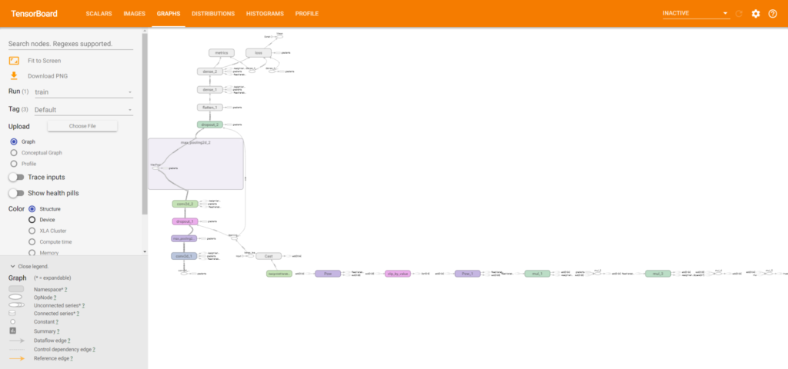]

The best thing is that TensorBoard even works - albeit in a limited way - when you use Theano or CNTK as the backend for your Keras models!

**Read more:** [How to use TensorBoard with Keras?](https://github.com/mobiletest2016/machine-learning-articles/blob/master/articles/how-to-use-tensorboard-with-keras)

* * *

## Visualizing model architecture: Net2Vis

Another tool for generating visualizations of the architecture of your Keras generated neural networks is Net2Vis. The tool, which is a React web application and a Python Flask backend, was created by German scholars who found that existing tools would only produce vertical visualizations - making them useless for print media, which often requires horizontal ones.

[]

Using Net2Vis is really easy, it supports the Keras Functional and Sequential APIs, and there is a wide range of configuration options available - _even_ color sets for the color blind and those with monochromatic (i.e., grayscale) vision. I really love it!

What's more, at MachineCurve, we've created a Docker based installation procedure called `net2vis-docker`, which allows you to run it with only one command.

**Read more:** [Visualizing Keras neural networks with Net2Vis and Docker](https://github.com/mobiletest2016/machine-learning-articles/blob/master/articles/visualizing-keras-neural-networks-with-net2vis-and-docker.md)

* * *

## Visualizing model architecture: Netron

One of the most beautiful tools for visualizing model architectures that I know about is Netron. This tool, which has a cross-platform availability (source code builds and installers for Macs and Windows machines) and supports a variety of frameworks and model formats, allows you to inspect models in a visually appealing way:

[]

It's also possible to export these plots, so that you can use them in publications. However, contrary to Net2Vis, which generates horizontal visualizations, Netron makes them vertical - and doesn't allow you to switch directions. Especially with deep networks, this results in plots that can hardly be printed. However, despite this observation, I love the visual styles!

**Read more:** [Visualizing your Neural Network with Netron](https://github.com/mobiletest2016/machine-learning-articles/blob/master/articles/visualizing-your-neural-network-with-netron.md)

* * *

## Visualizing the training process: Keras History object

Besides the architecture of your model, it may be interesting to know something about your training process as well. This is especially important when you want to answer the following questions:

- How do I know whether my model is overfitting?
- Is my model still underfitting?
- Is training progress stalling? Do I need fewer epochs, or do I need to change my architecture?
- Can I achieve better performance, and do I perhaps need to add more epochs?
- Do I need to change my architecture based on training results?

[]

Visualizing the training process, i.e. the _history_ of your training process, might then be of help. Keras helps you with this by providing a `History` object if you wish to capture this training history. At MachineCurve, we've written a tutorial that helps you make such plots when you wish to visualize them. Doing so is easy: it involves adding a bit of code to _one line of Python_ only, as well as some Matplotlib code for visualizations. Click the link below if you wish to read more.

**Read more:** [How to visualize the training process in Keras?](https://github.com/mobiletest2016/machine-learning-articles/blob/master/articles/how-to-visualize-the-training-process-in-keras.md)

* * *

## Visualizing the training process: TensorBoard

As with the architecture of your neural network, you can also generate visualizations of your training process with TensorBoard. Keras natively supports TensorBoard by means of a callback, so integrating it with your model should be really easy.

[]

As you can see, contrary to History-based visualization, the TensorBoard visualizations are more detailed. They are also more interactive, as you can visualize various options on the fly. This is not possible with the History-object based approach. Nevertheless, both work fine. If you wish to find out how to visualize how training proceeds over time with TensorBoard, the corresponding tutorial at 'Read more' should help you further.

**Read more:** [How to use TensorBoard with Keras?](https://github.com/mobiletest2016/machine-learning-articles/blob/master/articles/how-to-use-tensorboard-with-keras)

* * *

## Visualizing model decision boundaries: Mlxtend

The success of a classifier is determined by how well it classifies - i.e., assigns new objects to the correct class. During training, it generates what is known as a decision boundary - a dividing line between two or more classes that allows the classifier to generate its prediction.

Mlxtend, a generic toolkit providing extensions to various machine learning models, was created by dr. Sebastian Raschka to - among others - serve this need. It allows you to visualize the decision boundary of your machine learning model:

[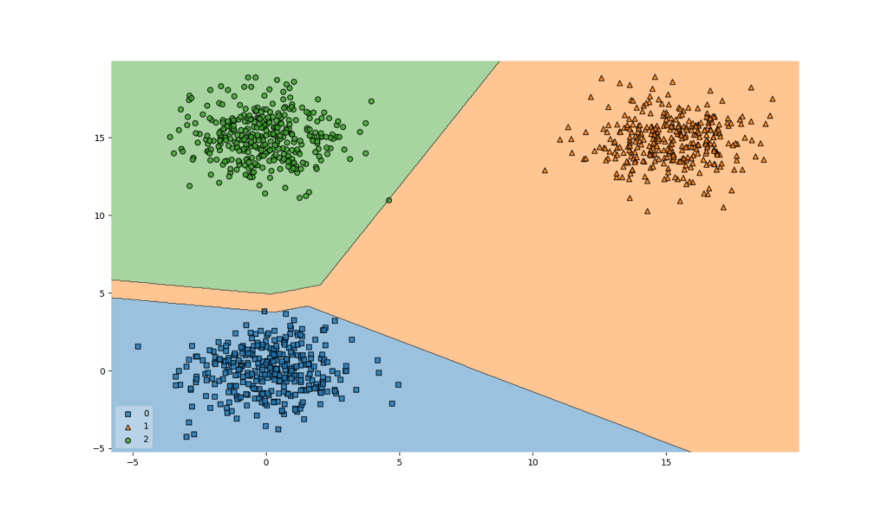]

...and, by consequence, also the decision boundary of your Keras model 😄

Fun thing is that integrating Mlxtend with your Keras model for visualizing the model's decision boundary is not difficult. Hence, answering the question **How does my model decide between classes?** becomes a lot more transparent. Make sure to read this tutorial if you're interested in those kind of visualizations.

**Read more:** [How to visualize the decision boundary for your Keras model?](https://github.com/mobiletest2016/machine-learning-articles/blob/master/articles/how-to-visualize-the-decision-boundary-for-your-keras-model.md)

* * *

## Visualizing weight/bias distributions: TensorBoard

TensorBoard once again! 😁 But this time we're not discussing model architectures or the training process.

No, rather, you may be interested in visualizing the distribution of weights and biases at your layers. TensorBoard supports this natively, and Keras as well through its integration with TensorBoard. The tutorial below helps you with this.

[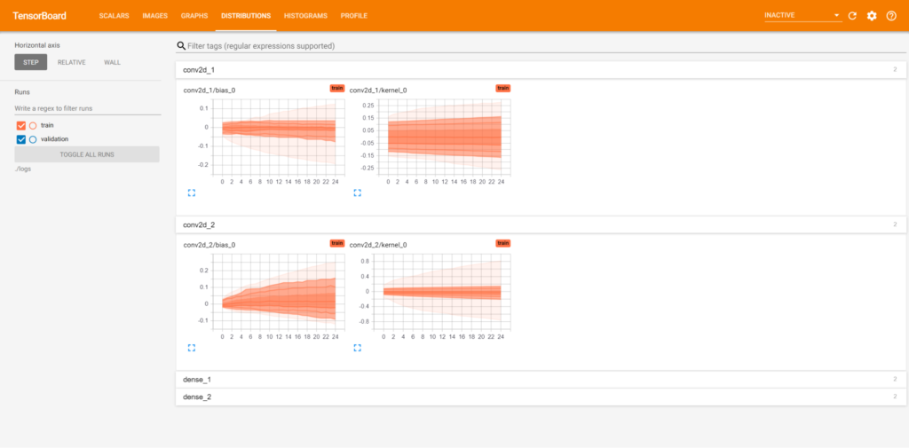]

**Read more:** [How to use TensorBoard with Keras?](https://github.com/mobiletest2016/machine-learning-articles/blob/master/articles/how-to-use-tensorboard-with-keras)

* * *

## Visualizing weight/bias change over time: TensorBoard

While weights and biases of your layers are static with respect to the individual layers, they change over time. Visualizing how they change over time helps you answering a lot of questions with respect to the training process:

- **Which layers contribute most to training?**
- **Which layers do not contribute to training?**
- **Can I remove a layer?**
- **Do I need to add more layers?**
- **Does training happen throughout weights or biases?**

[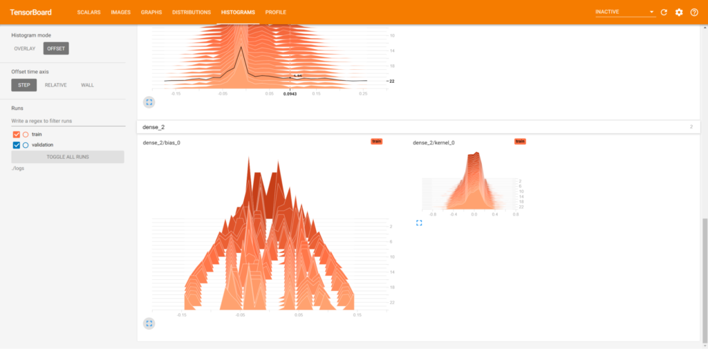]

Make sure to read the TensorBoard tutorial if you wish to understand it, as it explains how you can generated _and_ read these charts in order to better understand your neural network.

**Read more:** [How to use TensorBoard with Keras?](https://github.com/mobiletest2016/machine-learning-articles/blob/master/articles/how-to-use-tensorboard-with-keras)

* * *

## Visualizing ConvNet inputs: Activation Maximization

Convolutional neural networks are, as any neural network, viewed as black boxes very often. What if I told you that there exist methods to visualize these black boxes, and to take a look inside them, in order to find out how your model performs?

What if you can answer the question: **does my model actually generate its prediction based on the correct input elements?**

Activation Maximization can help you with this - combined with the `keras-vis` toolkit in Keras.

The technique essentially uses a trained model and performs inverse operations to find out _which image would be perfect with respect to a class_. That is, what would your input need to be in order to find a particular prediction - in this case, for classes '3', '6' and '4' of the MNIST dataset 😁

- [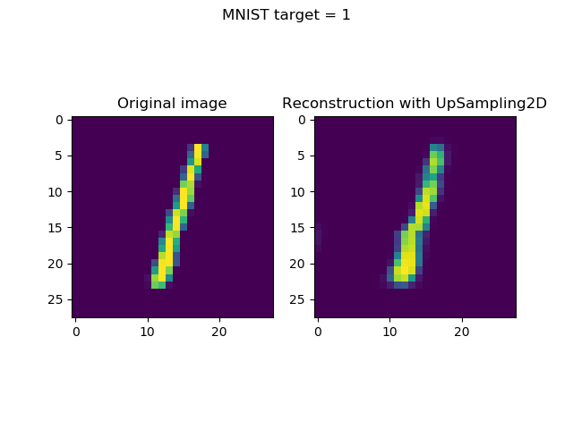]
    
- [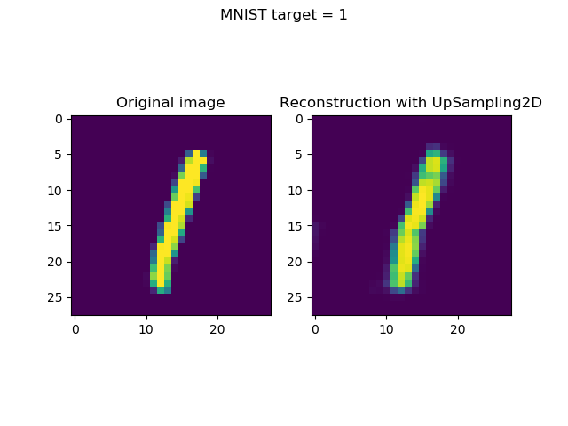]
    
- []
    

If you're very excited about this - cool, so was I when I first found out about this! At MachineCurve, I've written a tutorial that explains how to use Activation Maximization for generating 'perfect class images' that help you understand your Keras ConvNet. I've provided a link at 'Read more'.

**Read more:** [Visualizing Keras model inputs with Activation Maximization](https://github.com/mobiletest2016/machine-learning-articles/blob/master/articles/visualizing-keras-model-inputs-with-activation-maximization.md)

* * *

## Visualizing ConvNet filters: Activation Maximization

While Activation Maximization can be used at the _output level_ - generating images that represent perfect inputs with respect to some class - it can also be used for visualizing the filters of your ConvNet.

This answers the question: **What does my CNN see?**

As well as the following ones: **What patterns have my ConvNet filters/kernels learnt?**

You get visualizations that look like this:

- [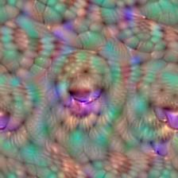]
    
- [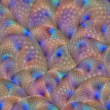]
    
- []
    

As with input visualizations, we're using `keras-vis` for applying Activation Maximization to ConvNet filters. Similarly, we've written a tutorial as well. Check it out if you wish to find out how this works!

**Read more:** [What do ConvNets see? Visualizing filters with Activation Maximization](https://github.com/mobiletest2016/machine-learning-articles/blob/master/articles/what-do-convnets-see-visualizing-filters-with-activation-maximization.md)

* * *

## Visualizing where your ConvNet looks: Saliency maps

Activation Maximization can be used in order to generate a _perfect representation_: that is, it allows you to find out whether the model has actually learnt to recognize the _correct object_.

It is irrelevant of input in the sense that only a fixed output and fixed model weights are required, and it will generate the perfect input for you.

But what if you wish to find an answer to a slightly different question - **given some input, does my model look at the correct object when generating the prediction?**

Activation Maximization does not help here - but saliency maps do. They essentially highlight which pixels contribute most to generating a prediction, like this:

- [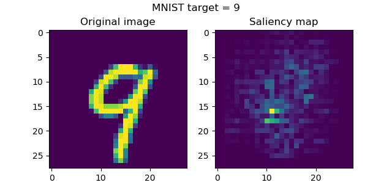]
    
- []
    

How saliency maps work and how you can use `keras-vis` to implement them for visualizing the importance within inputs to your Keras model? Check out the tutorial that we wrote for this purpose 😁 Hope it helps you!

**Read more:** [Visualizing Keras CNN attention: Saliency maps](https://github.com/mobiletest2016/machine-learning-articles/blob/master/articles/visualizing-keras-cnn-attention-saliency-maps.md)

* * *

## Visualizing where your ConvNet looks: Grad-CAM activation maps

While saliency maps help you answer the question _which areas of the input image contribute most to generating the prediction_, you get the answer at a pixel level. Especially with complex images, or when you wish to generate overlays of importance/input, this is difficult. Rather, you would really find the true _areas_ of importance, rather than the _pixels_ of importance.

Heatmaps may help you here. While they are less granular, they might be a competitor for saliency maps:

- []
    
- [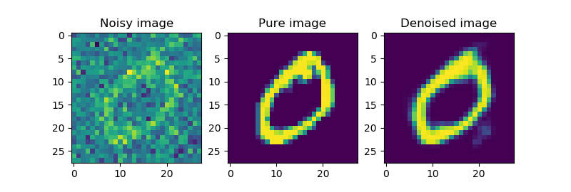]
    

The link below refers to our tutorial for visualizing where your Keras ConvNet attends to with Grad-CAM activation maps. Once again, we use `keras-vis` for this purpose. When you augment these activation maps with guided backprop (which is similar to generating the saliency maps), your results get even more powerful.

**Read more:** [Visualizing Keras CNN attention: Grad-CAM Class Activation Maps](https://github.com/mobiletest2016/machine-learning-articles/blob/master/articles/visualizing-keras-cnn-attention-grad-cam-class-activation-maps.md)

* * *

## Visualizing layer outputs: Keract

You may also be interested in answering the questions: **how do my Keras model's layers activate given some input?** The `keract` toolkit might provide you with an answer to this question, as it allows you to visualize this for one, multiple or all of your layers - by providing heatmaps or simple activation outputs:

- []
    
- [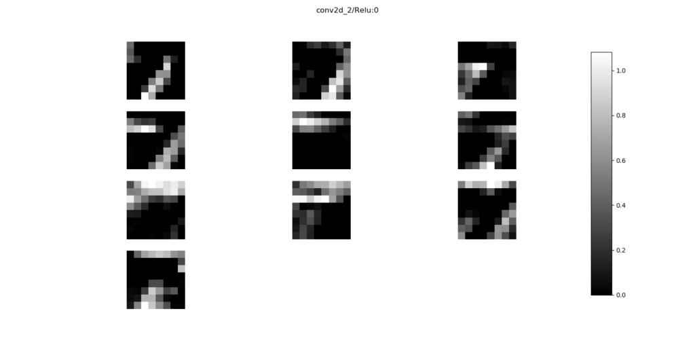]
    

Once again, we have a tutorial for this 😊

**Read more:** [Visualize layer outputs of your Keras classifier with Keract](https://github.com/mobiletest2016/machine-learning-articles/blob/master/articles/visualize-layer-outputs-of-your-keras-classifier-with-keract.md)

* * *

## Summary

In this blog post, we've provided an overview of Keras visualization methods & techniques that are currently available. We provided references to a wide variety of blog posts at MachineCurve that may help you further when your interest is visualizing your model's architecture, the training process, or how its layers activate and/or behave.

If you have any questions or remarks, please leave a comment in the comments box below. **I kindly request that you especially do so when you know about another visualization method that I didn't cover yet!** I will then try my best to cover it as soon as possible 😁

Thanks a lot for reading MachineCurve today and happy engineering! 😎
