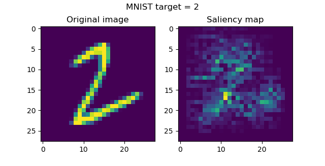
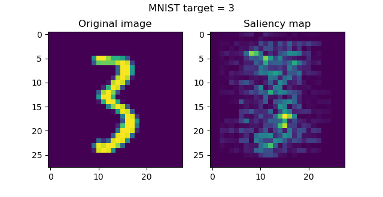
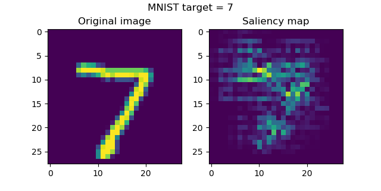
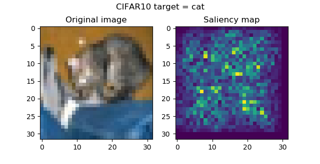
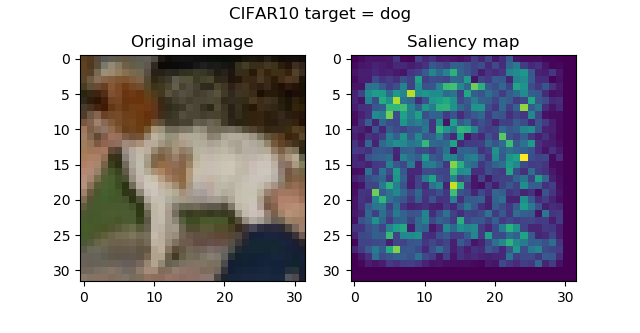
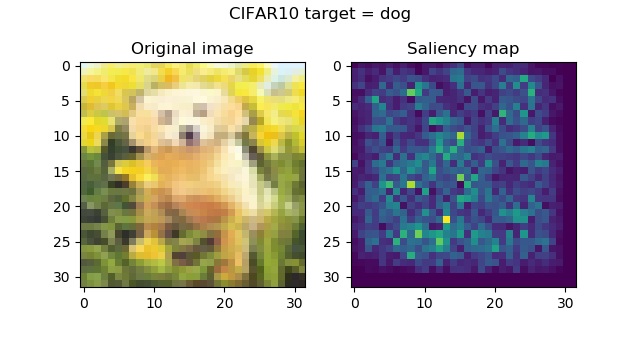
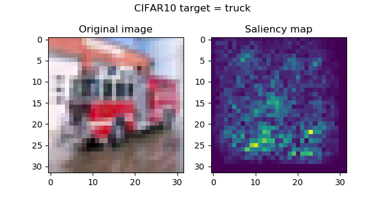

Suppose that you're training an image classifier. You don't have much training data. The classifier is binary and it allows you to distinguish between cats and dogs. However, for the cats, you only have images of the animals photographed at home, sitting on a couch.

Now, having achieved high accuracies and low losses on your training results, you're very confident that your model is capable of separating cats from dogs. You feed your trained model another image, this time of a cat outside - but for some reason, it outputs _dog_.

Why does this occur? You've trained the model to separate dogs and cats!

There might be a simple yet unwanted explanation for this behavior: the model does not actually separate _cats from dogs_, but _the outside environment from the inside environment_, as cats were only photographed inside, whereas dogs were photographed both inside and outside.

You obviously don't want this. For image classifiers, it may thus be a good idea to actually _check_ whether your model uses the interesting parts of your input image to generate the class output. But how to do this?

That's where **saliency maps** enter the picture. They can be used to visualize _attention_ of your ConvNet, i.e., which parts of an input image primarily help determine the output class. In this blog post, we'll take a look at these saliency maps. We do so by first taking a look at attention and why it's a good idea to visualize them in the first place. Then, we get technical.

In the technical part, we first introduce `keras-vis`, which we use for visualizing these maps. Next, we actually generate saliency maps for visualizing attention for possible inputs to a Keras based CNN trained on the MNIST dataset. Then, we investigate whether this approach also works with the CIFAR10 dataset, which doesn't represent numbers but objects instead.

Hope you're ready, because let's go! 😎

\[toc\]

## Recap: what is attention and why visualize it?

When you look at this text, it's likely that there are various objects that compete for your attention. The titles of this post, for example, or the _related articles_ in the sidebar, all require your _attention_. But when you're interested in understanding how to visualize attention of a ConvNet with saliency maps, what should you look at?

Yes: the text 😉

Now suppose that you have trained a [ConvNet classifier](https://github.com/mobiletest2016/machine-learning-articles/blob/master/articles/how-to-create-a-cnn-classifier-with-keras.md) which you can use to generate predictions for images. As discussed before, accuracy is high. But can you be certain that your classifier looks at the important aspects of an image when generating a prediction?

For example, that - when being trained on pictures of cats and dogs - it really looks at the _animal_ for generating the predition, rather than the _environment_.

(You can guess how easy it to mislead a model during training when e.g. the cats are all recorded in a snowy environment, while the dogs are not.)

It's important to visualize the decision structure of your ConvNet. Does it really make its prediction based on the object, and not the environment? That's the question, which can be embedded into the broader context of why to visualize the model (Gehrman et al., 2019), as:

- Users give up their agency, or autonomy, and control over the processes automated by machine learning.
- Users are forced to trust models that have been shown to be biased.
- Similarly, users have to rely on these same models.

## Introducing `keras-vis`

When building a model with Keras, you may wish to visualize the 'attention' of your ConvNet with respect to the object you're trying to visualize.

Say hello to `keras-vis`, which [allows you to do precisely this](https://github.com/raghakot/keras-vis). The toolkit, which runs with your Keras model, allows you to visualize models in multiple ways:

- By _[activation maximization](https://github.com/mobiletest2016/machine-learning-articles/blob/master/articles/visualizing-keras-model-inputs-with-activation-maximization.md)_, essentially generating a 'perfect picture' of your classes.
- By _saliency maps_, which we cover next.
- By _[class activation maps](https://github.com/mobiletest2016/machine-learning-articles/blob/master/articles/visualizing-keras-cnn-attention-grad-cam-class-activation-maps.md)_, which are heatmaps of where the model attends to.

## Using saliency maps to visualize attention at MNIST inputs

In this blog post, however, we cover _saliency maps_. Wikipedia defines such a map as:

> In [computer vision](https://en.wikipedia.org/wiki/Computer_vision), a **saliency map** is an [image](https://en.wikipedia.org/wiki/Image) that shows each [pixel](https://en.wikipedia.org/wiki/Pixel)'s unique quality.
> 
> Wikipedia (2015)

In our case, this unique quality is _how much a pixel contributes to the class prediction_.

Or, to put it in terms of `keras-vis`: to compute the gradient of output category with respect to the input image. I.e., if we change the input image from an empty image to say, a 'one' as provided by the MNIST dataset, how much do the _output pixels_ of the saliency map change? This tells us something about where the model attends to when generating a prediction.

Now, how do we implement this? Let's give it a try for the MNIST dataset.

### Today's dataset: MNIST

We're going to use a very straight-forward dataset today: the MNIST dataset. This dataset, which stands for _Modified National Institute of Standards and Technology_ dataset, contains thousands of 28x28 pixel handwritten digits, like this:

[](https://www.machinecurve.com/wp-content/uploads/2019/07/mnist.png)

Given the simplicity of the dataset, the deep integration with various Python frameworks for deep learning - including Keras - and the ease of which good results can be obtained, it's one of the better datasets for educational purposes.

Hence, we're using this dataset in today's Keras CNN. Let's now discover what we need to run the visualizations we'll be creating next.

### What you'll need to run the models

What you need is really simple:

- You need **Keras**, which is the deep learning framework we're using to train the models.
- You need one of the backends, being **Theano, Tensorflow or CNTK** - and preferably TensorFlow, since Keras has been integrated deeply (and doing so increasingly) with this backend.
- You need **Matplotlib** for actually displaying the visualizations on screen.
- Additionally, **Numpy** is required for data processing.
- You finally need `keras-vis` for generating the visualizations.

With this latter requirement, there is a catch: `pip install keras-vis` doesn't work, as it will not install the most recent version - which is a version that doesn't work with the most recent versions of Tensorflow/Keras.

Instead, you'll need to install `keras-vis` a little bit differently, like this:

```
pip install https://github.com/raghakot/keras-vis/archive/master.zip
```

When doing so, version `0.5.0` will be installed, which is - as of November 2019 - the most recent version:

```
>pip install https://github.com/raghakot/keras-vis/archive/master.zip
Collecting https://github.com/raghakot/keras-vis/archive/master.zip
  Downloading https://github.com/raghakot/keras-vis/archive/master.zip
     \ 58.1MB 819kB/s
Building wheels for collected packages: keras-vis
  Building wheel for keras-vis (setup.py) ... done
Successfully built keras-vis
Installing collected packages: keras-vis
Successfully installed keras-vis-0.5.0
```

Preferably, you run all requirements in an Anaconda environment, given isolation purposes with respect to other packages. However, using Anaconda is not mandatory to make it work.

### Adding a Keras CNN

Now that you know what is necessary to train the model and generate the saliency map visualizations, it's time to add a model.

We simply add the [Keras CNN that we created in a different blog post](https://github.com/mobiletest2016/machine-learning-articles/blob/master/articles/how-to-create-a-cnn-classifier-with-keras.md).

For the sake of brevity, I'm not repeating the explanation about the architecture and code blocks here. If you wish to understand this in more detail, please feel free to click the link above and read the other blog post - where you'll find all the details.

Your first step in the context of generating the saliency map visualizations will thus be to open up your Explorer, navigate to some folder, and create a file called e.g. `saliency_maps_mnist.py`. Next, you open your code editor, open up the file, and paste the Keras CNN we created before:

```
'''
  Visualizing how layers represent classes with keras-vis Saliency Maps.
'''

# =============================================
# Model to be visualized
# =============================================
import keras
from keras.datasets import mnist
from keras.models import Sequential
from keras.layers import Dense, Dropout, Flatten
from keras.layers import Conv2D, MaxPooling2D
from keras import backend as K
from keras import activations

# Model configuration
img_width, img_height = 28, 28
batch_size = 250
no_epochs = 25
no_classes = 10
validation_split = 0.2
verbosity = 1

# Load MNIST dataset
(input_train, target_train), (input_test, target_test) = mnist.load_data()

# Reshape data based on channels first / channels last strategy.
# This is dependent on whether you use TF, Theano or CNTK as backend.
# Source: https://github.com/keras-team/keras/blob/master/examples/mnist_cnn.py
if K.image_data_format() == 'channels_first':
    input_train = input_train.reshape(input_train.shape[0], 1, img_width, img_height)
    input_test = input_test.reshape(input_test.shape[0], 1, img_width, img_height)
    input_shape = (1, img_width, img_height)
else:
    input_train = input_train.reshape(input_train.shape[0], img_width, img_height, 1)
    input_test = input_test.reshape(input_test.shape[0], img_width, img_height, 1)
    input_shape = (img_width, img_height, 1)

# Parse numbers as floats
input_train = input_train.astype('float32')
input_test = input_test.astype('float32')

# Normalize data
input_train = input_train / 255
input_test = input_test / 255

# Convert target vectors to categorical targets
target_train = keras.utils.to_categorical(target_train, no_classes)
target_test = keras.utils.to_categorical(target_test, no_classes)

# Create the model
model = Sequential()
model.add(Conv2D(32, kernel_size=(3, 3), activation='relu', input_shape=input_shape))
model.add(MaxPooling2D(pool_size=(2, 2)))
model.add(Dropout(0.25))
model.add(Conv2D(64, kernel_size=(3, 3), activation='relu'))
model.add(MaxPooling2D(pool_size=(2, 2)))
model.add(Dropout(0.25))
model.add(Flatten())
model.add(Dense(256, activation='relu'))
model.add(Dense(no_classes, activation='softmax', name='visualized_layer'))

# Compile the model
model.compile(loss=keras.losses.categorical_crossentropy,
              optimizer=keras.optimizers.Adam(),
              metrics=['accuracy'])

# Fit data to model
model.fit(input_train, target_train,
          batch_size=batch_size,
          epochs=no_epochs,
          verbose=verbosity,
          validation_split=validation_split)

# Generate generalization metrics
score = model.evaluate(input_test, target_test, verbose=0)
print(f'Test loss: {score[0]} / Test accuracy: {score[1]}')
```

### ...the same, except for one thing

But wait!

There is _one difference_ with respect to the Keras CNN.

And it's related to the last layer we'll add:

```
model.add(Dense(no_classes, activation='softmax', name='visualized_layer'))
```

In this layer, we add `name='visualized_layer'`, which isn't present in the traditional CNN.

Why is this the case?

Simple: our saliency map will visualize the attention generated _by some particular layer_, or set of layers, if you will.

This requires that you assign a name to at least one layer, to be reused in the saliency map code layer.

Since we're interested in attention in our _final layer_ (i.e., implicitly taking into account all the upstream layers), we're adding the name there.

Let's now create the saliency map itself 😀

### Creating the saliency map

For this purpose, we first need to add some imports:

```
# =============================================
# Saliency Maps code
# =============================================
from vis.visualization import visualize_saliency
from vis.utils import utils
import matplotlib.pyplot as plt
import numpy as np
```

`vis` represents the `keras-vis` toolkit, and from it, we import `visualize_saliency` (allowing us to perform saliency map visualization) and `utils`.

Additionally, we import Matplotlib - for generating the visualization plots - and Numpy, for some data processing.

Next, we find the index of the layer for which we wish to generate the saliency map visualizations - indeed, this is the `visualized_layer` layer name that we assigned to the final layer previously.

```
# Find the index of the to be visualized layer above
layer_index = utils.find_layer_idx(model, 'visualized_layer')
```

This code simply converts a layer name into a layer index, or a number that specifies where the layer to be visualized can be found in the architecture.

Next, we swap the final Softmax layer with a linear one:

```
# Swap softmax with linear
model.layers[layer_index].activation = activations.linear
model = utils.apply_modifications(model)  
```

We need to do this because the _saliency map_ generation process essentially performs a reversed process: instead of feeding data forward, and computing how the input should change with respect to the output, we compute it the other way around. That is, we compute how the output changes with respect to a change in input. Softmax, in this case, causes trouble - and that's why we replace it with a linear activation, which essentially passes the data.

We next specify some samples from our test set for which we wish to generate saliency maps:

```
# Numbers to visualize
indices_to_visualize = [ 0, 12, 38, 83, 112, 74, 190 ]
```

And finally add code for generating the visualizations:

```
# Visualize
for index_to_visualize in indices_to_visualize:
  # Get input
  input_image = input_test[index_to_visualize]
  input_class = np.argmax(target_test[index_to_visualize])
  # Matplotlib preparations
  fig, axes = plt.subplots(1, 2)
  # Generate visualization
  visualization = visualize_saliency(model, layer_index, filter_indices=input_class, seed_input=input_image)
  axes[0].imshow(input_image[..., 0]) 
  axes[0].set_title('Original image')
  axes[1].imshow(visualization)
  axes[1].set_title('Saliency map')
  fig.suptitle(f'MNIST target = {input_class}')
  plt.show()
```

This code:

- Loops over all the indices to visualize.
- For each index, retrieves the actual _input image_, and the _index of the input class_. This latter, in this case, is also the number in MNIST (i.e., index 1 is the number 1, and so on).
- Prepares Matplotlib to plot two subplots in one plot: two columns, one row.
- Calls `visualize_saliency` to generate the saliency map visualization. We do this with our `model` instance (which we trained as a Keras CNN), at a particular `layer_index` (which we selecteD), with some `filter_indices` (i.e., the true class we wish to visualize) and some `seed_input` (i.e., the input image we're generating the saliency map for).
- Subsequently plots the original image and the saliency map for each index, adds a global title, and displays the plot on screen.

### The results

Now that we've finished coding the model, we can run it.

Open up a terminal that can access the dependencies you've installed, `cd` to the particular folder you've stored the file into, and hit a command like `python saliency_maps_mnist.py`. You should see Keras starting the training process, likely with the Tensorflow backend. Eventually, when the training process finishes, you should see the results generated with your test data:

```
Test loss: 0.03036452561810365 / Test accuracy: 0.9911999702453613
```

In the MNIST case, we created a pretty well functioning model, with 99+% accuracies!

That's great.

Next, you should find visualizations popping up your screen:

- [](https://www.machinecurve.com/wp-content/uploads/2019/11/sal1.png)
    
- [](https://www.machinecurve.com/wp-content/uploads/2019/11/sal1-2.png)
    
- [](https://www.machinecurve.com/wp-content/uploads/2019/11/sal2.png)
    
- [](https://www.machinecurve.com/wp-content/uploads/2019/11/sal3.png)
    
- [](https://www.machinecurve.com/wp-content/uploads/2019/11/sal7.png)
    
- [](https://www.machinecurve.com/wp-content/uploads/2019/11/sal7-2.png)
    
- [](https://www.machinecurve.com/wp-content/uploads/2019/11/sal9.png)
    

...which show you where the model attends to when generating a class prediction 😎

What's great is that apparently, the model recognizes that it should look at positions _near the numbers_ for generating the prediction. This effect is especially visible with seven, three, two and one, and slightly less with the nine. Nevertheless, mission achieved! 😀

## Do they also work with CIFAR10 inputs?

We can next try to do the same thing with the CIFAR10 dataset, which contains various real-world objects:


We create another file, e.g. `saliency_maps_cifar10.py`, and add code that really resembles the MNIST scenario:

```
'''
  Visualizing how layers represent classes with keras-vis Saliency Maps.
'''

# =============================================
# Model to be visualized
# =============================================
import keras
from keras.datasets import cifar10
from keras.models import Sequential
from keras.layers import Dense, Dropout, Flatten
from keras.layers import Conv2D, MaxPooling2D
from keras import backend as K
from keras import activations

# Model configuration
img_width, img_height = 32, 32
batch_size = 250
no_epochs = 25
no_classes = 10
validation_split = 0.2
verbosity = 1

# Load MNIST dataset
(input_train, target_train), (input_test, target_test) = cifar10.load_data()

# Reshape data based on channels first / channels last strategy.
# This is dependent on whether you use TF, Theano or CNTK as backend.
# Source: https://github.com/keras-team/keras/blob/master/examples/mnist_cnn.py
if K.image_data_format() == 'channels_first':
    input_train = input_train.reshape(input_train.shape[0], 3, img_width, img_height)
    input_test = input_test.reshape(input_test.shape[0], 3, img_width, img_height)
    input_shape = (1, img_width, img_height)
else:
    input_train = input_train.reshape(input_train.shape[0], img_width, img_height, 3)
    input_test = input_test.reshape(input_test.shape[0], img_width, img_height, 3)
    input_shape = (img_width, img_height, 3)

# Parse numbers as floats
input_train = input_train.astype('float32')
input_test = input_test.astype('float32')

# Normalize data
input_train = input_train / 255
input_test = input_test / 255

# Convert target vectors to categorical targets
target_train = keras.utils.to_categorical(target_train, no_classes)
target_test = keras.utils.to_categorical(target_test, no_classes)

# Create the model
model = Sequential()
model.add(Conv2D(32, kernel_size=(3, 3), activation='relu', input_shape=input_shape))
model.add(MaxPooling2D(pool_size=(2, 2)))
model.add(Dropout(0.25))
model.add(Conv2D(64, kernel_size=(3, 3), activation='relu'))
model.add(MaxPooling2D(pool_size=(2, 2)))
model.add(Dropout(0.25))
model.add(Flatten())
model.add(Dense(256, activation='relu'))
model.add(Dense(no_classes, activation='softmax', name='visualized_layer'))

# Compile the model
model.compile(loss=keras.losses.categorical_crossentropy,
              optimizer=keras.optimizers.Adam(),
              metrics=['accuracy'])

# Fit data to model
model.fit(input_train, target_train,
          batch_size=batch_size,
          epochs=no_epochs,
          verbose=verbosity,
          validation_split=validation_split)

# Generate generalization metrics
score = model.evaluate(input_test, target_test, verbose=0)
print(f'Test loss: {score[0]} / Test accuracy: {score[1]}')

# =============================================
# Saliency Maps code
# =============================================
from vis.visualization import visualize_saliency
from vis.utils import utils
import matplotlib.pyplot as plt
import numpy as np

# Find the index of the to be visualized layer above
layer_index = utils.find_layer_idx(model, 'visualized_layer')

# Swap softmax with linear
model.layers[layer_index].activation = activations.linear
model = utils.apply_modifications(model)  

# Numbers to visualize
indices_to_visualize = [ 0, 12, 38, 83, 112, 74, 190 ]

# Visualize
for index_to_visualize in indices_to_visualize:
  # Get input
  input_image = input_test[index_to_visualize]
  # Class object
  classes = {
    0: 'airplane',
    1: 'automobile',
    2: 'bird',
    3: 'cat',
    4: 'deer',
    5: 'dog',
    6: 'frog',
    7: 'horse',
    8: 'ship',
    9: 'truck'
  }
  input_class = np.argmax(target_test[index_to_visualize])
  input_class_name = classes[input_class]
  # Matplotlib preparations
  fig, axes = plt.subplots(1, 2)
  # Generate visualization
  visualization = visualize_saliency(model, layer_index, filter_indices=input_class, seed_input=input_image)
  axes[0].imshow(input_image) 
  axes[0].set_title('Original image')
  axes[1].imshow(visualization)
  axes[1].set_title('Saliency map')
  fig.suptitle(f'CIFAR10 target = {input_class_name}')
  plt.show()
```

What is different is this:

- CIFAR10 data is loaded instead of MNIST data.
- Reshaping the input data considers the 3 RGB channels, instead of just one channel in the MNIST case;
- A `classes` object is added to allow Matplotlib to find the class name for some input target class integer.

When running this again, with e.g. `python saliency_maps_cifar10.py`, we see that the model is performing slightly less - which makes sense, as MNIST is _really, really simple_ in terms of complexity - with these performance metrics:

```
Test loss: 0.8597345282554626 / Test accuracy: 0.7184000015258789
```

And these are the saliency maps for CIFAR10 targets:

- 
    
- 
    
- 
    
- 
    
- 
    
- 
    
- 
    

...attention seems to be in order, and is especially striking with the frog and the horse images. Funnily, the firetruck is recognized by its wheels.

## Rectified and guided backprop

We've successfully saliency maps, but can we make the inputs sharper?

Yes, and `keras-vis` supports this - by modifying the backprop operations performed when generating the visualizations, into rectified or guided backprop.

...what's sad, however, is that `keras-vis` has not been updated for quite some time, and the model crashes time after time with new versions of Keras and TensorFlow.

So, unfortunately, `keras-vis` based saliency maps with rectified and guided backprop seem to be no option for the time being ☹ Nevertheless, it was great generating them with 'vanilla' backprop, and to see that they really work!

## Summary

In this blog post, we've seen how to visualize where your ConvNet attends to by means of _saliency maps_. We discussed what is visualized and how you can visualize these for your Keras models by means of the `keras-vis` toolkit.

I hope you've learnt something interesting today. If you did, please feel free to leave a comment below 😊 You're invited to do the same when you face questions, or when you have other remarks. I'll happily answer your questions and if necessary adapt my blog.

Thanks a lot and happy engineering! 😎

## References

Gehrmann, S., Strobelt, H., Kruger, R., Pfister, H., & Rush, A. M. (2019). Visual Interaction with Deep Learning Models through Collaborative Semantic Inference. _IEEE Transactions on Visualization and Computer Graphics_, 1-1. [doi:10.1109/tvcg.2019.2934595](https://arxiv.org/abs/1907.10739)

Kotikalapudi, Raghavendra and contributors. (2017). Github / keras-vis. Retrieved from [https://github.com/raghakot/keras-vis](https://github.com/raghakot/keras-vis)

Wikipedia. (2015, December 3). Saliency map. Retrieved from [https://en.wikipedia.org/wiki/Saliency\_map](https://en.wikipedia.org/wiki/Saliency_map)
