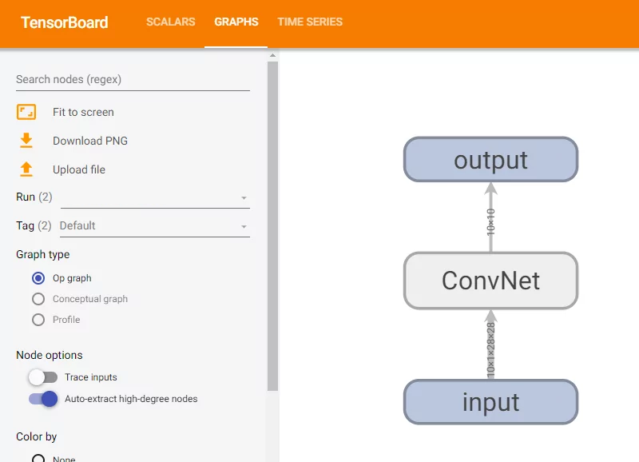
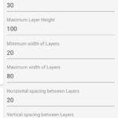
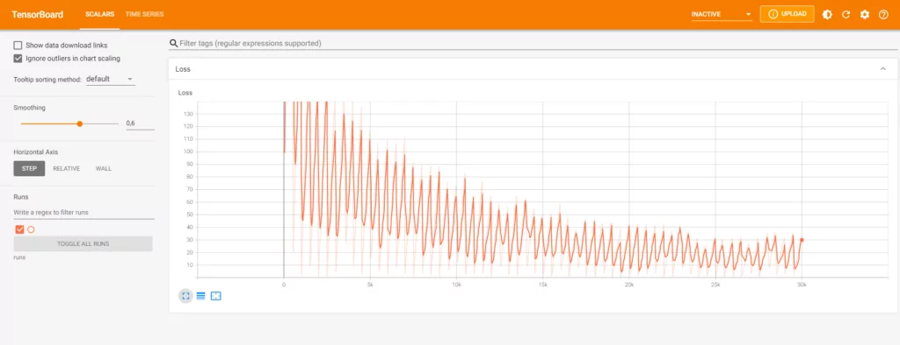
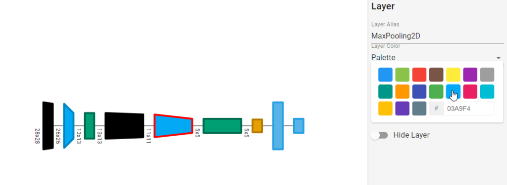

Visualizing the structure of your neural network is quite useful for publications, such as papers and blogs.

Today, various tools exist for generating these visualizations - allowing engineers and researchers to generate them either by hand, or even (partially) automated.

Net2Vis is one such tool: recognizing that current tools have certain flaws, scholars at a German university designed a web application which allows you to visualize Keras-based neural networks automatically.

In this blog post, we'll take a look at Net2Vis. Firstly, we'll inspect the challenges of current tools in more detail, followed by the introduction of Net2Vis. We then suggest a different way of installing it, by using our Docker-based installation process, saving you quite some time on installing dependencies. Subsequently, we'll talk you through our experience with Net2Vis - and show you what it's capable of.

Are you ready? All right! Let's go :)

* * *

\[toc\]

* * *

## What is Net2Vis?

Let's briefly take a look at what Net2Vis is precisely first :)

In the scientific field of deep learning, many scholars are writing academic papers about their findings. The same is true for practical findings in industry journals and on industry blogs. Visualizing neural networks is a key element in those reports, as people often appreciate visual structures over large amounts of text.

However, when looking at the available tools and techniques for visualizing neural networks, Bäuerle & Ropinski (2019) found some key insights about the state of the art of neural network visualization:

- Most of the time, neural networks are visualized by hand, which consumes a lot of time and induces errors in (even _published_!) papers.
- This time is better spent on improving the model through tuning hyperparameters or training result evaluation.
- Often, print media requires horizontal visualizations, maintaining the natural flow of reading, while still conveying all important information.
- There are a lot of tools available for visualizing neural networks, like [Keras plot\_model](https://github.com/mobiletest2016/machine-learning-articles/blob/master/articles/how-to-visualize-a-model-with-keras.md), but they either do not convey enough information or produce vertical visualizations.

Hence, convinced that the current tool landscape is suboptimal, they set out and created [Net2Vis](https://github.com/viscom-ulm/Net2Vis), a web application for automatically visualizing your Keras neural networks.

[](https://www.machinecurve.com/wp-content/uploads/2020/01/image-4.png)

* * *

## Using Net2Vis online

If you don't want to install Net2Vis at all, you can also use it online at the authors' website: [https://viscom.net2vis.uni-ulm.de](https://viscom.net2vis.uni-ulm.de) :)

* * *

## Installing Net2Vis

Installing Net2Vis is quite easy if you use a Mac or a Linux based machine, but it's more difficult when using Windows. However, don't worry, because I created a Docker based variant which also makes using Net2Vis on Windows easy. So, for installing Net2Vis, you can choose from one of two options:

- Install it with Docker, which means that it runs inside containers. It's however still accessible from your host machine, e.g. your computer.
- Install it manually, which requires you to follow the authors' installation steps.

### Easy way: install with Docker

If you wish to install Net2Vis with Docker, keep on reading.

#### What is Docker?

Docker's slogan is as follows:

> Securely build, share and run any application, anywhere
> 
> [https://www.docker.com/](https://www.docker.com/)

This sounds good :)

Docker is software which allows you to run apps in a virtualized-ish fashion, but not in the style of traditional Virtual Machines as we know them. Rather, Docker runs containerized apps directly in Docker's container engine, on your host machine. This allows you to _still_ use containerized apps, _still_ run apps in an isolated and atomic fashion, _still_ benefit from the benefits of Linux - even on Windows, _without_ having the need to install massive operating systems in virtual machines, consuming a lot of disk space.

#### What you'll need to run Net2Vis

There's a couple of things that you must install if you wish to install Net2Vis with Docker:

- Firstly, you'll need **Docker**. This allows you to run the Net2Vis backend and frontend in two separate containers.
    - You can find the installation instructions here: [https://docs.docker.com/install/](https://docs.docker.com/install/)
- Secondly, you'll need **Docker Compose**. Compose allows you to create one file in which you specify the orchestration of separate containers, i.e. how they must be started and what their interdependencies are. This way, you can make your app start with just one command.
    - You can find the installation instructions here: [https://docs.docker.com/compose/install](https://docs.docker.com/compose/install)
- Finally, you'll need **Git**, as you'll need to clone my repository from GitHub in order to run it from your local machine.
    - You can find the installation instructions here: [https://git-scm.com/book/en/v2/Getting-Started-Installing-Git](https://git-scm.com/book/en/v2/Getting-Started-Installing-Git)

#### Installation procedure

As per the [GitHub repository](https://github.com/christianversloot/net2vis-docker), this is the installation procedure:

1. Clone the repository: `git clone https://github.com/christianversloot/net2vis-docker.git`
2. Open a terminal, `cd` into the folder where `net2vis-docker` has been unpacked, and run it with Docker compose:
    1. `docker-compose up` if you wish to run it in the front so that you can see messages easily, with the downside that it shuts down when you close the terminal;
    2. `docker-compose up -d` if you wish to run it in the background so that it keeps running when you close the terminal, with the downside that you'll have to run `docker logs <container id>` if you wish to see what happens inside.

If you choose to run it in the frontend, the backend will start first, followed by the frontend. The first time, it will also build the Docker containers :) Startup looks like this:

```
Creating backend ... done                                                                                                                                                                                                                                                                                                    Recreating frontend ... done                                                                                                                                                                                                                                                                                                 Attaching to backend, frontend
backend             |  * Serving Flask app "server" (lazy loading)
backend             |  * Environment: production
backend             |    WARNING: This is a development server. Do not use it in a production deployment.
backend             |    Use a production WSGI server instead.
backend             |  * Debug mode: on
backend             |  * Running on http://0.0.0.0:5000/ (Press CTRL+C to quit)
backend             |  * Restarting with stat
backend             |  * Debugger is active!
backend             |  * Debugger PIN: 181-171-933
frontend            |
frontend            | > netviz@0.1.0 start /Net2Vis/net2vis
frontend            | > npm-run-all -p watch-css start-js
frontend            |
frontend            |
frontend            | > netviz@0.1.0 start-js /Net2Vis/net2vis
frontend            | > react-scripts start
frontend            |
frontend            |
frontend            | > netviz@0.1.0 watch-css /Net2Vis/net2vis
frontend            | > npm run build-css && node-sass-chokidar src/ -o src/ --watch --recursive
frontend            |
frontend            |
frontend            | > netviz@0.1.0 build-css /Net2Vis/net2vis
frontend            | > node-sass-chokidar src/ -o src/
frontend            |
frontend            | Rendering Complete, saving .css file...
frontend            | Wrote CSS to /Net2Vis/net2vis/src/styles/index.css
frontend            | Wrote 1 CSS files to /Net2Vis/net2vis/src/
frontend            | => changed: /Net2Vis/net2vis/src/styles/index.scss
frontend            | Rendering Complete, saving .css file...
frontend            | Wrote CSS to /Net2Vis/net2vis/src/styles/index.css
frontend            | [HPM] Proxy created: /api  ->  http://host.docker.internal:5000
frontend            | Starting the development server...
frontend            |
frontend            | Browserslist: caniuse-lite is outdated. Please run next command `npm update`
frontend            | Compiled successfully!
frontend            |
frontend            | You can now view netviz in the browser.
frontend            |
frontend            |   Local:            http://localhost:3000/
frontend            |   On Your Network:  http://192.168.96.3:3000/
frontend            |
frontend            | Note that the development build is not optimized.
frontend            | To create a production build, use npm run build.
frontend            |
frontend            | Compiling...
frontend            | Compiled successfully!
```

### Original way: install on your host machine

Of course, you might also wish to omit installing Net2Vis with Docker - for example, because you have a Mac or Linux based system, which enables you to install e.g. Cairo quite easily. In that case, please go [to the original Net2Vis repository and follow its installation instructions](https://github.com/viscom-ulm/Net2Vis).

* * *

## How does Net2Vis work?

When Net2Vis is running, you can access it from http://localhost:3000. When navigating here with your web browser, a blue and white web application will open with a code editor on the left, a settings panel on the right and a visualization in the middle of your screen.

Let's now walk through each of these :)

[](https://www.machinecurve.com/wp-content/uploads/2020/01/image-4.png)

### The model we'll be visualizing today

But first - the model we'll be visualizing today. It's a simple ConvNet with two Conv2D layers, Max Pooling and [Dropout](https://github.com/mobiletest2016/machine-learning-articles/blob/master/articles/how-to-use-dropout-with-keras.md). Do note that Net2Vis has a particular structure, which in essence boils down to this:

```
def get_model():
   model = ....
   .....
   return model
```

That is, it will look in your code for a definition called `get_model` which should return a Keras model. Both the Sequential and the Functional API are supported. This also means that in essence, Net2Vis doesn't really care about data preprocessing, and you can skip these parts of your code.

You really only have to add the `model` definition, the layers, the necessary variables as used in the layers, and finally return the `model`.

Take this example of the ConvNet to be visualized as follows:

```
# You can freely modify this file.
# However, you need to have a function that is named get_model and returns a Keras Model.
import keras as k
from keras.models import Sequential
from keras.layers import Conv2D, MaxPooling2D, Dropout, Flatten, Dense

def get_model():
    input_shape = (28, 28, 1)
    no_classes = 10    
    model = Sequential()
    model.add(Conv2D(32, kernel_size=(3, 3), activation='relu', input_shape=input_shape))
    model.add(MaxPooling2D(pool_size=(2, 2)))
    model.add(Dropout(0.25))
    model.add(Conv2D(64, kernel_size=(3, 3), activation='relu'))
    model.add(MaxPooling2D(pool_size=(2, 2)))
    model.add(Dropout(0.25))
    model.add(Flatten())
    model.add(Dense(256, activation='relu'))
    model.add(Dense(no_classes, activation='softmax'))

    return model
```

If you add it _(do note that the code editor can be sensitive at times; it's best to write your code in a regular editor, after which you select the code in Net2Vis, delete it entirely, and ctrl+c/ctrl+v your own code in the empty code editor)_, the default visualization should immediately change into something that resembles this:

[](https://www.machinecurve.com/wp-content/uploads/2020/01/image-7.png)

That's good, because this is the ConvNet we just defined 👇

[](https://www.machinecurve.com/wp-content/uploads/2020/01/image-1.png)

### Interpreting visualizations

However, the default visualization doesn't provide you with all the details - for example, it doesn't show you which layer is being visualized.

Fortunately, Net2Vis shows a legend immediately below the visualization:



Indeed, the colors match the model code we just defined, so we've got the correct one visualized :)

### Configuring the plots

[](https://www.machinecurve.com/wp-content/uploads/2020/01/image-3.png)

On the right side of the web application, there is a large amount of configuration options. Let's take a look at these.

By default, Net2Vis determines the height of a particular box by the _spatial resolution_ of the layer, whereas the width is determined by the _number of feature channels_ (Bäuerle & Ropinski, 2019). Note that the resolution and number of feature channels of Conv and Dense layers do not influence each other, given the fact that they are incomparable in terms of these determinants.

#### Plot shape

It's possible to change these **minimum and maximum visualization heights**. By default, the neural network is 30 pixels high at minimum and 100 at maximum, but let's take a look at what the model looks like when we change these values.

For example, let's set the maximum height to 350 and the minimum height to 100:

[](https://www.machinecurve.com/wp-content/uploads/2020/01/image-9.png)

It's also possible to do this with **minimum and maximum visualization widths** **of the individual layers** - say, we change them from 20/80 into 50/100:

[](https://www.machinecurve.com/wp-content/uploads/2020/01/image-10.png)

Increasing or decreasing the **horizontal and vertical spacing** between individual layers is also possible. For example, here, the horizontal spacing was changed from 20 into 50:

[](https://www.machinecurve.com/wp-content/uploads/2020/01/image-11.png)

(note that vertical spacing becomes useful when you have models that branch at one point in time and, possibly, join together later)

These options give you full control over the shape of your visualization.

#### Default plot color

But there is more. Net2Vis also allows you to adapt the **color** of the visualizations, and even provide a **colorless** version for people with monochromatic vision, which means that people can only see in grayscale (Bäuerle & Ropinski, 2019).

By selecting the color selector on the right, it's possible to select one out of three options:

- **Palette mode**, which provides a 17-color palette which is used to visualize the layers (Bäuerle & Ropinski, 2019).
- **Interpolation mode**, which uses "farthest point sampling (...) \[to find\] unused colors in hsv color space" (Bäuerle & Ropinski, 2019).
- **Color blindness mode**, which also provides a palette, but instead provides only 8 colors to ensure that color blind people can sufficiently distinguish between layer colors (Bäuerle & Ropinski, 2019).

- [](https://www.machinecurve.com/wp-content/uploads/2020/01/graph-1.png)
    
- [](https://www.machinecurve.com/wp-content/uploads/2020/01/graph.png)
    
- [](https://www.machinecurve.com/wp-content/uploads/2020/01/grap1h.png)
    

_Palette (top), interpolation (middle) and color blindness mode (bottom)._

By selecting 'Disable color', you activate monochromatic mode:

[](https://www.machinecurve.com/wp-content/uploads/2020/01/image-12.png)

#### Custom plot color

However, it doesn't end here: users can select their custom colors as well :)

By clicking on a layer, the palette for that particular layer type can be changed. That is, when selecting a color (one can even set a hex value manually!), it's possible to change the layer style - the other layers of the type change automatically when the color is changed.

So, beyond space, the user can also fully control the colors of their neural network visualizations with Net2Vis. I love it :)

[](https://www.machinecurve.com/wp-content/uploads/2020/01/image-13.png)

#### Plot labels and extra details

[](https://www.machinecurve.com/wp-content/uploads/2020/01/image-5.png)

And we're still not there yet :)

Net2Vis has additional functionality with respect to labels and additional details. As explained by Bäuerle & Ropinski in their paper (Bäuerle & Ropinski, 2019), the goal of Net2Vis is to produce models that are as sparsely and as understandably as possible. As a result, the authors have decided to keep as much as possible away from the default visualization - which essentially just distinguishes between layers and shows spatial resolutions and number of kernels used.

However, it's possible to:

- Display or hide the dimensions of the input of a particular layer;
- Display or hide the number of features learnt by some particular layer;
- Replace split layers;
- Show the bounding boxes of the input and output samples that must be fed to the models;
- Disable colors as a whole, as we just saw before.

For example, by selecting the _dimensions label_, the spatial dimensions of the layer inputs start popping up. For example, in our ConvNet, we have a 28 x 28 pixels input which is downsampled to 5 x 5 before it's flattened (green) and fed to the Dense layers (red). This is reminiscent of the MNIST dataset, and indeed, this was the dataset which we trained our model with :)


By selecting the _features label_, the number of features learnt per layer is shown. As we can see, the first Conv2D learns 32 filters, and the second one learns 64. The first Dense layer learns 256 features, while the second one learns 10 - and hey, this is exactly the number of classes present within our MNIST dataset, which suggests a multiclass / categorical data classification problem and a Softmax activation function.


### Grouping layers

[](https://www.machinecurve.com/wp-content/uploads/2020/01/image-6.png)

Before configuring layer shape and colors, however, you may wish to take a look at the functionality for grouping layers together.

For example, in the visualizations above, it's clear that there's a block that repeats twice: the Conv2D-MaxPooling2D-Dropout block. I always tend to call these 'convolutional blocks', as it's a nice summary, and it's possible to visualize these with Net2Vis as well.

This is especially useful if you have to visualize very large networks, and don't have so much space available in e.g. your paper or on your website.

By clicking "automatically group", Net2Vis will attempt to find blocks by checking the sequences available within the graph. For example, it will find the convolutional blocks we identified in the plot manually:

[](https://www.machinecurve.com/wp-content/uploads/2020/01/image-18.png)

What's best is that it automatically adapts the legend, and adds the group to it: purple = blue + yellow + brown, i.e. group = Conv2D + MaxPooling2D + Dropout. Great :)

### Exporting to PDF and SVG

By clicking the download button in the blue top bar, your visualization will be downloaded to your computer:

[](https://www.machinecurve.com/wp-content/uploads/2020/01/image-2.png)

It'll download a ZIP file containing:

- Your visualization, in PDF and SVG format;
- The corresponding legend, also in PDF and SVG format.

* * *

## Summary

In this blog post, we've shown you what Net2Vis is and how it can be used to visualize Keras models easily and consistently. We took a look at the features available within this web application, which was designed by Bäuerle & Ropinski (2019).

What's more, given the relative complexity of installing Net2Vis on a Windows machine, we made available a Docker based version called `net2vis-docker`, which takes away the complex installation steps and installs Net2Vis for you, granted that you have Docker and Docker Compose installed on your system, as well as Git.

I hope this blog post has been useful to your machine learning projects. If it has, I'd love to know how, so in that case please leave a comment in the comments box below! 👇 Please do too if you have questions or remarks :)

Thanks for reading MachineCurve today and happy engineering! 😎

* * *

## References

Bäuerle, A., & Ropinski, T. (2019). [Net2Vis: Transforming Deep Convolutional Networks into Publication-Ready Visualizations](https://arxiv.org/abs/1902.04394). arXiv preprint arXiv:1902.04394.

Visual Computing Group (Ulm University). (n.d.). Net2Vis. Retrieved from [https://github.com/viscom-ulm/Net2Vis](https://github.com/viscom-ulm/Net2Vis)

MachineCurve. (n.d.). net2vis-docker. Retrieved from [https://github.com/christianversloot/net2vis-docker](https://github.com/christianversloot/net2vis-docker)

Docker. (n.d.). Enterprise Container Platform. Retrieved from [https://www.docker.com/](https://www.docker.com/)
