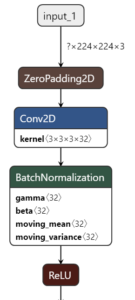
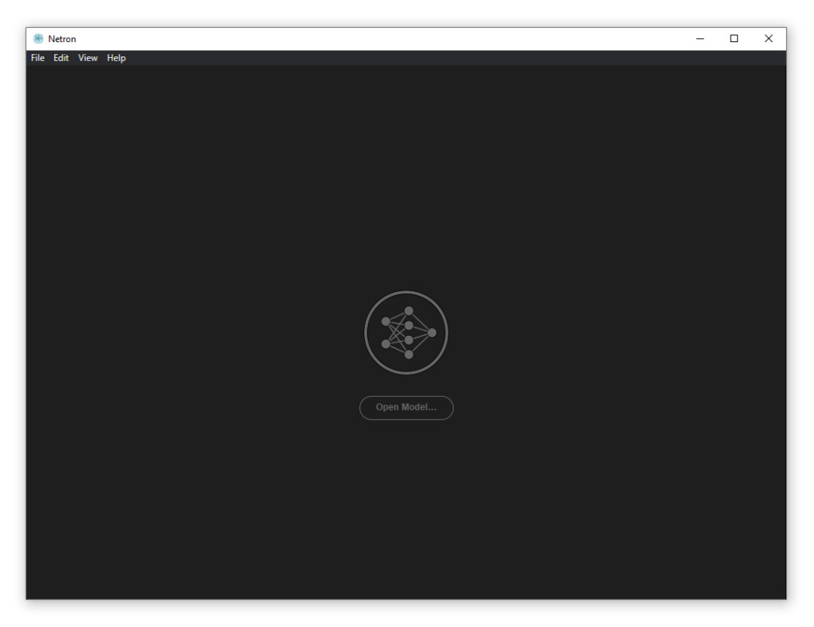

Neural networks, and especially the deep ones, have achieved many state-of-the-art results over the past few years. Many scholars and practitioners have used them to create cool tools and new techniques, which are used in various real-world scenarios today.

Let's say that you've identified a new type of architecture that works really well. Now, you wish to communicate about this architecture. How do you do so? And how can you visualize your neural network architecture easily - or inspect it, if you will?

Netron is such a tool. Being a viewer for neural networks and machine learning models, it generates beautiful visualizations that you can use to clearly communicate the structure of your neural network. What's more, using the tool, you can explore your models in great detail. And best of all, it's a cross-platform tool - which also means Windows and Mac support - and works with a wide range of machine learning frameworks and model formats.

In this blog post, we'll take a look at Netron. First, we'll discuss what it is and what frameworks and model formats it supports. Then, we move on to an example with Keras: we show you how to generate a Netron-ready model output, and how to visualize and inspect it subsequently.

Let's take a look! :)

* * *

\[toc\]

* * *

## Introducing Netron



Let's now take a look at Netron. Created by Lutz Roeder - from now on cited as Roeder (2020) - is a cross-platform tool for visualizing deep learning models, specifically deep neural networks.

Or as they describe their tool: **Netron is a viewer for neural network, deep learning and machine learning models** (Roeder, 2020).

It can generate beautiful visualizations of your neural network and supports a wide range of frameworks and formats. A slice from such a visualization can be seen on the right, and was generated from a Keras model.

Let's now take a look at the frameworks and formats that are supported by Netron. Then, we'll show you how to install the tool - which is really easy, and given the fact that it's cross-platform, it's supported for Windows and Mac machines as well.

Then, we continue by providing an example for Keras.

### What frameworks and formats does Netron support?

As you can see, Netron supports a wide range of frameworks - and offers experimental support for a wide range of others (Roeder, 2020) :)

| Framework | Supported? | File types |
| --- | --- | --- |
| ONNX | Supported | .onnx, .pb, .pbtxt |
| Keras | Supported | .h5, .keras |
| Core ML | Supported | .mlmodel |
| Caffe | Supported | .caffemodel, .prototxt |
| Caffe2 | Supported | predict\_net.pb, predict\_net.pbtxt |
| Darknet | Supported | .cfg |
| MXNet | Supported | .model, -symbol.json |
| ncnn | Supported | .param |
| TensorFlow Lite | Supported | .tflite |
| TorchScript | Experimental support | .pt, .pth |
| PyTorch | Experimental support | .pt, .pth |
| TorchScript | Experimental support | .t7 |
| Arm NN | Experimental support | .armnn |
| BigDL | Experimental support | .bigdl, .model |
| Chainer | Experimental support | .npz, .h5 |
| CNTK | Experimental support | .model, .cntk |
| Deeplearning4j | Experimental support | .zip |
| MediaPipe | Experimental support | .pbtxt |
| ML.NET | Experimental support | .zip |
| MNN | Experimental support | .mnn |
| OpenVINO | Experimental support | .xml |
| PaddlePaddle | Experimental support | .zip, \_\_model\_\_ |
| Scikit-learn | Experimental support | .pkl |
| TensorFlow.js | Experimental support | model.json, .pb |
| TensorFlow | Experimental support | .pb, .meta, .pbtxt, .ckpt, .index |

### Installing Netron

Installing Netron is pretty easy! :)

Navigate to the [releases](https://github.com/lutzroeder/netron/releases) page of the Netron repository, select the installer of your choice (for example, `.exe` for Windows systems, `dmg` for Apple systems or the source code if you wish to build it yourself), and ensure that installation completes.

Netron will then open automatically, and you can also do so from e.g. the Start Menu.

[](https://www.machinecurve.com/wp-content/uploads/2020/02/image-3.png)

* * *

## An example with a Keras model

Let's now generate an example with a Keras based model. We'll be taking a shortcut, and we'll be using one of the `tf.keras.applications` models that come predelivered with Keras - just as simple, and it doesn't distract from the point - showing how Netron works - with large amounts of model code.

Do note that Netron works with any `model` instance, so models created by yourself will work too! :)

### Keras code

Now, open up your Explorer, navigate to some folder, and create a file - say, `netron.py`. Given what we decided above, today's model code will be very brief. Let's start with the imports:

```
# Imports
from tensorflow.keras.applications.mobilenet_v2 import MobileNetV2
```

Or, rather, _import_ 😉

There is only one: the `MobileNetV2` class of the MobileNet v2 model that we'll be visualizing today. The next thing we do is instantiate it:

```
# Define the model
model = MobileNetV2()
```

And subsequently, we save it into an HDF5 file:

```
# Save the model
model.save('netron_model_mobilenetv2.h5')
```

### Exploring the model in Netron

Now, open up Netron, and import the `netron_model_mobilenetv2.h5` file that can be found in the folder of your `netron.py` file. In no time, the model should open up on screen. When zooming in, the individual layers are clearly and beautifully visualized:

[](https://www.machinecurve.com/wp-content/uploads/2020/02/image-6.png)

Now, when you click on layers, additional information becomes visible on screen:


This information includes, but is not limited to:

- The type of the layer;
- The name of the layer;
- Whether the layer is trainable;
- What the data type is;
- For Convolutional layers, the number of filters, the kernel size, the strides, padding, data format and dilation rate;
- The [activation function](https://github.com/mobiletest2016/machine-learning-articles/blob/master/articles/overview-of-activation-functions-for-neural-networks.md) that is used;
- Whether bias is used;
- And how the kernels and (if applied) biases are [initialized](https://github.com/mobiletest2016/machine-learning-articles/blob/master/articles/what-is-weight-initialization.md).

Each layer has its own unique set of characteristics.

### Exporting visualizations

It's also possible to export visualizations by using the top menu, then the 'Export' menu button. This allows you to generate PNG images of the models. The only downside is that these architectures aren't very suitable for print, especially if they are very deep:

[](https://www.machinecurve.com/wp-content/uploads/2020/02/netron_model_mobilenetv2.png)

If you wish to use architecture visualizations in print or, more generally, in a horizontal fashion, use [Net2Vis](https://github.com/mobiletest2016/machine-learning-articles/blob/master/articles/visualizing-keras-neural-networks-with-net2vis-and-docker.md) instead.

* * *

## Summary

As you can see, Netron is a very beautiful and easy way to visualize your neural networks. With a wide range of frameworks and model types that is supported, it's truly scalable and usable for many people in the machine learning community.

It's even possible to export the plots, although you might wish to use a different approach if your goal is to generate plots for print, especially when they are very deep.

Thank you for reading MachineCurve today and happy engineering! 😎

* * *

## References

Roeder, L. (2020, February 27). lutzroeder/netron. Retrieved from [https://github.com/lutzroeder/netron](https://github.com/lutzroeder/netron)
