Training a ConvNet can be equal to training a black box: you start the training process, get a model that performs (or not) and that's it. It's then up to you to find out what is possibly wrong, and whether it can be improved any further. This is difficult, since you cannot look inside the black box.

Or can you? In the past few years, many techniques have emerged that allow you to _take a look inside that black box!_

In this blog post, we'll cover Activation Maximization. It can be used to generate a 'perfect representation' for some aspect of your model - and in this case, convolutional filters. We provide an example implementation with `keras-vis` for visualizing your Keras CNNs, and show our results based on the VGG16 model.

All right - let's go! 😎

\[toc\]

## Recap: what are convolutional filters?

I find them interesting, these **convolutional neural networks** - you feed them image-like data, they start learning, and you may end up with a model that can correctly identify objects within real images, or classify the real images as a whole.

However, it's important to understand how convolutional neural networks work if we wish to understand how we can visualize their _filters_ with Activation Maximization (which we will also cover next).

If you wish to understand convolutional neural networks in more detail, I would like to recommend you read these two blogs:

- [Convolutional Neural Networks and their components for computer vision](https://github.com/mobiletest2016/machine-learning-articles/blob/master/articles/convolutional-neural-networks-and-their-components-for-computer-vision.md)
- [Understanding separable convolutions](https://github.com/mobiletest2016/machine-learning-articles/blob/master/articles/understanding-separable-convolutions.md)

However, if you already have a slight understanding about them or only need to reiterate your existing knowledge, hang on tight - as we'll give you a crash course ConvNets here.

Recall that this is the generic structure of a ConvNet:


The input might be a W x H RGB image, meaning that the input to the ConvNet is three-dimensional: the width, the height and the red, blue and green channels.

Once the data is input, it passes through **N kernels** (where N is an integer number, such as 3) or **filters** that have the same dimension. These kernels slide over the input data, performing element-wise multiplications, generating **N feature maps** of width Wfm and height Hfm, depending on the size of the kernel.

This convolutional operation is often followed by pooling operations, possibly by other convolutional operations, and likely, finally, by densely-connected neural operations, to generate a prediction. It is hence part of the [high-level supervised learning process](https://github.com/mobiletest2016/machine-learning-articles/blob/master/articles/about-loss-and-loss-functions/#the-high-level-supervised-learning-process).

This also sheds light on how ConvNets actually learn. We saw that for any input, the kernels help determine the feature map. The kernels thus contain the patterns that the model has learnt. As after training the kernels are kept constant, they drive the predictions for all the inputs when a model is put into production (possibly augmented with the weights from the densely-connected layers - it's important to know that convolutions and Dense layers are often combined in ConvNets.)

But how does it learn? And what does it learn? Even though it might sound difficult, it's actually pretty simple. We know that the kernels contain the learnt information. They thus need to be adapted when learning needs to take place. From the high-level supervised learning process, the concept of a [loss function](https://github.com/mobiletest2016/machine-learning-articles/blob/master/articles/about-loss-and-loss-functions), and the concept of an [optimizer](https://github.com/mobiletest2016/machine-learning-articles/blob/master/articles/gradient-descent-and-its-variants.md), we know that:

1. Data is fed forward in full batches, minibatches or a stochastic (single-item) fashion.
2. For every sample, a prediction is generated.
3. The average difference between the predictions and the true targets (which are known in supervised settings) determines how _bad_ the model performs, or - in other words - how high its _loss_ is. How this is computed is determined by the choice of loss function.
4. With backpropagation, the error displayed by the loss can be computed backwards to each neuron, computing what is known as a _gradient_, or the change of loss with respect to changes in neurons.
5. With the optimizer, the (negative of the) computed gradient is applied to the neuron's weights, changing them and likely improving the model as a result. The choice of optimizer (such as [gradient descent](https://github.com/mobiletest2016/machine-learning-articles/blob/master/articles/gradient-descent-and-its-variants.md) or [adaptive optimizers](https://github.com/mobiletest2016/machine-learning-articles/blob/master/articles/extensions-to-gradient-descent-from-momentum-to-adabound.md)) determines how gradients are applied.

Kernels are nothing but neurons structured differently. Hence, learning can take place by shifting neuron weights, which means that the high-level supervised learning process is responsible for changing the neurons. Recall that kernels are also called filters every now and then. With that in mind, let's now take a look at the concept of Activation Maximization - which we can use to visualize these filters.

## Recap: what is Activation Maximization?

In different blog post, we used **Activation Maximization** [to visualize the perfect input to produce some class prediction](https://github.com/mobiletest2016/machine-learning-articles/blob/master/articles/visualizing-keras-model-inputs-with-activation-maximization.md). This is a really powerful idea: we derive whether the model has learnt correctly by _generating some input_ that _maximizes_ _activations_ in order to produce _some output_, which we set in advance - to some class that we wish to check. Really nice results!

But how does Activation Maximization work? The principle is simple:

- You keep the output class constant, you keep the weights constant, and change the input to find maximum activations for the constant class.
- If the generated input, which is the 'perfect input for some class' given the trained model, looks accurate, then you can be more confident that the model has learnt correctly.
- If it doesn't, you might wish to inspect learning in more detail with e.g. [TensorBoard](https://github.com/mobiletest2016/machine-learning-articles/blob/master/articles/how-to-use-tensorboard-with-keras.md), [saliency maps](https://github.com/mobiletest2016/machine-learning-articles/blob/master/articles/visualizing-keras-cnn-attention-saliency-maps.md) or [Grad-CAMs](https://github.com/mobiletest2016/machine-learning-articles/blob/master/articles/visualizing-keras-cnn-attention-grad-cam-class-activation-maps.md), to identify where the model attends and which layers contribute to learning.
- You might do the same with [Keract output visualizations](https://github.com/mobiletest2016/machine-learning-articles/blob/master/articles/visualize-layer-outputs-of-your-keras-classifier-with-keract.md), or read on, to learn how to visualize ConvNet filters with Activation Maximization.

## Introducing `keras-vis`

Today, we'll be creating ConvNet filter visualizations with Keras, the deep learning framework that is deeply integrated with TensorFlow and originally created by François Chollet. We're going to use `keras-vis` for this purpose, which is a third-party toolkit for visualizing Keras models, supporting Activation Maximization, Saliency Maps and Grad-CAM class activation maps.

Or, in their words:

> keras-vis is a high-level toolkit for visualizing and debugging your trained keras neural net models.
> 
> [https://github.com/raghakot/keras-vis](https://github.com/raghakot/keras-vis)

We will use it to visualize what a Keras based ConvNet sees through (some of its) filters, by means of Activation Maximization.

### Installing `keras-vis`

The first step is installing `keras-vis`. Unfortunately, it is a little bit less straight-forward than performing a `pip install keras-vis`. That is due to the status of the `pip` package: it's not up to date, and hence doesn't run with newer Keras versions.

Fortunately, there is an escape.

It's actually rather simple, too: first, open up a terminal, preferably the terminal where you have access to all the other dependencies (Python, Keras, and so on). Second, run this command:

```
pip install https://github.com/raghakot/keras-vis/archive/master.zip
```

It still uses `pip` to install `keras-vis`, but simply installs the most recent version from the [Github](https://github.com/raghakot/keras-vis) repository.

When you see this (or anything more recent than `0.5.0`, you've successfully installed `keras-vis`:

```
>pip install https://github.com/raghakot/keras-vis/archive/master.zip
Collecting https://github.com/raghakot/keras-vis/archive/master.zip
  Downloading https://github.com/raghakot/keras-vis/archive/master.zip
     \ 58.1MB 819kB/s
Building wheels for collected packages: keras-vis
  Building wheel for keras-vis (setup.py) ... done
Successfully built keras-vis
Installing collected packages: keras-vis
Successfully installed keras-vis-0.5.0
```

## Today's model: VGG16

Now, let's take a look at today's model. Contrary to other posts, where we used a simple Convolutional Neural Network for visualization purposes (e.g. in our other [Activation Maximization post](https://github.com/mobiletest2016/machine-learning-articles/blob/master/articles/visualizing-keras-model-inputs-with-activation-maximization.md)), we don't use simple ones here today. This is due to the nature of this post: we're interested in generating filter visualizations that are relatively discriminative in terms of abstractness, yet show enough similarity to the task that we can include them here.

Fortunately, the Keras framework comes to the rescue; more specifically, the `keras.applications` ([Github here](https://github.com/keras-team/keras-applications)). It is delivered with various model architectures included. That's perfect for our task today! 🎉

We're using the **VGG16 model** today. This model, which was created by scientists at the Visual Geometry Group (hence VGG) at the University of Oxford, participated in the [ImageNet Large Scale Visual Recognition Challenge of 2014](http://image-net.org/challenges/LSVRC/2014/). It uses many (sixteen, in our case - hence VGG16) convolutional layers and has achieved substantial accuracies in the 2014 competition. If you wish to read more about VGG16, [click here for an excellent resource](https://neurohive.io/en/popular-networks/vgg16/).

ConvNets can be trained on any dataset. However, what often happens is that large-scale datasets are used for pretraining, only to be slightly altered by subsequent training afterwards, possibly for another purpose - a process called Transfer Learning. These large-scale datasets therefore come delivered with such models often, and in this case it's the same. The Keras `VGG16` model can be used directly while it is initialized with [weights trained on the ImageNet dataset](https://keras.io/applications/#vgg16), if you wish. Today, we'll do precisely that: visualizing filters of the VGG16 model when it's initialized on the ImageNet dataset.

Let's go! 😀

## Creating ConvNet filter visualizations

### What you'll need to run this code

As usual, you'll to install a set of dependencies if you wish to run the model & the visualization code:

- **Python**, as we will create Python code. Preferably, use version 3.6+. I can't guarantee that it works with older versions.
- **Keras**, which is the deep learning framework that we will use today.
- One of the Keras backends - being Tensorflow, Theano and CNTK - and of these, preferably **Tensorflow**.
- **Keras-vis**, which you can install by following the [instructions above](#installing-keras-vis).
- **Matplotlib**, for saving the visualizations to disk as images.
- **Numpy**, for number processing.

### Imports & VGG16 initialization

Now, let's write some code! 😎

To start, create a file in some directory, e.g. `activation_maximization_filters.py`.

Open this file in the code editor of your choice, and write with me:

```
'''
  ConvNet filter visualization with Activation Maximization on exemplary VGG16 Keras model
'''
from keras.applications import VGG16
from vis.utils import utils
from vis.visualization import visualize_activation, get_num_filters
from vis.input_modifiers import Jitter
import matplotlib.pyplot as plt
import numpy as np
import random
import os.path
```

These are the imports that you'll need for today's tutorial:

- You import `VGG16` from `keras.applications`, which is the model that we're using today.
- From `keras-vis`, you'll import `utils` (for finding the layer index of the to be visualized layer later), `visualize_activation` and `get_num_filters` (for the visualization part) and `Jitter` (to boost image quality).
- You'll import the PyPlot API from Matplotlib into `plt`.
- Numpy is imported for number processing, `random` is used for drawing a random sample, and `os.path` for selecting the path to write the images to.

Now, let's define the name of the folder which we'll be writing into:

```
# Define the folder name to save into
folder_name = 'filter_visualizations'
```

Then define the model:

```
# Define the model
model = VGG16(weights='imagenet', include_top=True)
```

This initializes the `VGG16` model into the `model` variable, and initializes it with weights trained on the ImageNet dataset. With `include_top`, the densely-connected layers that generate the prediction are included; if set to `False`, you'll only get the convolutional layers. The latter is especially useful when you wish to use pretrained Keras models as your convolutional base, to train additional layers further.

### Generating visualizations

Next, we can generate some visualizations!

```
# Iterate over multiple layers
for layer_nm in ['block1_conv1', 'block2_conv1', 'block3_conv2', 'block4_conv1', 'block5_conv2']:
```

This part means that your code will iterate over an array that contains various layers:

- The first Conv layer of the first Conv block;
- The first Conv layer of the second Conv block;
- The second Conv layer of the third Conv block;
- The first Conv layer of the fourth Conv block;
- The second Conv layer of the fifth Conv block.

That is, it will generate visualizations for (a random selection of) the filters that are part of these blocks. In your case, you may choose any blocks. This, however, comes in to flavors. When using Keras pretrained models, you can look for the layer names in the code available for these models - such as for the VGG16 at Keras' GitHub (search for 'block1\_conv1' on [this page](https://github.com/keras-team/keras-applications/blob/master/keras_applications/vgg16.py), to give you an example). When you do however visualize the Conv filters of your own models, you'll have to name layers yourself when you stack the architecture:

```
model.add(Dense(no_classes, activation='softmax', name='dense_layer'))
```

When adding these names to the array above, you'll ensure that you're visualizing the correct layers.

The following code is part of the iteration, which means that it runs every time the loop is activated (in our case, five times, for five layers):

```
  # Find the particular layer
  layer_idx = utils.find_layer_idx(model, layer_nm)
```

...this `keras-vis` util finds the correct layer index for the name that we specify. `layer_nm`, in this case, is one of the layer names in the array, e.g. `block1_conv1`.

```
  # Get the number of filters in this layer
  num_filters = get_num_filters(model.layers[layer_idx])
```

We then retrieve the number of filters in this layer. This is also done by applying a nice Keras-vis util.

Then, we select six filters randomly (with replacement, so there's a small chance that you visualize one or two filters twice - but I've found that this doesn't really happen given the large number of filters present in VGG16. For your own model, this may be different):

```
  # Draw 6 filters randomly
  drawn_filters = random.choices(np.arange(num_filters), k=6)
```

Finally, we visualize each filter drawn:

```
  # Visualize each filter
  for filter_id in drawn_filters:
    img = visualize_activation(model, layer_idx, filter_indices=filter_id, input_modifiers=[Jitter(16)])
    plt.imshow(img)
    img_path = os.path.join('.', folder_name, layer_nm + '_' + str(filter_id) + '.jpg')
    plt.imsave(img_path, img)
    print(f'Saved layer {layer_nm}/{filter_id} to file!')
```

- We iterate over every filter.
- We visualize its activation with `keras_vis`, for the particular `filter_id`, modifying the input with `Jitter` to make the images more clear.
- Subsequently, we draw the array (which is returned by `keras-vis`) with Matplotlib.
- We don't show the visualization on screen, but rather save them to `img_path` (based on the `folder_name`, `layer_nm` and `filter_id` properties) with Matplotlib.
- Finally, we print that the layer was visualized and that the visualization was saved - allowing you to take a look at what was generated!

## Results

In my case, these were the results:

### Block1Conv1

For the first Conv layer in the first Conv block, the results are not very detailed. However, filters clearly distinguish from each other, as can be seen from the results:

- [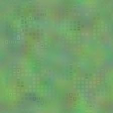](https://www.machinecurve.com/wp-content/uploads/2019/12/block1_conv1_2.jpg)
    
- [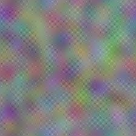](https://www.machinecurve.com/wp-content/uploads/2019/12/block1_conv1_5.jpg)
    
- [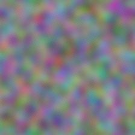](https://www.machinecurve.com/wp-content/uploads/2019/12/block1_conv1_11.jpg)
    
- [](https://www.machinecurve.com/wp-content/uploads/2019/12/block1_conv1_12.jpg)
    
- [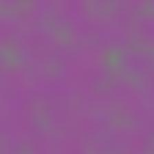](https://www.machinecurve.com/wp-content/uploads/2019/12/block1_conv1_15.jpg)
    
- [](https://www.machinecurve.com/wp-content/uploads/2019/12/block1_conv1_25.jpg)
    

### Block2Conv1

In the second block, a little bit more detail becomes visible. Certain stretched patterns seem to be learnt by the filters.

- [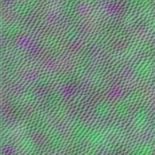](https://www.machinecurve.com/wp-content/uploads/2019/12/block2_conv1_26.jpg)
    
- [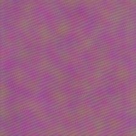](https://www.machinecurve.com/wp-content/uploads/2019/12/block2_conv1_33.jpg)
    
- [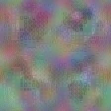](https://www.machinecurve.com/wp-content/uploads/2019/12/block2_conv1_39.jpg)
    
- [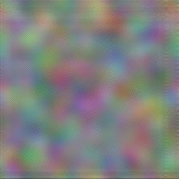](https://www.machinecurve.com/wp-content/uploads/2019/12/block2_conv1_84.jpg)
    
- [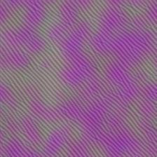](https://www.machinecurve.com/wp-content/uploads/2019/12/block2_conv1_97.jpg)
    
- [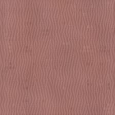](https://www.machinecurve.com/wp-content/uploads/2019/12/block2_conv1_100.jpg)
    

### Block3Conv2

This gets even clearer in the third block. The stretches are now combined with clear patterns, and even blocky representations, like in the center-bottom visualization.

- [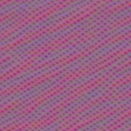](https://www.machinecurve.com/wp-content/uploads/2019/12/block3_conv2_3.jpg)
    
- [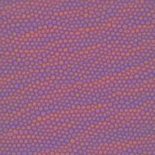](https://www.machinecurve.com/wp-content/uploads/2019/12/block3_conv2_17.jpg)
    
- [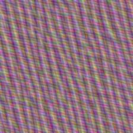](https://www.machinecurve.com/wp-content/uploads/2019/12/block3_conv2_21.jpg)
    
- [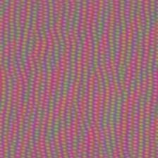](https://www.machinecurve.com/wp-content/uploads/2019/12/block3_conv2_123.jpg)
    
- [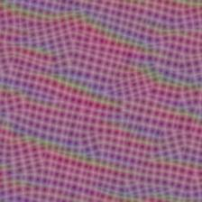](https://www.machinecurve.com/wp-content/uploads/2019/12/block3_conv2_162.jpg)
    
- [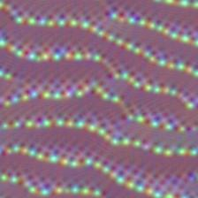](https://www.machinecurve.com/wp-content/uploads/2019/12/block3_conv2_185.jpg)
    

### Block4Conv1

Details become visible in the fourth convolutional block. It's still difficult to identify real objects in these visualizations, though.

- [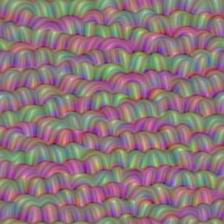](https://www.machinecurve.com/wp-content/uploads/2019/12/block4_conv1_69.jpg)
    
- [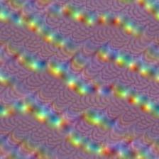](https://www.machinecurve.com/wp-content/uploads/2019/12/block4_conv1_78.jpg)
    
- [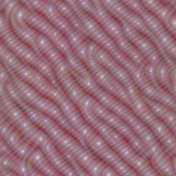](https://www.machinecurve.com/wp-content/uploads/2019/12/block4_conv1_97.jpg)
    
- [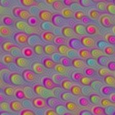](https://www.machinecurve.com/wp-content/uploads/2019/12/block4_conv1_100.jpg)
    
- [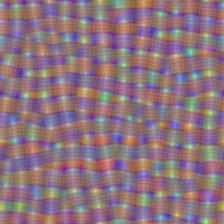](https://www.machinecurve.com/wp-content/uploads/2019/12/block4_conv1_294.jpg)
    
- [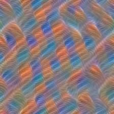](https://www.machinecurve.com/wp-content/uploads/2019/12/block4_conv1_461.jpg)
    

### Block5Conv2

This latter becomes possible in the visualizations generated from the fifth block. We see eyes and other shapes, which clearly resemble the objects that this model was trained to identify.

- [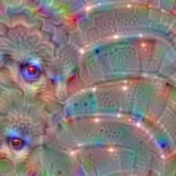](https://www.machinecurve.com/wp-content/uploads/2019/12/block5_conv2_53.jpg)
    
- [](https://www.machinecurve.com/wp-content/uploads/2019/12/block5_conv2_136.jpg)
    
- [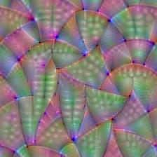](https://www.machinecurve.com/wp-content/uploads/2019/12/block5_conv2_222.jpg)
    
- [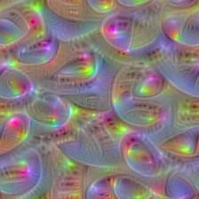](https://www.machinecurve.com/wp-content/uploads/2019/12/block5_conv2_247.jpg)
    
- [](https://www.machinecurve.com/wp-content/uploads/2019/12/block5_conv2_479.jpg)
    
- [](https://www.machinecurve.com/wp-content/uploads/2019/12/block5_conv2_480.jpg)
    

This clearly illustrates that the model learns very detailed patterns near the output, i.e. in the final layers of the model, whereas more global and abstract ones are learnt in the early layers. It now makes perfect sense why the first two or perhaps three layers of ImageNet trained models are often used in practical settings in order to boost training accuracy: the patterns that are learnt are so general that they do not necessarily represent the _object in question_, but rather the _shape in question_. While both the sun, a football and a volleyball are round, we don't know whether an input is any of those in the first few layers. We do know, however, that it's _round_.

## Summary

In this blog post, we've seen how we can use Activation Maximization to generate visualizations for filters in our CNNs, i.e. convolutional neural networks. We provided an example that demonstrates this by means of the `keras-vis` toolkit, which can be used to visualize Keras models.

I hope you've learnt something today! 😀 If you did, or if you have any questions or remarks, please feel free to leave a comment in the comments box below 👇 Thank you for reading MachineCurve today and happy engineering! 😎

## References

Kotikalapudi, Raghavendra and contributors. (2017). Github / keras-vis. Retrieved from [https://github.com/raghakot/keras-vis](https://github.com/raghakot/keras-vis)

Simonyan, K., & Zisserman, A. (2014). Very deep convolutional networks for large-scale image recognition. _[arXiv preprint arXiv:1409.1556](https://arxiv.org/abs/1409.1556)_.

VGG16 - Convolutional Network for Classification and Detection. (2018, November 21). Retrieved from [https://neurohive.io/en/popular-networks/vgg16/](https://neurohive.io/en/popular-networks/vgg16/)
