Suppose that you have an image of a man with a moustache and one of a man without one. You feed them to a segment of a neural network that returns an approximation of the most important features that determine the image, once per image. You then smartly combine the two approximations into one, which you feed to another part of the same neural network...

...what do you see?

If you've trained the neural network well, there's a chance that the output is the _man without moustache, but then with the other person's moustache_.

Sounds great, doesn't it?

[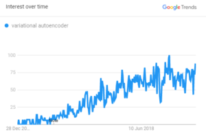](https://www.machinecurve.com/wp-content/uploads/2019/12/image.png)

_Popularity of VAEs in [Google Trends](https://trends.google.com/trends/explore?date=today%205-y&q=variational%20autoencoder)._

Like [GANs](https://www.machinecurve.com/index.php/2019/07/17/this-person-does-not-exist-how-does-it-work/), **Variational Autoencoders** **(VAEs)** can be used for this purpose. Being an adaptation of classic autoencoders, which are used for dimensionality reduction and input denoising, VAEs are _generative_. Unlike the classic ones, with VAEs you can use what they've learnt in order to generate _new samples_. Blends of images, predictions of the next video frame, synthetic music - the list goes on.

..and on! VAEs have been rising in popularity over the last few years. Let's investigate them in more detail 😁

In this blog post, we'll take a _generative_ view towards VAEs. Although strictly speaking, VAEs are autoencoders and can also be used for e.g. denoising, we already have posts about such applications - specifically for [image denoising](https://www.machinecurve.com/index.php/2019/12/20/building-an-image-denoiser-with-a-keras-autoencoder-neural-network/) and [signal denoising](https://www.machinecurve.com/index.php/2019/12/19/creating-a-signal-noise-removal-autoencoder-with-keras/). Here, we'll focus on how to use VAEs for generative purposes.

This means first covering traditional (or, _vanilla_) autoencoders. What types do exist? And what are they used for? We'll see that they have very interesting applications. But we'll also find out what their limitations are. When your goal is to generate new content, it's difficult if not impossible to use these classic autoencoders. We'll also cover why this is the case.

We then introduce Variational Autoencoders. We'll cover what they are, and how they are different from traditional autoencoders. The two primary differences - that samples are encoded as two vectors that represent a probability distribution over the latent space rather than a point in latent space _and_ that [Kullback-Leibler divergence](https://www.machinecurve.com/index.php/2019/12/21/how-to-use-kullback-leibler-divergence-kl-divergence-with-keras/) is added to optimization - will be covered in more detail. Through these, we'll see why VAEs are suitable for generating content.

As an extra, this blog also includes some examples of data generated with VAEs.

Are you ready?

Let's go! 😎

**Update 08/Dec/2020:** added references to PCA article.

* * *

\[toc\]

* * *

## About normal autoencoders

Before we can introduce Variational Autoencoders, it's wise to cover the general concepts behind autoencoders first. Those are valid for VAEs as well, but also for the vanilla autoencoders we talked about in the introduction.

At a high level, this is the architecture of an autoencoder:

It takes some data as input, encodes this input into an encoded (or latent) state and subsequently recreates the input, sometimes with slight differences (Jordan, 2018A).

Autoencoders have an _encoder segment_, which is the mapping between the input data and the encoded or latent state, and a _decoder segment_, which maps between latent state and the reconstructed output value.

Reconstructions may be the original images:

But autoencoders may also be used for [noise reduction](https://www.machinecurve.com/index.php/2019/12/20/building-an-image-denoiser-with-a-keras-autoencoder-neural-network/):

[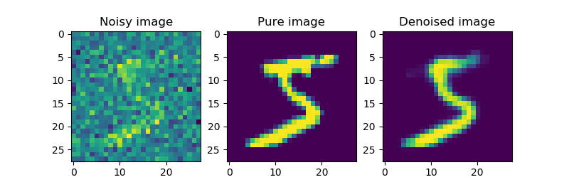](https://www.machinecurve.com/wp-content/uploads/2019/12/1-5.png)

The fun thing about autoencoders is that the encoder and decoder segments are _learnt_, because neural networks are used to implement them. They are trained together with the other parts of the network. Usually, the networks as a whole use loss functions such as Mean Squared Error or [Crossentropy loss](https://www.machinecurve.com/index.php/2019/10/22/how-to-use-binary-categorical-crossentropy-with-keras/) (Shafkat, 2018). This way, autoencoders will be very data-specific. This is good news when you wish to have e.g. a tailor-made denoiser, but becomes challenging when you want to use the learnt encoding across various projects. In those cases, e.g. generalized denoising functions such as mean/median sample removal may be more suitable to your problem.

Let's now take a look at classic autoencoders in more detail and how they are used, so that we can understand why they are problematic if we want to generate new content.

### Types of vanilla / traditional autoencoders

Jordan (2018B) defines multiple types of traditional autoencoders: among them, undercomplete autoencoders, sparse autoencoders and denoising autoencoders. Myself, I'd like to add _convolutional autoencoders_ to this list, as well as _recurrent_ autoencoders. They effectively extend undercomplete and sparse autoencoders by using convolutional or recurrent layers instead of Dense ones.

**Undercomplete** autoencoders involve creating an information bottleneck, by having hidden layers with many fewer neurons than the input and output layers. This way, the neural network is forced to compress much information in fewer dimensions (Jordan, 2018B) - exactly the goal of an autoencoder when generating the encoding.

**Sparse autoencoders**, on the other hand, do have an equal number of neurons in their hidden layers compared to input and output neurons, only not all of them are used or do contribute to the training process (Jordan, 2018B). Regularization techniques like L1 regularization or [Dropout](https://www.machinecurve.com/index.php/2019/12/16/what-is-dropout-reduce-overfitting-in-your-neural-networks/) can serve this purpose, effectively creating the information bottleneck once more.

When using **Denoising autoencoders**, the goal is no longer to _reconstruct the input data_. Rather, your goal has become _denoising the input data_ by learning the noise (Jordan, 2018B). This is achieved by adding noise to pure inputs, feeding them as samples, while having the original pure samples as targets. Minimizing reconstruction loss then involves learning noise. At MachineCurve, we have available examples for [signal noise](https://www.machinecurve.com/index.php/2019/12/19/creating-a-signal-noise-removal-autoencoder-with-keras/) and [image noise](https://www.machinecurve.com/index.php/2019/12/20/building-an-image-denoiser-with-a-keras-autoencoder-neural-network/).

While traditionally densely-connected layers (or Dense layers) have been used for autoencoders, it's of course also possible to use **convolutional** or **recurrent** layers when creating them. The convolutional ones are useful when you're trying to work with image data or image-like data, while the recurrent ones can e.g. be used for discrete and sequential data such as text.

### What are normal autoencoders used for?

There are two main applications for traditional autoencoders (Keras Blog, n.d.):

- **Noise removal**, as we've seen above.
- **Dimensionality reduction**. As the _encoder segment_ learns representations of your input data with much lower dimensionality, the encoder segments of autoencoders are useful when you wish to perform dimensionality reduction. This can especially be handy when e.g. [PCA](https://www.machinecurve.com/index.php/2020/12/07/introducing-pca-with-python-and-scikit-learn-for-machine-learning/) doesn't work, but you suspect that nonlinear dimensionality reduction does (i.e. using neural networks with nonlinear activation functions).

You may now think: I have an idea! 💡 It goes as follows:

_"Okay, my autoencoder learns to map inputs to an encoded representation (the latent state), which is subsequently re-converted into some output. Can't I generate new outputs, then, when I feeda randomly sampled encoded state to the decoder segment of my autoencoder?"_

It's a good idea, because intuitively, the decoder must be capable of performing similar to the generator of a GAN when trained (Rocca, 2019).

But the answer is _no_ 😥. Traditional autoencoders cannot be used for this. We'll now investigate why.

* * *

## The Content Generation problem

Yes: generating new content with traditional autoencoders is quite challenging, if not impossible. This has to do with how classic autoencoders map their input to the latent space and how the encoded state is represented. If this seems like abracadabra to you - don't worry. I'll try to explain it in plainer English now 😀

### How classic autoencoders map input to the latent space

To illustrate the point, I've trained a classic autoencoder where the encoded state has only 2 dimensions. This allows us to plot digits with Matplotlib. Do note that going from 784 to 2 dimensions is a substantial reduction and will likely lead to too much information loss than strictly necessary (indeed, the loss value stalled at around \[latex\]\\approx 0.25\[/latex\], while in a similar network a loss of \[latex\]\\approx 0.09\[/latex\] could be achieved).

The plot of our encoded space - or latent space - looks as follows. Each color represents a class:

[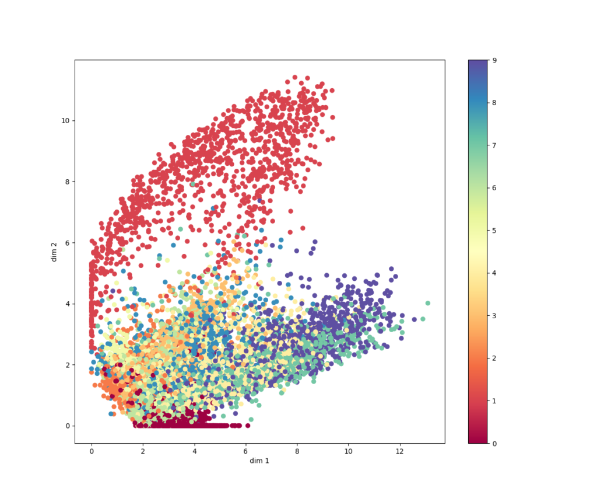](https://www.machinecurve.com/wp-content/uploads/2019/12/classic_autoencoder.png)

Some classes (the zeroes and especially the ones) are discriminative enough in order to be mapped quite successfully. Others, such as nines, eights and sevens, are less discriminative. This explains the relatively high loss.

### Continuity and completeness

However, let's go back to content generation. If we do wish to create new content, we really want our latent space to satisfy two criteria (Rocca, 2019):

- It must be **continuous**. This means that two close points in the latent space should give two similar outputs when decoded.
- It must be **complete**. This means that a point sampled from the distribution should produce an output that makes sense.

The thing with classic autoencoders is this: they're likely neither. Let's find out why.

### Normal autoencoders don't work here

As an example: suppose that you train a classic autoencoder where your latent space has six dimensions. The encoder segment of the autoencoder will then output a vector with six values. In other words: it outputs a single value per dimension (Jordan, 2018A).

In the plot of our latent state space above - where we trained a classic autoencoder to encode a space of _two dimensions_ - this would just be a dot somewhere on an (x, y) plane.

Does this plot, with all the dots, meet the criteria specified above?

No: it's neither continuous nor complete. Take a look at the plot and at what would happen if I would take a random position in my latent space, decode the output - generating a zero - and then start moving around.

If the space were _continuous_, it would mean that I'd find a value somewhere between a zero and a five (in terms of shape, not in terms of number!).

As you can see, however, I would find outputs like six, seven, one, two, ... anything but a five-ish output. The latent space of a classic autoencoder is hence not continuous.

But is it complete?

Nope, it's neither.

If I'd go back to my original sample, and moved around to a position that would decode as a one, I'd find a hole just beyond the halfway mark.

The decoder would likely produce utter nonsense here, since it simply hasn't seen anything similar to that particular encoding! (Rocca, 2019)

I hope it's clear now: the latent spaces of classic autoencoders are neither _continuous_ nor _complete_. They don't produce similar outputs when changing the encoding over short distances in space, and the odds are there that they will produce nonsense when you'll feed encodings the model hasn't seen before. This is why traditional autoencoders cannot be used for content generation.

### Why does this happen?

Funnily, the undesirable behavior of classic autoencoders with respect to content generation is perfectly explainable. It's because _they were never trained to do so_. They were trained to approximate the target output (i.e., the reconstructed input, or the denoised input, and so on) in the best way possible (Rocca, 2019).

In machine learning terms, this means that the only goal of the classic autoencoder is to _minimize reconstruction loss_. Minimizing reconstruction loss needs no continuity or completeness. Nope, it only needs learning a way of generating encodings for inputs that maximize reconstruction to the desired output. Whether this happens with or without a continuous and complete state, is of no concern to the autoencoder.

What's more, factors like the distribution of your training data, the dimension of the latent space configured by the machine learning engineer, and the architecture of your encoder - they all influence the _regularity_ and hence continuity and completeness of your autoencoder's, and thus are factors in explaining why classic autoencoders cannot be used (Rocca, 2019).

To make a long story short: training an autoencoder that generates a latent space that is both continuous and complete _locally_ (i.e., for some point in space and its direct vicinity) is difficult. Achieving the same but then _globally_ (i.e., for the entire space) is close to impossible when using traditional autoencoders. Such a shame! 😑

* * *

## Say hello to Variational Autoencoders (VAEs)!

Let's now take a look at a class of autoencoders that _does work_ well with generative processes. It's the class of Variational Autoencoders, or VAEs. They are "powerful generative models" with "applications as diverse as generating fake human faces \[or producing purely synthetic music\]" (Shafkat, 2018). When comparing them with [GANs](https://www.machinecurve.com/index.php/2019/07/17/this-person-does-not-exist-how-does-it-work/), Variational Autoencoders are particularly useful when you wish to _adapt_ your data rather than _purely generating new data_, due to their structure (Shafkat, 2018).

### How are VAEs different from traditional autoencoders?

[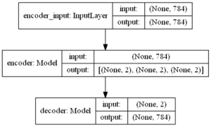](https://www.machinecurve.com/wp-content/uploads/2019/12/vae_mlp.png)

They achieve this through two main differences (Shafkat, 2018; Rocca, 2019; Jordan, 2018A):

- Firstly, recall that classic autoencoders output one value per dimension when mapping input data to latent state. VAEs don't do this: rather, they output a Gaussian probability distribution with some mean \[latex\]\\mu\[/latex\] and standard deviation \[latex\]\\sigma\[/latex\] for every dimension. For example, when the latent state space has seven dimensions, you'd thus get seven probability distributions that together represent state, as a probability distribution across space.
- Secondly, contrary to classic autoencoders - which minimize reconstruction loss only - VAEs minimize a combination of reconstruction loss and a probability comparison loss called [Kullback-Leibler divergence](https://www.machinecurve.com/index.php/2019/12/21/how-to-use-kullback-leibler-divergence-kl-divergence-with-keras/). This enforces the regularization we so deeply need.

These two differences allow them to be both _continuous_ and, quite often, _complete_, making VAEs candidates for generative processes.

Let's now take a look at these differences in more detail :)

### First difference: encodings are probability distributions

Recall that classic autoencoders encode their inputs as a single point in some multidimensional space. Like this, for five-dimensional encoded space:

VAEs don't do this, and this is their first difference: yes, they still encode inputs to some multidimensional space, but they encode inputs as a _distribution over the latent space_ (Rocca, 2019). As part of this, the encoder doesn't output _one vector_ of size \[latex\]N\[/latex\], but instead _two vectors_ of size \[latex\]N\[/latex\]. The first is a vector of means, \[latex\]\\mu\[/latex\], and the second a vector of standard deviations, \[latex\]\\sigma\[/latex\].

The _encoder_ segment of our VAE is what Kingma & Welling (2013) call the _recognition model:_ it's a learnt approximation ("what must encoding \[latex\]z\[/latex\] be given input \[latex\]x\[/latex\]?") of the _true_ posterior \[latex\]p(z | x)\[/latex\]. Since the approximation is learnt, we don't know its exact distribution, but we _do_ know that the true posterior would be Gaussian, so that the \[latex\]z\[/latex\] from our true posterior would be \[latex\]z \\sim \\mathcal{N}(\\mu,\\,\\sigma^{2})\\,\[/latex\] ("z is part of a Gaussian a.k.a. normal distribution with mean \[latex\]\\mu\[/latex\] and standard deviation \[latex\]\\sigma\[/latex\]", Kingma & Welling 2013).

By consequence, we assume that the _approximated_ posterior distribution (the distribution generated by the encoder) is also distributed \[latex\]\\mathcal{N}(\\mu,\\,\\sigma^{2})\\,\[/latex\]. This, in return, means that we can effectively combine the two vectors into one, if we assume that each element in the new vector is a random variable \[latex\]X \\sim \\mathcal{N}(\\mu,\\,\\sigma^{2})\\,\[/latex\] with the \[latex\]\\mu\[/latex\]s and \[latex\]\\sigma\[/latex\]s being the values from the vectors.

So:

[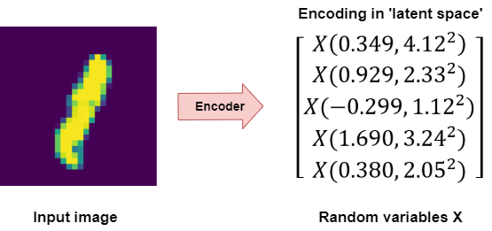](https://www.machinecurve.com/wp-content/uploads/2019/12/vae-encoder-x.png)

When we know the encoding of our input, we can randomly sample from all the variables \[latex\]X\[/latex\], selecting a number from the distribution with which the encoding was made. We then feed this number to the decoder, which decodes it into - hopefully 😀 - interpretable output (Shafkat, 2018).

The fact that we sample randomly means that what we feed to the decoder is different every time (i.e., at every epoch during training, and at every inference in production, Jordan 2018A). This means that the reconstructed output is slightly different every time (Shafkat, 2018).

It's important to understand this property, which is visualized below for a two-dimensional latent space with two Gaussian distributions (red and blue) generating a range of possible sampled \[latex\]X\[/latex\]s (the area in green):

_Even though this work is licensed under CC0, I'd wish to pay thanks to Wikipedia user 'BScan' for creating it: ["Illustration of a multivariate gaussian distribution and its marginals."](https://en.wikipedia.org/wiki/Multivariate_normal_distribution#/media/File:MultivariateNormal.png)_

As we can see, the mean values \[latex\]\\mu\[/latex\] for our distributions determine the average center of the range of values, while the \[latex\]\\sigma\[/latex\]s determine the area in green (Shafkat, 2018).

Now why is this difference - _probability distributions instead of points_ - important? Let's explore.

Do you remember the two criteria that latent spaces must preferably satisfy if you wish to use autoencoders for generative processes? Indeed, they must be _continuous_ and, preferably, _complete_.

If the space is continuous, two inputs to the decoder should produce similar results. If it's complete, all inputs in some area should produce results that make sense.

Having the VAE encoder output a probability distribution over the latent space ensures that it's continuous and (theoretically, with infinite iterations) complete over a _local segment_ in the space. That is, for the samples in one class, or for only a few samples together. The illustration above clearly demonstrates this: within the green area, there's only a limited amount of space that is white. What's more, the results are similar: all the samples are drawn from the same probability distribution, which was generated as the encoding for _just one sample_.

### Second difference: KL divergence + reconstruction error for optimization

Now imagine what happens when you feed dozens of samples (or, with the size of today's datasets, likely thousands or tens of thousands of samples) to the encoder. Given its learnt internals, it will produce a vector of means and standard deviations for each of them.

Now imagine that for each vector, we draw the variables \[latex\]X\[/latex\] once, generating various points in the latent space. But now imagine that we do so an infinite amount of times, but _without removing the earlier points_. What you'll get is an area in space that becomes entirely filled, with only the bounds unfilled.

Why this happens is simple: the probability distributions that were encoded by the encoder overlap, and so do the points - especially when you don't stop sampling :-)

This is the benefit of the _first difference_, covered previously. But we're not there yet. Let's take a look at a visualization of a 2D latent space generated by a VAE that is trained to minimize reconstruction loss:

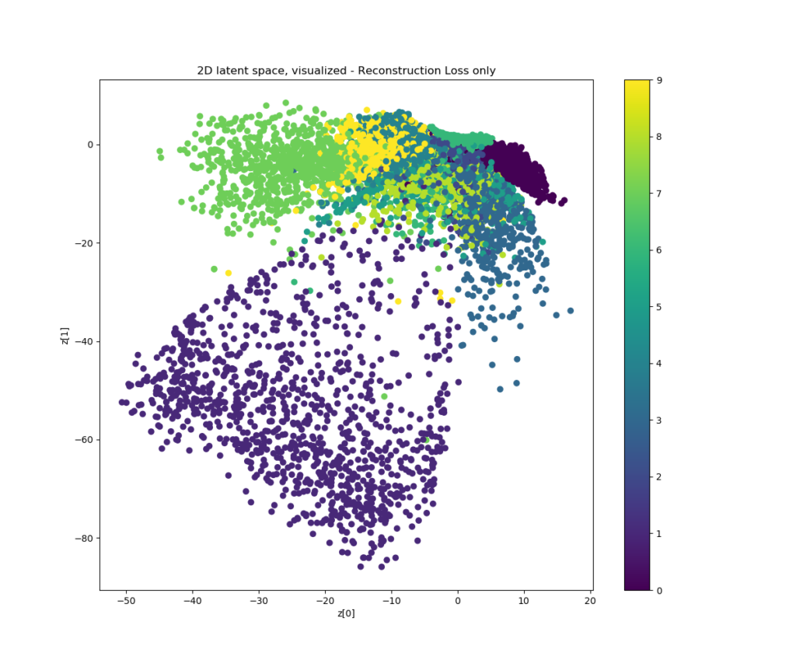

What I see is a distribution that is not _centered_, leaving many holes in between samples, where the decoder will not know how to decode the sampled point, producing nonsensical outputs.

What I see as well is that when moving across space (ignoring the nonsense data generated in the holes), the results produced are quite similar to each other. Take for example the _zeroes_ generated at the top right of the diagram. Moving a bit to the left and to the top leaves us in the cluster with _sixes_, and yep: a 0 looks quite like a 6, in terms of shape. Zeroes and _ones_ do not look like each other at all, and hey, they are located really far from each other! That's great 🎉

In terms of the principles: **the latent spaces generated by VAEs trained to minimize reconstruction loss are _continuous_, but not _complete_.**

This happens because the neural network has only been trained to minimize _reconstruction loss_ so far.

Minimizing reconstruction loss in plain English goes like this: "make the output look like the input as much as possible - and take any chance you'll get". This ensures that the model will encode the latent space in a way that _discriminates_ between classes, as much as possible (i.e., if it's not certain whether an input is a zero or a six, it will encode it to be somewhere in between. It will also move samples about which it is very certain as far away as possible, especially when encoding samples at the edges of input space).

Thus:

1. Training with reconstruction loss clusters samples that look like each other together. This means that each class is clustered together and samples from different classes that look alike are encoded close to each other. Hence, the _continuity_ principle is satisfied.
2. However, there is no such thing that ensures that the clusters _do overlap to some extent, having attachment to each other_. In fact, it may be the case that in order to minimize reconstruction loss, the encoder will encode samples into disjoint clusters, i.e. clusters that _have no overlap!_ By consequence, we must say that the _completeness_ principle is still not satisfied.

Fortunately, there is a workaround: adding the [Kullback-Leibler divergence](https://www.machinecurve.com/index.php/2019/12/21/how-to-use-kullback-leibler-divergence-kl-divergence-with-keras/) to the loss function. This divergence, which is also called KL divergence, essentially computes the "divergence" between two probability distributions (i.e., how much they look _not_ like each other).

If we add it to the loss function (currently with reconstruction loss only) to be minimized by the neural network, and configure it to compare the probability distribution generated by the encoder with the standard Gaussian \[latex\]\\mathcal{N}(0, 1^{2})\\,\[/latex\], we get the following plot when retraining the model:

[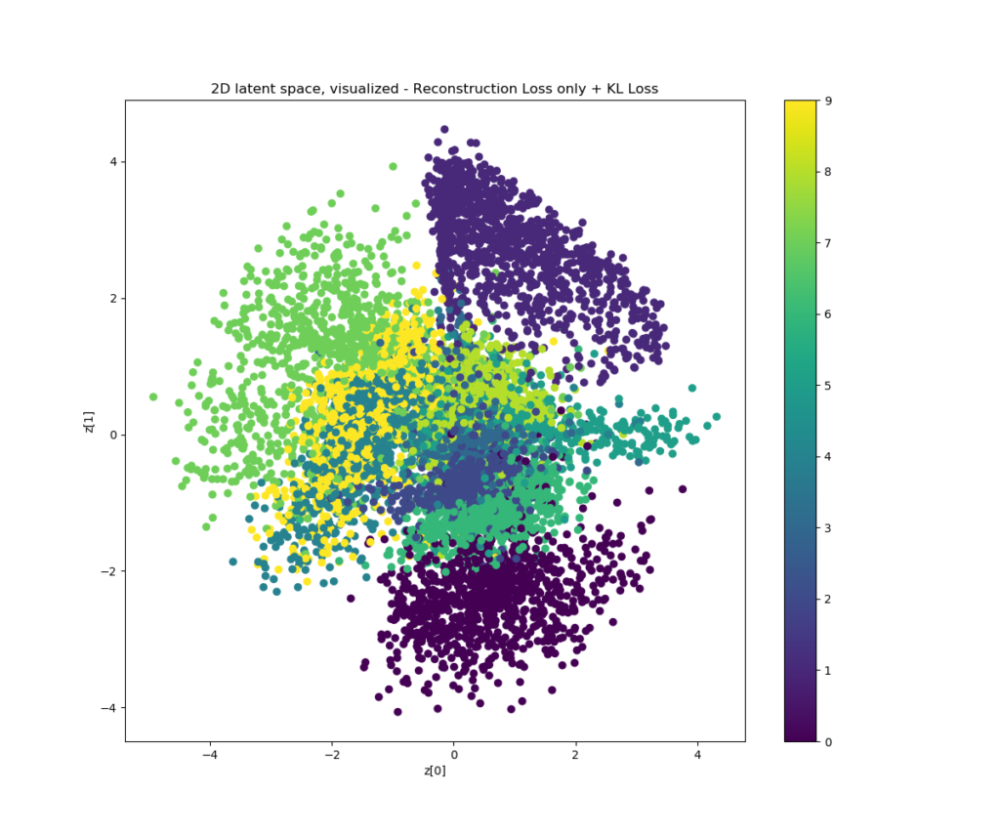](https://www.machinecurve.com/wp-content/uploads/2019/12/rlkl_2d.png)

It's clear that _continuity_ is still enforced: zeroes and ones are still on opposite sides of the latent space, while for example the values 6 and 8 are close together.

However, what also becomes visible is that the _completeness_ principle is now also met to a great extent!

This happens because the KL divergence loss term increases when the probability distribution generated by the encoder diverges from the \[latex\]\\mathcal{N}(0, 1^{2})\\,\[/latex\] standard normal distribution. Effectively, this means that the neural network is regularized to learn an encoder that produces a probability distribution with \[latex\]\\mu \\approx 0\[/latex\] and \[latex\]\\sigma \\approx 1\[/latex\], "pushing" the probability distributions and hence the sampled \[latex\]X\[/latex\]s close together.

And this is visible in the illustration above: the entire latent space is built around the point \[latex\](0, 0)\[/latex\] with the majority of samples being within the \[latex\]\[-1, +1\]\[/latex\] domain and range. There are much fewer holes now, making the global space much more _complete_.

### Recap: why does this help content generation?

So, in short:

- VAEs learn encoders that produce probability distributions over the latent space instead of points in the latent space.
- As we sample from these probability distributions during many training iterations, we effectively show the decoder that the entire area around the distribution's mean produces outputs that are similar to the input value. In short, we create a _continuous and complete latent space_ locally.
- By minimizing a loss function that is composed of both reconstruction loss and KL divergence loss, we ensure that the same principles also hold globally - at least to a maximum extent.
- This way, we have a continuous and complete latent space globally - i.e., for all our input samples, and by consequence also similar ones.
- This, in return, allows us to "walk" across the latent space, and generate input that both makes sense (thanks to completeness) and is similar to what we've seen already on our journey (thanks to the continuity).

Let's now take a walk 😂

* * *

## Examples of VAE generated content

### MNIST dataset

When training a VAE with the MNIST dataset, this is the latent space (on the left) and the result of selecting points in this space randomly on the right (Keras Blog, n.d.). Clearly, the latent space is continuous _and_ complete, as the generated content shows.

- [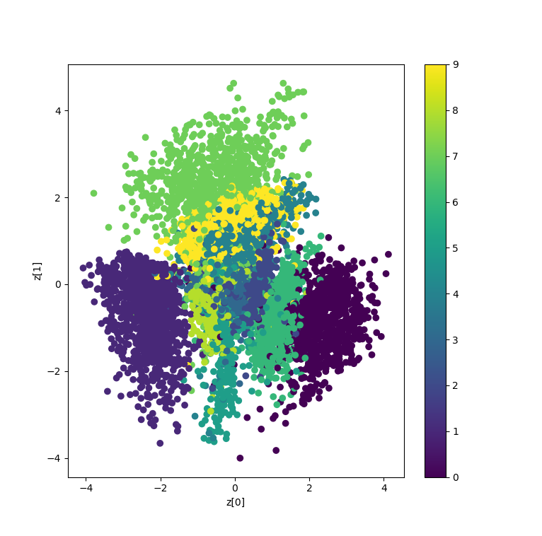](https://www.machinecurve.com/wp-content/uploads/2019/12/vae_space.png)
    
- [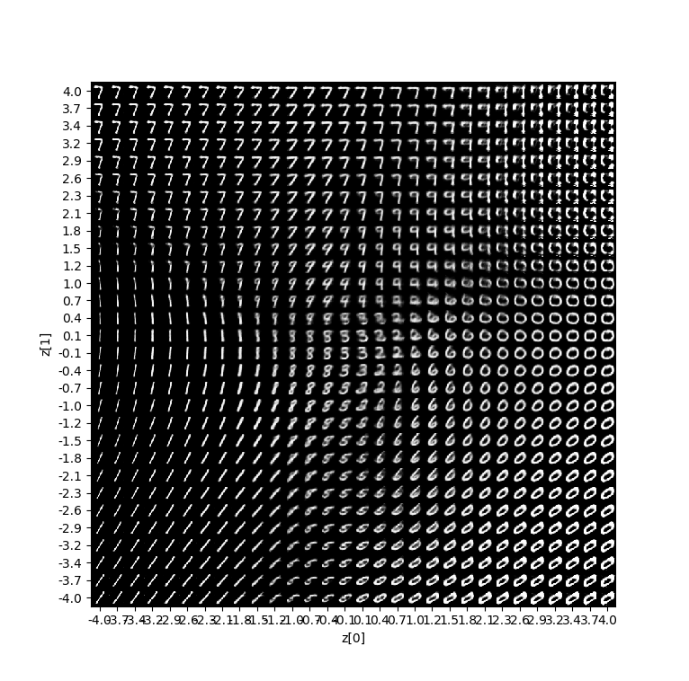](https://www.machinecurve.com/wp-content/uploads/2019/12/vae_mnist.png)
    

_The script to generate these plots was created by François Chollet and can be retrieved [here](https://github.com/keras-team/keras/blob/master/examples/variational_autoencoder.py)._

Great! 😎

### Fashion MNIST

With quite some easy changes (effectively replacing all references to `mnist` with `fashion_mnist` in the script mentioned above), one can replace the MNIST dataset with the Fashion MNIST dataset. This should be harder for the model, because the fashion items are less discriminative than the original MNIST samples. I feel that indeed, the plot of the latent space is a bit flurrier than the plot of the original MNIST dataset - but still, random decodings of points in the latent space show that it works! 🎉

- [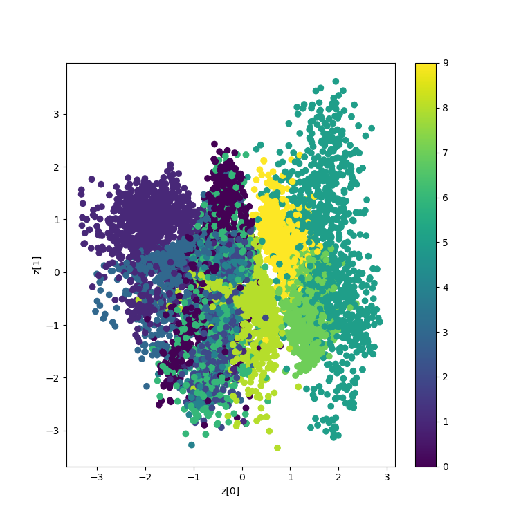](https://www.machinecurve.com/wp-content/uploads/2019/12/fmnist_50_latsp.png)
    
- [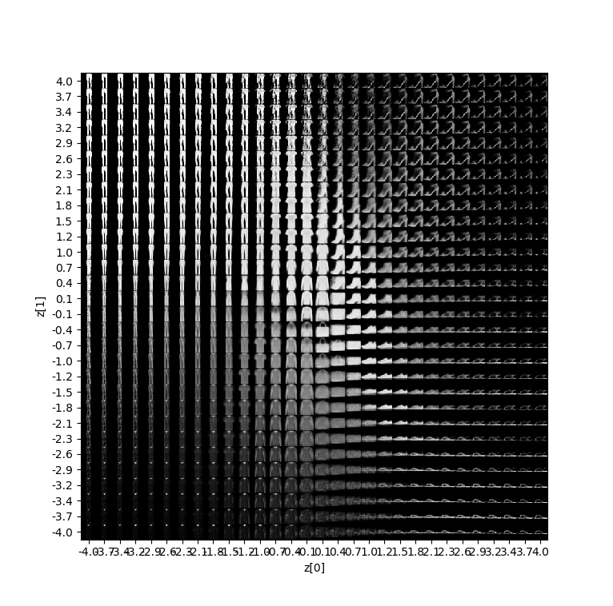](https://www.machinecurve.com/wp-content/uploads/2019/12/fmnist_50_plot.png)
    

_The script to generate these plots was created by François Chollet and can be retrieved [here](https://keras.io/examples/variational_autoencoder_deconv/)._

Now, let's see if we can improve when we regularize even further.

As with the Dropout best practices, [we applied Dropout](https://www.machinecurve.com/index.php/2019/12/16/what-is-dropout-reduce-overfitting-in-your-neural-networks/) with \[latex\]p = 0.5\[/latex\] in the hidden layers and max-norm regularization with \[latex\]maxnormvalue = 2.0\[/latex\]. It seems to improve the model's ability to discriminate between classes, which also becomes clear from the samples across latent space:

- [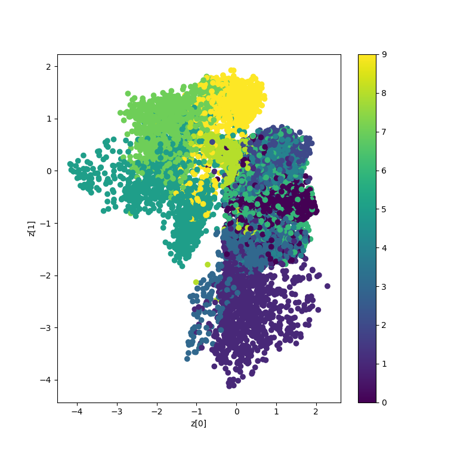](https://www.machinecurve.com/wp-content/uploads/2019/12/fmnist_dmax_space.png)
    
- 
    

_The script to generate these plots was created by François Chollet and can be retrieved [here](https://keras.io/examples/variational_autoencoder_deconv/)._

* * *

## Summary

In this blog post, we've looked at the concept of a Variational Autoencoder, or VAE. We did so by looking at classic or 'normal' autoencoders first, as well as their difficulties when it comes to content generation.

Doing so, we have seen how VAEs may overcome these issues by encoding samples as a probability distribution over the latent space, making it continuous and complete - which allows generative processes to take place. We illustrated this with two examples, a visualization of the MNIST dataset and its latent space as well as the Fashion MNIST dataset. Clearly, the more discriminative - the MNIST - produced a better plot.

I hope you've learnt something today. If you like my blog, please leave a comment in the comments box below 👇 - I'd really appreciate it! Please do the same if you find mistakes or when you think things could be better. Based on your feedback, I'll try to improve my post where possible.

Thank you for reading MachineCurve today and happy engineering! 😎

* * *

## References

Autoencoder. (2006, September 4). Retrieved from [https://en.wikipedia.org/wiki/Autoencoder](https://en.wikipedia.org/wiki/Autoencoder)

Shafkat, I. (2018, April 5). Intuitively Understanding Variational Autoencoders. Retrieved from [https://towardsdatascience.com/intuitively-understanding-variational-autoencoders-1bfe67eb5daf](https://towardsdatascience.com/intuitively-understanding-variational-autoencoders-1bfe67eb5daf)

Rocca, J. (2019, December 8). Understanding Variational Autoencoders (VAEs). Retrieved from [https://towardsdatascience.com/understanding-variational-autoencoders-vaes-f70510919f73](https://towardsdatascience.com/understanding-variational-autoencoders-vaes-f70510919f73)

Jordan, J. (2018A, July 16). Variational autoencoders. Retrieved from [https://www.jeremyjordan.me/variational-autoencoders/](https://www.jeremyjordan.me/variational-autoencoders/)

Jordan, J. (2018B, March 19). Introduction to autoencoders. Retrieved from [https://www.jeremyjordan.me/autoencoders/](https://www.jeremyjordan.me/autoencoders/)

Keras Blog. (n.d.). Building Autoencoders in Keras. Retrieved from [https://blog.keras.io/building-autoencoders-in-keras.html](https://blog.keras.io/building-autoencoders-in-keras.html)

Kingma, D. P., & Welling, M. (2013). [Auto-encoding variational bayes](https://arxiv.org/abs/1312.6114). _arXiv preprint arXiv:1312.6114_.
