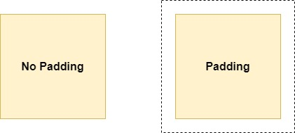
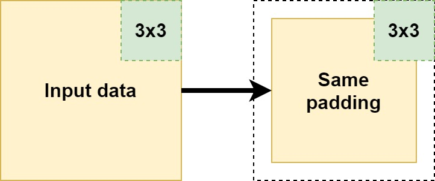
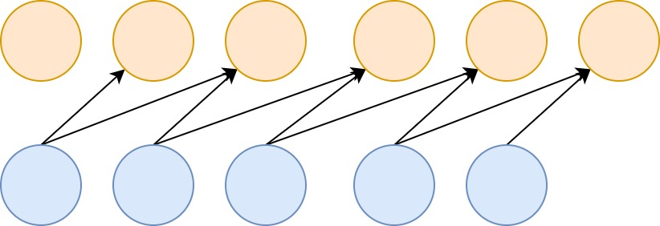
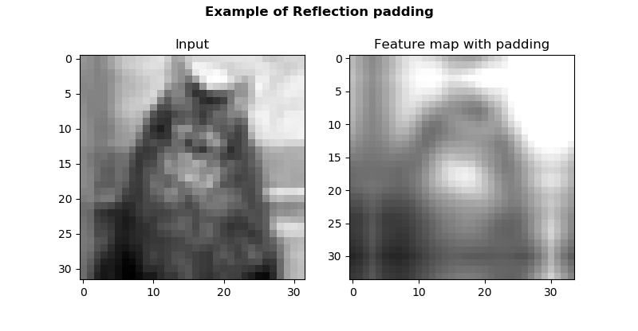

Training Convolutional Neural Networks means that your network is composed of two separate parts most of the times. The last part of your network, which often contains densely-connected layers [but doesn't have to](https://github.com/mobiletest2016/machine-learning-articles/blob/master/articles/reducing-trainable-parameters-with-a-dense-free-convnet-classifier.md), generates a classification or regresses a value based on the inputs received by the first Dense layer.

The first part, however, serves as a "feature extraction" mechanism - it transforms the original inputs into "bits of information" which ensures that the Dense layers perform better (for example, due to the effects of translation invariance; Chollet, 2017). By consequence, the system as a whole allows you to feed it raw inputs, which are processed internally, while you get a probability distribution over a set of classes in return.

Typically, Convolutional layers are used as feature extractors. Through optimization, these layers learn "kernels" which slide (or convolve) over the input data, generating a number of "feature maps" that can subsequently be used for detecting certain patterns in the data. This is achieved by element-wise multiplications between the _slice_ of input data the filter is currently hovering over, and the _weights_ present within the filter.

This, in return, effectively means that a spatial hierarchy is created: the more one moves towards the right when inspecting the [model architecture](https://github.com/mobiletest2016/machine-learning-articles/blob/master/articles/how-to-visualize-a-model-with-keras.md), the smaller the inputs and hence feature maps become. Sometimes, though, you don't want your input to become smaller - in the case of [an autoencoder](https://github.com/mobiletest2016/machine-learning-articles/blob/master/articles/creating-a-signal-noise-removal-autoencoder-with-keras.md), for example, where you just want to converge the feature maps into one Sigmoid activated output. This can be achieved with the **"padding mechanism"**, which is precisely what we'll cover in this blog post.

Firstly, we'll look into the necessity of padding for some cases. This is followed by a generic description of the various forms of padding that are present within today's two most widely used frameworks for deep learning, being Keras - and thus TensorFlow - and PyTorch (please note that we don't provide code examples; this we'll do in a different blog post). For each of them, we'll check what they do. We also try to find out which one should be used in what scenario. We finally recap on all our learnings and finalize the blog.

This way, you should have a good understanding about both the _necessity_ and the _workings_ of padding upon finishing this blog!

Are you ready? Let's go 😎

* * *

\[toc\]

* * *

## What is padding and why do we need it?

Let's first take a look at what padding is. From this, it gets clear straight away why we might need it for training our neural network. More specifically, our _ConvNet_, because that's where you'll apply padding pretty much all of time time 😄

Now, in order to find out about how padding works, we need to study the internals of a convolutional layer first.

Here you've got one, although it's very generic:

[](https://www.machinecurve.com/wp-content/uploads/2019/09/CNN.png)

What you see on the left is an RGB input image - width \[latex\]W\[/latex\], height \[latex\]H\[/latex\] and three channels. Hence, this layer is likely the _first layer in your model_; in any other scenario, you'd have feature maps as the input to your layer.

Now, what is a feature map? That's the yellow block in the image. It's a collection of \[latex\]N\[/latex\] one-dimensional "maps" that each represent a particular "feature" that the model has spotted within the image. This is why convolutional layers are known as feature extractors.

Now, this is very nice - but how do we get from input (whether image or feature map) to a feature map? This is through _kernels_, or _filters_, actually. These filters - you configure some number \[latex\]N\[/latex\] per convolutional layer - "slide" (strictly: convolve) over your input data, and have the same number of "channel" dimensions as your input data, but have much smaller widths and heights. For example, for the scenario above, a filter may be 3 x 3 pixels wide and high, but always has 3 channels as our input has 3 channels too.

Now, when they slide over the input - from left to right horizontally, then moving down vertically after a row has been fully captured - they perform _element-wise multiplications_ between what's "currently under investigation" within the input data and the _weights present within the filter_. These weights are equal to the weights of a "classic" neural network, but are structured in a different way. Hence, optimization a ConvNet involves computing [a loss value](https://github.com/mobiletest2016/machine-learning-articles/blob/master/articles/about-loss-and-loss-functions.md) for the model and subsequently using [an optimizer](https://github.com/mobiletest2016/machine-learning-articles/blob/master/articles/gradient-descent-and-its-variants.md) to change the weights.

Through these weights, as you may guess, the model learns to detect the presence of particular features - which, once again, are represented by the feature maps. This closes the circle with respect to how a convolutional layer works :)

### Conv layers might induce spatial hierarchy

[](https://www.machinecurve.com/wp-content/uploads/2020/02/pad-nopad-conv-1.jpg)

If the width and/or height of your kernels is \[latex\]> 1\[/latex\], you'll see that the width and height of the feature map being output gets smaller. This occurs due to the fact that the feature map slides over the input and computes the element-wise multiplications, but is too large in order to inspect the "edges" of the input. This is illustrated in the image to the right, where the "red" position is impossible to take and the "green" one is part of the path of the convolution operation.

As it cannot capture the edges, it won't be able to effectively "end" at the final position of your row, resulting in a smaller output width and/or height.

For example, take the model that we generated in our blog post ["Reducing trainable parameters with a Dense-free ConvNet classifier"](https://github.com/mobiletest2016/machine-learning-articles/blob/master/articles/reducing-trainable-parameters-with-a-dense-free-convnet-classifier.md). In the model summary, you clearly see that the output shape gets smaller in terms of width and height. Primarily, this occurs due to [max pooling](https://github.com/mobiletest2016/machine-learning-articles/blob/master/articles/what-are-max-pooling-average-pooling-global-max-pooling-and-global-average-pooling.md), but you also see that the second `Conv2D` layer impacts the width and height of the feature map (and indeed, also the _number_ of maps, but this is not relevant for now).

```
Model: "GlobalAveragePoolingBased"
_________________________________________________________________
Layer (type)                 Output Shape              Param #
=================================================================
conv2d (Conv2D)              (None, 26, 26, 32)        320
_________________________________________________________________
max_pooling2d (MaxPooling2D) (None, 13, 13, 32)        0
_________________________________________________________________
dropout (Dropout)            (None, 13, 13, 32)        0
_________________________________________________________________
conv2d_1 (Conv2D)            (None, 11, 11, 64)        18496
```

We call this _a spatial hierarchy._ Indeed, convolutional layers may cause a "hierarchy"-like flow of data through the model. Here, you have a schematic representation of a substantial hierarchy and a less substantial one - which is often considered to be _less efficient_:

[](https://www.machinecurve.com/wp-content/uploads/2020/01/hierarchies.png)

### Padding avoids the loss of spatial dimensions

Sometimes, however, you need to apply filters of a fixed size, but you _don't want to lose width and/or height dimensions in your feature maps_. For example, this is the case when you're [training an autoencoder](https://github.com/mobiletest2016/machine-learning-articles/blob/master/articles/building-an-image-denoiser-with-a-keras-autoencoder-neural-network.md). You need the output images to be of the same size as the input, yet need an [activation function](https://github.com/mobiletest2016/machine-learning-articles/blob/master/articles/overview-of-activation-functions-for-neural-networks.md) like e.g. [Sigmoid](https://github.com/mobiletest2016/machine-learning-articles/blob/master/articles/relu-sigmoid-and-tanh-todays-most-used-activation-functions.md) in order to generate them.

If you would do so with a `Conv` layer, this would become problematic, as you'd reduce the size of your feature maps - and hence would produce outputs unequal in size to your inputs.

That's not what we want when we create an autoencoder. We want the original output and the original output only ;-)

Padding helps you solve this problem. Applying it effectively adds "space" around your input data or your feature map - or, more precisely, "extra rows and columns" \[with some instantiation\] (Chollet, 2017).

[](https://www.machinecurve.com/wp-content/uploads/2020/02/pad-nopad.jpg)

The consequences of this fact are rather pleasurable, as we can see in the example below.

[](https://www.machinecurve.com/wp-content/uploads/2020/02/pad-nopad-conv.jpg)

Adding the "extra space" now allows us to capture the position we previously couldn't capture, and allows us to detect features in the "edges" of your input. This is great! 😊

* * *

## Types of padding

Now, unfortunately, padding is not a binary option - i.e., it cannot simply be turned on and off. Rather, you can choose which padding you use. Based on the Keras docs (Keras, n.d.) and PyTorch docs (PyTorch, n.d.), we'll cover these types of padding next:

- Valid padding (or no padding);
- Same padding;
- Causal padding;
- Constant padding;
- Reflection padding;
- Replication padding.

Please note that the discussion next doesn't contain any Python code. We'll cover the padding options in terms of code in a different blog post ;)

### Valid padding / no padding

[](https://www.machinecurve.com/wp-content/uploads/2020/02/validpad.jpg)

Valid padding simply means "no padding" (Keras, n.d.).

This equals the scenario to the right, where capturing the "edges" only is not possible.

It may seem strange to you that frameworks include an option for valid padding / no padding, as you could simply omit the padding as well. However, this is not strange at all: if you specify some `padding` attribute, there must be a default value. As it may be confusing to perform some padding operation if you didn't specify any, at least Keras chooses to set `padding` to 'valid' if none is provided. By consequence, you can also _specify it yourself_. A bit useless, but possible by design :)

### Same padding / zero padding

Another option would be "same padding", also known as "zero padding". Here, the padding ensures that the output has the same shape as the input data, as you can see in the image below (Keras, n.d.). It is achieved by adding "zeros" at the edges of your layer output, e.g. the white space on the right of the image.

Side note: in Keras, there is an inconsistency between backends (i.e., TensorFlow, Theano and CNTK) [as described here](https://github.com/keras-team/keras/pull/9473#issuecomment-372166860) (Keras, n.d.). However, with TensorFlow 2.0 being the "recommended choice" these days, this shouldn't be too much of a problem.

[](https://www.machinecurve.com/wp-content/uploads/2020/02/same-pad.jpg)

### Constant padding

A type of padding that really resembles same padding is _constant padding_. Here, the outcome can be the same - the output will have the same shape as the input. However, rather than "zeros" - which is what same padding does - constant padding allows you to pad with a user-specified constant value (PyTorch, n.d.). In PyTorch, it is also possible to specify the padding at the boundary level (e.g. pad on the left and the top but not on the right and at the bottom). This obviously breaks with _same padding_ covered earlier; be aware of this.

[](https://www.machinecurve.com/wp-content/uploads/2020/02/constantpad.jpg)

### Causal padding

Suppose that you have a time series dataset, where _two inputs_ together determine an _output_, in a causal fashion. Like this:



It's possible to create a model that can handle this by means of a `Conv1D` layer with a kernel of size 2 - the learnt kernel will be able to map the inputs to the outputs successfully.

But what about the first two targets?

[](https://www.machinecurve.com/wp-content/uploads/2020/02/Causalpad-3.jpg)

Although they are valid targets, the _inputs_ are incomplete - that is, there is insufficient input data available in order to successfully use them in the training process (The Blog, n.d.). For the second target, _one_ input - visible in gray - is missing (whereas the second is actually there), while for the first target both aren't there.

For the first target, there is no real hope for success (as we don't have any input at all and hence do not know which values produce the target value), but for the second, we have a partial picture: we've got half the inputs that produce the target.

Causal padding on the `Conv1D` layer allows you to include the partial information in your training process. By padding your input dataset with zeros at the front, a causal mapping to the first, missed-out targets can be made (Keras, n.d.; The Blog, n.d.). While the first target will be useless for training, the second can now be used based on the partial information that we have:

[](https://www.machinecurve.com/wp-content/uploads/2020/02/Causalpad-4.jpg)

### Reflection padding

Another type of padding is "reflection padding" (TensorFlow, n.d.). As you can see, it pads the values with the "reflection" or "mirror" of the values directly in the opposite direction of the edge of your to be padded shape.

For example, if you look at the image below, for the first row of the yellow box (i.e., your shape):

- If you go to the right, you'll see a 1. Now, you need to fill the padding element directly to the right. What do you find when you move in the _opposite_ direction of the edge? Indeed, a 5. Hence, your first padding value is a 5. When you move further, it's a 3, so the next padding value following the 5 is a 3. And so on.
- In the opposite direction, you get a mirrored effect. Having a 3 at the edge, you'll once again find the 5 (as it's the center value) but the second value for padding will be a 1.
- And so on!

[](https://www.machinecurve.com/wp-content/uploads/2020/02/reflection_pad.jpg)

Reflective padding seems to improve the empirical performance of your model (Physincubus, n.d.). Possibly, this occurs because of how "zero" based padding (i.e., the "same" padding) and "constant" based padding alter the distribution of your dataset:

https://twitter.com/karpathy/status/720622989289644033

This becomes clear when we actually visualize the padding when it is applied:

- [](https://www.machinecurve.com/wp-content/uploads/2020/02/zero_padding.png)
    
- [](https://www.machinecurve.com/wp-content/uploads/2020/02/reflection.png)
    

### Replication padding / symmetric padding

Replication padding looks like reflection padding, but is slightly different (TensorFlow, n.d.). Rather than _reflecting_ like a _mirror_, you simply take a copy, and mirror it. Like this:

- You're at the first row again, at the right. You find a 1. What is the next value?
- Simple: you copy the entire row, mirror it, and start adding it as padding values horizontally. So, for row 1 with \[latex\]\[3, 5, 1\]\[/latex\], this will be \[latex\]\[1, 5, 3\]\[/latex\] being added. As you can see, since we only pad 2 elements in width, there are 1 and 5, but 3 falls off the padding.


As with reflection padding, replication padding attempts to reduce the impact of "zero" and "constant" padding on the quality of your data by using "plausible data values by re-using what is along the borders of the input" (Liu et al., 2018):

- [](https://www.machinecurve.com/wp-content/uploads/2020/02/zero_padding.png)
    
- [](https://www.machinecurve.com/wp-content/uploads/2020/02/replication.png)
    

* * *

## Which padding to use when?

There are no hard criteria that prescribe when to use which type of padding. Rather, it's important to understand that padding is pretty much important all the time - because it allows you to preserve information that is present at the borders of your input data, and present there only.

We've seen multiple types of padding. If you have causal data (i.e. multiple inputs that lead to one target value) and use a one-dimensional convolutional layer to improve model efficiency, you might benefit from "causal" padding to stress the importance of causality in your data by ensuring that your target is never present _before all your input data_.

If you have an image classification problem, or wish to use Conv layers differently, causal padding might not be interesting for you. But "zero" padding, "constant" padding, "reflection" padding and "replication" padding may be. All of them add one or multiple columns and/or rows of padded elements around your shape, but each works differently. While zero and constant padding add zeros and constants, reflection and replication padding attempt to preserve the distribution of your data by re-using what's present along the borders. This, scholars like Liu et al. (2018) expect, could improve model performance. Hence, if you're in this scenario, you may wish to start with reflection or replication padding, moving to constant and eventually zero padding if they don't work.

* * *

## Summary

This blog post discussed the necessity of padding that you may encounter in your machine learning problems - and especially when using Conv layers / when creating a ConvNet. It did so by taking a look at convolutional layers, explaining why borders only cannot be inspected when you don't add padding to your inputs.

Subsequently, we discussed various types of padding - valid padding (a.k.a. no padding), same (or zero) padding, constant padding, reflection padding and replication padding. Through this discussion, you are now likely able to explain the differences between those types of padding.

I hope you've learnt something today! If you did, please feel free to leave a comment in the comments section below 😊 Please do the same if you have any questions, remarks or when you spot a mistake.

Thank you for reading MachineCurve today and happy engineering! 😎

* * *

## References

Chollet, F. (2017). _Deep Learning with Python_. New York, NY: Manning Publications.

Keras. (n.d.). Convolutional Layers. Retrieved from [https://keras.io/layers/convolutional/](https://keras.io/layers/convolutional/)

PyTorch. (n.d.). torch.nn.modules.padding. Retrieved from [https://pytorch.org/docs/stable/\_modules/torch/nn/modules/padding.html](https://pytorch.org/docs/stable/_modules/torch/nn/modules/padding.html)

The Blog. (n.d.). Convolutions in Autoregressive Neural Networks. Retrieved from [https://theblog.github.io/post/convolution-in-autoregressive-neural-networks/](https://theblog.github.io/post/convolution-in-autoregressive-neural-networks/)

TensorFlow. (n.d.). tf.pad. Retrieved from [https://www.tensorflow.org/api\_docs/python/tf/pad](https://www.tensorflow.org/api_docs/python/tf/pad)

Physincubus. (n.d.). When to use what type of padding for convolution layers? Retrieved from [https://stackoverflow.com/questions/44960987/when-to-use-what-type-of-padding-for-convolution-layers#comment77020477\_44960987](https://stackoverflow.com/questions/44960987/when-to-use-what-type-of-padding-for-convolution-layers#comment77020477_44960987)

Liu, G., Shih, K. J., Wang, T. C., Reda, F. A., Sapra, K., Yu, Z., ... & Catanzaro, B. (2018). [Partial convolution based padding](https://arxiv.org/abs/1811.11718). _arXiv preprint arXiv:1811.11718_.
