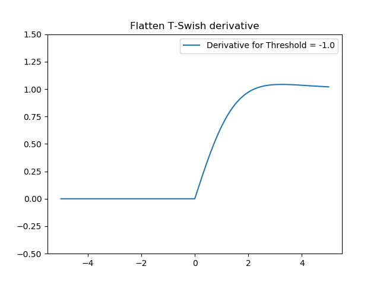
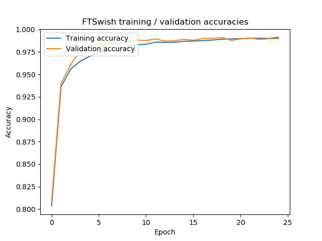
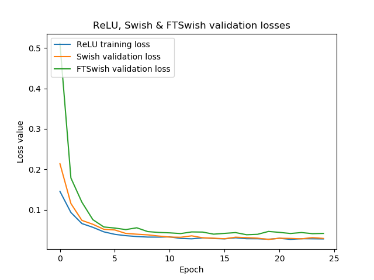
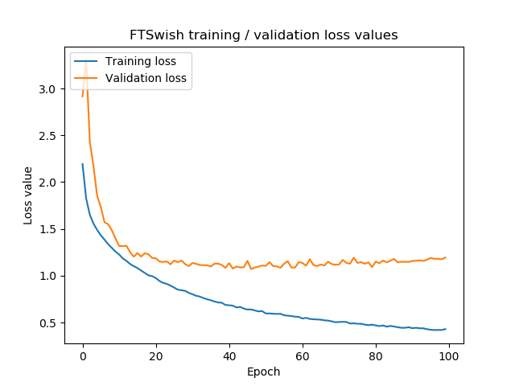
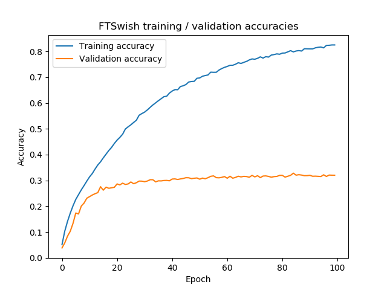
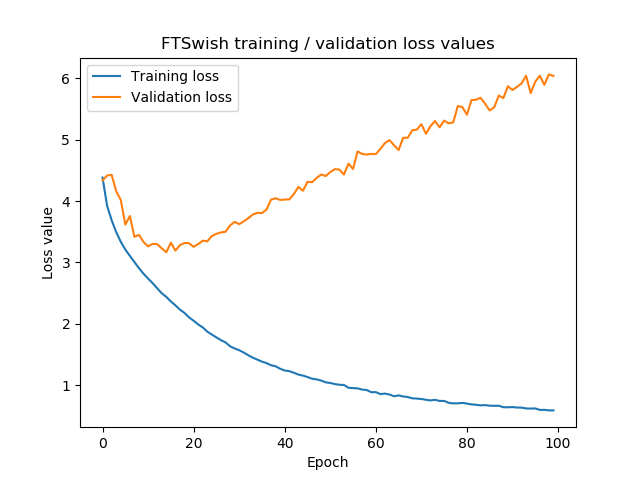
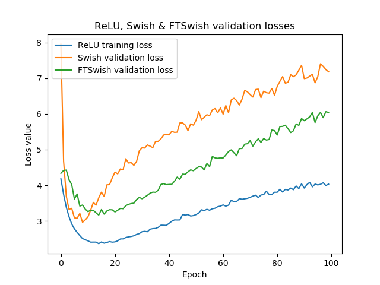

Over the last few years, we've seen the rise of a wide range of activation functions - such as **FTSwish**. Being an improvement to traditional ReLU by blending it with Sigmoid and a threshold value, it attempts to achieve the best of both worlds: ReLU's model sparsity and Sigmoid's smoothness, presumably benefiting the loss surface (MachineCurve, 2019).

In doing so, it attempts to be on par with or even improve newer activation functions like Leaky ReLU, ELU, PReLU and Swish.

In this blog post, we'll look at a couple of things. Firstly, we'll look at the concept of an artificial neuron and an activation function - what are they again? Then, we'll continue by looking at the challenges of classic activation - notably, the vanishing gradients problem and the dying ReLU problem. This is followed by a brief recap on the new activation functions mentioned above, followed by an introduction to **Flatten-T Swish**, or FTSwish. We conclude with comparing the performance of FTSwish with ReLU's and Swish' on the MNIST, CIFAR-10 and CIFAR-100 datasets.

Are you ready? Let's go 😊

* * *

\[toc\]

* * *

## Classic activation functions & their challenges

When creating neural networks, you need to attach activation functions to the individual layers in order to make them work with nonlinear data. Inspiration for them can be traced back to biological neurons, which "fire" when their inputs are sufficiently large, and remain "silent" when they're not. Artificial activation functions tend to show the same behavior, albeit in much less complex ways.

[]

_Schematic drawing of a biological neuron. Source: Dana Scarinci Zabaleta at Wikipedia, licensed CC0_

And necessary they are! Artificial neural networks, which include today's deep neural networks, operate by multiplying a learnt "weights vector" with the "input vector" at each neuron. This element-wise multiplication is a linear operation, which means that any output is linear. As the system as a whole is now linear, it can handle linear data only. This is not powerful.

By placing an artificial activation function directly after each neuron, it's possible to mathematically map the linear neuron output (which is input to the activation function) to some nonlinear output, e.g. by using \[latex\]sin(x)\[/latex\] as an activation function. Now, the system as a whole operates nonlinearly and is capable of handling nonlinear data. That's what we want, because pretty much no real-life data is linear!

### Common activation functions

Over the years, many nonlinear activation functions have emerged that are widely used. They can now be considered to be legacy activation functions, I would say. These are the primary three:

- The **[Sigmoid](https://github.com/mobiletest2016/machine-learning-articles/blob/master/articles/relu-sigmoid-and-tanh-todays-most-used-activation-functions/#sigmoid)** activation function has been around for many years now. It maps any input from a real domain to the range \[latex\](0, 1)\[/latex\]. Sigmoid is a good replacement for the Heaviside step function used in [Rosenblatt Perceptrons](https://github.com/mobiletest2016/machine-learning-articles/blob/master/articles/why-you-cant-truly-create-rosenblatts-perceptron-with-keras.md), which made them non-differentiable and useless with respect to Gradient Descent. Sigmoid has also been used in Multilayer Perceptrons used for classification.
- The **[Tangens hyperbolicus](https://github.com/mobiletest2016/machine-learning-articles/blob/master/articles/relu-sigmoid-and-tanh-todays-most-used-activation-functions/#tangens-hyperbolicus-tanh)** or Tanh activation function is quite an oldie, and has also been around for many years. It maps any input from a real domain into a value in the range \[latex\](-1, 1)\[/latex\]. Contrary to Sigmoid, it's symmetrical around the origin, which benefits optimization. However, it's relatively slow during training, while the next one is faster.
- The **[Rectified Linear Unit](https://github.com/mobiletest2016/machine-learning-articles/blob/master/articles/relu-sigmoid-and-tanh-todays-most-used-activation-functions/#rectified-linear-unit-relu)** or ReLU is the de facto standard activation function for today's neural networks. Activating to zero for all negative inputs and to the identity \[latex\]f(x) = x\[/latex\] for all nonnegative inputs, it induces sparsity and greatly benefits learning.

### Problems with common activation functions

Having been used for many years, both practitioners and researchers have identified certain issues with the previous activation functions that might make training neural nets impossible - especially when the neural networks are larger.

The first issue, the [**vanishing gradients problem**](https://github.com/mobiletest2016/machine-learning-articles/blob/master/articles/random-initialization-vanishing-and-exploding-gradients.md), occurs when the gradients computed during backpropagation are smaller than 1. Given the fact that each gradient is chained to the downstream layers' gradients to find the update with respect to the error value, you'll easily see where it goes wrong: with many layers, and gradients \[latex\]< 1\[/latex\], the upstream gradients get very small. For example: \[latex\] 0.25 \\times 0.25 \\times 0.25 = 0.25^3 = 0.015625\[/latex\]. And this only for a few layers in the network. Remember that today's deep neural networks can have thousands. The effect of vanishing gradients, which is present particularly with Sigmoid: the most upstream layers learn very slowly, or no longer at all. This severely impacts learning.

Fortunately, ReLU does not suffer from this problem, as its gradient is either zero (for \[latex\] x < 0\[/latex\]) or one (for the other values). However, the **dying ReLU problem** is a substantial bottleneck for learning here: if _only one_ of the layers in the chain produces a partial gradient of zero, the entire chain _and_ the upstream layers have a zero gradient. This effectively excludes the neurons from participating in learning, once again severely impacting learning. Especially with larger networks, this becomes an issue, which you'll have to deal with.

* * *

## New activation functions: Leaky ReLU, PReLU, ELU, Swish

Over the years, some new activation functions have emerged to deal with this problem. The first is **Leaky ReLU**: it's a traditional ReLU which "leaks" some information on the left side of the function, i.e. where \[latex\]x < 0\[/latex\]. This is visible in the plot below, as you can identify a very gentle slope configured by some \[latex\]\\alpha\[/latex\] parameter. It resolves the dying ReLU problem by ensuring that the gradient value for all \[latex\]x < 0\[/latex\] is also very small, i.e. the \[latex\]\\alpha\[/latex\] that you configured.

- [Leaky ReLU: improving traditional ReLU](https://github.com/mobiletest2016/machine-learning-articles/blob/master/articles/leaky-relu-improving-traditional-relu.md)
- [Using Leaky ReLU with Keras](https://github.com/mobiletest2016/machine-learning-articles/blob/master/articles/using-leaky-relu-with-keras.md)

[]

The downside of Leaky ReLU is that the value for \[latex\]\\alpha\[/latex\] has to be set in advance. Even though an estimate can be made by pretraining with a small subset of your data serving as a validation set, it's still suboptimal. Fortunately, Leaky ReLU can be generalized into what is known as **Parametric ReLU**, or PReLU. The value for \[latex\]\\alpha\[/latex\] no longer needs to be set by the machine learning engineer, but instead is learnt during training through a few extra trainable parameters. Here too, the gradient for all \[latex\]x < 0\[/latex\] is (very likely, as a learnt \[latex\]\\alpha = 0\[/latex\] cannot be ignored) small but nonzero, so that the dying ReLU problem is avoided.

- [How to use PReLU with Keras?](https://github.com/mobiletest2016/machine-learning-articles/blob/master/articles/how-to-use-prelu-with-keras.md)

Another activation function with which the dying ReLU problem can be avoided is the **Exponential Linear Unit**, or ELU. The creators of this activation function argue that both PReLU and Leaky ReLU still produce issues when inputs are _really_ _large_ and negative, because the negative side of the spectrum does not saturate to some value. They introduce ELU, which both resolves the dying ReLU problem and ensures saturation based on some \[latex\]\\alpha\[/latex\] value.

[]

- [How to use ELU with Keras?](https://github.com/mobiletest2016/machine-learning-articles/blob/master/articles/how-to-use-elu-with-keras.md)

Another relatively popular new activation function is **Swish**, which really looks like ReLU but is somewhat different:

[]

Firstly, it's smooth - which is expected to improve the loss surface during optimization (MachineCurve, 2019). Additionally, it saturates for large negative values, to zero - which is expected to still ensure that the activation function yields model sparsity. However, thirdly, it does produce small but nonzero (negative) outputs for small negative inputs, which is expected to help reduce the dying ReLU problem. Empirical tests with large datasets have shown that Swish may actually be beneficial in settings when larger neural networks are used.

- [Why Swish could perform better than ReLu](https://github.com/mobiletest2016/machine-learning-articles/blob/master/articles/why-swish-could-perform-better-than-relu.md)

* * *

## Introducing Flatten-T Swish (FTSwish)

Another activation function was introduced in a research paper entitled "[Flatten-T Swish: a thresholded ReLU-Swish-like activation function for deep learning](https://arxiv.org/abs/1812.06247)", by Chieng et al. (2018). **Flatten-T Swish**, or FTSwish, combines the ReLU and Sigmoid activation functions into a new one:

[]

FTSwish can be mathematically defined as follows:

\\begin{equation} FTSwish: f(x) = \\begin{cases} T, & \\text{if}\\ x < 0 \\\\ \\frac{x}{1 + e^{-x}} + T, & \\text{otherwise} \\\\ \\end{cases} \\end{equation}

Where \[latex\]T\[/latex\] is a parameter that is called the _threshold value_, and ensures that the negative part of the equation produces negative values (see e.g. the plot, where \[latex\]T = -1.0\[/latex\]).

Clearly, we recognize the ReLU and Sigmoid activation functions combined in the positive segment:

\\begin{equation} Sigmoid: f(x) = \\frac{1}{1 + e^{-x}} \\end{equation}

\\begin{equation} ReLU: f(x) = \\begin{cases} 0, & \\text{if}\\ x < 0 \\\\ x, & \\text{otherwise} \\\\ \\end{cases} \\end{equation}

This way, the authors expect that the function can _both_ benefit from ReLU's and Swish's advantages: sparsity with respect to the negative segment of the function, while the positive segment is smooth in terms of the gradients.

Why both? Let's take a look at these gradients:

[]

_FTSwish derivative_

As we can see, the sparsity principle is still true - the neurons that produce negative values are taken out.

What we also see is that the derivative of FTSwish is smooth, which is what made Swish theoretically better than ReLU in terms of the loss landscape (MachineCurve, 2019).

However, what I must note is that this function does not protect us from the dying ReLU problem: the gradients for \[latex\]x < 0\[/latex\] are zero, as with ReLU. That's why I'm a bit cautious, especially because Swish has _both_ the smoothness property _and_ the small but nonzero negative values at \[latex\]x \\approx 0\[/latex\] when negative.

## FTSwish benchmarks

Only one way to find out if my cautiousness is valid, right? :) Let's do some tests: we'll compare FTSwish with both ReLU and Swish with a ConvNet.

I used the following [Keras datasets](https://github.com/mobiletest2016/machine-learning-articles/blob/master/articles/exploring-the-keras-datasets.md) for this purpose:

- MNIST;
- CIFAR-10;
- CIFAR-100.

### MNIST

For the MNIST based CNN, the architecture was relatively simple - two Conv2D layers, MaxPooling2D, and Dropout, with a limited amount of trainable parameters. This should, in my opinion, still lead to a well-performing model, because MNIST is a relatively discriminative and simple dataset.

```
_________________________________________________________________
Layer (type)                 Output Shape              Param #
=================================================================
conv2d_1 (Conv2D)            (None, 26, 26, 32)        320
_________________________________________________________________
max_pooling2d_1 (MaxPooling2 (None, 13, 13, 32)        0
_________________________________________________________________
dropout_1 (Dropout)          (None, 13, 13, 32)        0
_________________________________________________________________
conv2d_2 (Conv2D)            (None, 11, 11, 64)        18496
_________________________________________________________________
max_pooling2d_2 (MaxPooling2 (None, 5, 5, 64)          0
_________________________________________________________________
dropout_2 (Dropout)          (None, 5, 5, 64)          0
_________________________________________________________________
flatten_1 (Flatten)          (None, 1600)              0
_________________________________________________________________
dense_1 (Dense)              (None, 256)               409856
_________________________________________________________________
dense_2 (Dense)              (None, 10)                2570
=================================================================
Total params: 431,242
Trainable params: 431,242
Non-trainable params: 0
_________________________________________________________________
```

These are the results:

- []
    
- []
    
- []
    

As we can see, FTSwish finds accuracies of 97%+. However, the loss values are slightly worse than the ones reported by training either ReLU or Swish.

### CIFAR-10

With CIFAR-10, I used the same architecture:

```
_________________________________________________________________
Layer (type)                 Output Shape              Param #
=================================================================
conv2d_1 (Conv2D)            (None, 26, 26, 32)        320
_________________________________________________________________
max_pooling2d_1 (MaxPooling2 (None, 13, 13, 32)        0
_________________________________________________________________
dropout_1 (Dropout)          (None, 13, 13, 32)        0
_________________________________________________________________
conv2d_2 (Conv2D)            (None, 11, 11, 64)        18496
_________________________________________________________________
max_pooling2d_2 (MaxPooling2 (None, 5, 5, 64)          0
_________________________________________________________________
dropout_2 (Dropout)          (None, 5, 5, 64)          0
_________________________________________________________________
flatten_1 (Flatten)          (None, 1600)              0
_________________________________________________________________
dense_1 (Dense)              (None, 256)               409856
_________________________________________________________________
dense_2 (Dense)              (None, 10)                2570
=================================================================
Total params: 431,242
Trainable params: 431,242
Non-trainable params: 0
_________________________________________________________________
```

These are the results:

- []
    
- []
    
- []
    

Contrary to the MNIST case, we can see overfitting occur here, despite the application of Dropout. What's more, ReLU seems to perform consistently over time, whereas overfitting definitely occurs with Swish and FTSwish.

### CIFAR-100

Finally, I trained a ConvNet architecture with the CIFAR-100 dataset, which contains 600 images per class across 100 classes. Please do note that I did not use any pretraining and thus transfer learning, which means that the results will likely be quite poor with respect to the state-of-the-art.

But I'm curious to find out how the activation functions perform, so I didn't focus on creating a transfer learning based model (perhaps, I'll do this later).

This is the architecture, which contains additional trainable parameters:

```
_________________________________________________________________
Layer (type)                 Output Shape              Param #
=================================================================
conv2d_1 (Conv2D)            (None, 30, 30, 64)        1792
_________________________________________________________________
max_pooling2d_1 (MaxPooling2 (None, 15, 15, 64)        0
_________________________________________________________________
dropout_1 (Dropout)          (None, 15, 15, 64)        0
_________________________________________________________________
conv2d_2 (Conv2D)            (None, 13, 13, 128)       73856
_________________________________________________________________
max_pooling2d_2 (MaxPooling2 (None, 6, 6, 128)         0
_________________________________________________________________
dropout_2 (Dropout)          (None, 6, 6, 128)         0
_________________________________________________________________
flatten_1 (Flatten)          (None, 4608)              0
_________________________________________________________________
dense_1 (Dense)              (None, 512)               2359808
_________________________________________________________________
dense_2 (Dense)              (None, 256)               131328
_________________________________________________________________
dense_3 (Dense)              (None, 100)               25700
=================================================================
Total params: 2,592,484
Trainable params: 2,592,484
Non-trainable params: 0
_________________________________________________________________
```

These are the results:

- []
    
- []
    
- []
    

As we can see, the model starts overfitting quite soon, despite the application of Dropout. Overfitting is significantly worse compared to e.g. CIFAR-10, but this makes sense, as the number of samples per class is lower _and_ the number of classes is higher.

Perhaps, the number of Dense parameters that can be trained might play a role as well, given the relatively few trainable parameters in the Conv layers :)

What's more, Swish seems to be most vulnerable to overfitting, followed by FTSwish. Traditional ReLU overfits as well, but seems to be most prone against it.

* * *

## Summary

In this blog post, we've looked at the Flatten-T Swish activation function, also known as FTSwish. What is FTSwish? Why do the authors argue that it might improve ReLU? Why does it look like traditional Swish? We answered these questions above: being a combination between traditional Sigmoid and ReLU, it is expected that FTSwish benefits both from the sparsity benefits of ReLU and the smoothness benefits of Sigmoid. This way, it looks a bit like traditional Swish.

In addition, we looked at the performance of FTSwish with the MNIST, CIFAR-10 and CIFAR-100 datasets. Our results suggest that with simple models - we did not use a convolutional base whatsoever - traditional ReLU still performs best. It may be worthwhile to extend these experiments to larger and deeper models in the future, to find out about performance there.

I hope you've learnt something today :) If you did, please leave a comment in the comments box below 😊 Feel free to do so as well if you have questions or if you wish to leave behind remarks, and I'll try to answer them quickly :)

Thanks for reading MachineCurve today and happy engineering! 😎

* * *

## References

Chieng, H. H., Wahid, N., Ong, P., & Perla, S. R. K. (2018). [Flatten-T Swish: a thresholded ReLU-Swish-like activation function for deep learning](https://arxiv.org/abs/1812.06247). _arXiv preprint arXiv:1812.06247_.

Why Swish could perform better than ReLu – MachineCurve. (2019, September 4). Retrieved from [https://github.com/mobiletest2016/machine-learning-articles/blob/master/articles/why-swish-could-perform-better-than-relu/](https://github.com/mobiletest2016/machine-learning-articles/blob/master/articles/why-swish-could-perform-better-than-relu.md)
