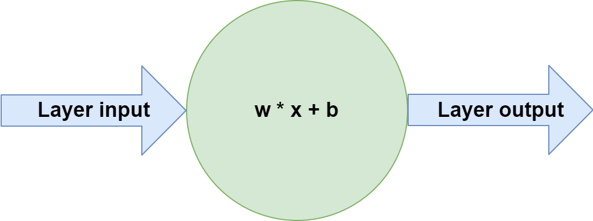
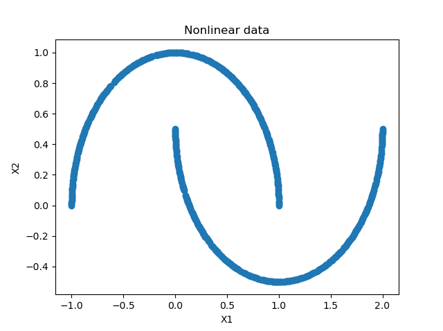
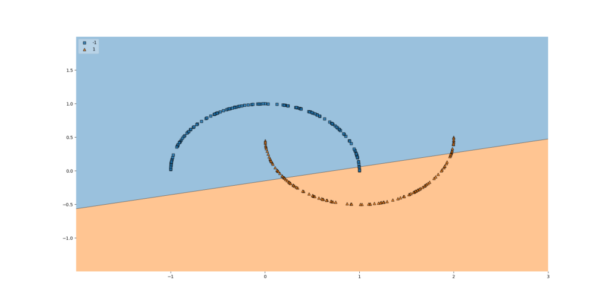

Machine Learning is here to stay. More and more organizations are grasping the benefits of the technology, as long as it is applied with care - and with a realistic mindset. By consequence, demand for ML engineers is high, and the field is working towards increased [commoditization](https://github.com/mobiletest2016/machine-learning-articles/blob/master/articles/using-teachable-machine-for-creating-tensorflow-models.md) and [automation](https://github.com/mobiletest2016/machine-learning-articles/blob/master/articles/automating-neural-network-configuration-with-keras-tuner.md).

But why was there an explosion of Machine Learning, anyway? Why did Deep Neural Networks grow in popularity exponentially in the years after the 2012 computer vision breakthrough?

In fact, there are many reasons - for example, that computational capabilities were now sufficient for training very deep models. However, one of the reasons is the fact that **nonlinear activation functions** are used. In this article, we'll figure out why this boosts Machine Learning performance. As we shall see, thanks to such activation functions, we can learn more complex patterns within data, compared to more linear approaches in the past. This includes an example TensorFlow model that demonstrates why nonlinear activations often lead to much better performance compared to a linear one.

Let's take a look! 😎

* * *

\[toc\]

* * *

## Neural networks as a system: layers with activation functions

I think that it's important to first view neural networks as a system, thus holistically: it's an architecture of layers and activation functions that is _trained_ - and by means of training, we mean a mathematical and iterative optimization process until some kind of threshold is reached or the process stops through user input.

### Layers

For example, let's take a look at this basic neural network:


It's in fact a really simple one - we see a yellow **input layer**, a red **output layer** and just one blue **hidden layer** in between.

As you can imagine, the input layer is capable of accepting input to the model that is in some kind of shape. For example, if the model supports a three-dimensional Tensor, that's what you must feed the input layer - or an error will be thrown. It's thus like an ingestion mechanism that feeds forward acceptable input into the next layer.

The hidden layer(s - just one in this case) attempt to capture patterns hidden within the dataset as a whole through training. Training, as we shall see later in this article, is an iterative optimization process. Patterns are captured by means of [weights](https://github.com/mobiletest2016/machine-learning-articles/blob/master/articles/what-is-weight-initialization.md). When new samples pass through these hidden layers, they thus attempt to 'see' whether certain patterns are present - and if so, the individual components (i.e. neurons) that capture these patterns will 'fire' to the next layer with more strength.

Finally, the output layer generates the final prediction. For example, [in the case of binary classification](https://github.com/mobiletest2016/machine-learning-articles/blob/master/articles/3-variants-of-classification-problems-in-machine-learning.md), this is a numeric prediction in the range $\[0, 1\]$ - i.e. a 0% to 100% probability that it's some class. Output $0.6666$ suggests that it's more likely to be class $1$, but the model is not entirely sure.

In the case of [multiclass classification](https://github.com/mobiletest2016/machine-learning-articles/blob/master/articles/3-variants-of-classification-problems-in-machine-learning.md), it would be a [probability distribution](https://github.com/mobiletest2016/machine-learning-articles/blob/master/articles/how-does-the-softmax-activation-function-work.md) over the possible output classes - with each class assigned a probability, all probabilities summed to $1$.

### Individual neurons

If you would zoom in to one of the neurons from the neural network displayed above, you would see this:



What is happening inside each individual neuron is that the _vector_ with input data called $\\textbf{x}$, which can be compared to a Python list, is multiplied with a weights vector $\\textbf{w}$, after which a bias value $b$ is added. The output is passed to the next layer.

Of course, in the input layer, $\\textbf{x}$ represents the _feature vector_ - i.e., the list of features that together represents one sample - while it represents the output of previous layers in the hidden layers and the output layer.

For each neuron, vector $\\textbf{w}$ represents the patterns within the dataset learnt by each individual neuron; the system as a whole captures all the patterns that can possibly be captured by the neural network.

This is already a great step forward - a system of neurons can learn increasingly abstract patterns from a dataset: it's Machine Learning taking place!

But our definition of a neuron until now is also problematic. If you remember some of your mathematics, you recall that the function of a straight line is of the form $f(x): y = a \\times x + b$. This really looks like the vector multiplication and bias addition mentioned above!

Indeed, it is exactly the cause of the problem - the weights $w$ and bias $b$ that can be learnt by the model effectively allow each neuron to capture a linear pattern - a line. As the system as a whole performs such tasks but then at massive scale, we can easily see that with the neuron setup from above, the system can only learn linear patterns.

In plain English, in case of [classification](https://github.com/mobiletest2016/machine-learning-articles/blob/master/articles/3-variants-of-classification-problems-in-machine-learning.md), it can only learn to generate a [separation boundary](https://github.com/mobiletest2016/machine-learning-articles/blob/master/articles/how-to-visualize-the-decision-boundary-for-your-keras-model.md) that has the shape of a line. And in the case of regression, the other form of supervised learning where the outcome is a real number (like 2.349839), it can only learn to predict a linear relationship between input variables.

We're not going the war with neural networks if they look like this, so let's take a look how to move forward.

### Activation functions

If we zoom out a bit more, especially in the case of newer neural networks, we see that an individual neuron is always followed by another block -- a block called an **activation function**:


This function takes the neuron output as its input and generates another output based on this input.

Or, more mathematically speaking, it maps the input to some output:

$layer\_output(\\textbf{x}) = activation(\\textbf{w} \\times \\textbf{x} + b)$.

And this output does not need to be linear! In fact, it is perfectly possible to use an $activation$ function that is nonlinear.

### A common activation function: ReLU

One such _nonlinear_ activation function is called the **Rectified Linear Unit**, or ReLU for short.

It is really simple: when the input $x < 0$, the output is $0$. Otherwise, it is $x$. Mathematically, it can also be written as $activation(x) = max(x,0)$ - as it will become 0 for all negative inputs. This mathematical and hence computational simplicity has led ReLU to become one of the most common activation functions used today.

Visually, it looks as follows:


Thanks to nonlinear activation functions like ReLU, training a neural network becomes training a _nonlinear_ system. This subtle change suddenly allows us to capture nonlinear inputs.

* * *

## Nonlinearity is part of why ML exploded

In fact, in my point of view, it is one of the reasons why the field of Machine Learning has seen such an extreme rise in popularity these last few years. (Okay, the massive performance boost of ConvNets has also contributed - but nonlinearity in activation functions has contributed as well).

I can certainly imagine that you want some kind of evidence in favor of this statement. For this reason, let's build a TensorFlow model that will first only use linear activation functions. We then show that it doesn't work with a nonlinear dataset, and subsequently move forward with ReLU based activation.

### A nonlinear dataset

Let's first construct a nonlinear dataset using [Scikit-learn](https://scikit-learn.org/) - also make sure that you have `matplotlib` and `numpy` on your system:

```
# Imports
import matplotlib.pyplot as plt
import numpy as np
from sklearn.datasets import make_moons

# Configuration options
num_samples_total = 1000
training_split = 250

# Generate data
X, targets = make_moons(n_samples = num_samples_total)
targets[np.where(targets == 0)] = -1
X_training = X[training_split:, :]
X_testing = X[:training_split, :]
Targets_training = targets[training_split:]
Targets_testing = targets[:training_split]

# Generate scatter plot for training data
plt.scatter(X_training[:,0], X_training[:,1])
plt.title('Nonlinear data')
plt.xlabel('X1')
plt.ylabel('X2')
plt.show()
```

Using Scikit's `make_moons` function, we're going two generate 1000 samples (750 training / 250 testing samples) that together form two moons:



It's simply impossible to create a linear [classifier](https://github.com/mobiletest2016/machine-learning-articles/blob/master/articles/3-variants-of-classification-problems-in-machine-learning.md) here - no straight line can be drawn that separates the two moons :)

### Constructing a linear TensorFlow model

We now show you that it doesn't work by generating a linear TensorFlow model. Let's extend our code:

- We add extra imports, specifically related to `tensorflow` and its Keras API
- We set configuration options for the Machine Learning model.
- We create the model - do note that our `Dense` layer (i.e. the blue hidden layer in the plot above) activates _linearly_, that is, it applies $f(x) = x$ as an activation function.
- We compile the model.
- We start the fitting i.e. training process.
- We perform light model evaluation activities to see how well it performs on a testing dataset.
- We use Mlxtend to [visualize the decision boundary](https://github.com/mobiletest2016/machine-learning-articles/blob/master/articles/how-to-visualize-the-decision-boundary-for-your-keras-model.md) of our model.

```
# Imports
import tensorflow.keras
from tensorflow.keras.models import Sequential
from tensorflow.keras.layers import Dense
import matplotlib.pyplot as plt
import numpy as np
from sklearn.datasets import make_moons
from mlxtend.plotting import plot_decision_regions

# Configuration options
num_samples_total = 1000
training_split = 250

# Generate data
X, targets = make_moons(n_samples = num_samples_total)
targets[np.where(targets == 0)] = -1
X_training = X[training_split:, :]
X_testing = X[:training_split, :]
Targets_training = targets[training_split:]
Targets_testing = targets[:training_split]

# Generate scatter plot for training data
plt.scatter(X_training[:,0], X_training[:,1])
plt.title('Nonlinear data')
plt.xlabel('X1')
plt.ylabel('X2')
plt.show()

# Set the input shape
feature_vector_shape = len(X_training[0])
input_shape = (feature_vector_shape,)
print(f'Feature shape: {input_shape}')

# Create the model
model = Sequential()
model.add(Dense(50, input_shape=input_shape, activation='linear', kernel_initializer='he_uniform'))
model.add(Dense(1, activation='sigmoid'))

# Configure the model and start training
model.compile(loss='squared_hinge', optimizer='adam', metrics=['accuracy'])
model.fit(X_training, Targets_training, epochs=50, batch_size=25, verbose=1, validation_split=0.2)

# Test the model after training
test_results = model.evaluate(X_testing, Targets_testing, verbose=1)
print(f'Test results - Loss: {test_results[0]} - Accuracy: {test_results[1]*100}%')

# Plot decision boundary
plot_decision_regions(X_testing, Targets_testing, clf=model, legend=2)
plt.show()
```

### Why it doesn't work

After running this code and letting the training process finish, this is the outcome:



And it is precisely as expected. Since our neurons activate linearly, i.e. $f(x) = x$, the neural network as a whole behaves linearly - and can only learn a straight line.

That straight line is perfectly visible in the plot above.

Long story short: linearity in a neural network significantly impacts model performance when your dataset is nonlinear.

### Using ReLU based nonlinear activation

Let's now replace the model creation part of the code above with the code that follows next. Here, we:

- Replace the `activation` function with ReLU, a.k.a. $max(x, 0)$.
- Add a few extra layers with more neurons per layer in the upstream layers, increasing the detail with which the model will learn a decision boundary (in fact, we're explicitly adding sensitivity to overfitting here, but for the demonstration purpose that is precisely what we want to happen).

```
# Create the model
model = Sequential()
model.add(Dense(200, input_shape=input_shape, activation='relu', kernel_initializer='he_uniform'))
model.add(Dense(150, activation='relu', kernel_initializer='he_uniform'))
model.add(Dense(100, activation='relu', kernel_initializer='he_uniform'))
model.add(Dense(50, activation='relu', kernel_initializer='he_uniform'))
model.add(Dense(1, activation='sigmoid'))
```

### So... does it work?

Yes, definitely:


Simply using nonlinear activation functions makes our neural network behave as a nonlinear system, allowing it to capture a decision boundary in nonlinear datasets as well.

And precisely that is what I mean with one of the advances that has boosted ML in the last decade!

* * *

## Summary

In this article, we looked at why linearity in a neural network - that is, using no activation function or a linear activation - will significantly impact model performance. This is due to the fact that neurons and the mathematical operations that happen within those neurons are linear operations - and can learn nothing but linear functions. The nonlinearities that can be added, such as Rectified Linear Unit - which is computationally efficient - will ensure that the model can learn a nonlinear decision boundary.

Using a TensorFlow model, we demonstrated that this is really the case in practice. Using a nonlinear dataset, we saw that no adequate decision boundary can be learnt when the neural network behaves linearly. Converting the linear activation functions into nonlinear ones, on the other hand, meant that learning the decision boundary became a piece of cake, at least for the relatively simple dataset that we used today.

I hope that you have learnt something from today's article. If you did, please feel free to leave a message in the comments section below! 💬 Please feel free to do the same if you have questions or other remarks. Thank you for reading MachineCurve today and happy engineering! 😎

* * *

## References

MachineCurve. (2019, October 22). _How to visualize the decision boundary for your Keras model?_ [https://github.com/mobiletest2016/machine-learning-articles/blob/master/articles/how-to-visualize-the-decision-boundary-for-your-keras-model/](https://github.com/mobiletest2016/machine-learning-articles/blob/master/articles/how-to-visualize-the-decision-boundary-for-your-keras-model.md)

MachineCurve. (2020, February 2). _Why you shouldn't use a linear activation function_. [https://github.com/mobiletest2016/machine-learning-articles/blob/master/articles/why-you-shouldnt-use-a-linear-activation-function/](https://github.com/mobiletest2016/machine-learning-articles/blob/master/articles/why-you-shouldnt-use-a-linear-activation-function.md)

MachineCurve. (2020, October 22). _3 variants of classification problems in machine learning_. [https://github.com/mobiletest2016/machine-learning-articles/blob/master/articles/3-variants-of-classification-problems-in-machine-learning/](https://github.com/mobiletest2016/machine-learning-articles/blob/master/articles/3-variants-of-classification-problems-in-machine-learning.md)
