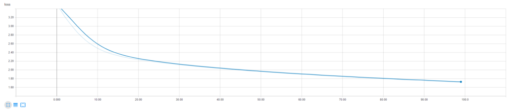
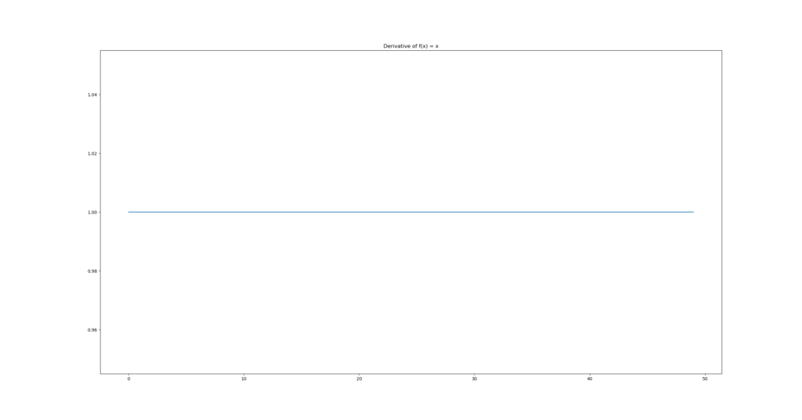

In today's deep learning community, three [activation functions are commonly used](https://github.com/mobiletest2016/machine-learning-articles/blob/master/articles/relu-sigmoid-and-tanh-todays-most-used-activation-functions.md): the sigmoid function, the tanh function and the Rectified Linear Unit, or ReLU for short.

While there exist other activation functions [such as Swish](https://github.com/mobiletest2016/machine-learning-articles/blob/master/articles/why-swish-could-perform-better-than-relu.md), it has been hard over the years for them to catch up with both the _improvements in predictive power_ required as well as the _generalization over training sets_. Whereas the high performance of ReLU for example generalizes well over various machine learning problems, this hasn't been the case with many other activation functions.

And there's another question people are asking a lot: **why can't I use a linear activation function when I'm training a deep neural network?** We'll take a look at this question in this blog, specifically inspect the [optimization process](https://github.com/mobiletest2016/machine-learning-articles/blob/master/articles/about-loss-and-loss-functions.md/#the-high-level-supervised-learning-process) of deep neural networks. The answer is relatively simple **\- using a linear activation function means that your model will behave as if it is linear**. And that means that it can no longer handle the complex, non-linear data for which those deep neural nets have boosted performance those last couple of years.

**Update February 2020** - Added links to other MachineCurve blogs; added table of contents; processed textual improvements.

\[toc\]

\[ad\]

## Optimizing your model: computing gradients, backprop and gradient descent

When you're building a deep neural network, there are three terms that you'll often hear:

- A gradient;
- Backpropagation, and finally...
- [Gradient descent](https://github.com/mobiletest2016/machine-learning-articles/blob/master/articles/gradient-descent-and-its-variants.md), often the stochastic version (SGD) - or SGD like optimizers.

Let's take a look [at the training process of a neural network](https://github.com/mobiletest2016/machine-learning-articles/blob/master/articles/about-loss-and-loss-functions.md/#the-high-level-supervised-learning-process), so that we'll understand the necessity of those three before we move on to studying the behavior of linear activation functions.

As you know, training a deep neural network goes iteratively, using epochs. This means that small batches of training data are input into the network, after which the [error is computed](https://github.com/mobiletest2016/machine-learning-articles/blob/master/articles/about-loss-and-loss-functions.md) and the [model is optimized](https://github.com/mobiletest2016/machine-learning-articles/blob/master/articles/gradient-descent-and-its-variants.md). If all the training data has been input once, an epoch has passed and the same process starts again - until the second, third, fourth, and so on - epochs have passed.

Suppose that we're at epoch 0 (or 1, if you like). The weights of the model have been initialized randomly, or pseudo-randomly. You input your first batch of training data into the model. Obviously, it will perform very poorly, and the [loss](https://github.com/mobiletest2016/machine-learning-articles/blob/master/articles/about-loss-and-loss-functions.md) - the difference between the actual targets and the predictions for this training data - will be huge. It needs to be improved if we want to use it in real life.

One way of doing so is by using _gradients_ and _backpropagation_, the latter of which stands for "backwards propagation of errors". While the data has been propagated forwards, the error can be computed backwards. This is done as follows:

1. We know which loss function we used and how it is instantiated. For this function, we can compute its derivative. That is, we can compute its _gradient_ i.e. how much it changes at some particular location. If we do that for our current spot on the loss curve, we can estimate where to move to in order to improve that particular weight.
2. Backpropagation allows us to descend the gradient with respect to _all the weights_. By chaining the gradients found, it can compute the gradient for any weight - and consequently, can compute improvements with respect to the errors backwards towards the most upstream layer in the network.
3. The _optimizer_, i.e. [SGD](https://github.com/mobiletest2016/machine-learning-articles/blob/master/articles/gradient-descent-and-its-variants.md) or the [SGD like optimizer such as Adam](https://github.com/mobiletest2016/machine-learning-articles/blob/master/articles/extensions-to-gradient-descent-from-momentum-to-adabound.md), is subsequently capable of altering the weights slightly in an attempt to improve overall network performance.

\[ad\]

And this often causes a really fast drop in loss at first, while it gets stable over time:

[]

An example from my [TensorBoard](https://github.com/mobiletest2016/machine-learning-articles/blob/master/articles/how-to-use-tensorboard-with-keras.md)

## The problem with linear activation functions

As you know, the dot product between the weight vector and the input (or transformed input) vector produced by the neuron itself is linear. It flows through an [activation function](https://github.com/mobiletest2016/machine-learning-articles/blob/master/articles/overview-of-activation-functions-for-neural-networks.md) to, generally, make it non-linear. But neural networks don't care what kind of function you choose for activating neuron output.

You can thus choose to use $f(x) = x$, i.e. the identity function, as your activation function.

But this is often a really bad idea.

And it all has to do with the gradient of this linear activation function:

[]

Yep, it's 1.

The formula of $f'(x)$ when $f(x) = x$?

\[ad\]

$f'(x) = 1 \\times x^0 = 1 \* 1 = 1$

**You will thus find the same gradient for any neuron output when you use the linear activation function, namely 1.**

And this impacts neural network training in two fundamental ways:

1. You cannot apply backpropagation to find how your neural weights should change based on the errors found. This observation emerges from the simple notion that gradients are no longer dependent on the input values (and by consequence, the errors) - they're always the same. There's thus simply no point in attempting to find where to improve your model.
2. Your model becomes a linear model because all layers chained can be considered to be a _linear combination_ of individual linear layers. You'll thus at best get some good performance on _linear data_. Forget good performance for non-linear data.

And that's why you shouldn't use linear activation functions :-)
